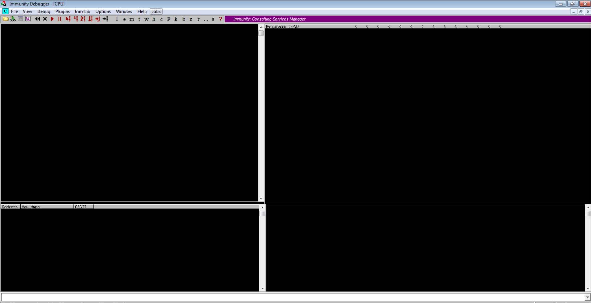
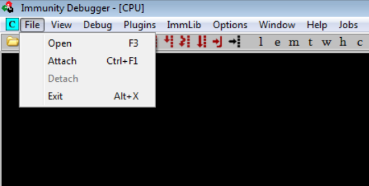
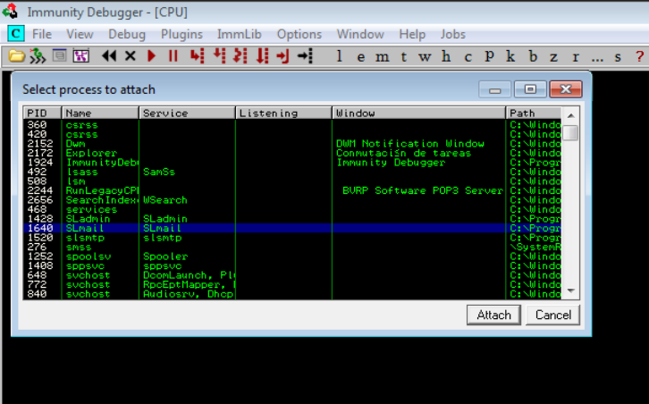
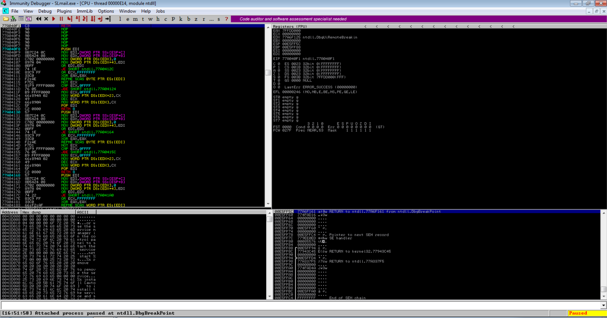
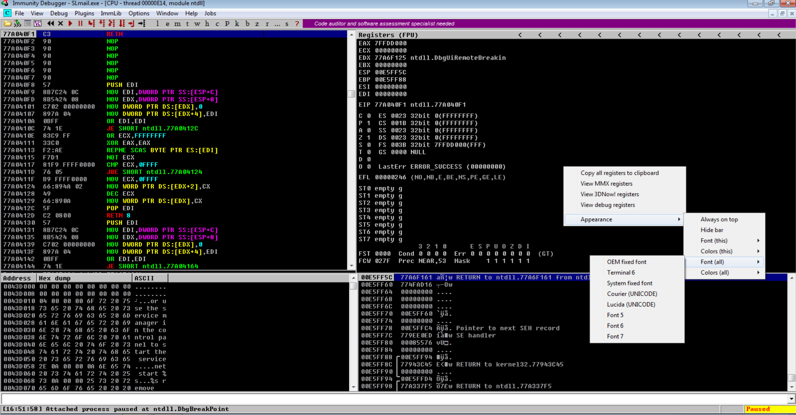
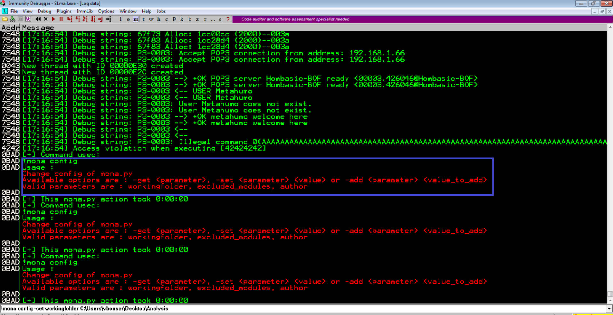
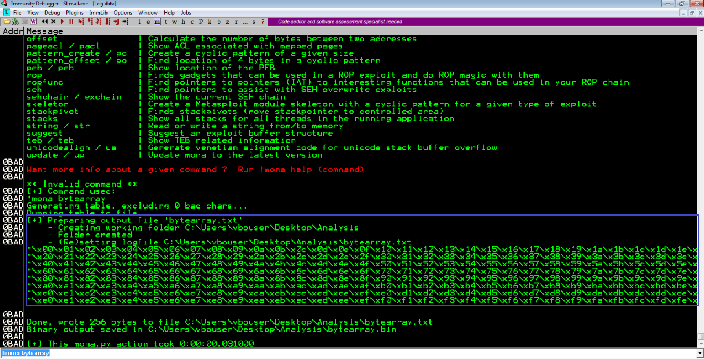
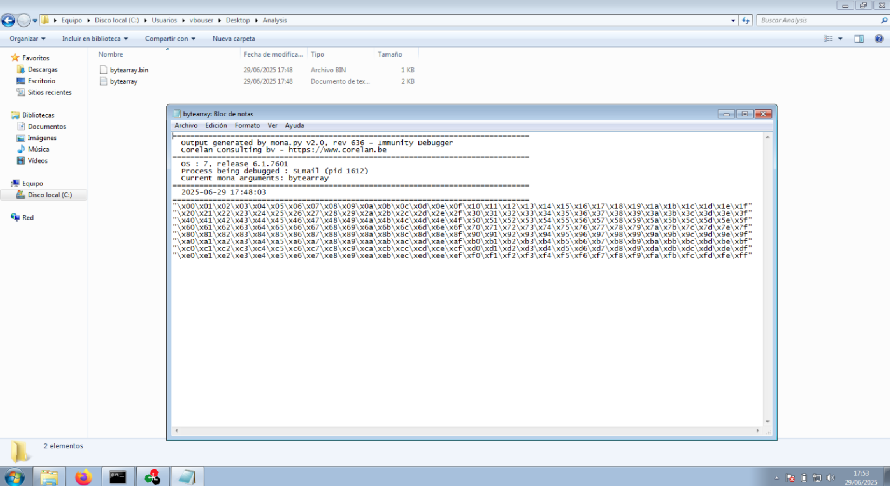
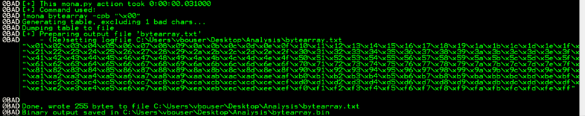

---
# Immunity Debugger — Qué es, para qué sirve y cómo lo usamos

## ¿Qué es Immunity Debugger?

Immunity Debugger es un depurador gráfico para sistemas Windows. Nos permite analizar programas en ejecución, observar cómo gestionan la memoria, y sobre todo, identificar fallos de seguridad explotables como **Buffer Overflows**.

A diferencia de otros depuradores, está optimizado para tareas de **seguridad ofensiva** y análisis de exploits. Incorpora un entorno de scripting en Python, lo que permite automatizar tareas comunes gracias a extensiones como `mona.py`.

---

## ¿Para qué lo usamos?

En un entorno de **hacking ético**, usamos Immunity Debugger principalmente para:

- Observar en tiempo real qué ocurre cuando un programa se rompe.
- Ver si hemos sobrescrito correctamente el registro `EIP` con un valor controlado.
- Identificar direcciones útiles para desviar el flujo de ejecución (como `jmp esp`).
- Verificar si se ejecuta un *shellcode* correctamente en memoria.
- Inspeccionar la pila (`ESP`, `EBP`), la memoria del proceso, y puntos de interrupción (breakpoints).

---

## ¿Cómo usamos Immunity Debugger en un buffer overflow?

### 1. Preparación

- Ejecutamos **Immunity Debugger como administrador**.
- Desde el menú `File > Open`, seleccionamos el binario vulnerable (por ejemplo `slmail.exe`).
- Dejamos el programa ejecutándose con el botón de **play (F9)**.

---

### 2. Ver el crash

- Desde nuestra máquina atacante, enviamos un payload de prueba (fuzzing, patrón, etc.).
- Cuando el proceso crashea, **Immunity se detiene** y nos muestra:
  - Si hay una `Access Violation`.
  - Qué contiene el registro `EIP`.
  - Qué hay en la pila y en las direcciones cercanas.

---

### 3. Calcular el offset con mona.py

Una vez cargado `mona.py`, usamos comandos como:

```bash
!mona pattern_create 3000
!mona pattern_offset EIP
````

Esto nos ayuda a determinar cuántos bytes necesitamos para controlar `EIP`.

---

### 4. Buscar direcciones útiles

Buscamos instrucciones como `jmp esp` dentro de los módulos cargados sin protección (sin ASLR, sin DEP):

```bash
!mona modules
!mona jmp -r esp
```

Copiamos una dirección útil para usarla en nuestro exploit.

---

### 5. Verificar la ejecución del shellcode

Cuando lanzamos un payload con shellcode, Immunity nos ayuda a:

- Ver si `EIP` salta a la dirección deseada.
    
- Confirmar que los NOPs y el shellcode están bien cargados.
    
- Interrumpir la ejecución con breakpoints si hace falta.
    

---

## Ventajas de Immunity Debugger

- Interfaz gráfica intuitiva.
    
- Potente integración con Python (`mona.py`).
    
- Ideal para pentesting en entornos controlados (máquinas vulnerables).
    
- Compatible con técnicas clásicas de explotación (Stack-based BOF, SEH, etc.).
    

---

## Conclusión

Immunity Debugger es una herramienta esencial en nuestra caja de herramientas de pentesting. Nos permite entender exactamente qué ocurre dentro de un proceso vulnerable, tomar el control de la ejecución y construir exploits de forma precisa. Su integración con `mona.py` nos ahorra mucho tiempo y errores durante la explotación.

---

## Ejemplo de explotación de SLMail

Abrimos con permisos de administrador Immunity Debugger (ImD)



Añadimos el proceso que queremos monitorizar (SLMail/File --> Attach)



Podemos filtrar por nombre y localizar el proceso



Tras darle a 'Attach' se verá así:



Podemos mejorar su visualización. Click derecho --> Apperance --> Font (all) --> Font 6



---

### ### Bytearrays y uso con `!mona bytearray`

Un `bytearray` en Python es una lista mutable de valores de byte que permite construir y modificar payloads dinámicamente. Con el comando `!mona bytearray` en Immunity Debugger generamos automáticamente una secuencia de bytes (0x00–0xFF) para detectar badchars al observar cuáles se corrompen durante el overflow.

Primero vamos a crear un directorio de trabajo con **mona**. 

```txt
!mona config -set workingfolder C:\Users\vbouser\Desktop\Analysis
```

Podemos saber los parámetros `-set` y `workingfolder` usando el comando `!mona config`



Ahora usamos `!mona bytearray`. Vemos que generamos un **bytearray** dentro del entorno de trabajo creado



Podemos ver en la ruta que creamos la carpeta ' Analysis' el documento




Como es recomendable no usar el carácter `null byte \x00` podemos usar este otor comando de **mona** para obtener un bytearray

```txt
!mona bytearray -cpb "\x00"
```



---


