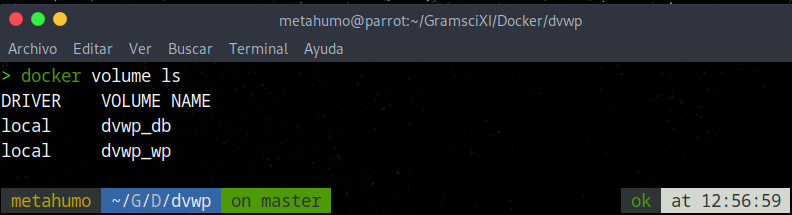
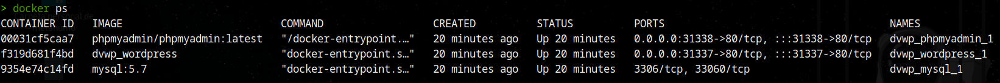
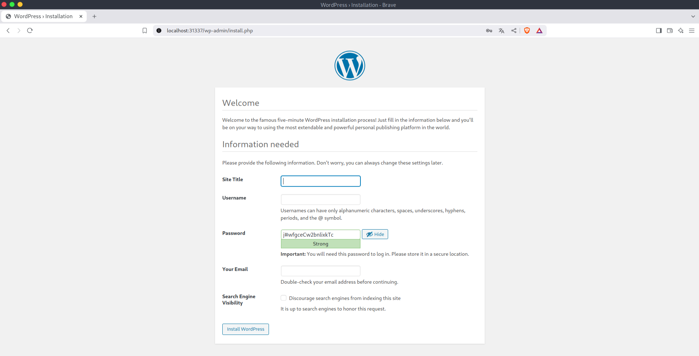
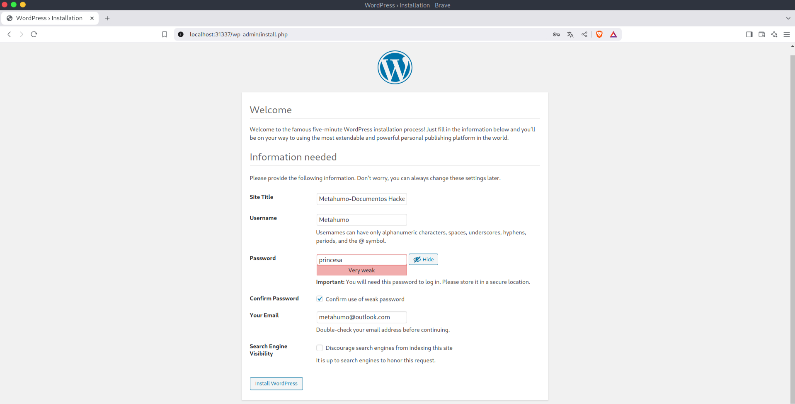
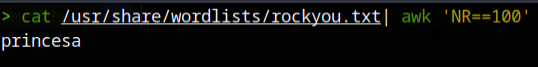
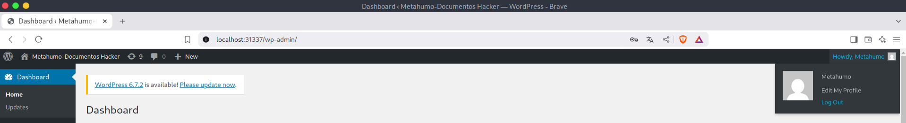
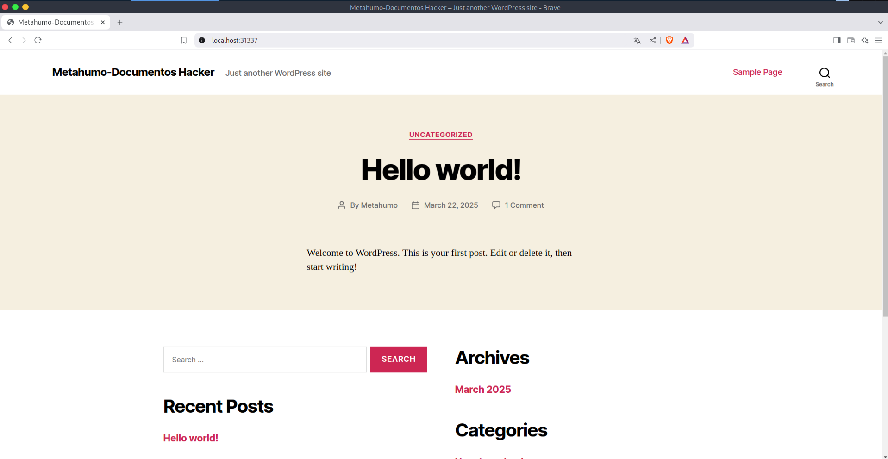
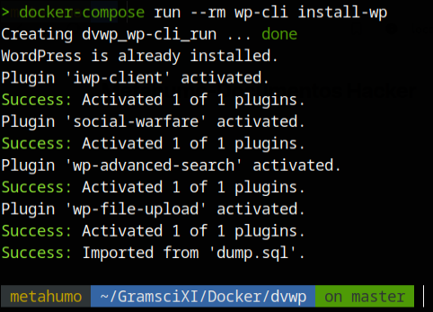
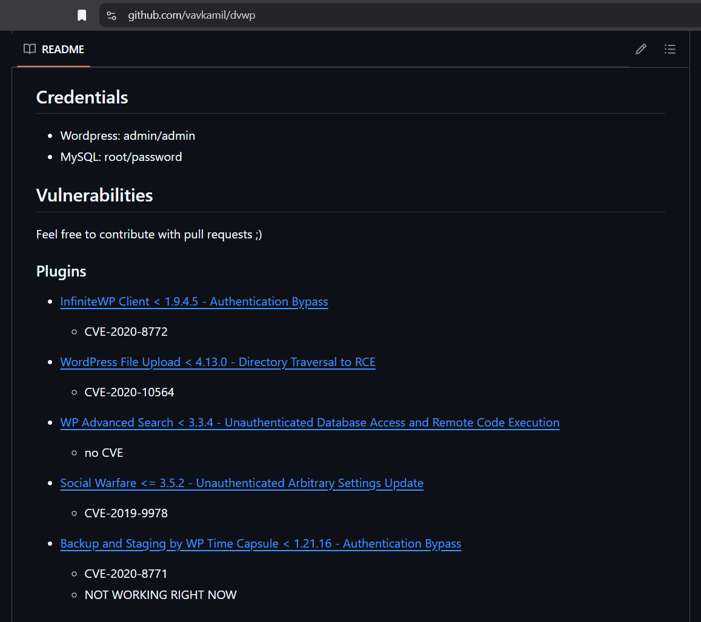

---

# Instalar un servicio WordPress vulnerable con Docker.

**Importante:** En este apartado mostramos de forma opcional la instalación de un entorno controlado en Docker que utiliza un servicio WordPress con ciertas vulnerabilidades.

Para desplegar un Docker con un sistema operativo que tenga el servicio de WordPress en funcionamiento. Podemos usar el siguiente repositorio de GitHub: [Docker-WordPress](https://github.com/vavkamil/dvwp)

El despliegue de este Docker podemos efectuarlo de la siguiente manera:

1. Clonar repositorio y configurar WordPress.
	
	**Nota:** Seguir los pasos indicados en el repositorio oficial para descargar y configurar el Docker. Para ello tenemos que introducir los comandos uno a uno:
	
	```bash
	git clone https://github.com/vavkamil/dvwp.git
	```
	
	```bash 
	cd dvwp/
	```
	
	```bash
	docker-compose up -d --build
	```
	
	**Nota:** Antes de proseguir vamos a aclarar un circunstancia que puede generar sorpresa si se desconoce. Cuando ejecutamos el comando `docker volume ls`, puedes ver los volúmenes listados por Docke. Esto es importante, ya que si decidimos borrar el contenedor que acabamos de clonarnos (`git clone`) y montado (`docker build`) necesitaremos borrar también estos dos volúmenes con el comando `docker volume rm <nombre_del_volumen>`. Para que de este modo no se quede almacenado en local ningún tipo de información. De lo contrario si en algún momento volvemos a clonar y montar un docker de WordPress veremos que se nos muestra toda la información que en su momento almacenamos en estos volúmenes.
	
	```bash
	docker volume ls
	```
	


**Nota:** Con `docker ps` podemos ver los contenedores montados. Antes de seguir arrancamos el Docker clonado y procedemos a configurar la página de WordPress que viene en ella. Para hacer esto tenemos que acceder desde el navegador a la dirección IP_local:Puerto_indicado_en_el_docker (como se muestra en la imagen):


	
**Nota:** Vemos que tenemos montado tres contenedores con los siguientes nombres: 'dvwp_phpmyadmin_1', 'dvwp_wordpress_1', 'dvwp_mysql_1'. Además, en el apartado de 'PORTS' vemos que cada uno de los contenedores corre por un puerto diferente. Esto quiere decir que si en el navegador accedemos a nuestra dirección IP local y el puerto indicado, accederemos a la página de WordPress donde podemos proseguir con la instalación. Tendremos que acudir a la página de configuración (como se muestra en la imagen) no al 'panel de admin'. Rellenar los campos necesarios y darle a instalar y posteriormente a login. Usando las credenciales configuradas deberíamos de acceder a nuestra página de WordPress con las vulnerabilidades instaladas (tal y como se puede ver en la documentación oficial del repositorio clonado). Realmente no es la página como tal (ya que esta ruta es para el apartado de 'administración') Para ver la página, cerramos sesión y acedemos a la URL `localhost:31337` por donde corre el servicio de WordPress del Docker.






**Nota:** Para la contraseña usamos una del documento rockyou.txt. Para de este modo poder practicar usando ataques de fuerza bruta contra la página que estamos configurando.
	


**Nota:** Salimos de la sesión:



**Nota:** Navegamos a la URL de la página: `localhost:31337


	
	
2. Finalizar con la instalación de los plugin necesarios:
	
	```bash
	docker-compose run --rm wp-cli install-wp
	```
	
	


**Nota:** De nuevo, para dejar claro, desde el repositorio oficial podemos ver las vulnerabilidades asociadas a este servicio, dada la configuración de plugin que posé.



---
