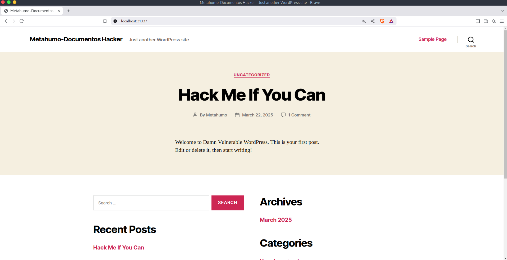
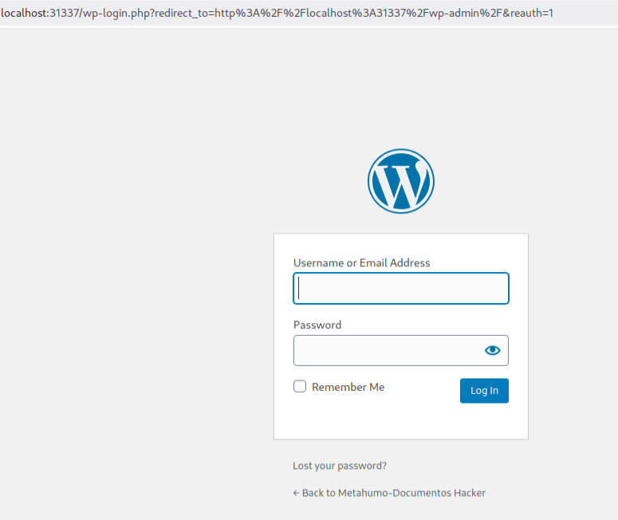
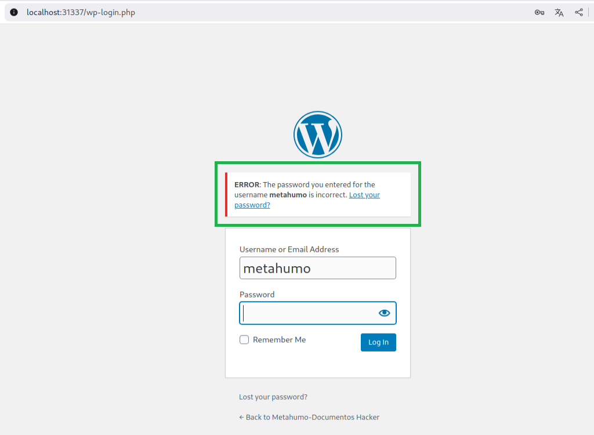
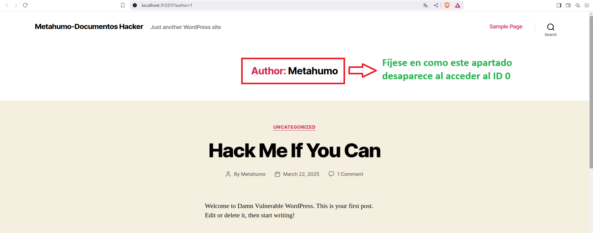
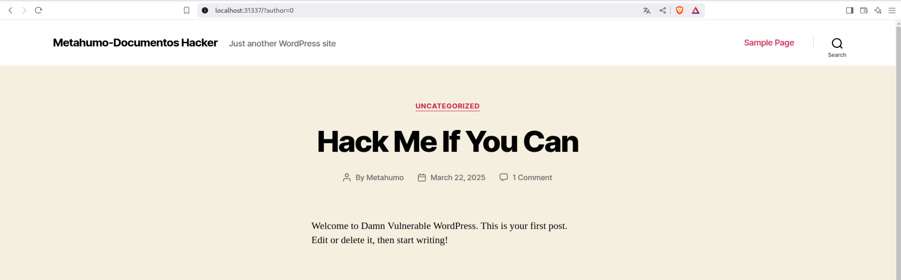

----

# Definición

> WordPress es un sistema de gestión de contenido (CMS) que permite a los usuarios crear y gestionar sitios web de manera sencilla. Es utilizado por una gran cantidad de sitios web en todo el mundo, lo que lo convierte en una plataforma popular para blogs, tiendas en línea, y sitios corporativos.
> 
> Debido a su alta popularidad, WordPress es un objetivo común para las pruebas de penetración y los ataques cibernéticos. Los atacantes se enfocan en las vulnerabilidades del CMS, los plugin y los temas de WordPress, ya que pueden permitirles obtener acceso no autorizado a los sitios web y, en algunos casos, tomar control total de los servidores donde están alojados.
> 
> Aprender a explotar WordPress es fundamental para los profesionales de la ciberseguridad, ya que permite identificar y mitigar vulnerabilidades antes de que los atacantes las utilicen. Además, entender las debilidades de WordPress proporciona una visión valiosa de cómo proteger otros sistemas y plataformas web.
> 
> La explotación de WordPress en pruebas de penetración[^1] generalmente involucra la identificación de vulnerabilidades conocidas, la explotación de plugin o temas inseguros, y la explotación de configuraciones incorrectas en el servidor web. A través de estas técnicas, los profesionales de la seguridad pueden simular ataques y reforzar las defensas de los sistemas web.

---
## Enumeración manual

Para enumerar diferentes vectores de ataque y vulnerabilidades. Podemos hacerlo a través de herramientas como Wpscan (la cual veremos más adelante u otra como *WPSeku*, *Wordpresscan*), o realizando una enumeración manual. Para este último caso podemos seguir los siguientes pasos:

-  Probar a navegar a través de la URL dada, por los diferentes directorios que se pueden encontrar por defecto en WordPress.

	**Nota:** Partimos desde la página principal:
	
	

	**Nota:** Si probamos la ruta `'/wp-admin/'` vemos que realmente existe y que nos redirecciona a un panel de login de administrador. Esta es un posible vector de ataque si conseguimos recopilar más información sobre posibles usuarios y/o contraseñas. Incluso podríamos probar con credenciales por defecto como 'admin:admin', 'root:password' o similares.

	**Nota:** Si probamos a acceder a estar ruta `/wp-admin/` habiéndonos logueado en otra ventana previamente (a diferencia de como procedíamos en la nota anterior) la URL que vemos es esta: http://localhost:31337/wp-login.php?loggedout=true&wp_lang=en_US. En cambio si accedemos a esta URL habiendo saliéndonos de la sesión logueada y accedemos de nueva a la ruta `/wp-admin/` vemos esta otra ruta (nótese la diferencia): http://localhost:31337/wp-login.php?redirect_to=http%3A%2F%2Flocalhost%3A31337%2Fwp-admin%2F&reauth=1  
	
	

	**Notas:** Más adelante puede encontrar un apartado con los Directorios vulnerables en WordPress que en caso de estar mal configuradas o por defecto pueden ser explotados.

-  Estos paneles de login, suelen tener un error de configuración. Ya que si introducimos un usuario que se detecte como válido, el propio panel nos lo 'chivará'. De tal forma que tendríamos una vía posible de confirmar usuarios y dejando expuesta la página a ataques de fuerza bruta (como veremos más adelante). Para probar esto introducimos un usuario que hayamos enumerado, ponemos cualquier contraseña y observamos la información que se nos muestra (como se señala en la imagen).

-  Si aparece un apartado sobre el autor o algún nombre de usuario, podemos clicar en él para ver a donde nos lleva y fijarnos en cómo cambia la URL. Si lo que nos reporta sigue la estructura `?author=1`, podemos probar a navegar por otros 'ID', probamos `?author=0`, `?author=2`, etc. Toda esta información se tiene que analizar con detalle, observando cambios en la página para posteriores explotaciones. Recuerde que estamos en una fase de enumeración, por lo que la clave aquí es detectar el máximo de vías potenciales de explotación.

	**Notas:** Observe como la página cambia mínimamente, denotando que accedemos a una ruta diferente pero que nos redirige a la página de inicio.

**Nota:** En esta guía solo mostramos algunas rutas. Animamos al lector o lectora a investigar por su cuenta los diferentes directorios que al final de esta guía se mencionan como vulnerables. Para observar y analizar la información obtenida.

---
## Directorios vulnerables en WordPress

En una instalación por defecto de WordPress, existen varios directorios que pueden ser vulnerables si no se configuran adecuadamente. Estos directorios contienen archivos sensibles que, si no se gestionan correctamente, pueden ser objetivo de un atacante. A continuación te menciono los directorios más comunes en una instalación de WordPress y los riesgos asociados si no se configuran bien[^3] :

### 1. /wp-admin/
**Descripción**: Este es el directorio donde se encuentra el panel de administración de WordPress.
**Riesgos**:
- **Acceso no autorizado**: Si no se protege adecuadamente (por ejemplo, mediante autenticación adicional, firewall o IP restringida), un atacante podría obtener acceso al panel de administración.
- **Ataques de fuerza bruta**: Sin limitaciones adecuadas en los intentos de login o una contraseña segura, este directorio puede ser blanco de ataques de fuerza bruta.

### 2. /wp-content/
**Descripción**: Es uno de los directorios más importantes de WordPress, donde se almacenan temas, plugins y subidas de archivos como imágenes, videos y otros contenidos multimedia.

**Riesgos**:

- **Subida de archivos maliciosos**: Si no se controla bien el tipo de archivos que se pueden subir (por ejemplo, permitiendo archivos .php o .exe), un atacante podría subir scripts maliciosos.
- **Acceso a archivos sensibles**: Si no se establece una correcta configuración de permisos, un atacante podría acceder a archivos sensibles dentro de este directorio.

### 3. /wp-includes/
**Descripción**: Contiene los archivos centrales de WordPress, como bibliotecas de funciones y recursos esenciales.

**Riesgos**:

- **Exposición a vulnerabilidades de la versión de WordPress**: Si la instalación no se mantiene actualizada, las vulnerabilidades en los archivos de este directorio pueden ser explotadas.
- **Exploit de funciones**: Algunos archivos dentro de este directorio pueden contener vulnerabilidades conocidas que un atacante podría aprovechar si no se implementan las medidas de seguridad adecuadas (como deshabilitar el acceso directo).

### 4. /wp-config.php
**Descripción**: Este archivo contiene la configuración principal de WordPress, incluyendo información crítica como las credenciales de la base de datos.

**Riesgos**:

- **Acceso a información sensible**: Si un atacante obtiene acceso a este archivo, podría comprometer la base de datos y otros elementos críticos de la instalación de WordPress.
- **Protección insuficiente**: Aunque no es un directorio, el archivo **`wp-config.php`** debe estar protegido adecuadamente (por ejemplo, mediante reglas .htaccess para evitar el acceso público).

### 5. /wp-content/plugins/
**Descripción**: Contiene los plugins que extienden la funcionalidad de WordPress.

**Riesgos**:

- **Plugins vulnerables**: Si los plugins no se actualizan o son de fuentes no confiables, pueden introducir vulnerabilidades. Algunos plugins mal desarrollados pueden permitir la ejecución de código malicioso.
- **Plugins maliciosos**: Si se instalan plugins de fuentes no confiables o comprometidas, podrían ser utilizados por los atacantes para obtener acceso al sistema.

### 6. /wp-content/themes/
**Descripción**: Contiene los temas activos y los que no están activos en la instalación de WordPress.

**Riesgos**:

- **Temas inseguros**: Al igual que los plugins, los temas mal escritos o desactualizados pueden contener vulnerabilidades que podrían ser explotadas por un atacante.
- **Acceso a archivos de configuración**: Un tema mal diseñado podría exponer archivos de configuración que los atacantes podrían aprovechar.

### 7. /wp-content/uploads/
**Descripción**: Este directorio es donde se almacenan los archivos subidos por los usuarios, como imágenes, PDFs y otros archivos multimedia.

**Riesgos**:

- **Subida de archivos maliciosos**: Si no se filtran correctamente los tipos de archivos permitidos, los atacantes podrían cargar archivos PHP u otros archivos ejecutables que podrían ser usados para ejecutar código en el servidor.
- **Permisos incorrectos**: Si los permisos de este directorio no están configurados correctamente, un atacante podría sobrescribir archivos o insertar archivos maliciosos.

### 8. /wp-content/upgrade/
**Descripción**: Este directorio se utiliza temporalmente durante el proceso de actualización de WordPress.

**Riesgos**:

- **Vulnerabilidad durante las actualizaciones**: Si no se eliminan los archivos de este directorio después de una actualización, podrían quedar archivos obsoletos o inseguros que los atacantes podrían utilizar para acceder al sistema.

### 9. /xmlrpc.php

**Descripción**:  
El archivo XMLRPC en WordPress es utilizado para permitir la comunicación remota entre WordPress y otros servicios mediante XML-RPC (Remote Procedure Call). Facilita la interacción con aplicaciones móviles, servicios de integración y otros clientes externos.

**Riesgos**:

- **Ataques de fuerza bruta**:  
  XML-RPC permite realizar múltiples intentos de autenticación remota en una sola solicitud mediante el método `system.multicall`. Esto hace que los ataques de fuerza bruta sean más efectivos y más difíciles de detectar en comparación con otros métodos de autenticación como `wp-login.php`.

- **Ataques DDoS (Denegación de Servicio Distribuida)**:  
  Los atacantes pueden abusar de **xmlrpc.php** para enviar solicitudes masivas que sobrecarguen el servidor, causando un **ataque de amplificación**. Este tipo de ataque es particularmente efectivo, ya que una pequeña solicitud puede generar una gran cantidad de tráfico.

- **Explotación de vulnerabilidades**:  
  Si un plugin o tema utiliza **xmlrpc.php** y contiene vulnerabilidades, un atacante podría explotarlas a través de solicitudes XML-RPC. Esto podría incluir inyecciones de código u otros fallos de seguridad que permitan ejecutar comandos maliciosos.

- **Uso indebido por bots maliciosos**:  
  Los bots maliciosos a menudo escanean y explotan **xmlrpc.php** para realizar ataques de spam, autenticación masiva o para infectar el sitio con malware.

---

