---

Para un ejemplo de uso ver: **Backend**

# ¿Qué es Postman y para qué se utiliza?

**Postman** es una herramienta ampliamente utilizada en desarrollo web y ciberseguridad para interactuar, probar y documentar APIs (Interfaces de Programación de Aplicaciones).

Su propósito principal es facilitar el **envío de solicitudes HTTP** (como `GET`, `POST`, `PUT`, `DELETE`, etc.) hacia un servidor y observar las respuestas que devuelve. Esto permite simular el comportamiento de una aplicación cliente, probar endpoints, verificar respuestas y autenticar sesiones, todo desde una interfaz gráfica amigable.

### ¿Para qué se utiliza en ciberseguridad?

En el contexto de la ciberseguridad y el pentesting, Postman se usa para:

- Repetir solicitudes capturadas desde DevTools o herramientas como Burp Suite.
- Analizar cómo se comporta una API al modificar parámetros o cabeceras.
- Gestionar tokens de autenticación como **JWTs**, **OAuth** o **API Keys**.
- Automatizar pruebas con entornos variables y colecciones.
- Detectar comportamientos inesperados en endpoints (por ejemplo: IDOR, autenticación rota, etc.).

---

Una de sus grandes ventajas es la posibilidad de trabajar con **colecciones reutilizables** que guardan múltiples rutas y configuraciones, lo cual es ideal para documentar y repetir pruebas de forma organizada.

---

**Primero** creamos una nueva colección y le damos un nombre. Después le damos a 'New' 

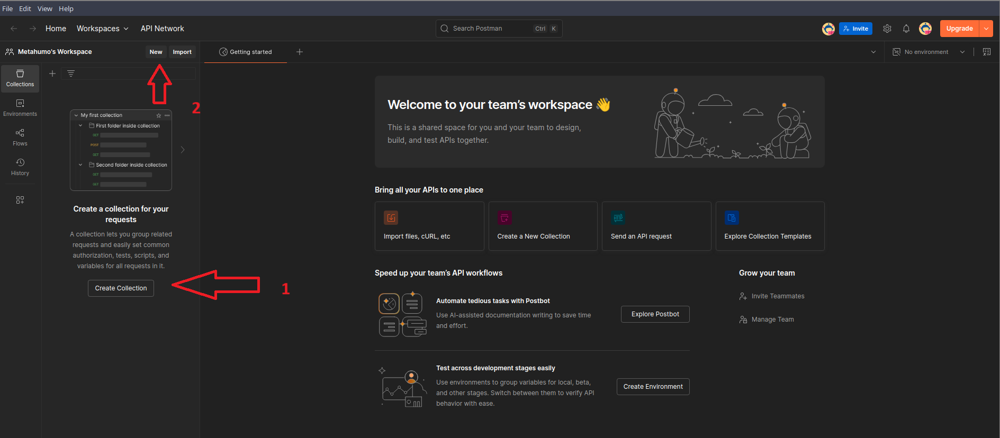

**Segundo** al darle a 'New' usamos la opción 'HTTP' 

**Tercero** copiamos la ruta del endpoint al que hace la solicitud la API al loguearnos y la registramos en Postman (cambiando el método a POST ya que es el método utilizado en la solicitud que vemos en DevTools)

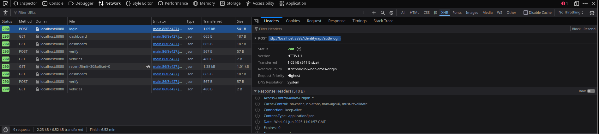

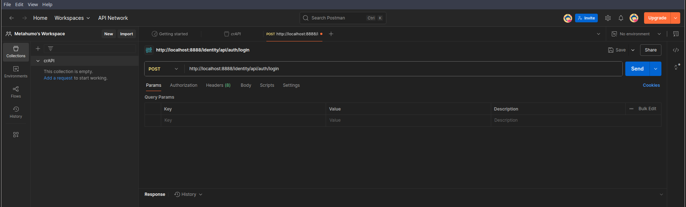

**Cuarto** copiamos la solicitud que enviamos en formato JSON y la copiamos en Postman, en formato raw y en JSON. De este modo en las cabeceras nos añadirá un 'Content-Type' correspondiente

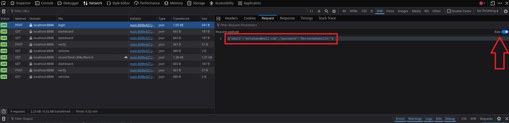

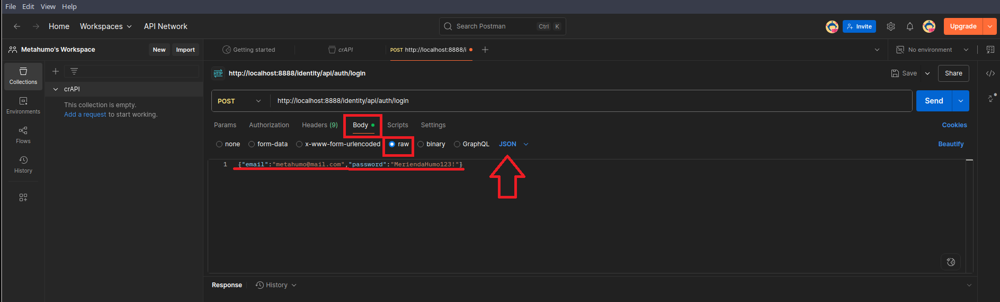

**Quinto** al darle a 'Send' obtenemos la respuesta con el JWT que obteníamos desde el DevTools. Ahora podríamos darle a 'Save' y darle un nombre descriptivo a este endpoint. Importante guardar todas las rutas dentro del repositorio creado

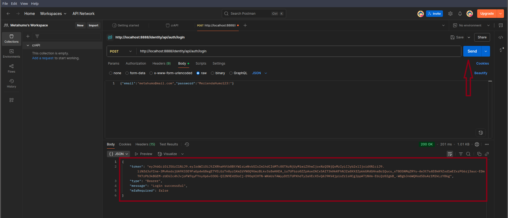

**Sexto** para el resto de endpoint, vamos a necesitar arrastrar el JWT, para agilizar creamos una variable 'Authorization' del siguiente modo, vamos al repositorio creado 'crAPI' y le damos a su pestaña 'Variables'. Le damos un nombre (por ejemplo 'accesToken), en 'initial value' ponemos dos guiones (--) y en 'Current value' es donde añadimos el JWT que obtuvimos anteriormente

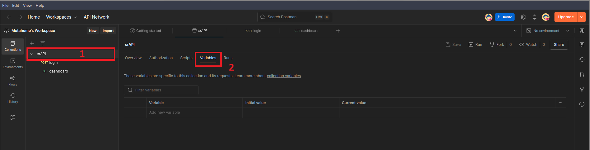

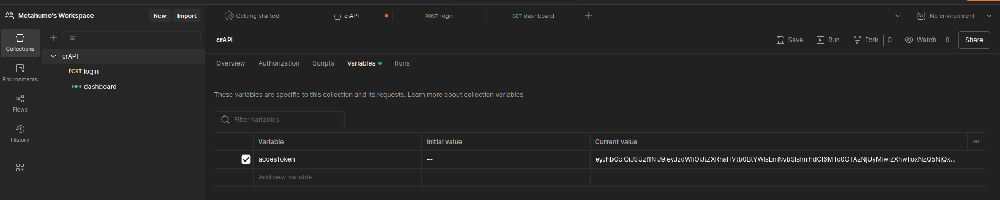

**Séptimo**  ahora le asignamos un tipo de 'Authorization' que para este JWT es de tipo 'Bearer' como se vio en el DevTools, y en 'Token' ponemos dos llaves ( {{ ) y nos sale el 'accesToken' que configuramos, ahora le damos a guardar y se nos añade en la cabecera de cada endpoint que añadamos a este repositorio la cabecera 'Authorization'. En caso de no aparecer tras esta configuración, probar a añadir también en 'Authorization' de la pestaña creada en 'Dashboard'

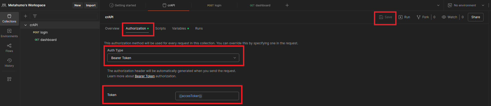

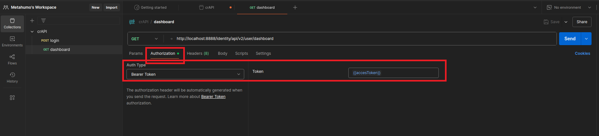

**Octavo** ahora tras esta configuración al darle a enviar vemos que nos devuelve la respuesta de la API con nuestros datos arrastrados por el JWT

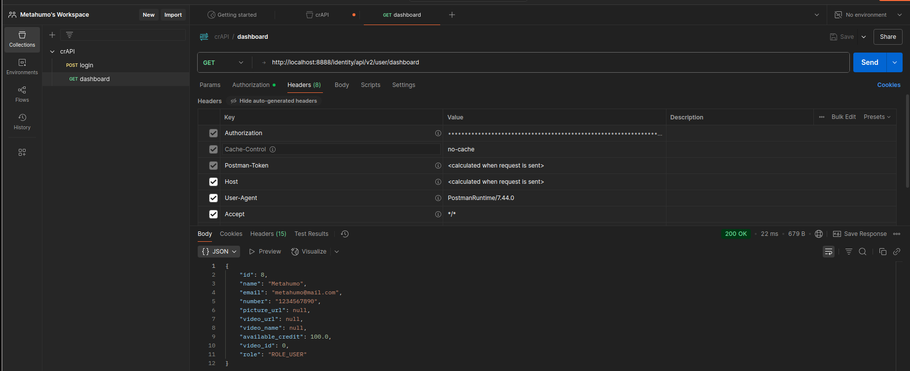

**Noveno** vamos añadiendo los distintos endpoint y cuando corresponda en POST añadimos el cuerpo en su formato correspondiente, como se ve en las imágenes

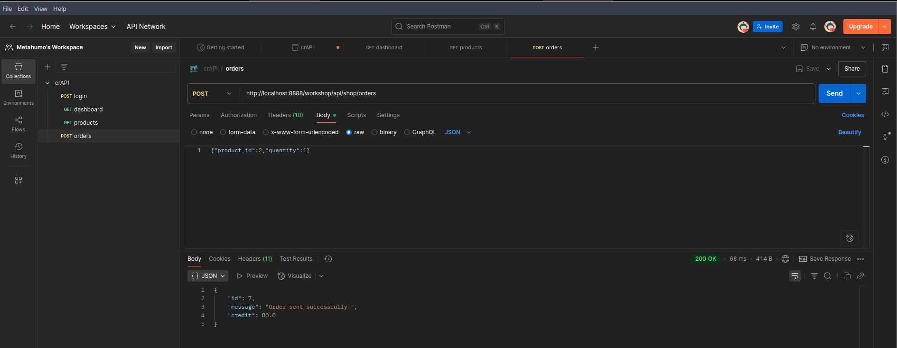

