---

Para la instalación de la máquina virtual Tornado IA seguir los pasos como se indica en la secuencia de imágenes

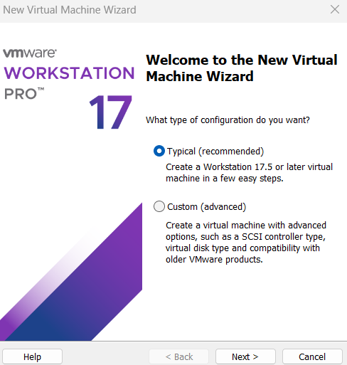

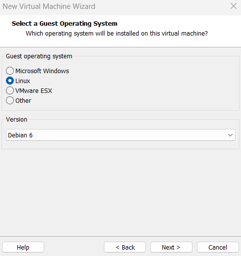

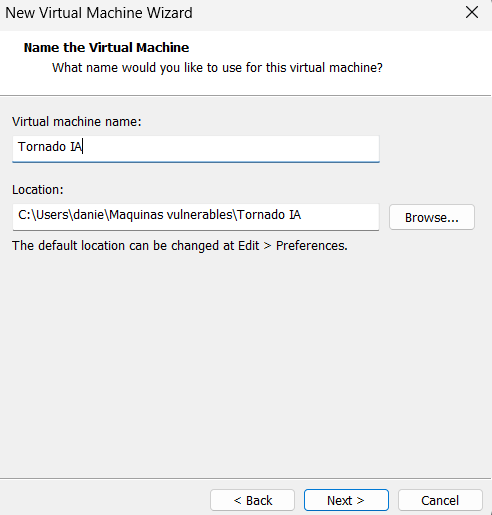

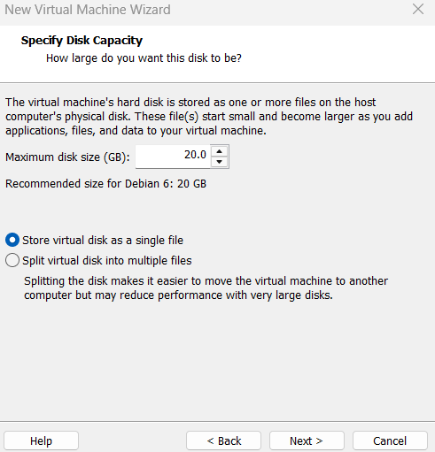

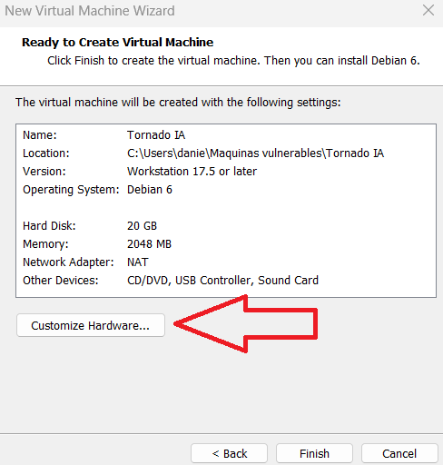

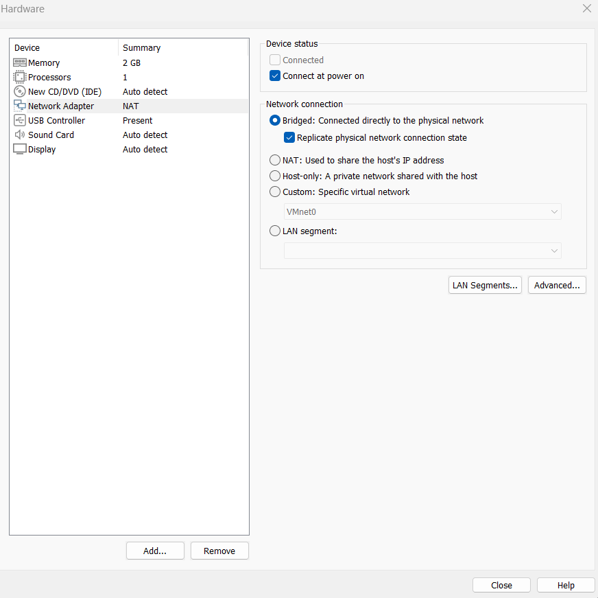

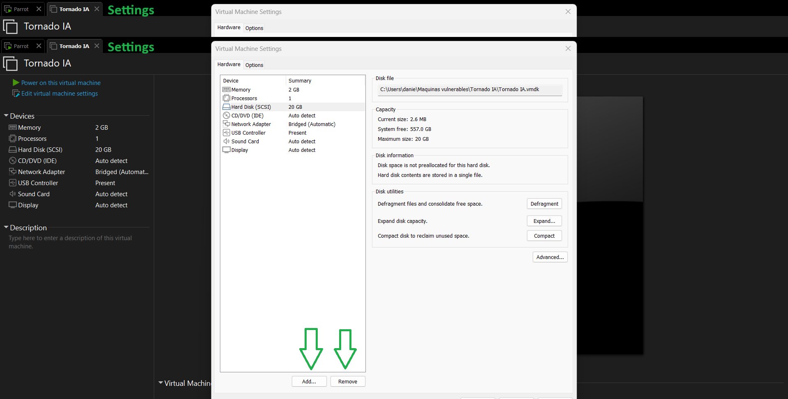

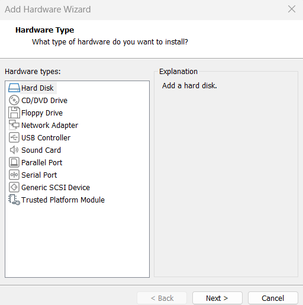

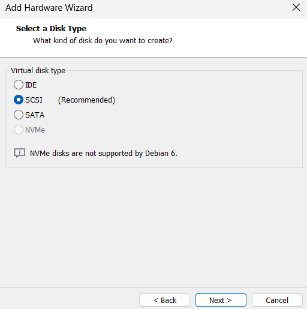

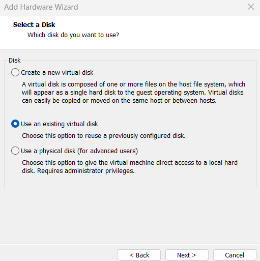

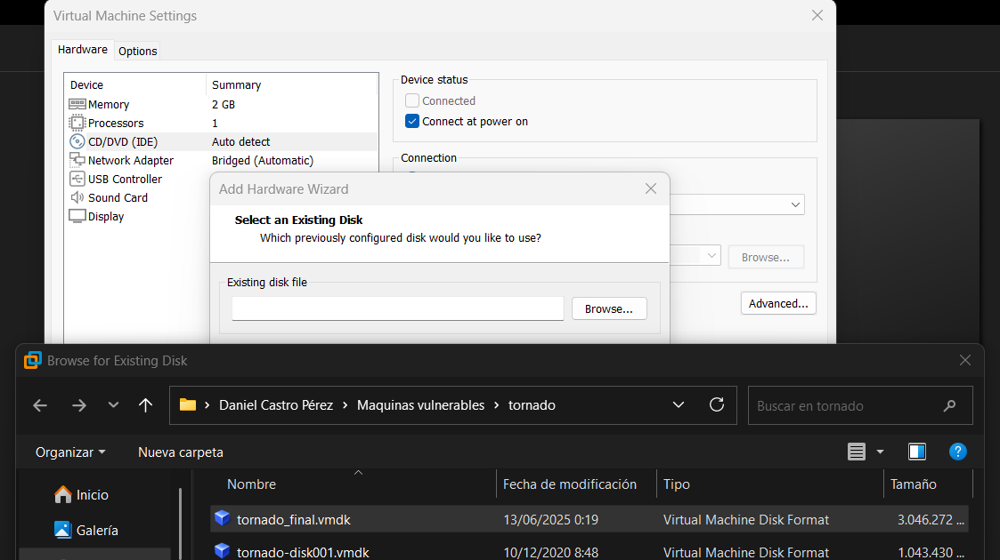

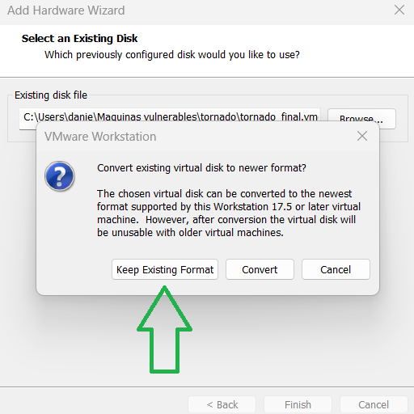

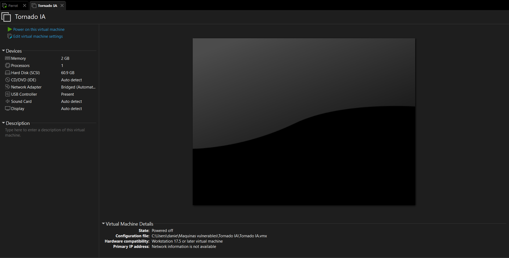

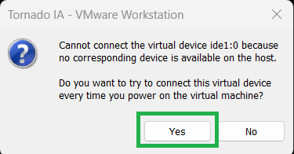

Una vez este arrancando, rápidamente darle a la tecla `e` para ir a este panel y más abajo buscar esta línea y sustituir por `rw init=/bin/bash` obtener una terminal interactiva y poder configurar correctamente la interfaz de red

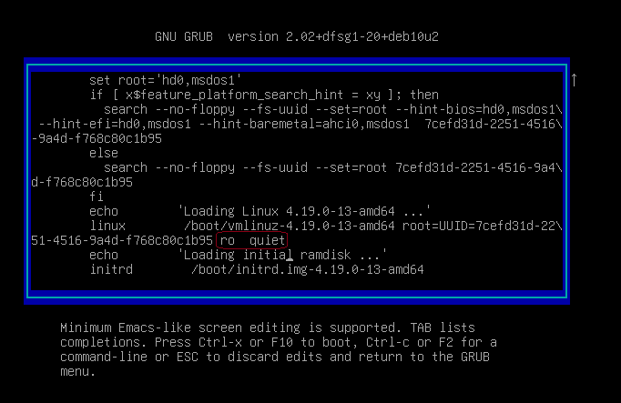

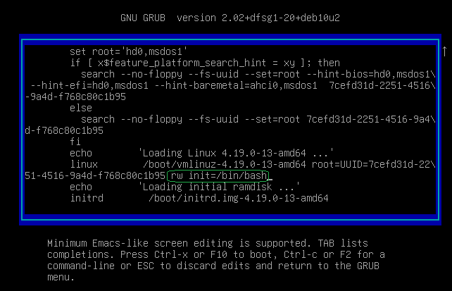

Podemos ver que no tiene nuestra interfaz de red por defecto

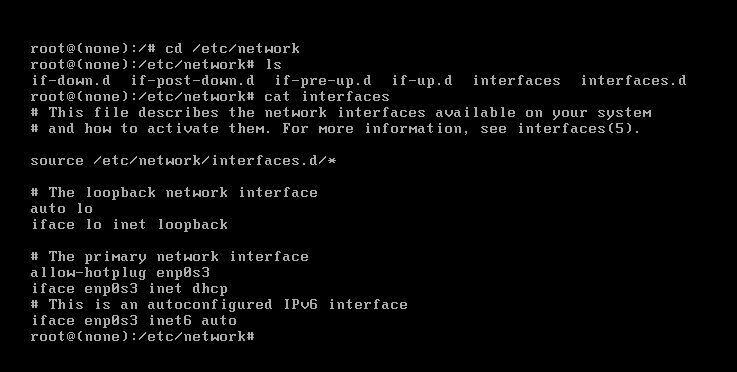

Con nano cambiamos su interfaz a la nuestra, en mi caso a `ens33`

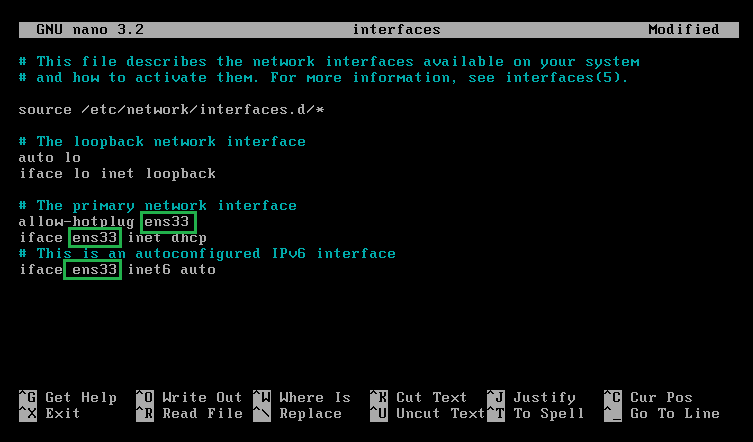

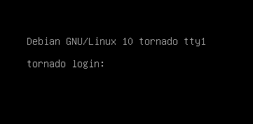

Por último creamos un **snapshot** de la máquina ara tener su configuración preparada por si queremos resetear
 
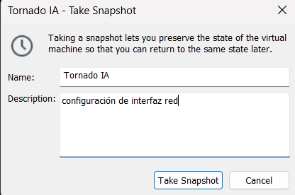

---

