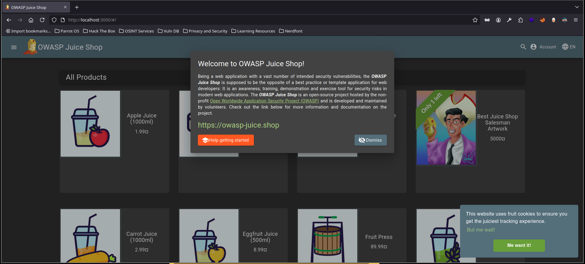
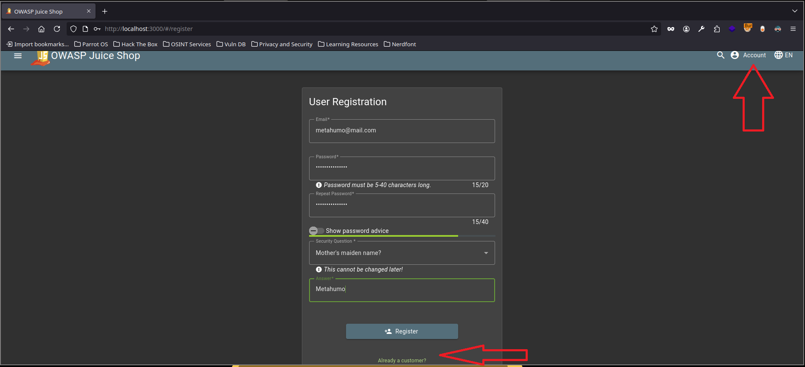
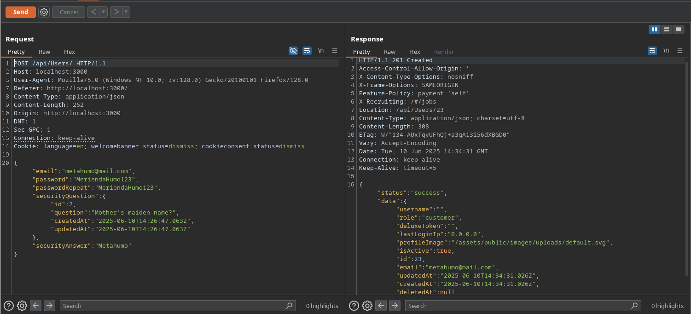
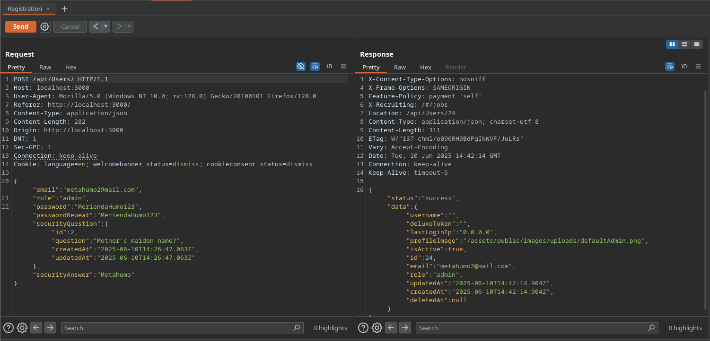

# Ataques de Asignación Masiva (Mass Assignment Attack) / Parameter Binding

En ciberseguridad, los ataques de asignación masiva consisten en manipular los parámetros que enviamos en una solicitud HTTP para modificar campos en la aplicación que no deberían estar accesibles para nosotros. No se trata solo de agregar datos nuevos, sino de aprovechar cómo la aplicación procesa esos datos para cambiar valores que normalmente estarían protegidos.

## ¿Cómo funciona?

Cuando una aplicación web recibe datos de un formulario o una API, muchas veces utiliza frameworks o bibliotecas que asignan automáticamente esos datos a un objeto o modelo en el backend (por ejemplo, un objeto Usuario). Si no hay un control estricto sobre qué campos se pueden modificar, un atacante puede enviar parámetros extras o modificar parámetros existentes para alterar campos sensibles.

## Ejemplo práctico

Imaginemos una aplicación para gestionar usuarios con un formulario de registro que solo permite enviar:

- nombre de usuario
- correo electrónico
- contraseña

Si el backend usa asignación masiva sin filtrar los campos, un atacante podría enviar también un parámetro llamado `rol` o `privilegios` en la solicitud HTTP, por ejemplo:

```

POST /register  
{  
"username": "usuarioNormal",  
"email": "[user@example.com](mailto:user@example.com)",  
"password": "miContraseña",  
"rol": "admin"  
}

```

Si el backend acepta ese parámetro y lo asigna directamente al objeto Usuario, sin validar, el atacante podría crear una cuenta con privilegios de administrador, lo que representa un grave riesgo.

## Ejemplo real

Un caso famoso ocurrió en 2010 con una vulnerabilidad en la plataforma Ruby on Rails. La función `attr_accessible` no estaba configurada correctamente, permitiendo que atacantes enviaran parámetros arbitrarios para cambiar atributos sensibles, como `is_admin`, en la base de datos. Esto permitió que algunos usuarios se auto-asignaran privilegios administrativos.

## Cómo protegernos

- Validar y filtrar explícitamente los campos que se pueden modificar o crear desde la entrada del usuario.
- Usar listas blancas (whitelisting) para permitir solo parámetros seguros.
- Evitar la asignación masiva automática sin control.
- Implementar validaciones en el servidor para roles y permisos.

## Laboratorio práctico

Para practicar esta vulnerabilidad, podemos usar el proyecto Juice Shop, una aplicación vulnerable especialmente diseñada para aprender sobre diferentes ataques web, incluyendo la asignación masiva.

Podemos desplegarlo fácilmente con Docker usando este enlace:  
[Juice Shop en Docker Hub](https://hub.docker.com/r/bkimminich/juice-shop)

---

Con este laboratorio, podemos intentar registrar usuarios y modificar parámetros para observar cómo se comporta la aplicación frente a este tipo de ataques y aprender a detectarlos y mitigarlos.

---
# Guía paso a paso de explotación

Acción:

```bash
docker pull bkimminich/juice-shop
docker run -dit -p 3000:3000 --name JuiceShop bkimminich/juice-shop
docker ps
```

Resultado:

```bash
CONTAINER ID   IMAGE                   COMMAND                  CREATED         STATUS         PORTS                                       NAMES
9d9ca046b2f2   bkimminich/juice-shop   "/nodejs/bin/node /j…"   3 seconds ago   Up 2 seconds   0.0.0.0:3000->3000/tcp, :::3000->3000/tcp   JuiceShop
```

Explicación: este contenedor corre por el puerto 3000 de nuestro localhost



**Nota:** le damos a 'Dismiss' y a 'Me want it!'

---

Acción: Vamos a la pestaña de 'Login' y le damos a crear nuevo usuario/registrarse. La petición de registro de usuario que vayamos a enviar la interceptamos con [Burp Suite](../../../../Herramientas/Burp%20Suite/BurpSuite.md) y la enviamos desde el 'Repeat'





Explicación: un ataque de Mass Assignment consiste en una vez que sabemos o intuimos los parámetros que se registran (aunque no los enviemos). Podemos hacer una petición/registro enviando más parámetros que los por defecto. Entonces parámetros como `role:"customer` podemos tratar de enviarlo como `role:"admin` o 'administrator' o 'isAdmin', la idea es ir probando estas 'asignaciones' 



Explicación: hemos tenido que: 1º cambiar el correo; 2º añadir la asignación deseada. Vemos que tenemos la nueva asignación `role:"admin`. Ahora probamos a loguearnos con este usuario, y ver que tenemos permisos de administrador

---
