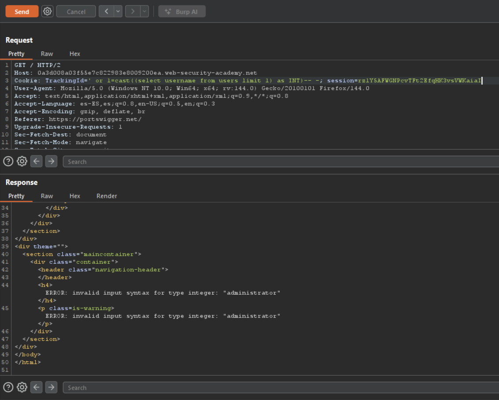
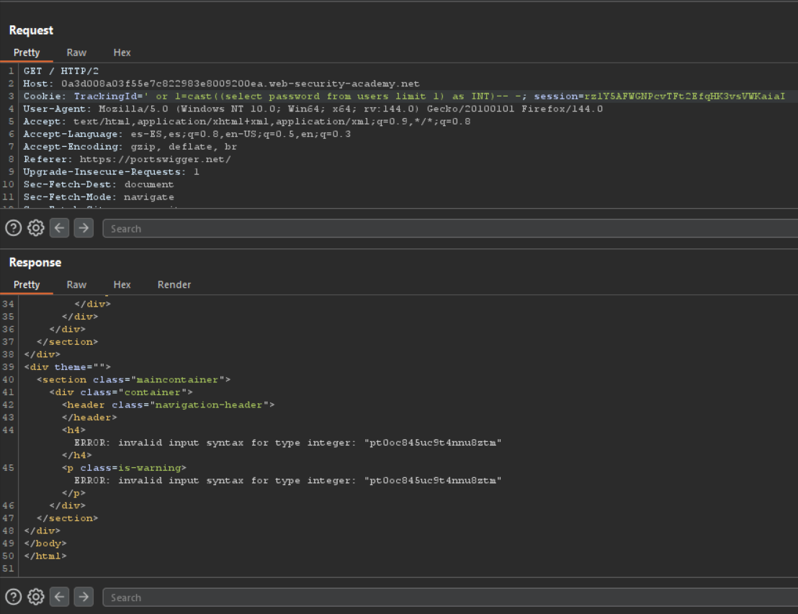

---
# Guía práctica: SQLi visual error
---

## Laboratorio PortSwigger

Para ilustrar con ejemplos reales usaremos el laboratorio gratuito de [PortSwigger](https://portswigger.net/web-security/sql-injection/blind/lab-conditional-responses):

`https://portswigger.net/web-security/sql-injection/blind/lab-conditional-responses`

Todas las pruebas que se muestran a continuación se realizaron contra la URL provista por ese laboratorio.

---

## Confirmación de la vulnerabilidad

**Resumen:** en este laboratorio la entrada vulnerable es la cookie `TrackingId`. Para confirmarlo interceptamos peticiones con Burp Suite y observamos el valor de la cookie en la cabecera `Cookie`. También se puede ver con DevTools (`Ctrl+Shift+I`).

**Paso práctico (comprobación rápida):**

1. Intercepta una petición con Burp (o abre DevTools).
    
2. Localiza la cabecera `Cookie: TrackingId=...`.
    
3. Modifica temporalmente el valor añadiendo una comilla simple (`'`) al final:  
    `TrackingId=G1KUuxbiLkvBBAT5'`


## Concepto

En este laboratorio podemos forzar que la aplicación devuelva un **mensaje de error personalizado** cuando la subconsulta no puede convertirse a un tipo numérico. Aprovechando esto, podemos volcar información haciendo que la conversión a entero falle salvo cuando la subconsulta devuelva un valor numérico. Mantendremos las dos querys que ya teníamos como comprobaciones explícitas de este comportamiento.


## Explotación

Al recibir algún tipo de respuesta solo cuando se produce un error. Con `cast((<query>) as INT)` podemos forzar un error y con la query siguiente vemos que se nos vuelca la información del primer `username` que para este caso es `administrator`

```SQL
' or 1=cast((select username from users limit 1) as INT)-- -
```



Estas consultas provocan un error controlado que hace que la aplicación devuelva el mensaje de error personalizado cuando la subconsulta no es convertible a entero. Observando cuándo se muestra el error podemos inferir el contenido de las columnas seleccionadas (en estos ejemplos `username` y `password` para la primera fila —que en este laboratorio corresponde a `administrator`).

```SQL
' or 1=cast((select password from users limit 1) as INT)-- -
```



