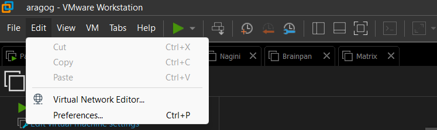
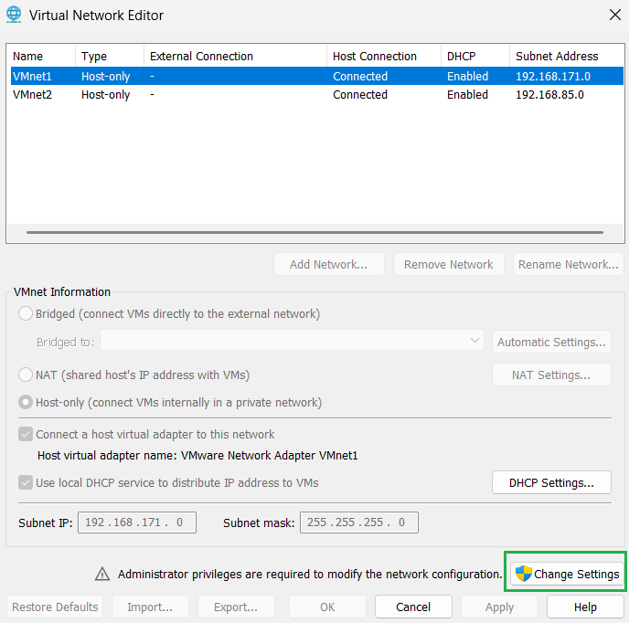
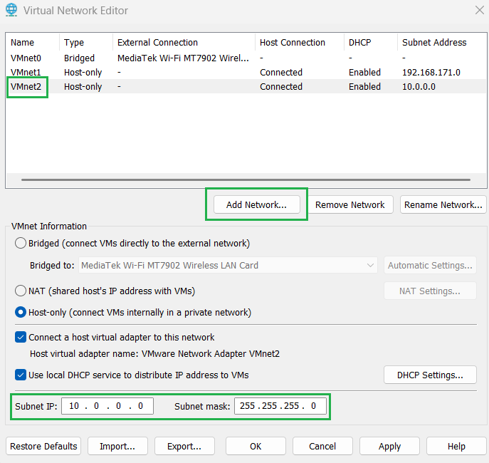
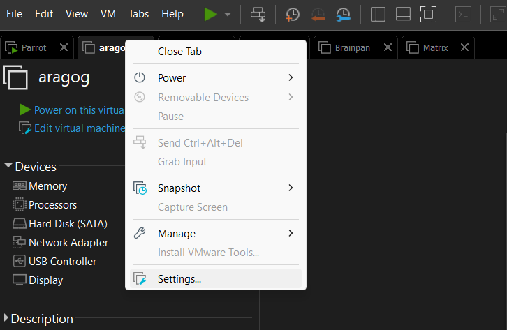
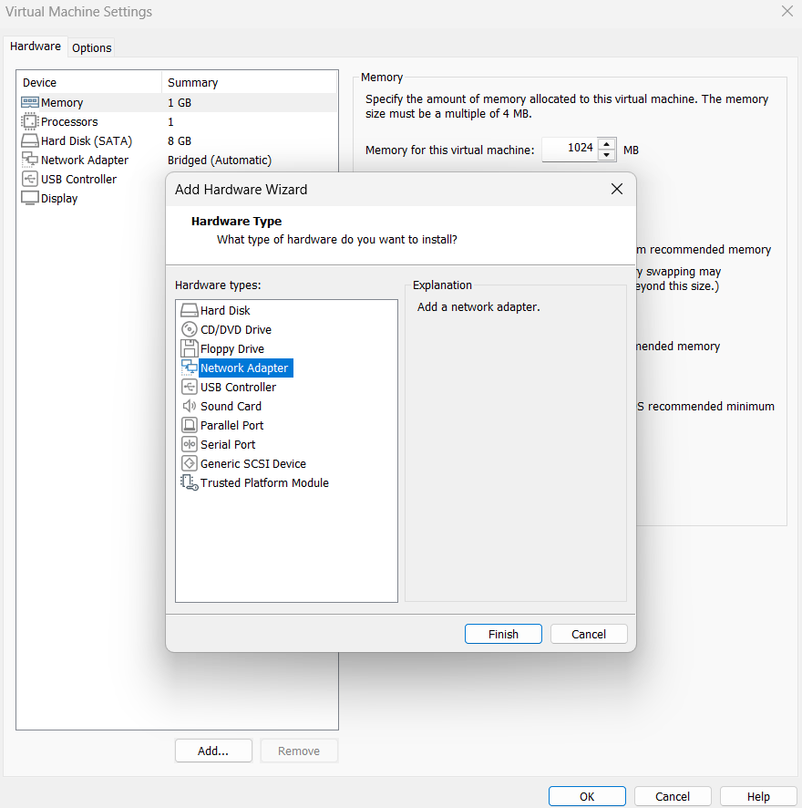
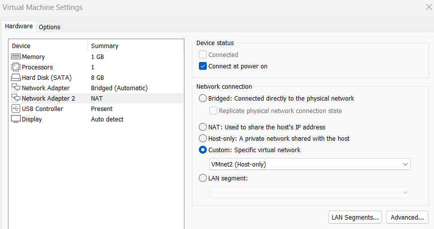
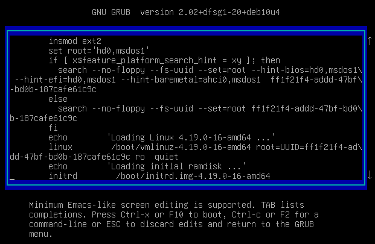
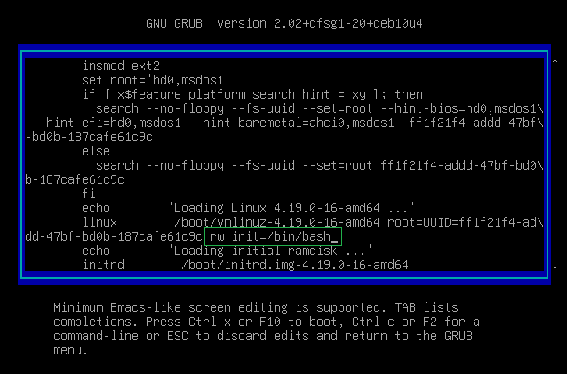
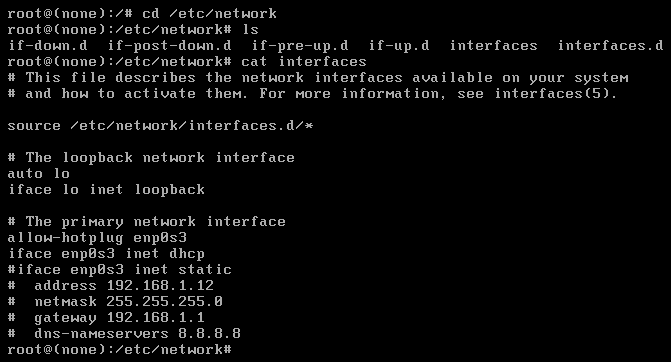

# Laboratorio de Pivoting: Entorno y Configuración

Este laboratorio simula un entorno empresarial donde realizaremos **pivoting** desde una máquina atacante hacia varias VMs internas, incluyendo Linux y Windows. Se incluyen redes internas, contenedores Docker y distintos niveles de acceso.

---

## VMs que se utilizarán:

- **Aragog**  
  [VulnHub: HarryPotter Aragog](https://www.vulnhub.com/entry/harrypotter-aragog-102%2C688/)  

- **Nagini**  
  [VulnHub: HarryPotter Nagini](https://www.vulnhub.com/entry/harrypotter-nagini%2C689/)  

- **Fawkes**  
  [VulnHub: HarryPotter Fawkes](https://www.vulnhub.com/entry/harrypotter-fawkes%2C686/)  

- **Matrix 1**  
  [VulnHub: Matrix 1](https://www.vulnhub.com/entry/matrix-1%2C259/)  

- **Brainpan**  
  [VulnHub: Brainpan 1](https://www.vulnhub.com/entry/brainpan-1%2C51/) 

---

## 1. Máquinas del laboratorio

Estas son las máquinas que se utilizarán en el laboratorio:

| Máquina          | Sistema | Rol                                                              |
| ---------------- | ------- | ---------------------------------------------------------------- |
| Aragog           | Linux   | Objetivo inicial, conecta con Nagini                             |
| Nagini           | Linux   | Movimiento lateral, conecta con Windows 7 64 bit y Fawkes        |
| Fawkes           | Linux   | Contenedor Docker interno, movimiento lateral hacia Matrix       |
| Matrix 1         | Linux   | Nodo intermedio, conecta con Brainpan                            |
| Brainpan         | Windows | Última máquina, requiere buffer overflow para finalizar pivoting |
| Windows 7 32 bit | Windows | Máquina de debugging, conexión directa desde atacante            |

---

## 2. Configuración de redes en VMware

Se utilizarán **múltiples redes internas** para simular distintos segmentos de la empresa:

| VMnet  | Subred        | Máscara       | Uso                                      |
| ------ | ------------- | ------------- | ---------------------------------------- |
| VMnet1 | 192.168.171.0 | 255.255.255.0 | Acceso inicial desde la máquina atacante |
| VMnet2 | 10.0.0.0      | 255.255.255.0 | Red interna Aragog ↔ Nagini              |
| VMnet3 | 192.168.100.0 | 255.255.255.0 | Red interna Nagini ↔ Fawkes ↔Matrix      |
| VMnet4 | 172.18.0.0    | 255.255.255.0 | Matrix ↔ Brainpan                        |

> **Nota:** Windows 7 32 bit se configura en modo *bridged* para tener conexión directa con la máquina atacante y realizar labores de debugging.


---

## 3. Configuración de red en VMware

### 3.1 Crear y configurar VMnets

1. Abrimos VMware y vamos a:  
   `Edit -> Virtual Network Editor...`
2. Pulsamos `Change Settings` y aceptamos permisos.
3. Verificamos que existan VMnet1–VMnet5. Si no, añadimos los necesarios:  
   `Add Network -> Custom -> VMnetX`
4. Configuramos las subredes y máscaras según la tabla anterior.
5. Aplicamos los cambios con `Apply` y cerramos con `OK`.

  

  

  


---

### 3.2 Añadir interfaces de red a cada VM

Cada VM necesita sus interfaces según la topología:

1. Seleccionamos la VM y vamos a:  
   `Settings -> Add -> Network Adapter -> Custom -> VMnetX`
2. Repetimos el proceso para cada interfaz adicional según la tabla de interfaces.
3. Aplicamos los cambios y encendemos la VM.

  

  

  

---

## 4. Flujo de Pivoting previsto

1. **Ataque inicial desde Parrot OS** → **Aragog** (Linux, ens33 VMnet1).  
2. Desde Aragog, se mueve lateralmente hacia **Nagini** (ens33 VMnet2).  
3. Desde Nagini, hacia **Matrix 1** y **Fawkes** (ens33 VMnet3, docker0 interno).  
4. Desde Matrix → pivot hacia **Brainpan** (VMnet5), donde se realiza buffer overflow para capturar la reverse shell.  
5. **Windows 7 32 bit** solo se usa para debugging y pruebas de exploits.

> Nota: El contenedor Docker en Fawkes simula una capa adicional de seguridad. Para pivotar correctamente, primero se obtiene acceso al contendor, luego al host, y finalmente se continúa el flujo hacia Matrix y Brainpan.


---

## 5. Configurar interfaz red

Si estamos importando las máquinas proporcionadas en VM Ware, tendremos que configurar la interfaz de red desde una terminal interactiva que nos lancemos desde el iniciador GRUB del sistema. Para ello al iniciar la máquina, pulsamos la tecla `e` cuando vemos que empieza a arrancar. Nos llevará a un apartado como el que vemos en las imágenes y tan solo tendremos que ir al apartado indicado: `dd-47bf...` y modificar `ro quiet` por `rw init=/bin/bash`. Pulsamos `f10` y al iniciarse obtendremos una bash con privilegios root en la que modificar manualmente el archivo de interfaces de red. Lo explicamos a continuación





Una vez tenemos la terminal. Acudimos a la ruta `/etc/network`. Para modificar el archivo `interfaces`. Como vemos en la imagen tenemos que quitar todo lo innecesario y quedarnos con esas únicas 6 líneas, las 3 que indican a la interfaz `ens33` y otra para la `ens34`



Así es como debe de quedar:

```bash
auto ens33
allow-hotplug ens33
iface ens33 inet dhcp

auto ens34
allow-hotplug ens34
iface ens34 inet dhcp
```

Sabiendo este procedimiento, lo replicamos para las máquinas: Aragog, Nagini y Fawkes. Para Matrix y Brainpan no hace falta y para la máquina Windows 7 de 64 bit tampoco, pero para esta última si que hay que habilitar el puerto 445 como regla de entrada y salida en el firewall

---

Con todo esto configurado, podemos comenzar con la explotación

[Ver Aragog explotación](./Aragog%20explotación.md)